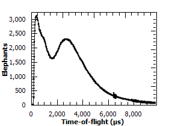

.. _MatrixWorkspace:

================
Matrix Workspace
================

.. contents::
  :local:

A MatrixWorkspace is a generic name for any workspace that can be access like a table of X, Y and E values.  This is the prime interface for accessing workspace data in Mantid.  This covers several workspace types including:

-  :ref:`Workspace2D <Workspace2D>` - A workspace for holding two       dimensional data in memory, this is the most commonly used workspace.
-  :ref:`EventWorkspace <EventWorkspace>` - A workspace that retains the       individual neutron event data.            

What information is in a MatrixWorkspace
----------------------------------------

All Matrix Workspaces contain:

-  Measured or derived data with associated errors, this is referenced as a 2D array of counts and error data.  The axes are commonly "SpectraNumber" and another unit of measure, but are very flexible.

Also they may contain:

-  Axes with
   :ref:`Units <Unit Factory>`
-  :ref:`Sample` and sample environment data
-  :ref:`Run` logs
-  A full :ref:`instrument <instrument>` geometric definition, along with
   an instrument parameter map
-  A spectra - detector mapping
-  A distribution flag
-  A list of 'masked' bins

Working with Matrix Workspaces in Python
----------------------------------------

MatrixWorkspace is an abstract description of an specific workspace implementation. It provides access to a common way of accessing the data for a 2D workspace without needing to know the details of how that data is actually stored.

Matrix Workspaces have all the data and operations of the base :ref:`Workspace <Workspace>` class, but add operations to access the data in a useful way.

You can look at the :ref:`Matrix Workspace API reference <mantid.api.MatrixWorkspace>` for a full list of properties and operations, but here are some of the key ones.

Accessing Workspaces
####################

The methods for getting a variable to a MatrixWorkspace is the same as shown in the :ref:`Workspace <Workspace-Accessing_Workspaces>` help page.

If you want to check if a variable points to something that is a Matrix Workspace you can use this:

.. testcode:: CheckMatrixWorkspace

    from mantid.api import MatrixWorkspace

    histoWS = CreateSampleWorkspace(WorkspaceType="Histogram")

    if isinstance(histoWS, MatrixWorkspace):
        print histoWS.name() + " is a " + histoWS.id() + \
                 " and can be treated as a MatrixWorkspace"

    print "\nFor more workspace types"
    eventWS = CreateSampleWorkspace(WorkspaceType="Event")
    svWS = CreateSingleValuedWorkspace()
    tableWS = CreateEmptyTableWorkspace()
    groupWS = GroupWorkspaces("histoWS,eventWS")
    mdWS = CreateMDWorkspace(Dimensions=3, Extents='-10,10,-10,10,-10,10', Names='A,B,C', Units='U,U,U')
    mdHistoWS=CreateMDHistoWorkspace(Dimensionality=2,Extents='-3,3,-10,10',SignalInput=range(0,100),ErrorInput=range(0,100),\
                               NumberOfBins='10,10',Names='Dim1,Dim2',Units='MomentumTransfer,EnergyTransfer')

    myWorkspaceList = [histoWS,eventWS,svWS,tableWS,mdWS,mdHistoWS]
    print "MatrixWorkspace?","Type"
    for ws in myWorkspaceList:
        print "  ", isinstance(ws, MatrixWorkspace), "\t     ", ws.id()

Output:

.. testoutput:: CheckMatrixWorkspace
    :options: +NORMALIZE_WHITESPACE

    histoWS is a Workspace2D and can be treated as a MatrixWorkspace

    For more workspace types
    MatrixWorkspace? Type
       True           Workspace2D
       True           EventWorkspace
       True           WorkspaceSingleValue
       False          TableWorkspace
       False          MDEventWorkspace<MDLeanEvent,3>
       False          MDHistoWorkspace

Matrix Workspace Properties
###########################

.. testsetup:: MatrixWorkspaceProperties

  ws = Load("MAR11015")

.. testcode:: MatrixWorkspaceProperties

  # find out the number of histograms on a workspace use getNumberHistograms()
  print "number of histograms = {0}".format(ws.getNumberHistograms())

  # To find out the number of bins use blocksize()
  print "number of bins = {0}".format(ws.blocksize())
  # To find out the bin containing a value use binIndexOf()
  print "bin index containing 502.2 for a histogram (0 by default) = {0}".format(ws.binIndexOf(502.2))
  print "bin index containing 997.1 for histogram 272 = {0}".format(ws.binIndexOf(997.1,272))

  # To find a workspace index from a spectrum number
  print "workspace index for histogram 272 = {0}".format(ws.getIndexFromSpectrumNumber(272))
  # To get the Run Number use getRunNumber()
  print "run number = {0}".format(ws.getRunNumber())

Output:

.. testoutput:: MatrixWorkspaceProperties

    number of histograms = 922
    number of bins = 2663
    bin index containing 502.2 for a histogram (0 by default) = 19
    bin index containing 997.1 for histogram 272 = 39
    workspace index for histogram 272 = 271
    run number = 11015

Instrument
^^^^^^^^^^

You can get access to the :ref:`Instrument` for a workspace with

.. testsetup:: MatrixWorkspaceInstrument

  ws = CreateSampleWorkspace()

.. testcode:: MatrixWorkspaceInstrument

  instrument = ws.getInstrument()

For the properties and operations of the instrument look at the :ref:`Instrument help <Instrument>`.

Run - to access logs, and other run information
^^^^^^^^^^^^^^^^^^^^^^^^^^^^^^^^^^^^^^^^^^^^^^^

You can get access to the :ref:`Run` for a workspace with

.. testsetup:: MatrixWorkspaceRun

  ws = CreateSampleWorkspace()

.. testcode:: MatrixWorkspaceRun

  run = ws.getRun()

For the properties and operations of the run object and how to access log data look at the :ref:`Run help <Run>`.

Axes
^^^^

Axes are used primarily for labeling plots, but are also used as validation criteria for several algorithms.
You can list out the axes of a workspace using the following code.

.. testcode:: MatrixWorkspaceAxes

  ws = CreateSampleWorkspace()
  for i in range(ws.axes()):
      axis = ws.getAxis(i)
      print "Axis {0} is a {1}{2}{3}".format(i,
                                             "Spectrum Axis" if axis.isSpectra() else "",
                                             "Text Axis" if axis.isText() else "",
                                             "Numeric Axis" if axis.isNumeric() else "")

      unit = axis.getUnit()
      print "\t caption:{0}".format(unit.caption())
      print "\t symbol:{0}".format(unit.symbol())

Output:

.. testoutput:: MatrixWorkspaceAxes
  :options: +NORMALIZE_WHITESPACE

  Axis 0 is a Numeric Axis
     caption:Time-of-flight
     symbol:microsecond
  Axis 1 is a Spectrum Axis
     caption:Spectrum
     symbol:

**Setting the axisLabel**

.. testcode:: MatrixWorkspaceAxesLabel

  ws = CreateSampleWorkspace()
  axis = ws.getAxis(1)
  # Create a new axis
  axis.setUnit("Label").setLabel('Temperature', 'K')

  unit = axis.getUnit()
  print "New caption:{0}".format(unit.caption())
  print "New symbol:{0}".format(unit.symbol())

Output:

.. testoutput:: MatrixWorkspaceAxesLabel
  :options: +ELLIPSIS,+NORMALIZE_WHITESPACE

  New caption:Temperature
  New symbol:K

**Replacing the Axis**

.. testsetup:: MatrixWorkspaceAxesReplace

  ws = Load("MAR11015")

.. testcode:: MatrixWorkspaceAxesReplace

  from mantid.api import NumericAxis

  axis = ws.getAxis(1)
  unit = axis.getUnit()
  print "Old caption:{0}".format(unit.caption())
  print "Old symbol:{0}".format(unit.symbol())

  # Create a new axis
  newAxis = NumericAxis.create(ws.getNumberHistograms())
  newAxis.setUnit("Label").setLabel('Temperature', 'K')

  # Set the vertical axis values
  for idx in range(0, ws.getNumberHistograms()):
      tempValue = idx*3+25 # some made up value
      newAxis.setValue(idx, tempValue)
      
  # Replace axis 1 with the new axis
  ws.replaceAxis(1, newAxis)

  axis = ws.getAxis(1)
  unit = axis.getUnit()
  print "New caption:{0}".format(unit.caption())
  print "New symbol:{0}".format(unit.symbol())
  print "New values: {0}".format(axis.extractValues())

Output:

.. testoutput:: MatrixWorkspaceAxesReplace
    :options: +ELLIPSIS,+NORMALIZE_WHITESPACE

    Old caption:Spectrum
    Old symbol:
    New caption:Temperature
    New symbol:K
    New values: [ 25. 28. ... 2785. 2788.]

**Setting the Y Label**

.. testsetup:: MatrixWorkspaceYUnit

  ws = CreateSampleWorkspace()

.. testcode:: MatrixWorkspaceYUnit

  print ws.YUnitLabel()
  ws.setYUnitLabel("Elephants")
  print ws.YUnitLabel()

Output:

.. testoutput:: MatrixWorkspaceYUnit

  Counts
  Elephants

Matrix Workspace Operations
###########################

.. testsetup:: MatrixWorkspaceOperations

  ws = CreateSampleWorkspace()

.. testcode:: MatrixWorkspaceOperations

  # To create a copy of a workspace
  wsClone = ws.clone()
  # or
  wsClone = CloneWorkspace(ws)

  # To check if two variables point to the same workspace
  if ws == wsClone:
      print "They are the same workspace"

  # To check if two workspaces have equal values
  if ws.equals(wsClone, tolerance = 0.05):
      print "They have the same data"

  # To create a copy of a workspace
  wsWavelength = ws.convertUnits(Target="Wavelength")
  # or
  wsWavelength = ConvertUnits(ws,Target="Wavelength")

  # To rebin the workspace
  ws = ws.rebin(Params = 200)
  # or 
  ws = Rebin(ws, Params = 200)

  # Mask detectors or spectra (or use the MaskDetectors algorithm
  ws.maskDetectors(SpectraList=[2,3,4])
  ws.maskDetectors(WorkspaceIndexList=range(101,105))
  ws.maskDetectors(DetectorList=[150,160,170])

  # To delete the workspace
  ws.delete()
  # or
  DeleteWorkspace(wsClone)
  # Do not access the python variable again as you will get a RuntimeError
  # e.g. RuntimeError: Variable invalidated, data has been deleted.
  
.. testoutput:: MatrixWorkspaceOperations
  :hide:

  They have the same data

Accessing Data
##############

A MatrixWorkspace is essentially a 2D list of binned data where a workspace index, starting at 0, gives access to the data fields in each spectra.

The data is accessed using the ``readX()``, ``readY()`` and ``readE()`` commands. Each of these commands takes a number that refers to the index on the workspace and returns a list of the data for that workspace index, i.e

.. testsetup:: MatrixWorkspaceData

  ws = Load("MAR11015")

.. testcode:: MatrixWorkspaceData

  # Get the Y vector for the second row of data
  y_data2 = ws.readY(1)
  for y in y_data2:
      print y

  # Or in loop access. Print the first value in all spectra
  for index in range(0, ws.getNumberHistograms()):
      #Note the round brackets followed by the square brackets
      print ws.readY(index)[0]

.. testoutput:: MatrixWorkspaceData
    :hide:
    :options: +ELLIPSIS,+NORMALIZE_WHITESPACE

    24571.0
    13761.0
    ...
    62.0
    95.0

There are more examples how to `Extract and manipulate workspace data here <http://www.mantidproject.org/Extracting_And_Manipulating_Data>`_.

Workspace algebra
#################

MatrixWorkspaces can have algebraic operations applied to them directly without the need to call a specific algorithm, e.g. :ref:`Plus <algm-Plus>`

The expected operations of +,-,*,/ are supported with either a single number or another workspace as the second argument, e.g.

.. testsetup:: MatrixWorkspaceAlgebra

  workspace1 = Load("MAR11015")
  workspace2 = CloneWorkspace(workspace1)

.. testcode:: MatrixWorkspaceAlgebra

  w1 = mtd['workspace1']
  w2 = mtd['workspace2']

  # Sum the two workspaces and place the output into a third
  w3 = w1 + w2

  # Multiply the new workspace by 2 and place the output into a new workspace
  w4 = w3 * 2

It is also possible to replace one of the input workspaces using one of +=,-=,*=,/= e.g.

.. testsetup:: MatrixWorkspaceAlgebra2

  w1= Load("MAR11015")
  w2= CloneWorkspace(w1)

.. testcode:: MatrixWorkspaceAlgebra2

  # Multiply a workspace by 2 and replace w1 with the output
  w1 *= 2.0

  # Add 'workspace2' to 'workspace1' and replace 'workspace1' with the output
  w1 += w2

.. include:: WorkspaceNavigation.txt
   

.. categories:: Concepts
