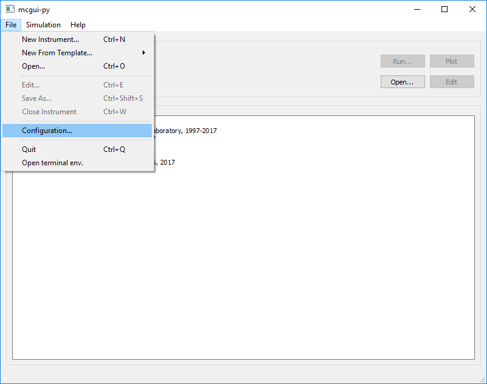
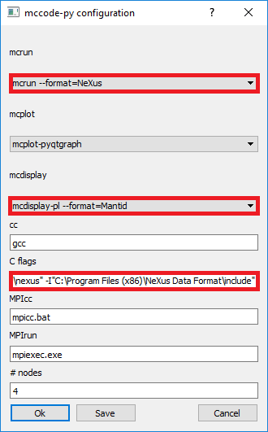

.. _McStas - A neutron ray-trace simulation package:

McStas - A neutron ray-trace simulation package
===============================================

This page gives a brief explanation of the McStas package as well as a more detailed explanation of the 
interoperability between Mantid and McStas. For more information, the paper 
`McStas and Mantid integration <https://arxiv.org/abs/1607.02498>`__ [1]_ by Torben Nielsen, 
Anders Markvardsen and Peter Willendrup is recommended as is the 
`McStas and Mantid wiki page <https://github.com/McStasMcXtrace/McCode/wiki/McStas-and-Mantid>`_ by McStas.

Introduction to McStas
----------------------
The McStas neutron ray-tracing simulation package is a versatile tool for producing accurate
simulations of neutron scattering instruments at reactors and pulsed spallation sources. McStas is
extensively used for design and optimization of instruments, virtual experiments, and user training.
McStas is an abbreviation for Monte Carlo Simulation of triple axis spectrometers, but allows for
describing and simulating any type of neutron scattering instrument.

For more information see:

- `McStas Homepage <http://www.mcstas.org/>`_
- `McStas Manual <http://www.mcstas.org/documentation/manual/>`_

McStas works by assembling a C file from instrument information which is then compiled and can be 
run to simulate neutron scattering experiments.

McStas and Mantid integration
-----------------------------
When compiled, McStas instrument code is not automatically configured to produce files in 
:ref:`NeXus <NexusFile>` format. Mantid also requires the instrument information it reads to be saved as 
an :ref:`Instrument Definition File <InstrumentDefinitionFile>`. First of all make sure `McStas is installed 
<http://mcstas.org/download/>`_. Then install the latest version of Nexus:

- Windows: Get latest release from https://github.com/nexusformat/code/releases?after=4.3.1 
- Mac: Get homebrew via https://brew.sh
	Install it via the recipe given then, in a terminal issue:
	
	`brew search nexusformat`
	
	`brew install homebrew/science/nexusformat`

Once this is completed open the McStas GUI and navigate to configurations and select the settings as shown 
highlighted in red.

:alt: McStasGUIConfig.png

:alt: McStasGUIConfigSettings.png

Where for Windows mcdisplay-pl --format=Mantid currently needs to selected currently as described in this 
`issue <https://github.com/McStasMcXtrace/McCode/issues/459>`__. On other platforms one may simply 
use mcdisplay --format=Mantid.

Under C flags we need to ensure the compiler can find the NeXus libraries and headers so for Windows this 
is usually:

`-DUSE_NEXUS -lNeXus-0  -L"C:\Program Files (x86)\NeXus Data Format\bin" -L"C:\Program Files (x86)\NeXus Data Format\lib\nexus" -I"C:\Program Files (x86)\NeXus Data Format\include"` 

and for Mac:

`-DUSE_NEXUS -lNeXus -L/usr/local/lib -I/usr/local/include`

With the configurations above, running a regular simulation will now produce a NeXus file with the .h5 extension which can 
be loaded into Mantid using :ref:`LoadMcStas <algm-LoadMcStas>`__.

Creating Instrument Definition Files
~~~~~~~~~~~~~~~~~~~~~~~~~~~~~~~~~~~~
If we now load up our .instr file in McStas, select Run then under Simulation set Simulation/Trace to Trace. 
When we start this simulation McStas should now automatically output an Instrument Definition File with a .xml extension containing the minimal information required by Mantid to lay out the instrument. If we want to include all components then we can run from the mcshell:

* Windows: `mcdisplay-pl templateSANS_Mantid.instr --format=Mantid -n0 --complete`
* Mac/Linux: `mccdisplay templateSANS_Mantid.instr --format=Mantid -n0 --complete`

References
----------
..	[1] `McStas and Mantid integration, arXiv:1607.02498 [physics.ins-det] <https://arxiv.org/abs/1607.02498>`__

.. categories:: Concepts
