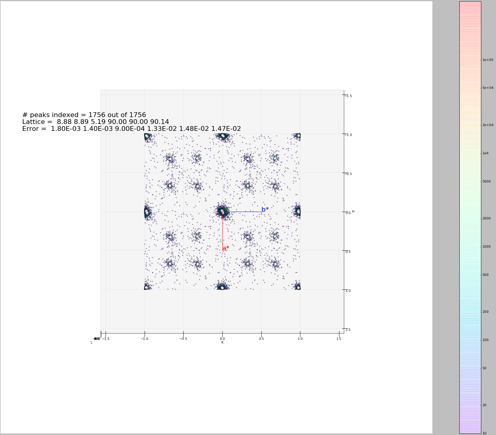

.. _ModulatedStructure:

Modulated Structure
===================

Data reduction for single-crystal neutron diffraction on (3+d) dimension modulated structure with Mantid
--------------------------------------------------------------------------------------------------------

Modulated Structures cannot be described by only three hkl indices, so additional dimensions must be added to
standard reduction of Bragg reflections for these structures.
More explanation can be found in `Acta Crystallographica Section B About modulated structures <https://publcif.iucr.org/cifmoldb/mscif/>`_.

The general procedure for reducing data collected on a modulated
structure should be as follows:

1. Harvest strong peaks from the data collected and find the basic unit
   cell and corresponding UB matrix;

2. Harvest more peaks to include the weaker satellites;

3. Index all the harvested peaks based on the UB found for the basic
   unit cell, with fractional Miller indices (h, k, l) allowed;

4. Collapse all the indexed peaks to lattice range by calculating
   *h-floor(h)*, *k-floor(k)*, *l-floor(l)*, and visualize all the peaks
   by making a 3d-plot of all the collapsed peaks. Find the clusters of
   the collapsed peaks, and calculate the coordinates of the centers of
   the clusters in HKL space, save them as options for modulation
   vectors;

5. It is up to the user to identify the best options for modulation
   vectors, and the maximum order of satellite peaks for each modulation
   vector. Up to three modulation vectors are allowed; (This task is can
   be really complicated to realize with an algorithm due to the
   countless number of special cases to consider, but should be
   effortless for a human mind in most cases with necessary knowledge of
   modulated structures. The rule of thumb is to use least number of
   modulation vectors to account for most satellite peaks, if not all.)

6. Use the identified modulation vectors together with the basic unit
   cell to index all the harvested peaks, both main and satellites, with
   a reasonable tolerance set by user. One extra index is introduced (m,
   n, p) for each modulation vector identified;

7. Recalculate the UB matrix together with the modulation vectors using
   indexed peaks; (Step 7 and 8 can be iterated several times with
   smaller tolerances to refine the UB matrix and modulation vectors.)

8. Predict all the main and satellite peaks that hit the detector with
   the refined UB matrix and modulation vectors;

9. Integrate the predicted peaks and save them. Scale the integrated
   peaks for scattering angles and correct for absorption.

For processing the data from modulated structures, new member ModUB is
added to the OrientedLattice class:

.. math::

   ModUB = \begin{pmatrix}
   \text{MV}_{11} & \text{MV}_{12} & \text{MV}_{13} \\
   \text{MV}_{21} & \text{MV}_{22} & \text{MV}_{23} \\
   \text{MV}_{31} & \text{MV}_{32} & \text{MV}_{33} \\
   \end{pmatrix}

.. math::

   ModulationVector_{i} = \begin{pmatrix}
   \text{MV}_{1i} \\
   \text{MV}_{2i} \\
   \text{MV}_{3i} \\
   \end{pmatrix}

In other words, the coordinates of Modulation Vector i (i=1,2,3) in Q
space is (:math:`\text{MV}_{1i}`, :math:`\text{MV}_{2i}`,
:math:`\text{MV}_{3i}`). If the structure is not modulated, ModUB=0.
Correspondingly, new members ModHKL and errorModHKL are added to
UnitCell class.

.. math::

   ModHKL = \begin{pmatrix}
   \text{dh}_{1} & \text{dh}_{2} & \text{dh}_{3} \\
   \text{dk}_{1} & \text{dk}_{2} & \text{dk}_{3} \\
   \text{dl}_{1} & \text{dl}_{2} & \text{dl}_{3} \\
   \end{pmatrix}

.. math::

   errorModHKL = \begin{pmatrix}
   \text{err}\text{dh}_{1} & \text{err}\text{dh}_{2} & \text{err}\text{dh}_{3} \\
   \text{err}\text{dk}_{1} & \text{err}\text{dk}_{2} & \text{err}\text{dk}_{3} \\
   \text{err}\text{dl}_{1} & \text{err}\text{dl}_{2} & \text{err}\text{dl}_{3} \\
   \end{pmatrix}

In this case, (:math:`\text{dh}_{i}`, :math:`\text{dk}_{i}`,
:math:`\text{dl}_{i}`) is the modulation vector i (i=1,2,3) in HKL
space. And the relation between ModUB and ModHKL is:

.. math:: ModUB = UB \times ModHKL

or

.. math:: ModHKL = \text{UB}^{- 1} \times ModUB

ModUB is added to OrientedLattice class and ModHKL and ModVec
are added to UnitCell class. Value
for ModHKL in UnitCell is set when the function setModUB is used in
OrientedLattice. Some of the values can be set from python.

.. code-block:: python

    sampleWs = CreateSampleWorkspace()
    pws = CreatePeaksWorkspace(InstrumentWorkspace=sampleWs,NumberOfPeaks=1)
    peak = pws.getPeak(0)
    testVector = V3D(0.9,0,0.2)
    peak.setIntMNP(testVector)
    print (peak.getIntMNP() == V3D(1,0,0))

A python script is in development for step 4, which provides a visual aid for
identifying the satellite peaks. It also find clusters of peaks by
binning the number of peaks in the collapsed HKL space into specified
sized boxes. The resulting clusters of peaks together with the visual
aid should be adequate for the user to identify modulation vectors in
step 5. See figure

For step 6, algorithm :ref:`IndexPeaksWithSatellites <algm-IndexPeaksWithSatellites>` is created, parallel to
the algorithm IndexPeaks for regular crystal structures. The inputs for
this algorithm include the PeaksWorkspace to be indexed, tolerance for
main and satellite reflections respectively, up to 3 modulation vectors,
maximum order of satellite to index, and a key for whether to include
satellites of crossed terms. The algorithm indexes the main reflections
the same as IndexPeaks algorithm, but the tolerance used has to be
smaller than any modulation vector. For each reflection in the list that
is not indexed as a main reflection, multiples of each modulation vector
(:math:`n \times (\delta h,\delta k,\delta l)`, where *n* ranges from
-MaxOrder to +MaxOrder, with 0 excluded) is subtracted from calculated
fractional Miller indices. If it results in integer h, k, l indices
within the input tolerance for satellites, the peak will be indexed
(h,k,l,n,0,0) for the first modulation vector, (h,k,l,0,n,0) for the
second modulation vector, and (h,k,l,0,0,n) for the second modulation
vector. If cross terms of satellite peaks are allowed in the indexing,
combinations of more than one modulation vectors
(:math:`m \times ({\delta h}_{1},{\delta k}_{1},{\delta l}_{1}) + n \times ({\delta h}_{2},{\delta k}_{2},{\delta l}_{2}) + p \times({\delta h}_{3},{\delta k}_{3},{\delta l}_{3})`,
with m, n, p within range (-MaxOrder, MaxOrder)) will be used, which
would result in satellite peak indexed as (h,k,l,m,n,p). The 6-D Miller
Indices of the peaks will be stored as IntHKL and IntMNP in the Peak
class. Functions like setIntHKL, setIntMNP, getIntHKL, and getIntMNP can
be used to write and read the indices from a peak.

For step 7, algorithm :ref:`FindUBUsingIndexedPeaks <algm-FindUBUsingIndexedPeaks>` is updated.
This algorithm uses the indexed peaks from step 6 (including both main and
satellite peaks) to calculate the UB and ModUB. Function, Optimize_6dUB, is
is added to IndexingUtils to Optimize_UB. Optimize_6dUB calculates the 6-dimensional matrix that most
nearly maps the specified hkl_vectors and mnp_vectors to the specified
q_vectors.  The calculated UB minimizes the sum squared differences between
UB|ModUB*(h,k,l,m,n,p) and the corresponding (qx,qy,qz) for all of the
specified hklmnp and Q vectors. The sum of the squares of the residual errors
is returned.  This method is used to optimize the UB matrix and ModUB matrix
once an initial indexing has been found. Other than ModUB and
the list of mnp vectors as additional arguments for the function, a
const int ModDim is also added to describe the modulation dimension of
the indexed peaks list. In the case of modulation dimension equals
three:

.. math::

   \begin{pmatrix}
   x_{i} \\
   y_{i} \\
   z_{i} \\
   \end{pmatrix} = \begin{pmatrix}
   \text{UB} & \text{ModUB} \\
   \end{pmatrix} \times \begin{pmatrix}
   \begin{matrix}
   h_{i} \\
   k_{i} \\
   l_{i} \\
   \end{matrix} \\
   \begin{matrix}
   m_{i} \\
   n_{i} \\
   p_{i} \\
   \end{matrix} \\
   \end{pmatrix}

.. math::

   \begin{pmatrix}
   x_{i} \\
   y_{i} \\
   z_{i} \\
   \end{pmatrix} = \begin{pmatrix}
   \begin{matrix}
   \mathbf{a}^{\mathbf{*}} & \mathbf{b}^{\mathbf{*}} & \mathbf{c}^{\mathbf{*}} \\
   \end{matrix} & \begin{matrix}
   \mathbf{\text{MV}}_{\mathbf{1}} & \mathbf{\text{MV}}_{\mathbf{2}} & \mathbf{\text{MV}}_{\mathbf{3}} \\
   \end{matrix} \\
   \end{pmatrix} \times \begin{pmatrix}
   \begin{matrix}
   h_{i} \\
   k_{i} \\
   l_{i} \\
   \end{matrix} \\
   \begin{matrix}
   m_{i} \\
   n_{i} \\
   p_{i} \\
   \end{matrix} \\
   \end{pmatrix}

.. math::

   \begin{pmatrix}
   x_{i} \\
   y_{i} \\
   z_{i} \\
   \end{pmatrix} = \begin{pmatrix}
   \begin{matrix}
   \text{UB}_{11} & \text{UB}_{12} & \text{UB}_{13} \\
   \text{UB}_{21} & \text{UB}_{22} & \text{UB}_{23} \\
   \text{UB}_{31} & \text{UB}_{32} & \text{UB}_{33} \\
   \end{matrix} & \begin{matrix}
   \text{MV}_{11} & \text{MV}_{12} & \text{MV}_{13} \\
   \text{MV}_{21} & \text{MV}_{22} & \text{MV}_{23} \\
   \text{MV}_{31} & \text{MV}_{32} & \text{MV}_{33} \\
   \end{matrix} \\
   \end{pmatrix} \times \begin{pmatrix}
   \begin{matrix}
   h_{i} \\
   k_{i} \\
   l_{i} \\
   \end{matrix} \\
   \begin{matrix}
   m_{i} \\
   n_{i} \\
   p_{i} \\
   \end{matrix} \\
   \end{pmatrix}

By having a list of indexed peaks, including both main and satellite
peaks, we can have a as many as equations as above. The UB matrix and
ModUB matrix, can be solved row by row using least square method.

.. math::

   (x_{1}\text{\ \ \ }x_{2}\ldots\ldots\ x_{\text{pc}}) = \left( \text{UB}_{11}\text{\ \ }\text{UB}_{12}\text{\ \ }\text{UB}_{13}\ \text{\ MV}_{11}\ \text{\ MV}_{12\ }\text{\ MV}_{13} \right) \times \left( \begin{matrix}
   \begin{matrix}
   h_{1} \\
   k_{1} \\
   l_{1} \\
   \end{matrix} \\
   \begin{matrix}
   m_{1} \\
   n_{1} \\
   p_{1} \\
   \end{matrix} \\
   \end{matrix}\text{\ \ \ \ }\begin{matrix}
   \begin{matrix}
   h_{2} \\
   k_{2} \\
   l_{2} \\
   \end{matrix} \\
   \begin{matrix}
   m_{2} \\
   n_{2} \\
   p_{2} \\
   \end{matrix} \\
   \end{matrix}\ldots\ldots\ \begin{matrix}
   \begin{matrix}
   h_{\text{pc}} \\
   k_{\text{pc}} \\
   l_{\text{pc}} \\
   \end{matrix} \\
   \begin{matrix}
   m_{i} \\
   n_{i} \\
   p_{i} \\
   \end{matrix} \\
   \end{matrix} \right)

.. math::

   (y_{1}\text{\ \ \ }y_{2}\ldots\ldots\ y_{\text{pc}}) = \left( \text{UB}_{21}\text{\ \ }\text{UB}_{22}\text{\ \ }\text{UB}_{23}\ \text{\ MV}_{21}\ \text{\ MV}_{22\ }\text{\ MV}_{23} \right) \times \left( \begin{matrix}
   \begin{matrix}
   h_{1} \\
   k_{1} \\
   l_{1} \\
   \end{matrix} \\
   \begin{matrix}
   m_{1} \\
   n_{1} \\
   p_{1} \\
   \end{matrix} \\
   \end{matrix}\text{\ \ \ \ }\begin{matrix}
   \begin{matrix}
   h_{2} \\
   k_{2} \\
   l_{2} \\
   \end{matrix} \\
   \begin{matrix}
   m_{2} \\
   n_{2} \\
   p_{2} \\
   \end{matrix} \\
   \end{matrix}\ldots\ldots\ \begin{matrix}
   \begin{matrix}
   h_{\text{pc}} \\
   k_{\text{pc}} \\
   l_{\text{pc}} \\
   \end{matrix} \\
   \begin{matrix}
   m_{i} \\
   n_{i} \\
   p_{i} \\
   \end{matrix} \\
   \end{matrix} \right)

.. math::

   (z_{1}\text{\ \ \ }z_{2}\ldots\ldots\ z_{\text{pc}}) = \left( \text{UB}_{31}\text{\ \ }\text{UB}_{32}\text{\ \ }\text{UB}_{33}\ \text{\ MV}_{31}\ \text{\ MV}_{32\ }\text{\ MV}_{33} \right) \times \left( \begin{matrix}
   \begin{matrix}
   h_{1} \\
   k_{1} \\
   l_{1} \\
   \end{matrix} \\
   \begin{matrix}
   m_{1} \\
   n_{1} \\
   p_{1} \\
   \end{matrix} \\
   \end{matrix}\text{\ \ \ \ }\begin{matrix}
   \begin{matrix}
   h_{2} \\
   k_{2} \\
   l_{2} \\
   \end{matrix} \\
   \begin{matrix}
   m_{2} \\
   n_{2} \\
   p_{2} \\
   \end{matrix} \\
   \end{matrix}\ldots\ldots\ \begin{matrix}
   \begin{matrix}
   h_{\text{pc}} \\
   k_{\text{pc}} \\
   l_{\text{pc}} \\
   \end{matrix} \\
   \begin{matrix}
   m_{i} \\
   n_{i} \\
   p_{i} \\
   \end{matrix} \\
   \end{matrix} \right)

Note that the above equations still stand even when the modulation
dimension is smaller than 3, meaning Modulation Vectors can be partially
or all zero. However, solving the UB and ModUB with the above equations
would require at least one of each indices (h,k,l,m,n,p) is not zero.
Therefore, while calculating the UB and ModUB for data with lower
modulation dimension, the column number of the above equations need to
be reduced. The errors for the lattice parameters and modulation vectors
are calculated in similar fashion as a regular structure.

For step 8, algorithm PredictSatellitePeaks is created. By using
equation:

.. math::

   \begin{pmatrix}
   x_{i} \\
   y_{i} \\
   z_{i} \\
   \end{pmatrix} = UB \times \left( \ \begin{matrix}
   h_{i} + dh \\
   k_{i} + dk \\
   l_{i} + dl \\
   \end{matrix} \right)

With dh,dk,dl as input for the algorithm, all the satellite peaks that
hits the detector within the wavelength range are predicted. This
algorithm is created as a way to set the modulation vectors and in case
different peak size need to be used for integrating main and satellite
peaks. Mean while, PredictPeaks algorithm is modified to have the option
to include satellite peaks, by using equation:

.. math::

   \begin{pmatrix}
   x_{i} \\
   y_{i} \\
   z_{i} \\
   \end{pmatrix} = \begin{pmatrix}
   \text{UB} & \text{ModUB} \\
   \end{pmatrix} \times \begin{pmatrix}
   \begin{matrix}
   h_{i} \\
   k_{i} \\
   l_{i} \\
   \end{matrix} \\
   \begin{matrix}
   m_{i} \\
   n_{i} \\
   p_{i} \\
   \end{matrix} \\
   \end{pmatrix}

.. categories:: Concepts
