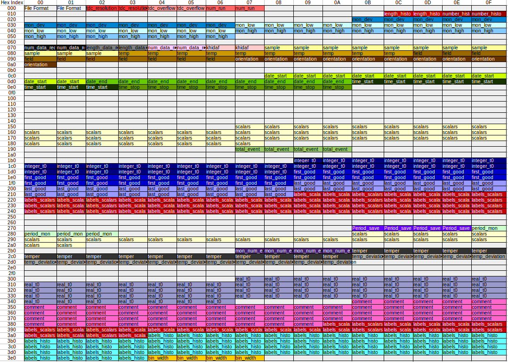

.. _PSIMuonBin file:

PSI Muon Bin File
=================

A PSI Muon Bin file is a data file used by multiple instruments at PSI, and is now able to
be used by MantidPlot. The format is just binary bytes, consisting of two main part of the
file. The two main components are the header and the histograms.

Mantidplot is capable of loading the .bin file from PSI.

Structure
---------

The general structure for the header of PSI bin files is:

Here are some specific details, following the header are the histograms, using the data from
the header the algorithm will load the data from the histograms.

The file can be loaded by using the :ref:`LoadPSIMuonBin<algm-LoadPSIMuonBin-v1>` algorithm,
which is called when you pass the file to the load algorithm either via the algorithms or by
loading the file like you would any other workspace

.. categories:: Concepts
