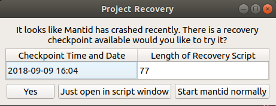

.. _Project Recovery:

Project Recovery
================

What is it?
-----------

If Mantid crashes for some reason, we have introduced the functionality to attempt to recover the state that Mantid was in prior to the crash.

Project recovery is a key part of our efforts to make Mantid as stable and reliable as possible.

How it works
------------

Project recovery works in two parts:

* History writer: This writes the history of the workspaces in your workspace dialog, periodically saving the files. It is not likely that you will ever notice the history writer process.
* Project recovery: This rebuilds the last saved state of Mantid after a crash, it uses the files produced by the history writer

If Mantid has crashed, then on the subsequent reboot you will be presented with the project recovery dialog (see image)

You can choose to attempt a full recovery, to open a recovery script or not to attempt a recovery. Full recovery will attempt to recover all workspaces present at the time of the crash as well as additional dialogs like plots or data windows. Script mode will attempt to construct a script that contains the history of all workspaces at the time of the crash.

If full project recovery runs successfully the scripting window will remain open in MantidPlot. It is safe to close this after a recovery.

If Project Recovery fails to run successfully it will open a GUI that will give users the option to select a specific checkpoint, try the last checkpoint again, open a specific checkpoint in a script window or start mantid normally without any project recovery occuring. (See image)

.. image:: ../images/ProjectRecoveryFailureDialog.png
    :width: 400px
    :align: center
    :alt: alternate text

**NB** This is an early version of project recovery. We think that it is a lot better than nothing, but we know it won't always work. Known caveats are listed below. Moreover, we would sincerely appreciate feedback and input from users. Contact us at `mantid-help@mantidproject.org <mailto:mantid-help@mantidproject.org>`__.

The settings for project recovery, including switiching the feature on/off, and how to set them, are listed at the bottom of this page.

Caveats
-------

* Interfaces
	* Muon - project recovery does not work at all with the existing Muon interfaces.
	* Indirect analysis - project recovery does not work when performing fitting routines within the indirect analysis interface.
	* SANS - project recovery does not currently work with the SANS interface.

* Dictionary properties
	* Affects: SANS interface, SetSample algorithm
	* Cause: Currently the history writer does not serialise Python dictionaries correctly.

Settings
--------

Specific behavior of this can be configured in the :ref:`properties file <Properties File>`.

.. categories:: Concepts
