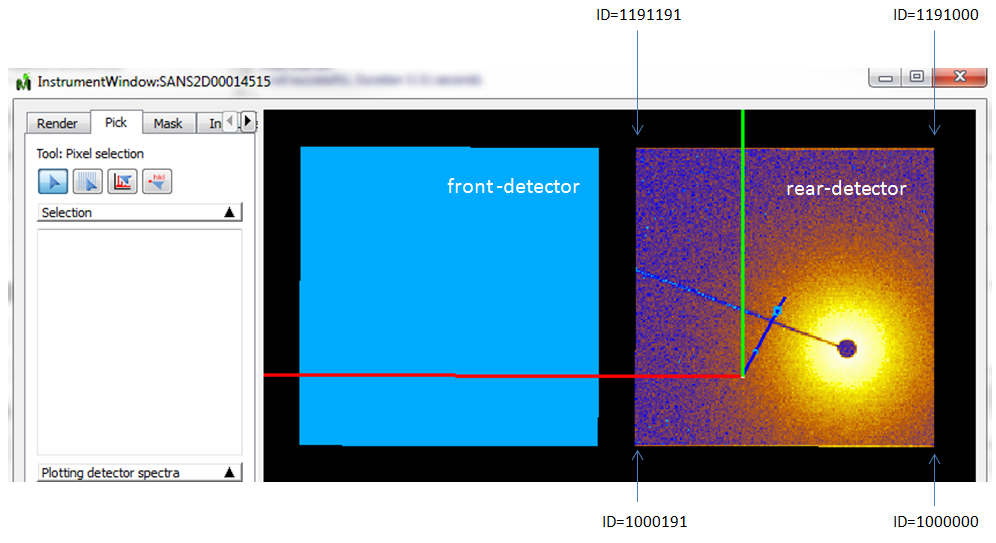
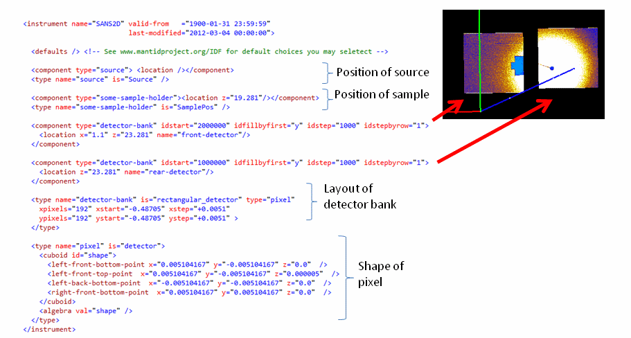

.. _SANS2D_Sample_IDF:

 
.. role:: xml(literal)
   :class: highlight

IDF ISIS SANS2D annotated
=========================

This page annotates the small angle scattering SANS2D IDF, with the purpose of (hopefully) quickly learn the basis of creating a similar IDF.

Instrument view of SANS2D
-------------------------

SANS2D consists of two square detector banks and some monitors. Below is shown data from run 14515 (using the Load button on MantidPlot and then selecting instrument view) and for this run zero counts where recorded for the front-detector bank (the SANS2D front-detector was taken off for a period of time, although zero count data were still recorded for this bank, and as of this writing the SANS2D scientists have chosen to stick with the same IDF regardless of weather the front-detector bank is on the instrument or not).

The view of the instrument is generated using the 'Pick' mode. This mode is, for example, useful to check how detector IDs have been assigned. Try this out yourself. In pick mode simply hover the mouse over the banks and you will in the left hand panel above 'Plotting detector spectra' see information about the individual detectors.

   Sans2d-instrument-view.png

A schematic annotation of parts of the ISIS SANS2D IDF

   Sans2d IDF annotated.png

A detailed annotated version of the full ISIS SANS2D IDF

.. code-block:: xml

  <!-- Specify name of instrument and date from when this IDF is valid -->
  <instrument xmlns="http://www.mantidproject.org/IDF/1.0" 
              xmlns:xsi="http://www.w3.org/2001/XMLSchema-instance"
              xsi:schemaLocation="http://www.mantidproject.org/IDF/1.0 Schema/IDFSchema.xsd"
              name="SANS2D" 
              valid-from="1900-01-31 23:59:59">
   
  <!-- Specify various optional defaults -->
    <defaults>
      <length unit="meter"/>
      <angle unit="degree"/>  
      <reference-frame>
        <along-beam axis="z"/>
        <pointing-up axis="y"/>
        <handedness val="right"/>
      </reference-frame>
      <default-view axis-view="z-"/>
    </defaults>
   
   
  <!-- ISIS is a neutron spallation source. Therefore an important
       piece of information is the position the source relative to
       the sample, which is needed to calculate neutron flightpaths. 
       The source currently also serves as a point along the beam, and 
       the source-to-sample direction is used to determine the beam 
       direction in a number of parts of the Mantid code. -->
    <component type="source">
      <location />  <!-- Specify location of this component. Specifying nothing means use defaults are (x=0,y=0,z=0) -->
    </component>
    <type name="source" is="Source" /> <!-- Specify the type with name "source", which also 'is' marked as the Source --> 
   
  <!-- Specify position of the sample. SANS2D scientists here 
       chose to specify this at (x=0,y=0,z=19.281) in their preferred coordinates
       system. Another common choice is setting the SamplePos at (0,0,0) -->
    <component type="some-sample-holder">
      <location z="19.281"/>
    </component>
    <type name="some-sample-holder" is="SamplePos" /> 
   
  <!-- Specify monitor components. Monitors collect data hence 
       the idlist="monitors", which specify the name of a list of detector/monitor IDs.
       For ISIS data this provides the link between the data and the components
       collecting the data. Even for data not associated with unique IDs,
       unique ID numbers of your choice are still required, for subsequent 
       use by Mantid analysis -->
    <component type="monitors" idlist="monitors">
      <location />
    </component>
   
    <!-- Define the monitor detector IDs. There are 8 of these on SANS2D -->
    <idlist idname="monitors">
      <id start="1" end="8" />  
    </idlist> 
   
    <!-- Specify what a type with name="monitors" is. This type happens to be a container/grouping
         of the monitors of this instrument. This grouping is here entirely optional. Only difference
         it makes is that in the Mantid instrument view tree these will be listed under one node, and
         in Python/C++ code a user can more easy for example set a property which applies
         to all the monitors -->
    <type name="monitors">
      <component type="monitor-tbd">
        <location z="7.217" name="monitor1"/>
        <location z="17.937" name="monitor2"/>
      </component>
      <component type="Moderator-Monitor3">
        <location z="19.497" name="monitor3"/>
      </component>
      <component type="monitor-tbd">
        <location z="30.0" name="monitor4"/>
      </component>       
      <!-- These monitors are defined in the data, but in fact do not exist on
           the instrument at present. So these are just located at dummy locations -->
      <component type="no shape monitor"> 
        <location z="0" name="placeholder monitor"/>
        <location z="0" name="placeholder monitor"/>
        <location z="0" name="placeholder monitor"/>
        <location z="0" name="placeholder monitor"/>      
      </component>  
    </type>
   
    <!-- Define one of the monitor types. This monitor is given a physical shape.
         More specifically here a cylindrical shape. See http://www.mantidproject.org/HowToDefineGeometricShape
         for all the options for defining a physical shape -->
    <type name="monitor-tbd" is="monitor">
      <cylinder id="some-shape">
        <centre-of-bottom-base r="0.0" t="0.0" p="0.0" />
        <axis x="0.0" y="0.0" z="1.0" /> 
        <radius val="0.01" />
        <height val="0.03" />
      </cylinder>   
    </type>
   
    <!-- Another monitor type -->
    <type name="Moderator-Monitor3" is="monitor">
      <percent-transparency val="99.9" />
      <cuboid id="shape">
        <left-front-bottom-point x="0.0125" y="-0.0125" z="0.0"  />
        <left-front-top-point  x="0.0125" y="-0.0125" z="0.005"  />
        <left-back-bottom-point  x="-0.0125" y="-0.0125" z="0.0"  />
        <right-front-bottom-point  x="0.0125" y="0.0125" z="0.0"  />
      </cuboid>
      <algebra val="shape" />
    </type>    
   
    <!-- Define a no shape monitor type -->
    <type name="no shape monitor" is="monitor" /> 
   
   
  <!-- Specify the SANS2D front detector bank, which is a square detector bank of 192 x 192 pixels
       Because this detector bank is described using an optional shortcut notation then an 'idlist' is
       not used to specify the detector IDs. Instead the tags idstart, idfillbyfirst, idstep and idstepbyrow
       which in this particular case means the ID are assigned as shown in the instrument view picture on this page -->
    <component type="detector-bank" idstart="2000000" idfillbyfirst="y" idstep="1000" idstepbyrow="1">
      <location x="1.1" z="23.281" name="front-detector"/>
    </component>  
   
  <!-- Specify the SANS2D rear detector, which is of the same type as the front detector bank -->  
    <component type="detector-bank" idstart="1000000" idfillbyfirst="y" idstep="1000" idstepbyrow="1">
      <location z="23.281" name="rear-detector"/>
    </component>
   
    <!-- Specify what a detector bank type is, which is a square array of 192 x 192 pixels, and here
         a shortcut notation is used do define such a bank using is="RectangularDetector" -->
    <type name="detector-bank" is="RectangularDetector" type="pixel" 
      xpixels="192" xstart="-0.48705" xstep="+0.0051"
      ypixels="192" ystart="-0.48705" ystep="+0.0051" >
    </type>  
   
    <!-- Specify a pixel type -->
    <type name="pixel" is="detector">
      <cuboid id="shape">
        <left-front-bottom-point x="0.005104167" y="-0.005104167" z="0.0"  />
        <left-front-top-point  x="0.005104167" y="-0.005104167" z="0.000005"  />
        <left-back-bottom-point  x="-0.005104167" y="-0.005104167" z="0.0"  />
        <right-front-bottom-point  x="0.005104167" y="0.005104167" z="0.0"  />
      </cuboid>
      <algebra val="shape" /> 
    </type>      
   
  </instrument>

.. categories:: Concepts