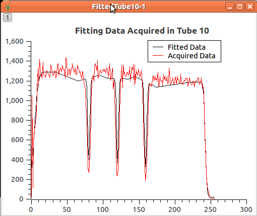

.. _Python_Code_For_Calibration:

Python Code For Calibration
===========================

The interaction with the calibration tools inside mantid is done through
the
`tube.py <https://github.com/mantidproject/mantid/blob/master/scripts/Calibration/tube.py>`__
file for which you can find an extensive documentation
:ref:`here <api_Calibration>`.

Calibrate function
------------------

Inside the python Console, all you need is to import the tube module.

.. code:: python

     import tube

Or, you may interested to import the main function **calibrate**
directly:

.. code:: python

     from tube import calibrate

This function requires some inputs and allow for some optional
parameters as well. The minimum set of parameters required are:

* The workspace whose instrument is based on tubes (ws), where the counts in the tube pixels have been integrated
* Definition of the set of tubes to be calibrated (tubeSet)
* The position of the known points (knownPositions)
* The shape of the known points (funcForm). Currently, we accept two shapes identified as 1 for :ref:`Gaussian <func-Gaussian>` and 2 for Edges.

Parameter: Workspace
####################

Below, it shows an example of a workspace:

.. code:: python

      wsToCalibrate = Load('MAP14919')
      wsToCalibrate = Integration(wsToCalibrate)
      # you may provide the integration limits as well
      #wsToCalibrate = Integration(wsToCalibrate,lowRange,highRange)

Parameter: tubeSet
##################

The second step is to define what are the tubes to be calibrated
(**tubeSet**). This parameter accepts the following inputs:

* As single string that defines a set of tubes (e.g.MERLIN/door2/tube_1_1), door (e.g. MAPS/A1_window), or the whole instrument (e.g. MAPS)
* A list of strings (e.g. [MERLIN/door2/tube_1_1, MERLIN/door2/tube_1_2], [MERLIN/door1, MERLIN/door2])
* A `TubeSpec <TubeSpec>`__ object.

.. code:: python

      from tube_spec import TubeSpec
      tubeSet = TubeSpec(wsToCalibrate)
      tubeSet.setTubeSpecByString("MAPS/A1_window")

Parameter: knownPositions and funcForm
######################################

The third step is to provide the positions of the special points of the
calibrated experiment along the tube. The important factor is that these
positions must obey the following agreement:

**The center of the tube is the origin, and the measures are given in
the same measures of the 3D space (usually meters)**

For example, the calibration experiment carried on MAPS instrument, you
find the following data acquired on tubes as shown in the image below.

There are 5 special points that can be used to the calibration.
These points must be in **meters**
The points has a rising edge, followed by 3 Gaussian through,
and finally, a final edge. These 5 points were measured and the result was:

.. code:: python

      # remember that the origin is in the center of the tube. measured in meters.
      knownPositions = [-0.50, -0.16, 0.0, 0.16, 0.50]
      # the shape of these points: edge, Gaussian, Gaussian, Gaussian, edge
      funcForm = [2, 1, 1, 1, 2]

Execution of calibrate function
###############################

The calibrate function returns a Calibration Table that will be used to
calibrate the instrument, providing, for each detector, its correct
position.

.. code:: python

      calibTable = calibrate(wsToCalibrate, 'MAPS/A1_window', knownPositions, funcForm)

With the given calibration table, the
:ref:`ApplyCalibration  <algm-ApplyCalibration>` algorithm is called to move
those detectors.

.. code:: python

      ApplyCalibration(wsToCalibrate, calibTable)

Options
#######

A more extensive description of the options is found at :ref:`here <api_Calibration>`.

A set of optional parameters are available for the **calibrate**
function for the sake of flexibility, to improve results.

The calibration heavily depends on the :ref:`estimation of the peaks position
<tubecalibintro-peak-pos-estimation>`,
when this step does not perform well, the calibration provides bad
results.

There are some parameters that help the calibration tool to better find
the peaks, they are: **fitPar** and **margin**. **margin** defines a
window around the peak to fit while **fitPar** is a
:ref:`TubeCalibFitParams <TubeCalibFitParams>` object that keeps
information of peaks center in pixels, and some other parameters that
are passed to the fitting functions.

The **plotTube** allows to output the data acquired and fitted as
workspaces for each tube. That allows the creation of plots like this

The **calibTable** option allow to concatenate results of sequential
calibration.

The **outputPeak** makes the calibrate to provide the peaks table, which
are the position for the peaks for each tube.

All these options are explored and used inside the examples.

Some Python scripts for analyzing the calibration
-------------------------------------------------

Saving the Detector Positions to Text File
##########################################

.. code:: python

    def savePositions2TxtFileFromCalibTable(calibTable, file_path):
      tofile = open(file_path,'w')
      for row in calibTable:
        print >> tofile, row['Detector ID'], row['Detector Position']
      tofile.close()

.. code:: python

    def savePositions2TxtFileFromWorkspace( ws, file_path):
      tofile = open(file_path, 'w')
      det_pos = [ws.getDetector(i).getPos() for i in range(ws.getNumberHistograms()) if not ws.getDetector(i).isMonitor()]
      for det in det_pos:
        print >> tofile, det
      tofile.close()

Loading Detector Positions From Text File
#########################################

.. code:: python

    import numpy as np
    def getDetPositionsFromFile(file_path):
      return np.loadtxt(file_path, delimiter=',')

.. categories:: Calibration
