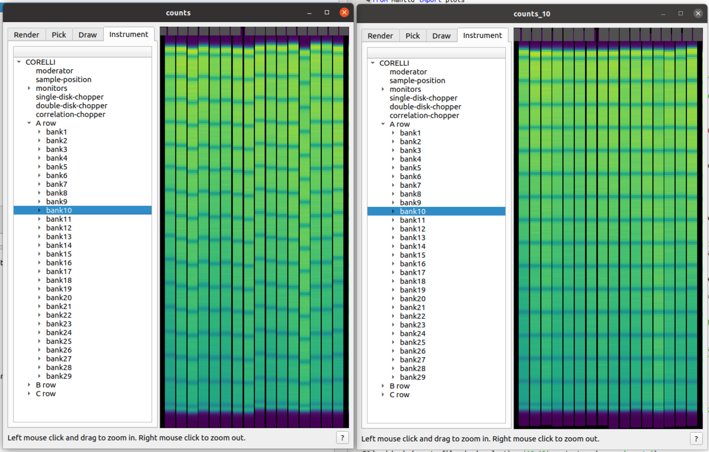

.. _Tube_Calibration_Corelli:

Corelli Tube Calibration
========================

Introduction
------------

Mantid has specific functionality for the Corelli instrument at Oak Ridge National Laboratory (ORNL). The Python scripts are located at: ``**MANTIDINSTALL**/scripts/corelli/calibration`` (`github link <https://github.com/mantidproject/mantid/tree/master/scripts/corelli/calibration>`__).
These scripts can be launched on MantidWorkbench.

The overarching goal is to create and update the information from the applied calibration functions as new cycles are performed.
The result is a database of calibrated vertical "Y"-coordinates stored for each bank as a :ref:`Table Workspaces` with pixel_id and Y-coordinate columns.

Performing a Calibration
------------------------

The following example illustrates the steps to follow for bank calibration.

* Load counts from instrument file
* Select banks to be calibrated
* Apply the calibration algorithm from :code:`corelli.calibration.utils`

.. code-block:: Python

   from corelli.calibration.bank import calibrate_banks
   from corelli.calibration.utils import apply_calibration, load_banks
   counts_file = '/SNS/CORELLI/shared/tmp/CORELLI_124023_counts.nxs'
   load_banks(counts_file, bank_selection='10-19', output_workspace='counts')
   calibrate_banks('counts', bank_selection='10-19')
   apply_calibration('counts', 'calib10', output_workspace='counts_10')

Open the instrument view for workspaces counts and counts_10, then look at bank10 and verify that all tubes in this bank have been calibrated for counts_10

Calibration Database
--------------------

Calibrated banks can then be stored in a database which follows the current structure:

.. code-block:: none

   database_path/
      manifest_corelli_20201201.csv
      manifest_corelli_20210601.csv
      bank001/
              calibration_corelli_bank001_20201201.nxs.h5
              mask_corelli_bank001_20201201.nxs.h5
              fit_corelli_bank001_20201201.nxs.h5
              calibration_corelli_bank001_20210601.nxs.h5
              mask_corelli_bank001_20210601.nxs.h5
              fit_corelli_bank001_20210601.nxs.h5

      bank002/
      bank003/

Each bank subdirectory contains 3 binary NeXus HDF5 files per calibration cycle (identified by the date timestamp) corresponding to a workspace that be loaded directly on MantidWorkbench for:

* calibration: correctly calibrated pixel_id and Y-coordinates
* mask: flagged pixel_id that didn't pass calibration criteria
* fit: summary

Each calibration cycle generates a manifest file in csv format. It contains information on the bank_id and timestamp for the performed calibration.

.. code-block:

   bankID,  timestamp
   ...
   70,      2020-09-02
   71,      2020-09-02
   75,      2020-09-02

Manipulation of the database, in particular saving and loading the files to/from Mantid workspace is provided in the `database.py module <https://github.com/mantidproject/mantid/tree/master/scripts/corelli/calibration/database.py>`__

The user should only be dealing with the following functions when saving/loading calibrations. Any other functions should only be used for debugging purposes.

.. code-block:: Python

   bank/load_banks
   bank/calibrate_banks
   database/save_calibration_set
   database/new_corelli_calibration
   database/load_calibration_set

As an example we can use:

.. code-block:: Python

   from corelli.calibration.database import save_calibration_set, load_bank_table, load_calibration_set
   from corelli.calibration.bank import calibrate_banks

   # populate a calibration database with a few cases. There should be at least one bank with two calibrations

   database_path = '/SNS/CORELLI/shared/calibration_database'
   ws = [('124023_banks_14_15', [ws14,ws15])]
   cases = [('124023_banks_14_15', '14-15')]
   # use current date if not provided
   save_manifest_file(database_path, [14, 15])

   for bank_case, bank_selection in cases:
       # Produce workspace groups 'calibrations', 'masks', 'fits'
       # ws is a dictionary with workspace values
       calibrate_banks(ws[bank_case], bank_selection)
       save_calibration_set(ws[bank_case], database.name, 'calibrations', masks, 'fits')

   # Each bank calibration table can be loaded for a particular timestamp date:
   # Not required, but good for debugging
   load_bank_table(14, database_path, date)
   load_bank_table(15, database_path, date)

   # Or just the set
   load_calibration_set(self.cases['124023_bank10'], database_path)

.. categories:: Calibration
