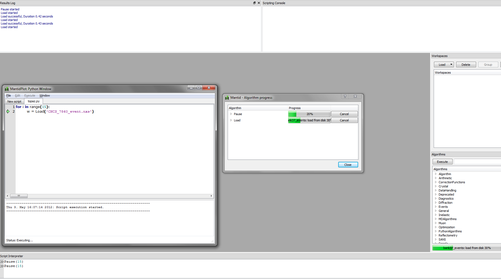
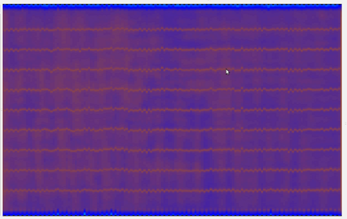
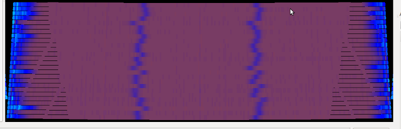
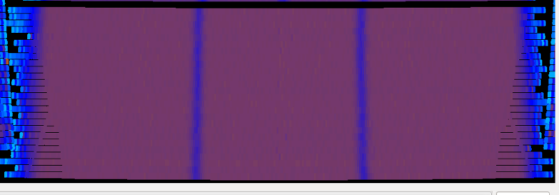
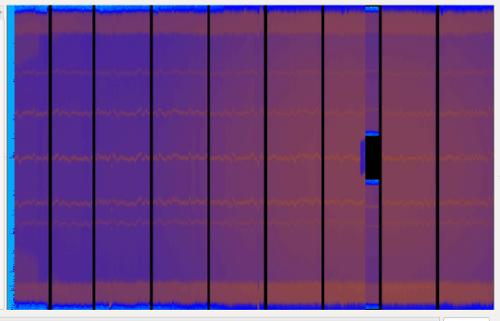
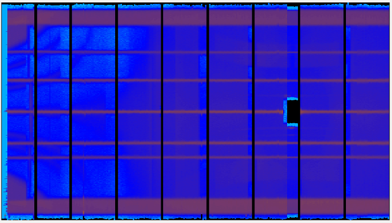
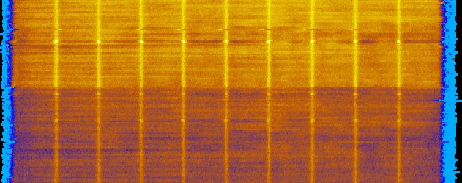

.. _Tube_Calibration_Examples:

Introduction
============

You will find lots of examples to run the calibration tool inside the
**MANTIDINSTALL**/scripts/Calibration/Examples folder (`github
link <https://github.com/mantidproject/mantid/tree/master/scripts/Calibration/Examples>`__).
Where **MANTIDINSTALL** usually points to C:/MandtidInstall on Windows
machines and to /opt/Mantid on linux machines.

The examples shows how the calibration tools available in Mantid can be
used to calibrate three different real instruments inside ISIS facility
(`MERLIN <http://www.isis.stfc.ac.uk/instruments/merlin/>`__,
`MAPS <http://www.isis.stfc.ac.uk/instruments/maps/>`__ and
`WISH <http://www.isis.stfc.ac.uk/instruments/wish/>`__). There is also
a presentation about the tube calibration where you may also find
interesting examples on how to use the calibration tools
(`Tube_Calibration.pdf <http://www.mantidproject.org/images/b/bc/Tube_Calibration.pdf>`__).

In what follows, it will be shown how you can use some of these
examples. Mantid needs to know where the files are in order to execute
these examples. For Merlin the examples uses the run 12024 found in
cycle_11_5, for MAPS the run 14919 in cycle_09_05, for WISH the run
17701 in cycle_11_1.

Examples
--------

Running TubeCalibDemoWish_Simple.py
###################################

Open Script Window Console (MantidPlot: Python Window **F3**)

From its Menu->File->Open File, select
scripts/Calibration/Examples/TubeCalibDemoWish_Simple.py

Finally, Menu->Execute->Execute_All triggers the execution of the
example.

Another possibility is to open a new file and write the following lines:

.. code-block:: python

     from Examples import TubeCalibDemoWish_Simple as wish
     wish.CalibrateWish(17701, '03')

The results are, uncalibrated WISH panel 03:

Calibrated panel 03:

.. image:: ../../images/CalibratedWish.png

.. note:: These images were taken from the InstrumentView having
          *Autoscaling* enabled, *ColorMap* set to Log10 and using the
          *Cylindrical Y* perspective.

Running TubeCalibDemoMaps_All.py
################################

Open file scripts/Calibration/Examples/TubeCalibDemoMaps_All.py on
Script Window Console or, alternatively, write the following line:

.. code-block:: python

     from Examples import TubeCalibDemoMaps_All as maps

TubeCalibDemoMaps_All defines 8 examples. It shows how the tube
calibration was used to improve the calibration of MAPS going from a
simple example, to the investigation on how to improve the results till
a final example.

If you open the whole file, you will have to uncomment the example that
you want to execute and them Menu->Execute->Execute_All.

If you are writing the script, them you can select the examples by
calling the functions as in the following example:

.. code:: python

     from Examples import TubeCalibDemoMaps_All as maps
     maps.calibrateB2Window('MAP14919.raw')

The results are, Uncalibrated MAPS B2 window (lower part) instrument:

 

Calibrated MAPS B2 window:

 
Running TubeCalibDemoMerlin.py
##############################

MERLIN instruments are loaded with already calibrated values. The
calibration works nicely with these files, but if you want to see the
uncalibrated file you can do it. Look at :ref:`How to reset detectors
calibration <How_to_reset_detectors_calibration>`.

Open file scripts/Calibration/Examples/TubeCalibDemoMerlin.py on Script
Window Console or, alternatively, write the following lines:

.. code:: python

     from Examples import TubeCalibDemoMerlin as mer
     mer.calibrateMerlin('MER12024.raw')

The results are, Uncalibrated MERLIN instrument:

Calibrated MERLIN instrument:

Running TubeCalibDemoWish_5panels.py
####################################

This example extends the work presented for the calibration of a single
panel in WISH to 5 panels.

To execute it, open the TubeCalibDemoWish_5panels.py inside mantid and
run it. The data files were collected in the cycle_11_1.

It uses the python feature of kwargs to selectively pass parameters to
the calibrate function and in this way append the calibration data for
the panels.

The picture below show part of two panels that result from the
calibration (they are rotated):

.. categories:: Calibration