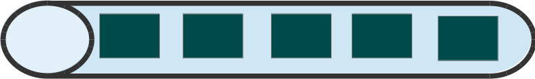
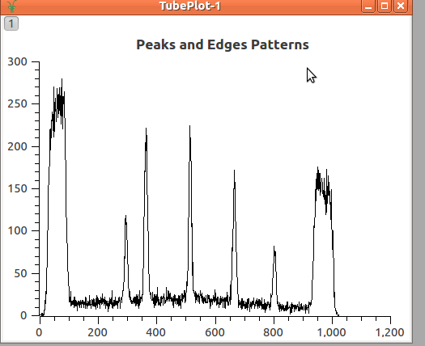
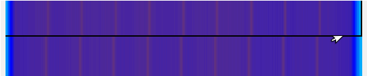
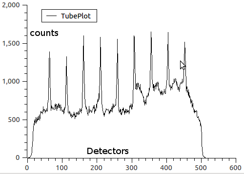
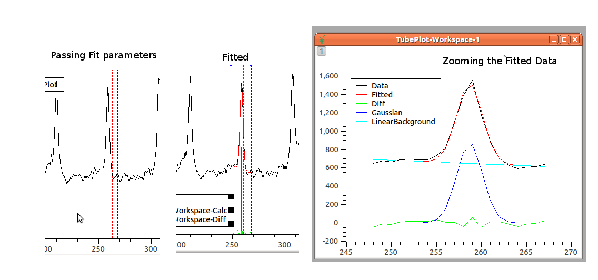
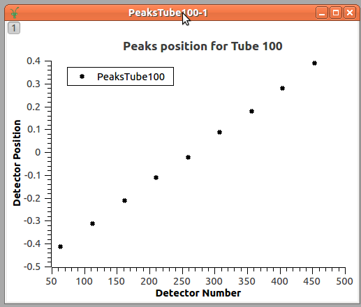
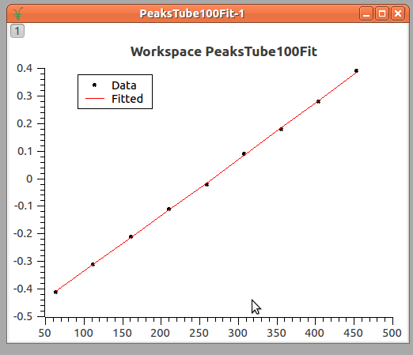
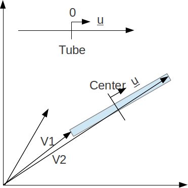

.. _Tube_Calibration_Introduction:

Tube Calibration Introduction
=============================

This page is about the python code supporting tube calibration. The
files are found in the **scripts/Calibration/** folder of the Mantid
install directory.

Introduction to Calibration
===========================

Some instruments use tubes. Each tube acts as set of detectors along a
line.

    Illustration of a tube with its detectors

The exact position of each detector in a tube depends on the electronics
of the tube and varies slightly from tube to tube. The aim of
calibration is to find the actual position of each detector and put it
into the representation of the instrument used by MANTID.

The general technique is to use a calibration bin or to place neutron
absorbing strips on the detector at known positions along the tube.
Depending on the dimensions of these strips or bins the different
patterns may be formed. Below you find an example of some narrow peaks
or edges. Although the plot shows measures of peaks of neutron
intensity, dip of intensity could be used as well.

The image below shows an acquired data with the shadows and the
peaks in two tubes; the blue are shadows and the red lines are peaks
where neutron are getting through. Observe that the positions of the
lines are different in each tube. Even though they were expected to be
aligned, i.e. in the figure below the vertical red lines should be
connected up to form straight lines.

  Acquired Data in two tubes not calibrated

Below is the plot of the integration counts in a single tube. The x-axis
shows pixels (detector numbers, where the detectors are numbered 0 to
511) and the y-axis shows integrated counts.

  Plot of the acquired Data in a single tube

So, it is the aim of the calibration to define the positions of the
detectors, so that, the calibrated data will really show straight lines.

This calibration is done through three main steps:

* Peak/Edge position estimation
* Find the correct position along the tube
* Apply the correction to the detectors

From now on, the calibration will be explained considering only peaks.
For edges the operation are similar.

.. _tubecalibintro-peak-pos-estimation:

Peak position estimation
------------------------

The first necessary operation to do is to find the position where the
peak of acquisition should be in each tube. Currently, this is done
through fitting the peak to a combination of a linear background and a
:ref:`Gaussian <func-Gaussian>` function. But, in the future, different approaches can be
foreseen as for example, the mean value among the peak position of the
neighbors, or simply getting the index where the maximum value occur.

By fitting the acquired data to the :ref:`Gaussian <func-Gaussian>` function, we are able to
find the PeakCentre (one parameter of the :ref:`Gaussian <func-Gaussian>` Function), that is
the estimated value of where the peak would be found in the tube. It is
expected that this estimation provides better result than just getting
the index of local maximum for the peak.

In conclusion, this operation will provide the expected position of the
peaks in each tube. For example, for the picture above, nine points will
be found as peaks positions.

Find the correct position along the tube
----------------------------------------

In the introduction, it was said that the bin or strips are placed at
known positions. These known positions in the calibration framework are
used to construct the **IdealTube**, the tube where the peaks occur at
the exactly known positions.

Here, an agreement is necessary to define how the positions will be
given for the tubes. The tubes may be considered as lines, where the
detectors have to be adjusted only in one direction. In the example
below, the positions were given having the center as origin and
increasing from left to right. (Suggestion: it would be simple by
assuming origin on the left and increasing values)

Having this, we display the data using the peaks positions (pixel
number) found for each tube and the correspondingly ideal position we
expected them to be.

Look, that the peaks positions are given in 'pixels', and we are looking
for a transformation that moves the peaks position to the known position,
those defined in the IdealTube, as the function:

:math:`T(pixels) = TubePosition`

Currently, this is done by fitting these data to a quadratic function.
(Should we consider 3rd order polynomial as said in the documentation?)

:math:`Position(pixels) = a  \times pixels^2 + b \times pixels + c`

The result is shown in the plot below

The final step is to define the transformation that moves the position
in relation to the center of the tube to the 3D space where the tube is.

Assuming that the units given for the position in the **IdealTube** and
for the 3D space are the same, as in the picture below

We have that the 3D position is:

:math:`\vec{p} = \vec{c} + v \vec{u}`

Where :math:`\vec{c}` is the coordinate of the center of the tube and is:

:math:`\vec{c} = \frac{\vec{v_1} + \vec{v_2}}{2}`

For  :math:`\vec{v_1}` and  :math:`\vec{v_2}` refer to the position of the first and the last
detector inside the tube.

**V** is the real value of the position in relation to the center (the
values from the equation :math:`y = ax^2+bx+c`).

And **u** is the unitary vector and is

:math:`\vec{u} = \frac{\vec{v_2} - \vec{v_1}}{|v_2-v_1|}`

If the units are different, them, the equation changes to:

:math:`\vec{p} = \vec{c} + \frac{v}{l} l'  \vec{u}`

Where :math:`l` is the length of the tube in the coordinates given for the
IdealTube while :math:`l'` is the length of the tube in the 3D space.

Apply the correction to the detectors
-------------------------------------

After having the defined position for the detectors, these positions are
applied to the instrument.

.. categories:: Calibration
