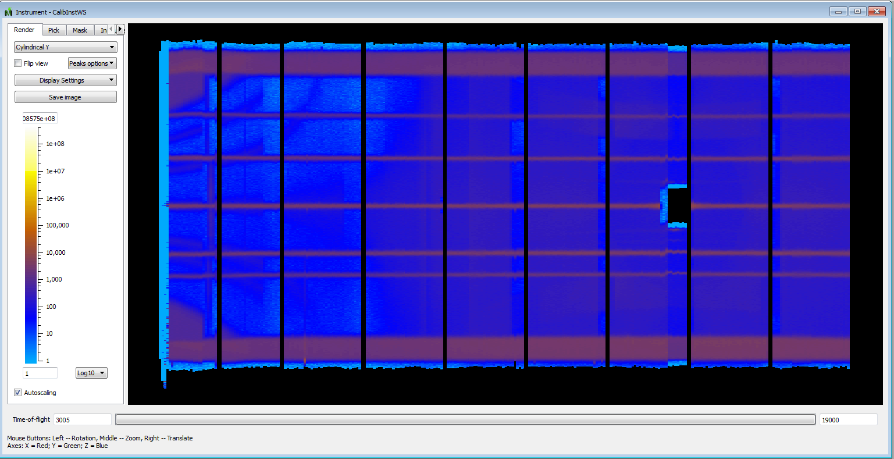

.. _Visualization_of_Calibrated_Tubes:

Visualization of Calibrated Tubes
=================================

When viewing the instrument in `Instrument View <http://www.mantidproject.org/Instrument_View>`__
note that for instruments that uses the 3D-graphics accelerator option
'outline' in :ref:`IDF <InstrumentDefinitionFile>`, you will not see the effects of calibration
in a 3D view. To see the calibration, select a 2D view. Cylindrical Y
is appropriate for MERLIN and WISH.

Example of tube calibration of MERLIN

.. categories:: Calibration
