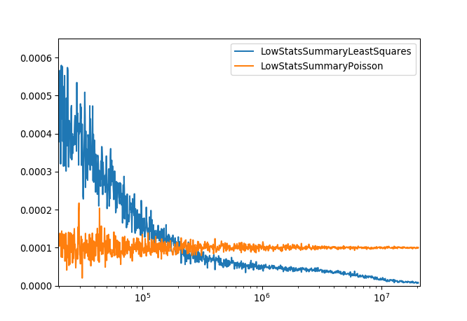

.. _Poisson:

=====================
Poisson Cost Function
=====================

.. index:: Poisson

Description
-----------

The Poisson cost function is designed to be applied to data, which has a low number of counts/events.
In this scenario a fit is being performed using a model (function) to some low stats data.

The number of counts/events in bin :math:`i` is given by :math:`y_i` and the corresponding value for the model is :math:`\mu_i`.
Where the values of :math:`y_i` and :math:`\mu_i` are strictly positive.

The quality of the fit can be represented numerically by the deviance (:math:`D`)

.. math:: 2\sum_{i}^{N} \left\{ y_{i} \log(y_i) -y_{i} \log(\mu_i)  - (y_{i} - \mu_i) \right\},

where the first two terms provide a measure for small variations between :math:`y_i` and :math:`\mu_i`, whereas the third term provides a measure of large variations.
Therefore, by minimizing the deviance the best fit can be identified.
This method is also known as the Poisson deviance or Poisson log-linear model.

When performing a fit on Poisson distributed data care needs to be taken when selecting the cost function.
For a large number of events/counts the least squares cost function can be used to minimize Poisson distributed data.
This is because in the limit of large numbers of events/counts the Poisson and Gaussian distributions are approximately equal.
In the limits of low events/counts using a least squares cost function can lead to biased results.

Example
-------

Given a workspace with low counts, a fit can be done in a script as follows:
``Fit(Function=f,InputWorkspace=workspace,Output="outputName",CreateOutput=True,CostFunction="Poisson",Minimizer="Levenberg-MarquardtMD")``

The plot below demonstrates the difference between using the Poisson and Least Squares cost functions for a given
parameter over a series of fits to data with different number of counts.
The Poisson model gives a much more consistent result and means no special treatment is required for zero counts.

References
----------

[1]  `Rodríguez, G. (2007). Lecture Notes on Generalized Linear Models <https://data.princeton.edu/wws509/notes/c4.pdf>`_.
