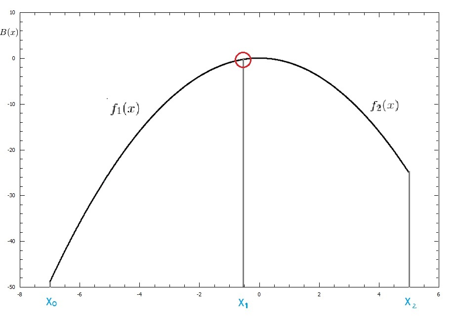
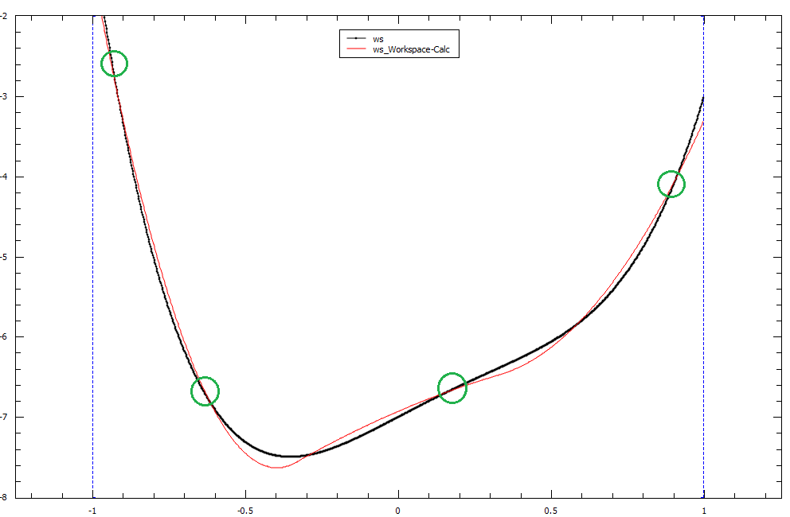

.. _func-BSpline:

=======
BSpline
=======

.. index:: BSpline

Description
-----------

This function creates spline using the set of points and interpolates
the input between them taking into account the least-squares fit.

First and second derivatives from the spline can be calculated by using
the derivative1D function.

A BSpline is a polynomial function :math:`f(x)` of order N, defined between an interval :math:`a \leqslant x \leqslant b`.
When using BSplines for interpolation or for fitting, we essentially chain BSplines together so that each
spline passes through the breakpoints in that interval.

There are conditions at each breakpoint that need to be fulfilled for the overall BSpline to be piecewise-smooth.

Example
-------

To demonstrate these conditions we can set up a basic BSpline of order 2 with 3 breakpoints:

Breakpoints : :math:`x_0, x_1, x_2`

Our BSpline will be defined as the following: 

.. math::

   B(x) = 
                               \begin{cases}
                                 f_1(x)& x_0 \leq x \leq x_1 \\
                                 f_2(x)& x_1 \leq x \leq x_2 \\
                               \end{cases}
                             
We can write our :math:`B(x)` function as a series :math:`B(x) = \sum_{i=0}^{n+k-2} A_i f_i(x)`

where :math:`A_i` is the coefficient of the BSpline. This coefficient maps to our fitting parameters found below.
The coefficients :math:`A_0` to :math:`A_i` can be readily retrieved from a least-squares fit.

If :math:`N` is our number of breakpoints for a spline of order :math:`K` then we can expect :math:`N + K - 2` coefficients
as the -2 accounts for our 2 exterior breakpoints at :math:`x_0` and :math:`x_n`.

To make our BSpline piecewise-smooth we must ensure that these conditions are satisfied:

.. math::
    
    f_1(x_0) = y_0\\
    f_2(x_2) = y_2\\
    \frac{df_1}{dx}(x_1) = \frac{df_2}{dx}(x_1)\\
    \frac{d^2 f_1}{dx^2}(x_1) = \frac{d^2 f_2}{dx^2}(x_1)\\

This point of smoothness is represented by the red circle in the graph below of our BSpline function :math:`B(x)`
      

BSplines and Interpolation
--------------------------
BSplines are commonly used when interpolating between points. An interpolation is different to a fit as 
it uses all of the data points to connect a straight line through them. It acts as if all of your data points
are also breakpoints and a smooth spline of order N will connect the points together.

BSplines and Fitting
--------------------

Fitting with a BSpline is different to interpolation as it requires your number of breakpoints to be less than your number
of data points. The reason being, the BSplines will attempt to fit close to the data points but might only pass through
some of the data points. It is not necessarily going to pass through all data points, only passing through breakpoints is gauranteed.

An example of a fit using BSplines of order 3 can be seen in the image below, our breakpoints have been highlighted in green.
The original dataset is in black, while the calculated fit using a least-squares fit with 4 breakpoints is in red.

.. attributes::

   Uniform;Boolean;true;If set to true, all breakpoints will be evenly spaced between startX and endX
   Order;Integer;3;The order of the spline you wish to use i.e Order = 2 will use Quadratic Splines
   NBreak;Integer;\-;The number of breakpoints you wish to have (must be greater than 1)
   StartX;Double;0.0;Minimum value of X
   EndX;Double;1.0;Maximum value of X
   BreakPoints;Double list;\-;If Uniform is set to false, you must supply the breakpoints as a comma-separated list

.. properties::

.. categories::

.. sourcelink::
