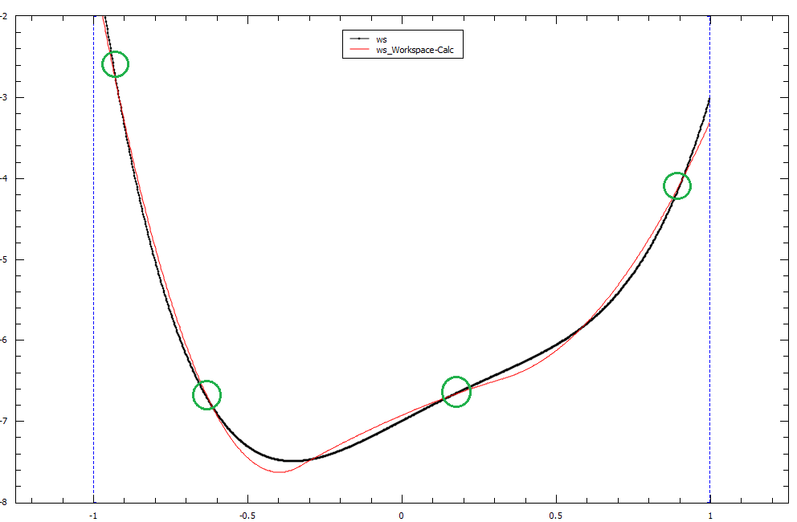

.. _func-CubicSpline:

===========
CubicSpline
===========

.. index:: CubicSpline

Description
-----------

This function creates spline of order 3 using the set of points and interpolates
the input between them taking into account the least-squares fit

First and second derivatives from the spline can be calculated by using
the derivative1D function.

A CubicSpline is a polynomial function :math:`f(x)` of order 3, defined between an interval :math:`a \leqslant x \leqslant b`.
When using CubicSplines for interpolation or for fitting, we essentially chain `BSplines <http://docs.mantidproject.org/nightly/fitfunctions/BSpline.html>`__ 
of order 3 together so that each spline passes through the breakpoints in that interval.

A Cubic Spline is a specific case of `BSpline <http://docs.mantidproject.org/nightly/fitfunctions/BSpline.html>`__
that only uses polynomials of order 3 to define the spline functions.

Again, as with `BSplines <http://docs.mantidproject.org/nightly/fitfunctions/BSpline.html>`__ , there are certain conditions
that must be fulfilled at each breakpoint such that the overall Spline is piecewise-smooth.

Example
-------

To demonstrate these conditions we can set up a basic CubicSpline with 3 breakpoints:

Our CubicSpline will be defined as the following: 

Breakpoints : :math:`x_0, x_1, x_2`

.. math::

   C(x) = 
                               \begin{cases}
                                 f_1(x)& x_0 \leq x \leq x_1 \\
                                 f_2(x)& x_1 \leq x \leq x_2 \\
                               \end{cases}

Our piecewise functions can be written as :math:`f_1(x) = c_0x^3 + c_1x^2 + c_2x + c_3` and :math:`f_2(x) = c_4x^3 + c_5x^2 + c_6x + c_7`

To make our CubicSpline piecewise-smooth we must ensure that these conditions are satisfied:

.. math::
    
    f_1(x_0) = y_0\\
    f_2(x_2) = y_2\\
    \frac{df_1}{dx}(x_1) = \frac{df_2}{dx}(x_1)\\
    \frac{d^2 f_1}{dx^2}(x_1) = \frac{d^2 f_2}{dx^2}(x_1)\\

This point of smoothness is represented by the red circle in the graph below of our CubicSpline function :math:`C(x)`

CubicSplines and Fitting
------------------------

Fitting using a CubicSpline fit function is different to interpolating with a CubicSpline as it requires the number of breakpoints 
to be less than the number of data points. This allows the CubicSpline to fit as close as possible to the dataset using a least-squares fit
instead of passing through all data points as with interpolation. The fitted curve will pass through the breakpoints however it may not pass through
all of the data points in the set.

A example of fitting with a CubicSpline has been provided below, with the breakpoints highlighted in green.
The original data plot is in black and our fitted CubicSpline with four breakpoints is in red.

    

.. attributes::

   n;Integer;3;Number of breakpoints in Spline
   x0;Double;\-;Position of first exterior breakpoint
   x1;Double;\-;Position of the interior breakpoint
   x2;Double;\-;Position of the last exterior breakpoint
   
.. properties::

Even though the number of fitting parameters is set to 3 by default, this number is based off :math:`N + K - 2`.
Where :math:`N` is the number of breakpoints in the fit, :math:`K` is the order of the spline (stays as 3 for the cubic spline case) and the :math:`-2`
accounts for our two exterior breakpoints :math:`x_0, x_n`.
Increasing the number of breakpoints in your fit will increase the number of fitting parameters by the same amount.

.. categories::

.. sourcelink::
