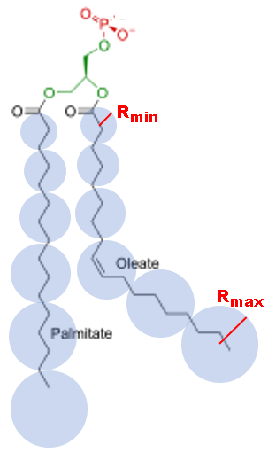

.. _func-EISFDiffSphereAlkyl:

===================
EISFDiffSphereAlkyl
===================

.. index:: EISFDiffSphereAlkyl

Description
-----------

This fitting function models the elastic incoherent intensity of a linear
polycarbon chain (alkyl) where the local diffusion of each unit in the chain
is modeled as undergoing continuous diffusion but confined to a spherical
volume whose radius varies from a minimal value :math:`r` to a maximum
value :math:`R` [1]_.

.. math::

   R_i = (R -r) * (i/M) + r

   EISF(Q) = \frac{1}{M} \sum_{i=1}^{M} (3 \frac{j_1(QR_i)}{QR_i})^2(Q\cdot R_i)

:math:`r` and :math:`R` units are inverse of :math:`Q` units.
Because of the spherical symmetry of the problem, the structure factor is
expressed in terms of the :math:`j_l(z)`
`spherical Bessel functions <http://mathworld.wolfram.com/SphericalBesselFunctionoftheFirstKind.html>`__.

Related functions:
- :ref:`EISFDiffSphere <func-EISFDiffSphere>`
- :ref:`ElasticDiffSphere <func-ElasticDiffSphere>`
- :ref:`InelasticDiffSphere <func-InelasticDiffSphere>`
- :ref:`DiffSphere <func-DiffSphere>`

References
----------

.. [1] V. K. Sharma, et al., `J. Phys. Chem. B 120(1):154-163 <http://pubs.acs.org/doi/abs/10.1021/acs.jpcb.5b10417>`__.

Usage
-----

**Example - fit of Q-dependence:**

.. testcode:: QdependenceFit

    q =  [0.3, 0.5, 0.7, 0.9, 1.1, 1.3, 1.5, 1.7, 1.9]
    # A=2.0, r=0.12, R=1.6, M=9
    eisf = [1.96561499215648, 1.90667574712235, 1.82327109734092,
            1.72075639596568, 1.60529662348532, 1.48322421137169,
            1.36043655237770, 1.24191091785048, 1.13138963884055]
    w = CreateWorkspace(q, eisf, NSpec=1)
    results = Fit('name=EISFDiffSphereAlkyl, M=9', w, WorkspaceIndex=0)
    print(results.Function)

Output:

.. testoutput:: QdependenceFit

    name=EISFDiffSphereAlkyl,M=9,A=2,Rmin=0.12,Rmax=1.6

.. properties::

.. categories::

.. sourcelink::
