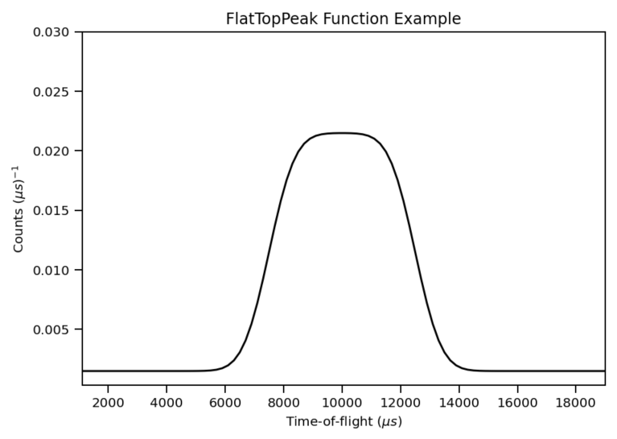

.. _func-FlatTopPeak:

===========
FlatTopPeak
===========

.. index:: FlatTopPeak

Description
-----------

A flat top peak function is defined as:

.. math:: y = scale * (erfc((centre - 0.5 * width - x) / endGrad) - erfc((centre + 0.5 * width - x) / endGrad)) + background

.. attributes::

.. properties::

.. categories::

.. sourcelink::
