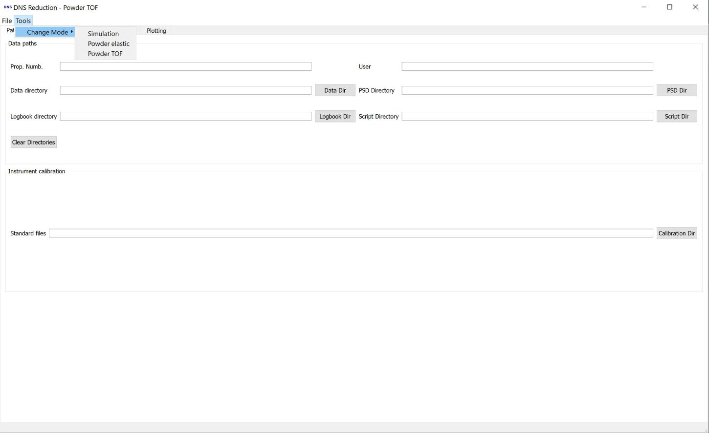
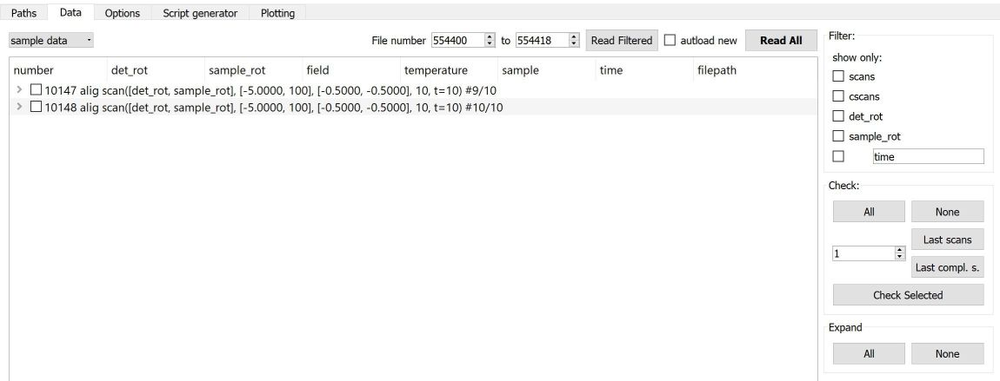
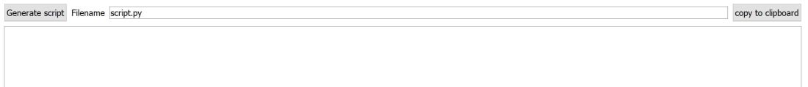

.. _DNSReduction-ref:

DNS Reduction
=============

.. contents:: Table of Contents
  :local:

Interface Overview
------------------

This interface is used to analyse elastic and inelastic TOF powder data at the
DNS instrument at MLZ. The interface can be
accessed from the main menu of MantidWorkbench (recommended) or MantidPlot, in 
*Interfaces → Direkt → DNS Reduction*. 

Main Menu
---------

The *Tools  → Change Mode* menu allows switching between *Simulation*,
*elastic powder* and *inelastic powder* data reduction.

The  *File* menu offers the possibility to save the current GUI status to an 
xml file, and to load such an xml file to restore a session.

Reduction Modes
---------------

* :ref:`Simulation<dns_simulation-ref>` generates a list of reflections and
  simulates powder and single crystal diffraction patterns
* :ref:`Powder elastic<dns_elastic_powder-ref>` Reduction
  of polarized and unpolarized powder diffraction data
* :ref:`Powder TOF <dns_tof_powder-ref>` Reduction of 
  unpolarized TOF powder data reduction

Common Tabs
-----------

The reduction modes share three common tabs:

Path tab
^^^^^^^^

The **Path** tab is used to setup the directories;it is shown in the figure
above.
If *Data directory* is set, the other fields are set automatically, if they 
are empty.
*Proposal Number* and *User* are taken from the first DNS-datafile found.

Data tab
^^^^^^^^
The **Data** tab is used to select the files for reduction.

**Read All** will read all DNS files in the data directory.
**Read Filtered** will read only file numbers in the given range.
Checking **autoload new** will monitor the directory for new files.

The drop down menu switches between sample and standard data. 

The list with the found files is grouped by the *scan numbers* and shows
additionally the *scan number*, the *sample name*, the 
*scan command*, the *number of files found*, and the
*expected number of files* for a complete scan.
By checking, the box on the left side a scan can be chosen for data reduction.
Clicking the arrow on the left will show the files in a scan.

The **Filter**  box filters the shown scans by type or free parameter.

The **Check** box is used to quickly select specific scans.
The Number before **Last scans**, allows checking multiple scans at the
end of the file list.
**Check Selected** checks selected files, multi selecting using *Shift* and
adding items, using *Strg* is supported.

The **Expand** box allows expanding or unexpanding all items.

If the view is changed to *standard* files, filter and selection options are
reduced.

The **automatically select standard files** checkbox will automatically load 
and use all standard files in the standard directory. 
At the moment no matching of standard files to the sample data is done 
and simply all standard files are used (different types and fields are 
handled automatically in the reduction).

Script generator tab
^^^^^^^^^^^^^^^^^^^^
Clicking **Generate script** generates and runs a Mantid script, 
the script is automatically saved to the *script dir* with the given filename.

The lower part shows the script, but does not allow to edit it. 

Feedback & Comments
-------------------

If you have any questions or comments about this interface or this help page,
please contact the 
`DNS Instrument scientists <https://www.mlz-garching.de/instrumente-und-labor
e/spektroskopie/dns.html>`__.

.. categories:: Interfaces Direct