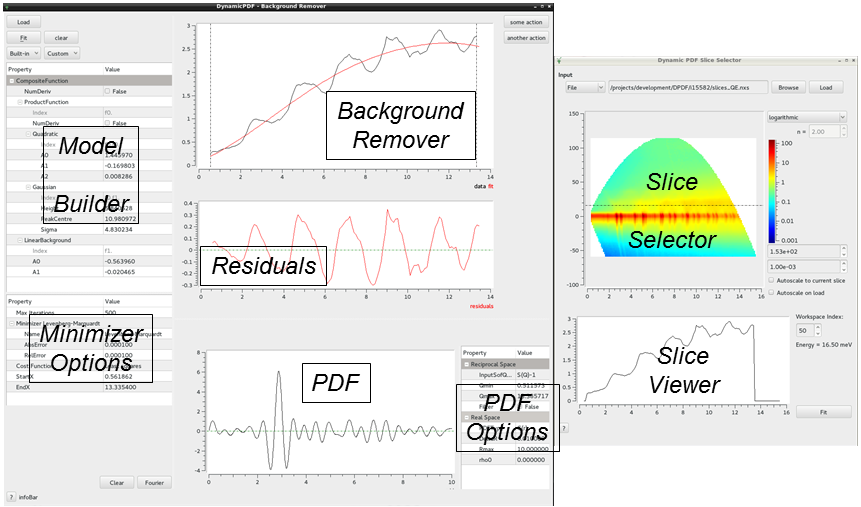
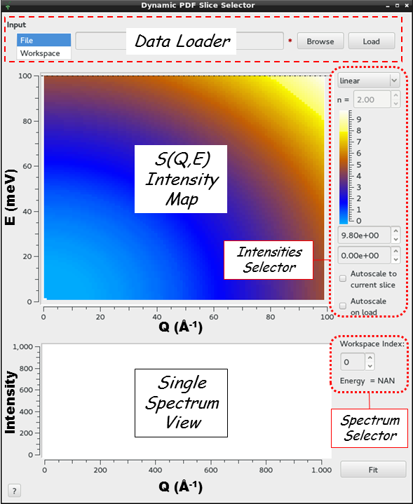
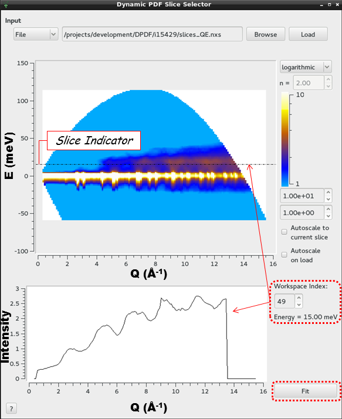

.. _Dynamic PDF:

Dynamic PDF
===========

.. contents:: Table of Contents
  :local:

Background remover
------------------

Overview
~~~~~~~~

The background remover is a tool to obtain the dynamic radial
distribution G(r,E) function after removal of the multi-phonon background
with a fitting procedure.

Unless stated otherwise in the Mantid preferences, the interface will open as
a window docked within the Mantid application. The interface window can be
undocked by changing its state to *floating*. This can be desirable when
displaying Mantid in small monitors. In the Menu, go to **Windows**, then
select **Change to floating**.

Action Buttons
~~~~~~~~~~~~~~

Load
  Summons the Slice Selector for loading of slices.

?
  Opens this help page.

Slice Selector
--------------

Overview
~~~~~~~~

The Slice Selector interface loads a MatrixWorkspace containing structure
factor S(Q,E). Alternatively, one can load a file containing S(Q,E). This file is
usually the result of saving the MatrixWorkspace to a file with algorithm
:ref:`SaveNexus <algm-SaveNexus>`

A bidimensional intensity plot shows overall S(Q,E) in the
*S(Q,E) Intensity Map*. A spectrum, slice, or cut, can be
selected by entering a workspace index (beginning at 0, not 1)
in the *Spectrum Selector* or by dragging up and down the
*Slice Indicator*, the horizontal dashed-line in the *S(Q,E) Intensity Map*
(see picture below).
The slice is shown in the *Single Spectrum View*. In the picture below, user
has loaded file *slices_QE.nxs* and is currently viewing the 15meV slice,
which corresponds to workspace index 49 of workspace *slices_QE*.

Action Buttons
~~~~~~~~~~~~~~

"Fit"
  Import the slice currently selected into the *Background Remover* widget.

.. categories:: Interfaces DynamicPDF

Developer's Corner
------------------

Diagrams
~~~~~~~~

.. diagram:: DPDFBackgroundRemover_mainComponents.dot

.. diagram:: DPDFBackgroundRemover_workspaceUpdated.dot

.. diagram:: DPDFBackgroundRemover_sliceSelected.dot
