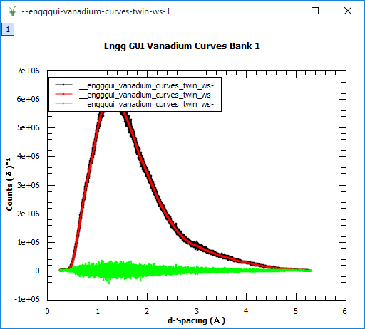
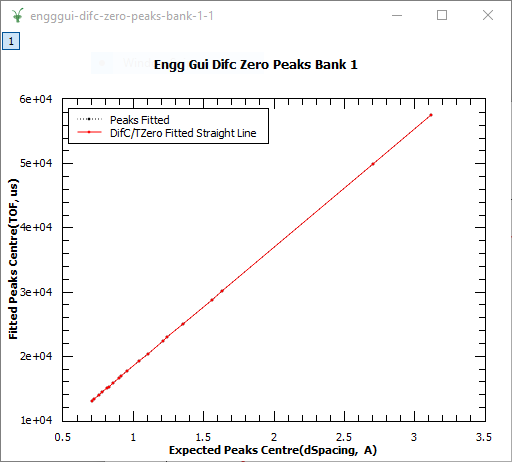
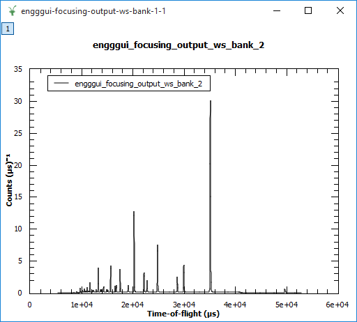
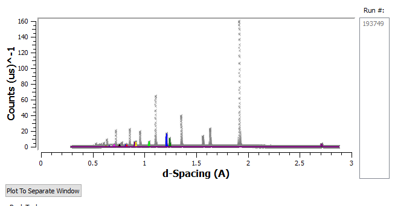
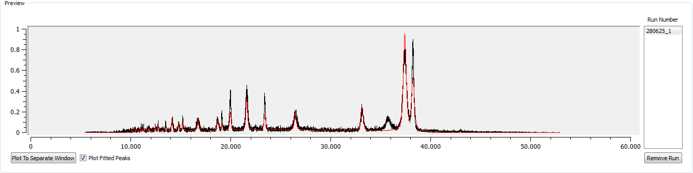

.. _Engineering_Diffraction_TestGuide-ref:

Engineering Diffraction Testing
=================================

.. contents:: Table of Contents
    :local:
    
Preamble
^^^^^^^^^
This document is tailored towards developers intending to test the Engineering Diffraction
interface. Whilst users may benefit from the additional documentation provided in this document
it is recommended they read :ref:`Engineering_Diffraction-ref` instead which is tailored towards users.

The files used in the following examples are found within System test files within 
`<MantidBuildDir>/ExternalData/Testing/Data/SystemTest` after building the *SystemTestData* target.

Overview
^^^^^^^^
The Engineering Diffraction interface allows scientists using the EnginX instrument to interactively
process their data. There are 5 tabs from which are ordered according to the main steps performed.
These are:

- Calibration - This is where a vanadium and cerium run are entered to calibrate the subsequent data.
- Focus - Where are the data across multiple spectra are summed into a single spectrum for later steps.
- Pre-processing - Event workspaces have to be converted into histogram data before 
  focusing which can be completed here.
- Fitting - The user uses their focused data here to interactively pick peaks for subsequent fitting.
- Settings - This holds additional settings which may be of use during testing.

.. _calibration-Engineering_Diffraction_test-ref:

Calibration
^^^^^^^^^^^
The first time the interface is opened it will be disabled except for the RB number entry box
and a pop up box which should prompt for a RB number. For testing purposes this can be anything.

If a vanadium calibration has never been run the `Current calibration` will be empty. Once
a calibration has been run these fields will retain their values for future runs of the program. 
The following files can be used for the calibration run.

- *Vanadium#*: ENGINX00236516.nxs

- *Calibration#*: ENGINX00241391.nxs

Once the calibration has completed if the calibration was successful plotting the spectra of the
newly created workspaces will produce images similar to below:

If the plot is incorrect check you haven't swapped the run numbers and they are both correct. 
    
If `Current calibration` is populated the algorithm will attempt to use a cached calculation instead
of recalculating the calibration. To force it to recalculate every time for testing purposes the
option can be set under :ref:`settings-Engineering_Diffraction_test-ref` .

A cropped calibration can be used to limit the spectra considered during calibration. This can
be useful if a subset of detectors are going to be used.

Negative Testing Ideas
----------------------

- Change the RB number (or remove it) and try immediately using controls such as close

- Running calibrate with various fields left blank

- Using files which aren't calibration files \- Mantid shouldn't crash

.. _focus-Engineering_Diffraction_test-ref:

Focus
^^^^^
Focusing takes a workspace with histogram data and sums the spectra into a single spectrum.
If the data is captured in event mode (i.e.. Event workspaces) it will first 
need :ref:`preProcessing-Engineering_Diffraction_test-ref` .

A .nxs file containing histogram data needs to be selected for example *ENGINX00193749.nxs*
this can have all banks summed, specific spectra and list or use a detector grouping to create
a texture. 

Once the focus run has finished it will save a focused .nxs file in 

`C:\\EnginX_Mantid\\User\\<RB Number>` or `~/EnginX_Mantid/User/<RB Number>` 

and store a copy in `C:\\EnginX_Mantid\\Focus` or `~/EnginX_Mantid/Focus`. 

The saved focused .nxs filename will be of the format
`<INST>_<Run number>_focused_bank_<bank number>.nxs`

Plotting the focused workspace should look similar to the image below:

    
Negative Testing Ideas
----------------------

- Using a .nxs file which doesn't have expected data \- Mantid shouldn't crash

- Running focus with no banks selected

- Using Cropped/Texture with bad inputs

- Whilst the data is being focused only `Plot Data Representation` should be changeable 

.. _preProcessing-Engineering_Diffraction_test-ref:

Pre-processing
^^^^^^^^^^^^^^
Pre-processing is used to convert event data into histogram data which can be subsequently
focused. The optimal parameters for pre-processing are dependent on how the instrument was
configured during the capture of the data.

`Regular time binning` requires the bin width to be specified and will produce a histogram #
workspace with TOF as the X axis. 

If the multi-period data with pulse times is captured `Multi-period data` should be used instead
with the delta in time on every step of the X axis entered. 

For testing purposes with regular time binning testing should be done using a .s0 file such as 299735.s08,
multi-period data should instead use a run from 285643-285701 which are event workspaces.

Fitting
^^^^^^^
Fitting allows a user to plot the peaks from their focused nexus file obtained from 
:ref:`focus-Engineering_Diffraction_test-ref` . The focused run can be entered by value
`193749`, a range of runs `19000-19100` or by browsing for the focused file. 

After the fitting has run if it managed to fit any peaks it should look similar to below
if there are no peaks and the display looks "corrupted" check the calibration was completed
correctly:

The banks available to plot are selected with the `Plot Bank` selector and then fit is clicked.
Mantid will plot the peaks in the peak picker window, expected peaks can also be selected 
to help the fitting process. Zoom in by dragging with the LMB and out by clicking the RMB.
Peaks are selected by holding `Shift` whilst clicking the LMB on a peak similar to the fit interface.

Once peaks are selected fit can be re-run with the expected peak list specified to attempt to
create a better fitting. 

Negative Testing Ideas
----------------------
- Using an unfocused .nxs file \- Mantid shouldn't crash

- Enter an unusual file name combinations such as `ENGINX_1000-2000` which combines a filename and 
  multi run number
    
- Enter bad input to expected peaks

- Change any unlocked dialog boxes whilst `Fit` runs

.. _gsas-fitting-Engineering-Diffraction_test-ref:

GSAS Fitting
^^^^^^^^^^^^

GSAS-style fitting allows the user to plot peaks from their focused
NeXuS file (obtained from
:ref:`focus-Engineering_Diffraction_test-ref`).

After a fit has run, the plot should look something like below:

If that fit output (the red line) is flat, or just follows the
background of the data, the fit was not unsuccessful. Make sure you're
using the right ``.cif`` and ``.prm`` files for your run. You can find
an example of files which work nicely together on most PRs related to
the GSAS tab or GSASIIRefineFitPeaks, or have a look `here
<https://github.com/mantidproject/mantid/files/1739753/GSASIIRefineFitPeaks.zip>`_.

.. warning:: At the moment, you will also just get background if you
	     try to do a Pawley refinement, as this is still under
	     development, possibly requiring input from ENGINX
	     scientists or GSAS-II developers (probably both)

You can navigate around the plot in the same way as the Fitting tab.

Negative Testing Ideas
----------------------

- Using an unfocused .nxs file \- Mantid shouldn't crash
- Enter bad input into the text entries - this should be handled
  elegantly
- Change any unlocked dialogs and click any unlocked buttons while
  refinement is running
- Cancel the algorithm before exiting the GUI, and vice verse

.. _settings-Engineering_Diffraction_test-ref:

Settings
^^^^^^^^^
- `Input directories/folders`
    Used as additional search locations when only a run number
    is specified such as `193749`. These do not need to be set for the browse (full paths) to work.

- `Pixel Calibration` 
    Is used for a full calibration run. Before each run they perform a quick
    calibration which is accounted for in the :ref:`calibration-Engineering_Diffraction_test-ref` tab.
    Every couple of years they perform a long calibration which is then processed and used as a baseline
    which is set here.

- `Force recalculate` 
    Useful whilst troubleshooting calibrations if you think a cached calibration
    is incorrect or you are testing the calibration algorithm. However this incurs a significant speed
    penalty as calibration is run every time instead of just reusing the results.

- `Focusing settings` 
    Allows the user to specify the output directory of their own focused runs
    it defaults to `C:\\EnginX_Mantid\\Focus` or `~/EnginX_Mantid/Focus` but can be changed to 
    suit the users needs.

.. categories:: Interfaces Diffraction
