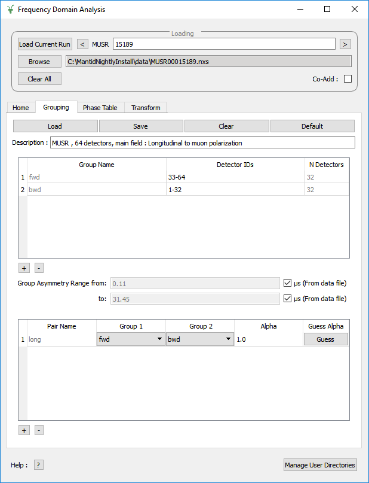

.. _Frequency_Domain_Analysis_2-ref:

Frequency Domain Analysis 2
===========================

.. contents:: Table of Contents
  :local:

Interface Overview
------------------

This interface is used to analyse the data collected on Muon instruments in the frequency domain. The interface can be
accessed from the main menu of MantidPlot, in *Interfaces → Muon → Frequency Domain Analysis 2*. For sample
datasets, please visit `Muon - Downloads <http://www.isis.stfc.ac.uk/groups/muons/downloads/downloads4612.html>`_.

Analysis of the frequency spectrum can be achieved by clicking the fit function icon.

Loading
-------

.. image::  ../images/frequency_domain_analysis_2_home.png
   :align: center
   :height: 500px

The loading section is used to load data as well as to specify what the current runs of interest are.

**Load Current Run** This will load the latest run for the selected instrument. You must be connected to the
ISIS data archive for this to work. It also currently only works on windows.

**Run selection box** This takes a comma seperated list of run numbers and loads them all in. You may also
specify ranged of runs with a dash. For example `62260, 62270-3` will load `62260, 62270, 62271, 62273`. This also specifies
which runs are used by the rest of the GUI. You must be connected to the ISIS data archive to load runs in this way.

**Browse** This lets you browse locally for files to load.

**Clear All** This clears all the data from the current GUI.

**Co-Add** If selected the list of runs chosen are added rather than being loaded individually.

Home Tab
--------

Pre-processing parameters
^^^^^^^^^^^^^^^^^^^^^^^^^

**Instrument** This selects the instrument used by the GUI

**Time Zero** This is the time zero value used. By default the time zero is taken from the file but
it can be specified here in which case the specified time zero is used for all calculations.

**First Good Data** This is the first good data value used. By default the time zero is taken from the file but
it can be specified here in which case the specified first good data is used for all calculations.

**Deadtime** The default is to use no deadtime correction. There are three deadtime correction options if required.

* `From data file`: The deadtime table will be taken from the relevant data file
* `From table workspace`: A previously loaded deadtime table may be selected which will then be used in all group and pair calculations.
* `From other file`: A file may be selected to load a deadtime table from this will then be used in all group and pair calculations.

Rebin
^^^^^

**Fixed** Fixed rebinning allows a scale factor to be entered which will then be used to scale the raw bins.

**Variable** Variable binning allows a string to be entered which specifies the required binning. The string is of the format used by the :ref:`Rebin <algm-Rebin>` algorithm.

Groups and Pairs
^^^^^^^^^^^^^^^^

**Periods** For multi period data the Summed and Subracted periods may be specified here. These periods will then be used for
all groups and pairs.

Grouping Tab
------------

**Load** Allows a grouping and pairing table xml file to be selected to load

**Save** Saves the current grouping and pairing tables to an xml file

**Clear** Clears all groups and pairs from the current tables

**Default** Loads in the default groups and pairs for the instrument

**Update All** Recalculates all groups and pairs putting the result in the ADS. New or modified groups
and pairs are not automatically recalculated.

Grouping Table
^^^^^^^^^^^^^^

**Plus and Minus** Add or remove groups

**Group Asymmetry Range** Controls the range to use when estimating the group asymmetry. By default this range is the first good data and end time value from the file
but may be overridden here if required.

Pairing Table
^^^^^^^^^^^^^

**Plus and Minus** Add or remove pairs

**Guess Alpha** Estimates the alpha for the current pair and recalculates.

Transformation Tab
------------------

.. _Transformation:

This tab is designed for the user to transform pre-loaded data into the frequency domain. At present there are two methods available, which the user can switch between by using the drop-down menu at the top of the interface.

Default: Fast Fourier Transforms
^^^^^^^^^^^^^^^^^^^^^^^^^^^^^^^^

.. image::  ../images/frequency_domain_analysis_2_transform.png
   :align: center
   :height: 500px

In this mode the interface displays two tables, FFT and Advanced options. The FFT table contains
all of the information required to produce a forward FFT. The Advanced Options table contains the information
for adding padding and apodization functions to the data.

Selecting the workspace to be ``PhaseQuad`` will cause the :ref:`PhaseQuad <algm-PhaseQuad>` algorithm to be called first. If no phase table is available then
the interface will generate one and output the result as ``PhaseTable``. It is possible to select the direction of the axis when generating the table and it is
possible to use a pre-existing ``PhaseTable``. **Note that the PhaseQuad option requires the data archieve to be in the search directory**.

The Calculate button will execute the :ref:`Padding and Apodization <algm-PaddingAndApodization>`  and then :ref:`FFT <algm-FFT>` algortihms. The output workspace will be added to
appropriate grouped workspace.

Maximum Entropy Method
^^^^^^^^^^^^^^^^^^^^^^

The maximum entropy method can be used to calculate the frequency domain spectrum. This interface uses the :ref:`MuonMaxent <algm-MuonMaxent>` algorithm to calculate the frequency spectrum. The MaxEnt Property table contains
the basic quantitites used during the calculation. If the ``Use Phase Table`` checkbox is set to true, then an input phase table will be used for the initial phase values (the phase table will be called ``PhaseTable``). To generate
an estimate phase table the ``Construct Phase Table`` option can be used and when the ``Calculate MaxEnt`` button is pressed :ref:`CalMuonDetectorPhases <algm-CalMuonDetectorPhases>` is ran first to generate the phase table. If the
``Construct Phase Table`` option is not selected then ``PhaseTable`` must already exist. At present ``Construct Phase Table`` does not work with the ``MuonAnalysisGrouped`` workspaces. If the ``Workspace`` is set to the run number then
their is no pre-defined grouping.
The
Advanced property table contains variables for users that would
like more control overt the calculation.

For large calculations this interface can be slow, therefore the Calculate button is disabled until the current calculation is complete.

.. image::  ../images/frequency_domain_analysis_2_transform_maxent.png
   :align: center
   :height: 500px

Feedback & Comments
-------------------

If you have any questions or comments about this interface or this help page, please
contact the `Mantid team <http://www.mantidproject.org/Contact>`__ or the
`Muon group <http://www.isis.stfc.ac.uk/groups/muons/muons3385.html>`__.

.. categories:: Interfaces Muon