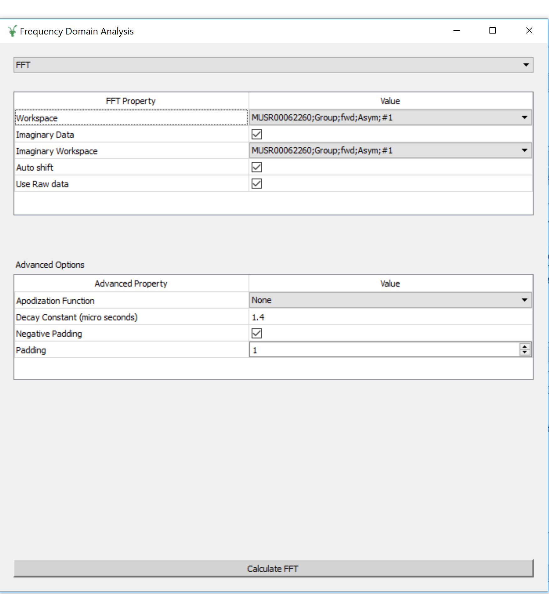
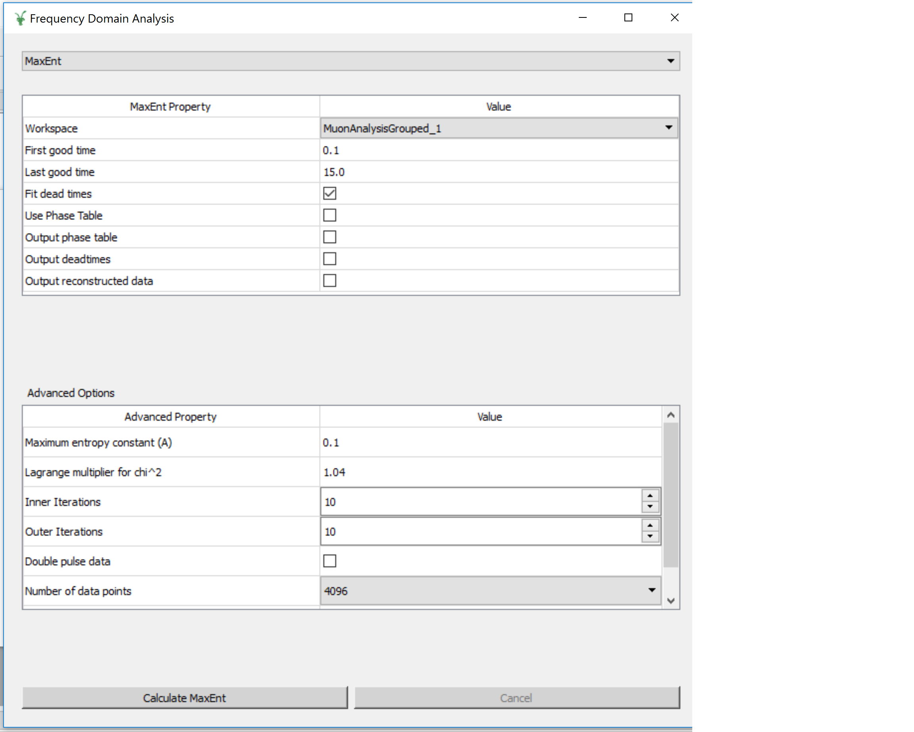

.. _Frequency_Domain_Analysis-ref:

Frequency Domain Analysis
==========================

.. contents:: Table of Contents
  :local:

Interface Overview
------------------

This interface is used to analyse the data collected on Muon instruments in the frequency domain. The interface can be
accessed from the main menu of MantidPlot, in *Interfaces → Muon → Frequency Domain Analysis*. For sample
datasets, please visit `Muon - Downloads <http://www.isis.stfc.ac.uk/groups/muons/downloads/downloads4612.html>`_.

This interface is currently still in development. The data needs to be loaded and prepared using :ref:`Muon_Analysis-ref`.
When Frequency Domain Analysis is opened it will import the groups/pairs from the current run in Muon Analysis, 
**if no data has been loaded into Muon Analysis then Frequency Domain Analysis will not open**.

Analysis of the frequency spectrum can be achieved by clicking the fit function icon.
As the interfaces is developed the features from Muon Analysis will be replicated. 

Transformation
---------------

.. _Transformation:

This tab is designed for the user to transform pre-loaded data into the frequency domain. At present there are two methods available, which the user can switch between by using the drop-down menu at the top of the interface. 

Default: Fast Fourier Transforms
^^^^^^^^^^^^^^^^^^^^^^^^^^^^^^^^

In this mode the interface displays two tables, FFT and Advanced options. The FFT table contains 
all of the information required to produce a forward FFT. The Advanced Options table contains the information
for adding padding and apodization functions to the data. 

Selecting the workspace to be ``PhaseQuad`` will cause the :ref:`PhaseQuad <algm-PhaseQuad>` algorithm to be called first. If no phase table is available then
the interface will generate one and output the result as ``PhaseTable``. It is possible to select the direction of the axis when generating the table and it is
possible to use a pre-existing ``PhaseTable``. **Note that the PhaseQuad option requires the data archieve to be in the search directory**. 

The Calculate button will execute the :ref:`Padding and Apodization <algm-PaddingAndApodization>`  and then :ref:`FFT <algm-FFT>` algortihms. The output workspace will be added to
appropriate grouped workspace. 

Maximum Entropy Method
^^^^^^^^^^^^^^^^^^^^^^

The maximum entropy method can be used to calculate the frequency domain spectrum. This interface uses the :ref:`MuonMaxent <algm-MuonMaxent>` algorithm to calculate the frequency spectrum. The MaxEnt Property table contains 
the basic quantitites used during the calculation. If the ``Use Phase Table`` checkbox is set to true, then an input phase table will be used for the initial phase values (the phase table will be called ``PhaseTable``). To generate
an estimate phase table the ``Construct Phase Table`` option can be used and when the ``Calculate MaxEnt`` button is pressed :ref:`CalMuonDetectorPhases <algm-CalMuonDetectorPhases>` is ran first to generate the phase table. If the 
``Construct Phase Table`` option is not selected then ``PhaseTable`` must already exist. At present ``Construct Phase Table`` does not work with the ``MuonAnalysisGrouped`` workspaces. If the ``Workspace`` is set to the run number then
their is no pre-defined grouping. 
The 
Advanced property table contains variables for users that would
like more control overt the calculation.

For large calculations this interface can be slow, therefore the Calculate button is disabled until the current calculation is complete. 

Feedback & Comments
-------------------

If you have any questions or comments about this interface or this help page, please
contact the `Mantid team <http://www.mantidproject.org/Contact>`__ or the
`Muon group <http://www.isis.stfc.ac.uk/groups/muons/muons3385.html>`__. 

.. categories:: Interfaces Muon
