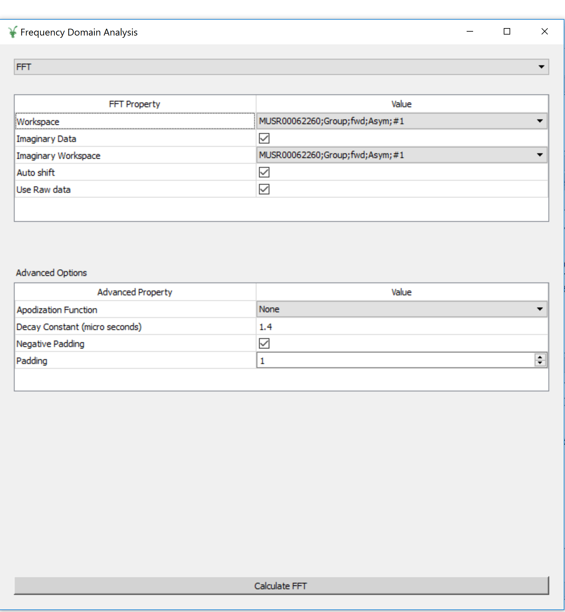

.. _Frequency_Domain_Analysis-ref:

Frequency Domain Analysis
==========================

.. image::  ../images/MuonAnalysisHome3.6.jpg
   :align: right

.. contents:: Table of Contents
  :local:

Interface Overview
------------------

This interface is used to analyse the data collected on Muon instruments in the frequency domain. The interface can be
accessed from the main menu of MantidPlot, in *Interfaces → Muon → Frequency Domain Analysis*. For sample
datasets, please visit `Muon - Downloads <http://www.isis.stfc.ac.uk/groups/muons/downloads/downloads4612.html>`_.

This interface is currently still in development. The data needs to be loaded and prepared using :ref:`Muon_Analysis-ref`.
Analysis of the frequency spectrum can be achieved by clicking the fit function icon.
As the interfaces is developed the features from Muon Analysis will be replicated. 

Transformation
---------------

.. _Transformation:

This tab is designed for the user to transform pre-loaded data into the frequency domain. At present there are two methods available, which the user can switch between by using the drop-down menu at the top of the interface. 

Default: Fast Fourier Transforms
^^^^^^^^^^^^^^^^^^^^^^^^^^^^^^^^

In this mode the interface displays two tables, FFT and Advanced options. The FFT table contains 
all of the information required to produce a forward FFT. The Advanced Options table contains the information
for adding padding and apodization functions to the data. 

The Calculate button will execute the :ref:`Padding and Apodization <algm-PaddingAndApodization>`  and then :ref:`FFT <algm-FFT>` algortihms. The output workspace will be added to
``FFTMuon``. 

Maximum Entropy Method
^^^^^^^^^^^^^^^^^^^^^^

The maximum entropy method can be used to calculate the frequency domain spectrum. The xxx table contains 
the basic quantitites used during the calculation. The advanced table contains variables for users that would
like more control overt the calculation. 

.. image::  ../images/MuonAnalysisTFAsymm.png
   :align: right

Feedback & Comments
-------------------

If you have any questions or comments about this interface or this help page, please
contact the `Mantid team <http://www.mantidproject.org/Contact>`__ or the
`Muon group <http://www.isis.stfc.ac.uk/groups/muons/muons3385.html>`__. 

.. categories:: Interfaces Muon
