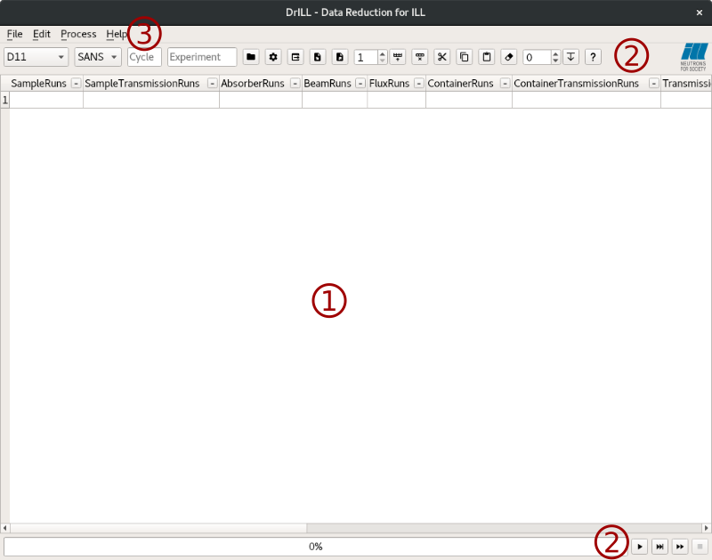
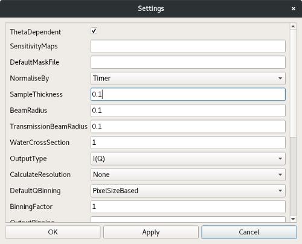
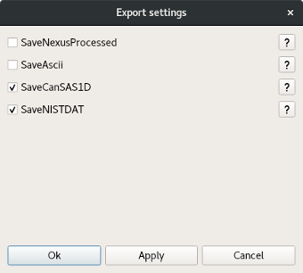

.. _DrILL-ref:

DrILL interface
===============

.. contents:: Table of Contents
   :local:

DrILL stands for Data Reduction at ILL. It provides an easy to use interface for
the reduction of data measured on different ILL instruments. Here are the
currently supported instruments:

    * D11: SANS
    * D16: SANS, SANS Sample scan
    * D17: Reflectometry
    * D22: SANS
    * D33: SANS
    * FIGARO: Reflectometry
    * D2B: Powder diffraction
    * D20: Powder diffraction

The interface is accessible through the Workbench menu bar: *Interfaces* ->
*ILL* -> *DrILL*.

n.b. To be able to use the interface, one has to set the default facility to ILL first.
Open the settings through the workbench menu (*File* -> *Settings*). In the *General* tab,
set the facility to ILL.

Interface overview
------------------

The DrILL main window is composed of different parts:

spreadsheet like table (1)
    This is the main part of the DrILL interface. Generally one row represents one sample
    measured at one or more distances (SANS) or angles (Reflectometry). There is no limit
    on the number of the different configurations.
    It is used to provide filenames and options to the reduction algorithm.
    The state of the table is reset when the instrument and/or the acquisition
    mode is changed.

tool buttons (2)
    In two different places. At the top of the table, these buttons facilitate
    the table filling and provide the instrument and acquisition mode
    selections. At the bottom, they are linked to the processing actions.

menu bar (3)
    Most of the actions are accessible through this menu bar.

A global settings dialog is also accessible through the menu or its dedicated
tool button. This dialog contains more options for the reduction algorithm.

Data reduction algorithm
------------------------

The underlying data reduction algorithm depends on the experimental technique.
Its selection is triggered when one has selected the instrument and the
acquisition mode.

To get further information on the currently supported algorithms:

    * SANS: :ref:`SANSILLAutoProcess <algm-SANSILLAutoProcess>` and
      :ref:`SANSILLParameterScan <algm-SANSILLParameterScan>`
    * Reflectometry: :ref:`ReflectometryILLAutoProcess <algm-ReflectometryILLAutoProcess>`
    * Powder diffraction: :ref:`PowderILLDetectorScan <algm-PowderILLDetectorScan>` and
      :ref:`PowderILLParameterScan <algm-PowderILLParameterScan>`

Global settings
---------------

Global settings are grouped in a dedicated dialog. This dialog is accessible
in the DrILL menu (*File* -> *Settings*) or with the dedicated tool button.
This dialog is dynamically linked to the selected algorithm, therefore to the
instrument and acquisition mode. It contains a set of options that will be used
for all the samples.

When opening the dialog for the first time, the settings are set to their
default value (see the corresponding algorithm documentation). After modifying
the settings, one can save or discard them with the usual three buttons 'ok',
'apply' or 'cancel'.

Each time a setting is changed in the dialog, its value is checked. A wrong
value will turn red the corresponding field. A tooltip explaining the error is
displayed when the mouse is over that red field. A single red field prevents the
settings from being saved.

Table filling
-------------

When selecting the instrument and the acquisition mode, the table is updated
with the needed column headers. To obtain information about a column, a tooltip
is displayed when moving the mouse over the corresponding header. To facilitate
filling, columns can be collapsed (button in the header), hidden (right click or
menu bar) and their order can be changed by drag-and-drop.

Each cell can be edited manually or filled programmatically by using some of the
tool buttons.

cut-copy-paste
    Cell or row contents can be copied/cut and then pasted in other cells.
    These actions are accessible through the dedicated button, the menu or the
    usual keyboard shortcuts. Copying or cutting a single cell and pasting it
    in several cells will repeat the value.

increment fill
    An automatic filling mechanism facilitates the filling of the table by
    incrementing/decrementing the numors over selected cells. To do so, the user
    has to select several cells that he wants to fill, choose an increment value
    and press the fill tool button. The value in the first cell (the one with
    the lowest row and column index) will be incremented and written in the
    following ones.

`DEFAULT` is a special value. During data reduction, it will be replaced with
the default value of this parameter defined in the algorithm. It acts like an
empty cell but this allows to override a master sample parameter with the
default value (see below).

For all algorithms, the last column of the table is always labelled
*CustomOptions*. It makes it possible to override a global parameter for
the current row only. It should contain a semicolon separated list of key value
pairs. For example, one can set :code:`SampleThickness=0.2;ThetaDependant=False`
and override the global values of these parameters for that specific row.

When filling the table, all parameters (including the custom options) are
checked for validity. When a value is not valid, the cell turns red and a
tooltip (visible when the mouse moves over the cell) explains the error. A
single red cell prevent the processing of the concerned row.

Groups
------

To avoid entering exactly the same value several times in the table, it is also
possible to create groups of samples. Within a group, a master sample can be
designated. The values of the parameters of the master sample will be used when
processing all rows in the group.

Paramaters can still be overriden manually whithin a group by entering a sample
specific value in the table. The special `DEFAULT` value can be use to override
a master sample parameter with its default value. The priority for the parameter
values is as follow:

sample > master sample > global settings

Example:

=========  =====  ===========  ===========
Sample     Group  parameter 1  parameter 2
=========  =====  ===========  ===========
1(master)  g1     v1           v2
2          g1
3          g1                  v2'
4          g1                  DEFAULT
=========  =====  ===========  ===========

* For the processing of sample 2: `parameter1=v1` and `parameter2=v2`
* For the processing of sample 3: `parameter1=v1` and `parameter2=v2'`
* For the processing of sample 4: `parameter1=v1` and `parameter2` will use the
  algorithm default value

To group samples, one has to select them (at least one cell per row) and press
Ctrl + G or use the context menu. To set a row as master, one has to select it
(again, one cell is sufficient) and press Ctrl + M or use the context menu.
Grouped samples will appear with a specific label in the table. The master
of a group will have a bold label. There can be only one master row per group,
if a second row is selected as the master row, it will replace the previous one.
One can also add a sample to an existing group (using the context menu) or
ungroup samples by selecting them and pressing Ctrl + Alt + G or using the
context menu.

Processing
----------

Processing control is made through the menu (*Process*) or the tool
buttons at the bottom of the table. One can start the processing (of selected or
all row(s)) or abort a running processing.

During processing, the table is in read-only mode. The active row(s) turn
yellow, the processed ones turn green and the row(s) for which the processing
failed turn red. The progress bar is also updated.

At the end of the processing, if any error occurs, a popup lists the concerned
row(s). To get further information about the errors, one has to look into the
Mantid logs.

Automatic data export
---------------------

After the processing, the export of reduced data is automatically triggered. The
configuration of this mechanism is done via the export dialog that can be opened
from the tool bar.

For each acquisition mode, a list of adapated algorithms will be displayed in
that dialog. Some of them are activated by default but the user is free to
select the ones he wants. All checked algorithms will be applied on all output
workspaces of all processed rows. The exported files are saved in the Mantid
default save directory with an extension that is defined by the algorithm (if no
default save directory is provided, there will be no export). If the algorithm
is not adapted to the data, it will be skipped. For further information, the
documentation of each algorithm can be obtained using the help button associated
to it in the dialog.

Import and export as Rundex file
--------------------------------

Rundex file (\*.mrd) is a human readable text file that represents the state of
the interface in JSON format. By using the appropriate tool button or the menu
bar (*File* -> *Save...* or *Load...*) one can export or import a Rundex file.

When saving, the global settings, all the samples and some of the visual setup
are exported in the rundex file (i.e. the collapsed columns, the hidden
columns...). Symmetrically, the load action imports all these data in the
current DrILL session and one will recover the interface in the same state as
it was previously saved.

.. categories:: Interfaces
