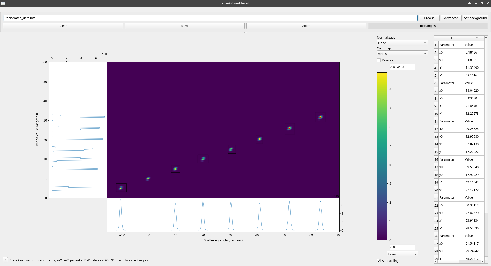

.. _SimpleScanViewer-ref:

SimpleScanViewer Interface
==========================

This interface is meant to perform basic and advanced reduction of scan data, with the help of a GUI based on the Slice
Viewer widget. It was designed for D16, but should work for every instrument producing scan data, as long as it can be
reduced by :ref:`SANSILLParameterScan <algm-SANSILLParameterScan>`.

   Example of the scan viewer showing ideal, generated data for D16B (real data is of course far noisier)

Workflow
--------

The user can provide data by:

* directly providing a NeXus file either by path or through the browse button. This file is then processed through
  :ref:`SANSILLParameterScan <algm-SANSILLParameterScan>` with default parameters.
* reducing a file through the Advanced button, which opens the dialog for
  :ref:`SANSILLParameterScan <algm-SANSILLParameterScan>` and allows for changing the default parameters.

After the algorithm has run, the output is displayed in a slice viewer-like interface. On the right is a table that
shows the coordinates of all the created ROIs and allows their editing.

Some keyboard inputs allow exporting data to workspaces for further analysis (see below).

Modes
-----

There 3 modes of interaction with the slice viewer interface :

Move
    Clicking and dragging will move the view around.
Zoom
    Clicking and dragging will zoom on the selected region. Right-clicking and dragging will de-zoom. Alternatively, in
    all modes, using the mouse wheel will also zoom/de-zoom.
ROI
    Clicking and dragging will define a rectangular region of interest. Multiple such regions can be created, and they
    are the main analysis tool provided. They can be selected, deselected, moved, and resized by clicking on the control
    points.

Features
--------

When a ROI is defined, the X and Y axis projections are plotted in the side plots attached to their respective axis.
A small red cross is also drawn in the ROI, showing the position of the centre of the fitted Gaussian peak in this ROI.

A number of keyboard shortcuts are provided to interact with the data and the ROIs defined.

'Del'
    Deletes the currently selected ROI.

'x', 'y', 'c'
    Export the cuts - the side plots - to workspaces. "x" exports the one along the X-axis, "y" the one along the Y-axis,
    and "c" along both of them. A different workspace is created for every ROI on each axis, in addition to a workspace
    containing the side plot itself (which is just the sum of all the other workspaces based on that axis).
'p'
    Exports the peaks to a table workspace. For each ROI, the detected peak is the fitted centre of a Gaussian in the ROI. The values
    exported are the index of the rectangle, the coordinates of the peak in :math:`2\theta, \Omega`, the peak width (:math:`\sigma` of the Gaussian),
    the data integrated over the ROI, and, if a background has been provided, the integration corrected by the background (i.e. integration
    of the sample data minus the background data with minimal reduction). NB : this last value will not make sense if
    the data shown in the data viewer has already been reduced through the `Advanced` button.
'f'
    Tries to extrapolate the ROIs currently drawn, with two behaviours:

    * if there is only one ROI, it is assumed to correspond to the first non-zero theta peak and linearly place other
      ROIs at regular intervals assuming :math:`\theta = \Omega`. No ROI is placed at :math:`\theta = 0`, because it is
      the beam and does not contain data.
    * if there are 2 ROIs, it simply linearly interpolates from these two to place more ROIs. Their size is the mean of
      the original ROIs.
    * if there are more than 2 ROIs, no linear interpolation can take place and an error message is thrown.

.. categories:: Interfaces
