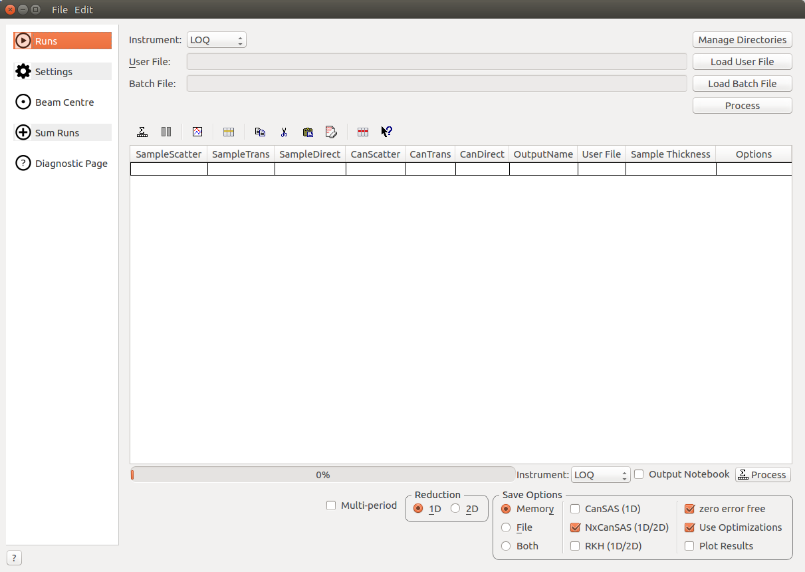
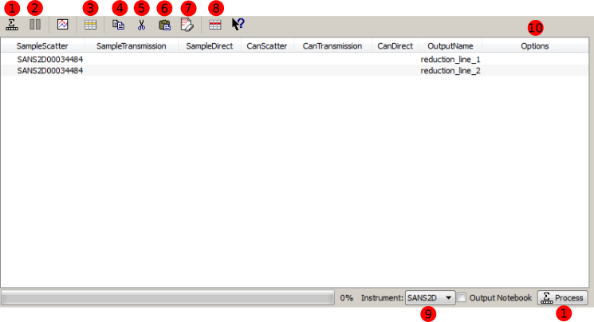
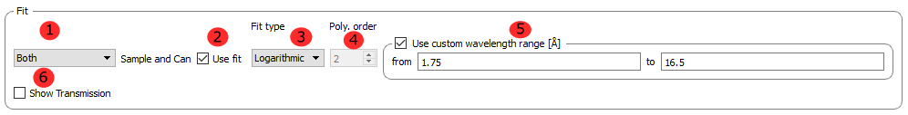
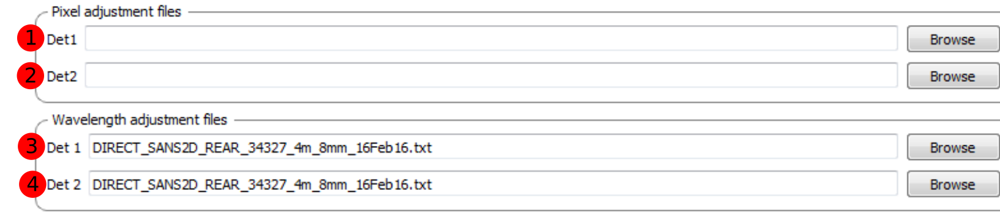
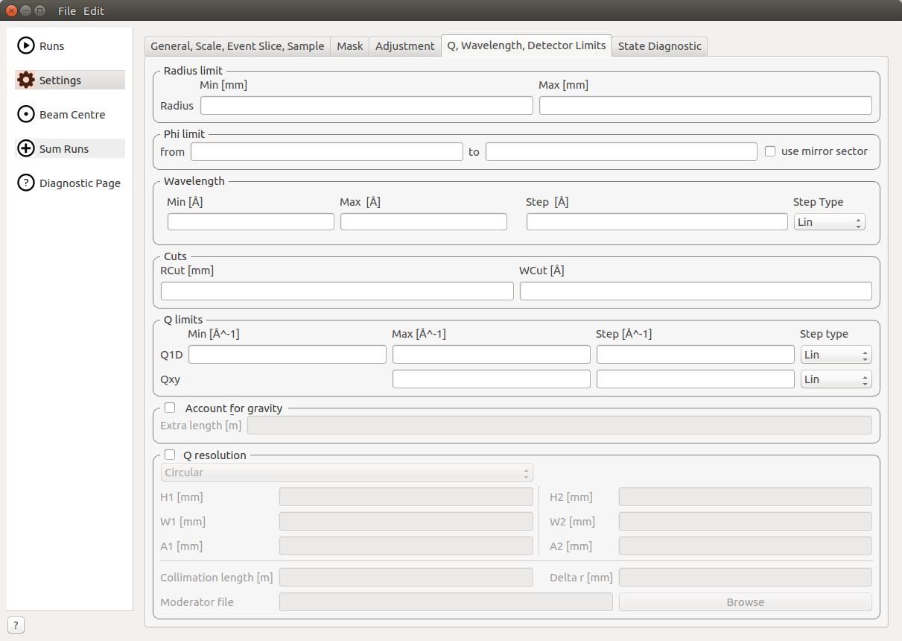

.. _ISIS_SANS_v2-ref:

ISIS SANS
============

.. contents:: Table of Contents
  :local:

Interface Overview
------------------

This interface is used to reduce ISIS SANS data for SANS2D, LOQ,LARMOR and ZOOM.
The interface can be accessed from the main menu of MantidPlot, in *Interfaces → SANS → ISIS SANS*.
This interface is intended as a gradual replacement for the old ISIS SANS
interface. As of version 4.0 this interface was renamed from *ISIS SANS v2 experimental* to *ISIS SANS*, and the
previous SANS interface was deprecated. This change signifies that this interface provides all major functionality and
will be the only ISIS SANS interface subject to active development.

Runs
----

.. _Runs:

The *Runs* tab is the ISIS SANS entry-point. It allows the user to specify the user file and
batch file. Alternatively the user can set the data sets for reduction manually on the data table.
In addition it allows the user to specify her preferred save settings (see more below). The actual
parameters which are loaded from the user file are accessible from the sub-tabs on the Settings_ tab.

Data Table
^^^^^^^^^^

.. _RunsDataTable:

+-------+--------------------------+-----------------------------------------------------------------------------------------+
| **1** | **Process**              | If no individual row is selected in the data table, then this will start a reduction.   |
|       |                          | In this case the user will be asked if she is sure that she wants to reduce all         |
|       |                          | rows. If rows are selected, then only these will be processed.                          |
+-------+--------------------------+-----------------------------------------------------------------------------------------+
| **2** | **Pause**                | Allows the user to pause a reduction, change her row selection and continue             |
|       |                          | the reduction with possibly a different selection.                                      |
+-------+--------------------------+-----------------------------------------------------------------------------------------+
| **3** | **Insert row after**     | Adds a row after the currently selected row.                                            |
+-------+--------------------------+-----------------------------------------------------------------------------------------+
| **4** | **Copy selected**        | Creates a copy of the selected rows.                                                    |
+-------+--------------------------+-----------------------------------------------------------------------------------------+
| **5** | **Cut selected**         | Cuts the selected rows.                                                                 |
+-------+--------------------------+-----------------------------------------------------------------------------------------+
| **6** | **Paste selected**       | Pastes rows from the clipboard.                                                         |
+-------+--------------------------+-----------------------------------------------------------------------------------------+
| **7** | **Clear selected**       | Clears the entries from selected rows.                                                  |
|       |                          | It however does not the delete the rows themselves.                                     |
+-------+--------------------------+-----------------------------------------------------------------------------------------+
| **8** | **Delete row**           | Deletes a selected row.                                                                 |
+-------+--------------------------+-----------------------------------------------------------------------------------------+
| **9** | **Select instrument**    | Selects the instrument to use. Note that this setting is used to resolve run numbers.   |
+-------+--------------------------+-----------------------------------------------------------------------------------------+
| **10**| **Unused Functionality** | These icons are not used                                                                |
+-------+--------------------------+-----------------------------------------------------------------------------------------+

Columns
^^^^^^^

+--------------------------+-------------------------------------------------------------------------------------------------+
| **SampleScatter**        |   Scatter data file to use. This is the only mandatory field                                    |
+--------------------------+-------------------------------------------------------------------------------------------------+
| **ssp**                  |   Sample scatter period, if not specified all periods will be used (where applicable)           |
+--------------------------+-------------------------------------------------------------------------------------------------+
| **SampleTrans**          |   Transmission data file to use.                                                                |
+--------------------------+-------------------------------------------------------------------------------------------------+
| **stp**                  |   Sample scatter period, if not specified all periods will be used (where applicable)           |
+--------------------------+-------------------------------------------------------------------------------------------------+
| **SampleDirect**         |   Direct data file to use                                                                       |
+--------------------------+-------------------------------------------------------------------------------------------------+
| **sdp**                  |   Sample direct period, if not specified all periods will be used (where applicable)            |
+--------------------------+-------------------------------------------------------------------------------------------------+
| **CanScatter**           |   Scatter datafile for can run                                                                  |
+--------------------------+-------------------------------------------------------------------------------------------------+
| **csp**                  |   Can scatter period, if not specified all periods will be used (where applicable)              |
+--------------------------+-------------------------------------------------------------------------------------------------+
| **CanTrans**             |   Transmission datafile for can run                                                             |
+--------------------------+-------------------------------------------------------------------------------------------------+
| **ctp**                  |   Can transmission period, if not specified all periods will be used (where applicable)         |
+--------------------------+-------------------------------------------------------------------------------------------------+
| **CanDirect**            |   Direct datafile for can run                                                                   |
+--------------------------+-------------------------------------------------------------------------------------------------+
| **OutputName**           |   Name of output workspace                                                                      |
+--------------------------+-------------------------------------------------------------------------------------------------+
| **User File**            |   User file to use for this row. If specified it will override any options set in the GUI,      |
|                          |   otherwise the default file will be used.                                                      |
+--------------------------+-------------------------------------------------------------------------------------------------+
| **Sample Thickness**     |   Sets the sample thickness to be used in the reduction.                                        |
|                          |                                                                                                 |
+--------------------------+-------------------------------------------------------------------------------------------------+
| **Options**              |   This column allows the user to provide row specific settings. Currently only **WavelengthMin**|
|                          |   , **WavelengthMax** and **EventSlices** can be set here.                                      |
+--------------------------+-------------------------------------------------------------------------------------------------+

Save Options
^^^^^^^^^^^^

.. image::  ../images/sans_isis_save_options.png
   :align: center
   :width: 500px

+-------+--------------------------+-----------------------------------------------------------------------------------------+
| **1** | **Save Other**           | Opens up the save other dialog box :ref:`Save Other <save-other>` which allows          |
|       |                          | for manual saving of reduced data.                                                      |
+-------+--------------------------+-----------------------------------------------------------------------------------------+
| **2** | **Save location**        | This sets where the reduced data will be made available for the user. The user          |
|       |                          | can select to have it only in memory (RAM) with the **Memory** option, saved out as     |
|       |                          | a file with the **File** option or saved both to file and memory with the **Both**      |
|       |                          | option.                                                                                 |
+-------+--------------------------+-----------------------------------------------------------------------------------------+
| **3** | **Save file formats**    | Allows the user to specify the save file format for the reduced data.                   |
|       |                          |                                                                                         |
+-------+--------------------------+-----------------------------------------------------------------------------------------+
| **4** | **Other**                | The **zero error free** option ensures that zero error entries get artificially         |
|       |                          | inflated when the data is saved to a file. This is beneficial if the data is to be      |
|       |                          | loaded into other analysis software.                                                    |
|       |                          | The **Use optimizations** option will reuse already loaded data. This can speed up the  |
|       |                          | data reduction considerably. It is recommended to have this option enabled.             |
|       |                          | The **Plot results** option controls whether the reduced data is automatically plotted  |
|       |                          | to a graph or not.                                                                      |
+-------+--------------------------+-----------------------------------------------------------------------------------------+

Settings
--------

.. image::  ../images/sans_isis_v2_general_tab_whole.png
   :align: right
   :width: 800px

.. _Settings:

The Settings tab and its sub-tabs allow for manipulating and inspecting the reduction parameters which were
initially set through loading a user file.  Currently there are five sub-tabs:

- **General, Scale, Event Slice, Sample** This tab contains settings which are not associated
  with the other tabs. This includes settings regarding the general reduction, the absolute scaling of the data, 
  event slicing and sample volume scaling.

- **Mask** The mask tab contains the masking information. It displays the selected masks in the
  familiar mask table.

- **Adjustment** This tab contains settings which are required to generate the adjustment workspaces. This
  includes information for the monitor normalization, transmission calculation, pixel-adjustment files and
  wavelength-adjustment files.

- **Q** This tab contains settings which are required for the conversion to momentum space.

- **State Diagnostic** This tab is currently being made available on an experimental basis. The tab provides
  insight into the actual settings which are being passed to the reduction algorithm. Once this interface
  reaches maturity this tab should be removed.

General, Wavelength, Scale, Event Slice, Sample
^^^^^^^^^^^^^^^^^^^^^^^^^^^^^^^^^^^^^^^^^^^^^^^

The first tab contains settings which are not associated with the wider themes of the other tabs.

General
"""""""
.. _General:

.. image::  ../images/sans_isis_v2_general_tab_general.png
   :align: center
   :width: 800px

+-------+------------------------------+----------------------------------------------------------------------------------------------+
| **1** | **Reduction mode**           | The user can choose to either perform a reduction on the low angle bank (**LAB**),           |
|       |                              | the high angle bank (**HAB**), on both (**Both**) or she can perform a merged (**Merged**).  |
|       |                              | If a merged reduction is enabled, then further settings are required (see below).            |
|       |                              | A merged reduction essentially means that the reduced result from the                        |
|       |                              | low angle bank and the high angle bank are stitched together.                                |
+-------+------------------------------+----------------------------------------------------------------------------------------------+
| **2** | **Merge scale**              | Sets the scale of a merged reduction. If the **Fit** check-box is enabled, then this scale is|
|       |                              | being fitted.                                                                                |
+-------+------------------------------+----------------------------------------------------------------------------------------------+
| **3** | **Merge shift**              | Sets the shift of a merged reduction. If the **Fit** check-box is enabled, then this shift is|
|       |                              | being fitted.                                                                                |
+-------+------------------------------+----------------------------------------------------------------------------------------------+
| **4** | **Merge fit custom q range** | Describes the q region which should be used to determine the merge parameters.               |
+-------+------------------------------+----------------------------------------------------------------------------------------------+
| **5** | **Merge custom q range**     | Describes the q region in which the merged data should be used. Outside of this region the   |
|       |                              | uncombined **HAB** or **LAB** data is used.                                                  |
+-------+------------------------------+----------------------------------------------------------------------------------------------+

Event Slice
"""""""""""
.. _Event_Slice:

.. image::  ../images/sans_isis_v2_general_tab_event_slice.png
   :align: center
   :width: 800px

In case of data which was measured in event-mode, it is possible to perform
time-of-flight slices of the data and reduce these separately. The input can be:

- ``start:step:stop`` specifies time slices from a ``start`` value for the ``stop`` value
  in steps of ``step``.

- ``start-stop`` which specifies a time slice from the ``start`` value to the ``stop`` value.

- ``>start`` specifies a slice form the ``start`` value to the end of the data set.

- ``<stop`` specifies a slice form the start of the data set to the ``stop`` value

In addition it is possible to concatenate these specifications using comma-separation.
An example would be *5-10,12:2:16,20-30*.

Compatibility Mode
""""""""""""""""""
.. _Compatibility_Mode:

.. image::  ../images/sans_isis_v2_general_tab_event_binning.png
   :align: center
   :width: 800px

The old SANS GUI allows event-mode data as input but will convert it early on
into histogram-mode data, either using the time-of-flight binning parameters
specified by the user or by using the binning inherent to the monitors. The new
SANS GUI can handle event-mode data up to the conversion to momentum transfer. This leads
to more precise results. However if the user wishes to compare the results between
the two GUIs she is advised to enable the compatibility mode. This will ensure
that event-mode data will be converted to histogram-mode data early on, even
in the new reduction framework and will lead to the same results as one
expects from the old GUI.

If the check-box is enabled, then the time-of-flight binning parameters will be
taken from the *Event binning* input. If this is not set, then the binning
parameters will be taken from the monitor workspace.

Scale and Sample
""""""""""""""""
.. _Scale_and_Sample:

This grouping allows the user to specify the absolute scale and sample geometry
information. Note that the geometry information is in millimetres.

+-------+--------------------+------------------------------------------------------------------+
| **1** | **Absolute scale** | The absolute, dimensionless scale factor.                        |
+-------+--------------------+------------------------------------------------------------------+
| **2** | **Geometry**       | A geometry selection. *Read from file* will use the settings     |
|       |                    | that are stored in the data file. The other options are          |
|       |                    | *Cylinder*, *FlatPlate* and *Disc*.                              |
+-------+--------------------+------------------------------------------------------------------+
| **3** | **Height**         | The sample height. If this is not specified,                     |
|       |                    | the information from the file will be used.                      |
+-------+--------------------+------------------------------------------------------------------+
| **4** | **Width**          | The sample width. If this is not specified,                      |
|       |                    | the information from the file will be used.                      |
+-------+--------------------+------------------------------------------------------------------+
| **5** | **Thickness**      | The sample thickness. If this is not specified,                  |
|       |                    | the information from the file will be used.                      |
+-------+--------------------+------------------------------------------------------------------+
| **6** | **Z offset**       | The sample offset.                                               |
+-------+--------------------+------------------------------------------------------------------+

Mask
^^^^
.. _Mask:

.. image::  ../images/sans_isis_v2_mask_tab_whole.png
   :align: center
   :width: 800px

The elements on this tab relate to settings which are used during the masking step.

Masking information
"""""""""""""""""""
.. _Masking_information:

.. image::  ../images/sans_isis_v2_masking_tab_masking_table.png
   :align: right
   :width: 400px

The masking table shows detailed information about the masks which will be applied.
These masks include bin masks, cylinder masks, mask files, spectrum masks, angle masks
and line masks for the beam stop arm. If a mask is applied only to a particular detector
then this will be shown in the masking table. Note that data needs to be specified
in order to see the masking information. Also note if a manual change to the
data table or other settings, requires you to update the row selection by
pressing *Update Rows*.

+-------+-----------------+------------------------------------------------------------------+
| **1** | **Table**       | The masking table which displays all masks which will be applied |
|       |                 | to the data set.                                                 |
+-------+-----------------+------------------------------------------------------------------+
| **2** | **Select row**  | The masking information is shown for a particular data set in    |
|       |                 | in the data table. The information for the selected row is       |
|       |                 | shown.                                                           |
+-------+-----------------+------------------------------------------------------------------+
| **3** | **Update rows** | Press this button if you have manually updated the data table.   |
|       |                 | These changes are currently not picked up automatically.         |
+-------+-----------------+------------------------------------------------------------------+

Adjustment
^^^^^^^^^^
.. _Adjustment:

This tab provides settings which are required for the creation of the adjustment
workspaces. These adjustments include monitor normalization, transmission
calculation and the application of adjustment files.

Monitor normalization
"""""""""""""""""""""
.. _Monitor_Normalization:

.. image::  ../images/sans_isis_v2_adjustment_tab_monitor_normalization.png
   :align: center
   :width: 800px

+-------+------------------------------+--------------------------------------------------------+
| **1** | **Incident monitor**         | The incident monitor spectrum number.                  |
+-------+------------------------------+--------------------------------------------------------+
| **2** | **Use interpolating rebin**  | Check if an interpolating rebin should be used instead |
|       |                              | of a normal rebin.                                     |
+-------+------------------------------+--------------------------------------------------------+

Transmission calculation
""""""""""""""""""""""""
.. _Transmission_Calculation:

The main inputs for the transmission calculation are concerned with the incident monitor,
the monitors/detectors which measure the transmission and the fit parameters for the
transmission calculation.

Incident monitor
~~~~~~~~~~~~~~~~

.. image::  ../images/sans_isis_v2_adjustment_tab_monitor_normalization.png
   :align: center
   :width: 800px

+-------+------------------------------+--------------------------------------------------------+
| **1** | **Incident monitor**         | The incident monitor spectrum number.                  |
+-------+------------------------------+--------------------------------------------------------+
| **2** | **Use interpolating rebin**  | Check if an interpolating rebin should be used instead |
|       |                              | of a normal rebin.                                     |
+-------+------------------------------+--------------------------------------------------------+

Transmission targets
~~~~~~~~~~~~~~~~~~~~

+-------+--------------------------+------------------------------------------------------------------------------------------------+
| **1** | **Transmission targets** | This combo box allows the user to select the transmission target. *Transmission monitor* will  |
|       |                          | take the transmission data from the monitor which has been selected in the                     |
|       |                          | **Transmission monitor** field. *Region of interest on bank* will take the transmission data   |
|       |                          | from the fields **Radius**, **ROI files** and **Mask files**.                                  |
+-------+--------------------------+------------------------------------------------------------------------------------------------+
| **2** | **Transmission monitor** | The monitor which will be used for the transmission calculation.                               |
+-------+--------------------------+------------------------------------------------------------------------------------------------+
| **3** | **M4 shift**             | An optional shift for the M4 monitor.                                                          |
+-------+--------------------------+------------------------------------------------------------------------------------------------+
| **4** | **Radius**               | This will select all detectors in the specified radius around the beam centre to contribute    |
|       |                          | to the transmission data.                                                                      |
+-------+--------------------------+------------------------------------------------------------------------------------------------+
| **5** | **ROI files**            | A comma-separated list of paths to ROI files. The detectors specified in the ROI files         |
|       |                          | contribute to the transmission data.                                                           |
+-------+--------------------------+------------------------------------------------------------------------------------------------+
| **6** | **Mask files**           | A comma-separated list of paths to Mask files. The detectors specified in the Mask files       |
|       |                          | are excluded from the transmission data.                                                       |
+-------+--------------------------+------------------------------------------------------------------------------------------------+

Additional information:

As mentioned above the transmission target can be a monitor (e.g. M3 or M4) or a region of interest on the detector bank itself.
If the preferred target is a selection of pixels on the detector bank itself, then the user can specify a region of interest.
The pixels in the region of interest contribute to the transmission calculation. There are several ways to specify the region of interest:

- Radius: A radius in mm with its centre at the beam centre can be specified. Pixels in this radius are added to the region of interest.
- A list of Region-Of-Interest files (ROI files) can be specified. The ROI file is equivalent to a mask file created in the Instrument View Window.

The combination of both methods can also be specified. This results in the union of all relevant pixels. In order to avoid certain areas on the detector,
a list of Mask-files can be specified. The Mask file is equivalent to a mask file created in the Instrument View Window.
Note that this mask file is only used for the transmission calculation.

The most general selection on the detector bank will be a specified radius, a list of ROI files and a list of Mask files. Note that individual
pixels which are specified by either the radius setting or a ROI file and at the same time by the Mask file, will not be considered
for the transmission calculation.

The following example/image should help to clarify the selection process:

The radius selection (red) picks pixels 8, 9, 13 and14. The ROI files (red) select pixels 9, 10, 11, 12, 14, 15, 16 and 17.
This means pixels 8 to 17 are selected. The Mask file (black) selects pixels 14, 15, 19, 20, 24 and 25.
This means that pixels 14 and 15 are dropped and pixels 8, 9, 10, 11, 12, 13, 16 and 17 are being used in the final
transmission calculation.

Fit settings
~~~~~~~~~~~~

+-------+-----------------+---------------------------------------+-----------------------------------------------------------------+
| **1** | **Fit selection**        | If *Both* is selected, then the Sample and Can will have the same fit settings applied to them.|
|       |                          | If *Separate* is selected, then the Sample and Can will have different fit settings applied    |
|       |                          | to them. In this case a second row with fit options will appear.                               |
+-------+--------------------------+------------------------------------------------------------------------------------------------+
| **2** | **Use fit**              | If fitting should be used for the transmission calculation.                                    |
+-------+--------------------------+------------------------------------------------------------------------------------------------+
| **3** | **Fit type**             | The type of fitting for the transmission calculation                                           |
|       |                          | This can be *Linear*, *Logarithmic* or *Polynomial*.                                           |
+-------+--------------------------+------------------------------------------------------------------------------------------------+
| **4** | **Polynomal order**      | If *Polynomial* has been chosen in the **Fit type** input, then the polynomial order of the    |
|       |                          | fit can be set here.                                                                           |
+-------+--------------------------+------------------------------------------------------------------------------------------------+
| **5** | **Custom wavelength**    | A custom wavelength range for the fit can be specified here.                                   |
+-------+--------------------------+------------------------------------------------------------------------------------------------+
| **6** | **Show Transmission**    | Controls whether the transmission workspaces are output during reduction.                      |
+-------+--------------------------+------------------------------------------------------------------------------------------------+

Adjustment files
~~~~~~~~~~~~~~~~

+-------+---------------------------------+------------------------------------------------------------------------------------------------+
| **1** | **Pixel adjustment det 1**      | File name of the pixel adjustment file for the first detector.                                 |
|       |                                 | The file to be loaded is a 'flat cell' (flood source) calibration file containing the relative |
|       |                                 | efficiency of individual detector pixels. Note that the numbers in this file include solid     |
|       |                                 | angle corrections for the sample-detector distance at which the flood field was measured.      |
|       |                                 | On SANS2D this flood field data is then rescaled for whatever sample-detector distance         |
|       |                                 | the experimental data was collected at. This file must be in the RKH format and the            |
|       |                                 | first column a spectrum number.                                                                |
+-------+---------------------------------+------------------------------------------------------------------------------------------------+
| **2** | **Pixel adjustment det 2**      | File name of the pixel adjustment file for the second detector. See more information above.    |
+-------+---------------------------------+------------------------------------------------------------------------------------------------+
| **3** | **Wavelength adjustment det 1** | File name of the wavelength adjustment file for the first detector.                            |
|       |                                 | The content specifies the detector efficiency ratio vs. wavelength.                            |
|       |                                 | These files must be in the RKH format.                                                         |
+-------+---------------------------------+------------------------------------------------------------------------------------------------+
| **4** | **Wavelength adjustment det 2** | File name of the wavelength adjustment file for the second detector.                           |
|       |                                 | See more information above.                                                                    |
+-------+---------------------------------+------------------------------------------------------------------------------------------------+

Q
^
.. _Q:

The elements on this tab relate to settings which are used during the conversion to momentum transfer step of the reduction.

Phi limit
"""""""""
.. _Phi_Limit:

.. image::  ../images/sans_isis_v2_masking_tab_phi.png
   :align: right
   :width: 400px

This group allows the user to specify an angle (pizza-slice) mask. The angles
are in degree.

+-------+-----------------+---------------------------------------+
| **1** | **Start angle** | The starting angle.                   |
+-------+-----------------+---------------------------------------+
| **2** | **Stop angle**  | The stop angle.                       |
+-------+-----------------+---------------------------------------+
| **3** | **Use mirror**  | If the mirror sector should be used.  |
+-------+-----------------+---------------------------------------+

Radius limit
""""""""""""
.. _Radius_Limit:

.. image::  ../images/sans_isis_v2_masking_tab_radius.png
   :align: right
   :width: 400px

These settings allow for a hollow cylinder mask. The *Min* entry is the inner
radius and the *Max* entry is the outer radius of the
hollow cylinder.

Wavelength
""""""""""
.. _Wavelength:

.. image::  ../images/sans_isis_v2_general_tab_wavelength_conversion.png
   :align: center
   :width: 800px

The settings provide the binning for the conversion from
time-of-flight units to wavelength units. Note that all units are Angstrom.
Depending on which Step type you have chosen you will be asked to enter either
a Max and Min wavelength value between which to do the reduction or to specify a
set of wavelength ranges to reduce between. The syntax for the latter case is the
same as that used to specify event slices and is 

- ``start:step:stop`` specifies wavelength slices from a ``start`` value for the ``stop`` value
  in steps of `step`.

- ``start-stop`` which specifies a wavelength slice from the ``start`` value to the ``stop`` value.

- ``>start`` specifies a slice from the ``start`` value to the end of the data set.

- ``<stop`` specifies a slice from the start of the data set to the ``stop`` value

In addition it is possible to concatenate these specifications using comma-separation.
An example would be ``5-10,12:2:16,20-30``.

+-------+---------------+------------------------------------------+
| **1** | **Min**       | The lower bound of the wavelength bins.  |
+-------+---------------+------------------------------------------+
| **2** | **Max**       | The upper bound of the wavelength bins.  |
+-------+---------------+------------------------------------------+
| **3** | **Step**      | The step of the wavelength bins.         |
+-------+---------------+------------------------------------------+
| **4** | **Step type** | The step type of the wavelength bins,    |
|       |               | i.e. linear, logarithmic range linear or |
|       |               | ranged logarithmic.                      |
+-------+---------------+------------------------------------------+
| **5** | **Ranges**    | A set of wavelength ranges. This option  |
|       |               | only appears if a range step type is     |
|       |               | selected.                                |
+-------+---------------+------------------------------------------+  

Cuts
""""

.. _Cuts:

These allow radius and wavelength cuts to be set. They 
are passed to :ref:`Q1D <algm-Q1D>` as the RadiusCut and
WaveCut respectively.

Q limits
""""""""
.. _Q_Limits:

.. image::  ../images/sans_isis_v2_q_tab_q_limits.png
   :align: center
   :width: 800px

The entries here allow for the providing the binning settings during the momentum transfer conversion. In the
case of a 1D reduction the user can specify standard bin information. In the case of a 2D reduction the user can only
specify the maximal momentum transfer value, as well as the step size and the step type.

+-------+-----------------+------------------------------------------------------------------------------------------------+
| **1** | **1D settings** | The 1D settings will be used if the reduction dimensionality has been set to 1D. The user can  |
|       |                 | specify the start, stop, step size and step type of the momentum transfer bins.                |
+-------+-----------------+------------------------------------------------------------------------------------------------+
| **2** | **2D settings** | The 2D settings will be used if the reduction dimensionality has been set to 2D. The user can  |
|       |                 | specify the stop value, step size and step type of the momentum transfer bins. The start       |
|       |                 | value is 0. Note that the binning is same for both dimensions.                                 |
+-------+-----------------+------------------------------------------------------------------------------------------------+

Gravity correction
""""""""""""""""""
.. _Gravity_Correction:

Enabling the check-box will enable the gravity correction. In this case an additional length can be specified.

Q Resolution
""""""""""""
.. _Q_Resolution:

.. image::  ../images/sans_isis_v2_q_tab_q_resolution.png
   :align: center
   :width: 800px

If you want to perform a momentum transfer resolution calculation then enable the check-box of this group.
For detailed information please refer to :ref:`TOFSANSResolutionByPixel <algm-TOFSANSResolutionByPixel>`.

+-------+---------------------------------------+------------------------------------------------------------------------------------------------+
| **1** | **Aperture type**                     | The aperture for the momentum transfer resolution calculation can either be *Circular* or      |
|       |                                       | *Rectangular*.                                                                                 |
+-------+---------------------------------------+------------------------------------------------------------------------------------------------+
| **2** | **Settings for rectangular aperture** | If the *Rectangular* aperture has been selected, then fields *H1* (source height), *W1* (source|
|       |                                       | width), *H2* (sample height) and *W2* (sample width) will have to be provided.                 |
+-------+---------------------------------------+------------------------------------------------------------------------------------------------+
| **3** | **Settings for circular aperture**    | If the *Circular* aperture has been selected, then fields *A1* (source diameter) and *A2*      |
|       |                                       | (sample diameter) will have to be provided.                                                    |
+-------+---------------------------------------+------------------------------------------------------------------------------------------------+
| **4** | **Collimation length**                | The collimation length.                                                                        |
+-------+---------------------------------------+------------------------------------------------------------------------------------------------+
| **5** | **Moderator file**                    | This file contains the moderator time spread as a function of wavelength.                      |
+-------+---------------------------------------+------------------------------------------------------------------------------------------------+
| **6** | **Delta r**                           | The virtual ring width on the detector.                                                        |
+-------+---------------------------------------+------------------------------------------------------------------------------------------------+

State Diagnostic
^^^^^^^^^^^^^^^^
.. _State_Diagnostic:

.. image::  ../images/sans_isis_v2_state_diagnostic.png
   :align: right
   :width: 800px

This tab only exits for diagnostic purposes and might be removed (or hidden) when the GUI has
reached maturity. The interface allows instrument scientists and developers to inspect all settings in one place and
check for potential inconsistencies. The settings are presented in a tree view which reflects the hierarchical nature
of the SANS state implementation of the reduction back-end.

To inspect the reduction settings for a particular data set it is necessary to press the *Update rows* button to ensure
that the most recent setting changes have been captured. Then the desired row can be selected from the drop-down
menu. The result will be displayed in the tree view.

Note that the settings are logically grouped by significant stages in the reduction. On a high level these are:

+-------------------+------------------------------------------------------------------------------------------------+
| **adjustment**    | This group has four sub-groups: *calculate_transmission*, *normalize_to_monitor*,              |
|                   | *wavelength_and_pixel_adjustment* and *wide_angle_correction*.                                 |
|                   | *calculate_transmission* contains information regarding the transmission calculation, e.g.     |
|                   | the transmission monitor.                                                                      |
|                   | *normalize_to_monitor* contains information regarding the monitor normalization, e.g.          |
|                   | the incident monitor.                                                                          |
|                   | *wavelength_and_pixel_adjustment* contains information required to generate the wavelength- and|
|                   | pixel-adjustment workspaces, e.g. the adjustment files.                                        |
|                   | *wide_angle_correction* contains information if the wide angle correction should be used.      |
+-------------------+------------------------------------------------------------------------------------------------+
| **compatibility** | This group contains information for the compatibility mode, e.g. the time-of-flight binning.   |
+-------------------+------------------------------------------------------------------------------------------------+
| **convert_to_q**  | This group contains information for the the momentum transfer conversion, e.g. the momentum    |
|                   | transfer binning information.                                                                  |
+-------------------+------------------------------------------------------------------------------------------------+
| **data**          | This group contains information about the data which is to be reduced.                         |
+-------------------+------------------------------------------------------------------------------------------------+
| **mask**          | This group contains information about masking, e.g. the mask files                             |
+-------------------+---------------------------------------+--------------------------------------------------------+
| **move**          | This group contains information about the position of the instrument. This is for example used |
|                   | when a data set is being loaded.                                                               |
+-------------------+---------------------------------------+--------------------------------------------------------+
| **reduction**     | This group contains general reduction information, e.g. the reduction dimensionality.          |
+-------------------+---------------------------------------+--------------------------------------------------------+
| **save**          | This group contains information about how the data should be saved, e.g. the file formats.     |
+-------------------+---------------------------------------+--------------------------------------------------------+
| **scale**         | This group contains information about the absolute scaling and the volume scaling of the data  |
|                   | set. This means it contains the information for the sample geometry.                           |
+-------------------+---------------------------------------+--------------------------------------------------------+
| **slice**         | This group contains information about event slicing.                                           |
+-------------------+---------------------------------------+--------------------------------------------------------+
| **wavelength**    | This group contains information about the wavelength conversion.                               |
+-------------------+---------------------------+--------------------------------------------------------------------+

Beam centre tab
---------------

.. image::  ../images/sans_isis_v2_beam_centre_tab.png
   :align: right
   :width: 800px

.. _Beam:

The beam centre tab allows the position of the beam centre to be set either manually by the user or by running the beam centre
finder.

+-------+--------------------------+-----------------------------------------------------------------------------------------+
| **1** | **Centre Position LAB**  | The centre position of the low angle bank. The first coordinate is horizontal           |
|       |                          | and the second vertical. These boxes are populated by the user file and the values here |
|       |                          | are used by the reduction.                                                              |
+-------+--------------------------+-----------------------------------------------------------------------------------------+
| **2** | **Centre Position HAB**  | The centre position of the high angle bank. The first coordinate is horizontal          |
|       |                          | and the second vertical. These boxes are populated by the user file and the values here |
|       |                          | are used by the reduction.                                                              |
+-------+--------------------------+-----------------------------------------------------------------------------------------+
| **3** | **Minimum radius limit** | The minimum radius of the region used to ascertain centre position.                     |
+-------+--------------------------+-----------------------------------------------------------------------------------------+
| **4** | **Maximum radius limit** | The maximum radius of the region used to ascertain centre position.                     |
+-------+--------------------------+-----------------------------------------------------------------------------------------+
| **5** | **Minimum Q limit**      | The minimum Q of the region used to ascertain centre position.                          |
+-------+--------------------------+-----------------------------------------------------------------------------------------+
| **6** | **Maximum Q limit**      | The maximum Q of the region used to ascertain centre position.                          |
+-------+--------------------------+-----------------------------------------------------------------------------------------+
| **7** | **Max iterations**       | The maximum number of iterations the algorithm will perform before concluding its       |
|       |                          | search.                                                                                 |
+-------+--------------------------+-----------------------------------------------------------------------------------------+
| **8** | **Tolerance**            | If the centre position moves by less than this in an iteration the algorithm will       |
|       |                          | conclude its search.                                                                    |
+-------+--------------------------+-----------------------------------------------------------------------------------------+
| **9** | **General Options**      | The **Verbose** option will store the output workspaces from all iterations in memory.  |
|       |                          | The **Initial COM** option will if checked use a centre of mass estimate as the starting|
|       |                          | point of the search rather than the user input value.                                   |
+-------+--------------------------+-----------------------------------------------------------------------------------------+
| **10**| **Left/Right**           | Controls whether the beam centre finder searches for the centre in the                  |
|       |                          | left/right and up/down directions.                                                      |
+-------+--------------------------+-----------------------------------------------------------------------------------------+
| **11**| **Run**                  | Runs the beam centre finder the boxes **1** and **2** are updated with new              |
|       |                          | values upon completion.                                                                 |
+-------+--------------------------+-----------------------------------------------------------------------------------------+

Run Summation
-------------

.. _Run_Summation:

The Run Summation tab is used to perform addition of two or more run files, saving the output to a
single file. The user builds a list of multiple histogram or event files (but not mixed) before
pressing the sum button to produce a single output file in the mantid output directory.

Runs To Sum
^^^^^^^^^^^^

+-------+---------------------------+-----------------------------------------------------------------------------------------+
| **1** | **Run Query Box**         | This box is used to add runs to the summation table below. The user can enter one or    |
|       |                           | more comma separated run numbers and press **Add** or the enter key to search for runs  |
|       |                           | with a matching number.                                                                 |
+-------+---------------------------+-----------------------------------------------------------------------------------------+
| **2** | **Run Summation List**    | This list contains the files to be summed.                                              |
+-------+---------------------------+-----------------------------------------------------------------------------------------+
| **3** | **Browse**                | This button is used to select one or more nexus files to be added to the summation      |
|       |                           | table.                                                                                  |
+-------+---------------------------+-----------------------------------------------------------------------------------------+
| **4** | **Manage Directories**    | Opens the 'Manage User Directories' window allowing the user to add/remove directories  |
|       |                           | from the mantid search path and to set the 'Output Folder' where the summation result   |
|       |                           | will be saved.                                                                          |
+-------+---------------------------+-----------------------------------------------------------------------------------------+
| **5** | **Remove**                | Removes an entry from the summation table. Note, this does not delete the file itself,  |
|       |                           | it just removes it from the list of files to be summed.                                 |
+-------+---------------------------+-----------------------------------------------------------------------------------------+
| **6** | **Remove All**            | Removes all entries from the summation table. As above, this will only remove the       |
|       |                           | entries from the table, not the files themselves.                                       |
+-------+---------------------------+-----------------------------------------------------------------------------------------+

Histogram Binning
^^^^^^^^^^^^^^^^^

This panel allows the user to specify the binning parameters to be applied when summing event data.
There are three different ways to add files containing event data [#no-effect-when-non-event]_.

Custom Binning
""""""""""""""

If this option is chosen a line edit field becomes available which the user can use to set the
preferred binning boundaries. The format of this input is identical to the format required by the
:doc:`Rebin Algorithm <../algorithms/Rebin-v1>`.

    A comma separated list of first bin boundary, width, last bin boundary. Optionally this can be
    followed by a comma and more widths and last boundary pairs. Optionally this can also be a single
    number, which is the bin width. In this case, the boundary of binning will be determined by minimum
    and maximum TOF values among all events, or previous binning boundary, in case of event Workspace,
    or non-event Workspace, respectively. Negative width values indicate logarithmic binning.

Use Binning From Monitors
"""""""""""""""""""""""""

If this option is chosen the binning is taken from the monitors.

Save As Event Data
""""""""""""""""""

If this option is chosen, the output file will contain event data. The output is not an event
workspace but rather a group workspace, which contains two child event workspaces, one for the
added event data and one for the added monitor data.

With **'Overlay Event Workspaces' Disabled** the event data from the files is added using the event
the :doc:`Plus Algorithm <../algorithms/Plus-v1>`. Timestamps of the events and of the logs are not
changed as indicated in the image below.

   Simple addition of event data

With **'Overlay Event Workspaces' Enabled** and **no Additional Time Shifts** specified, the event data of
the different files is shifted on top of each other.

In the case of two workspaces the time difference between them is determined by the difference
between their first entry in the proton charge log. This time difference is then applied to all
timestamps of the second workspace. The second workspace is essentially laid on the first. The same
principle applies if more than two workspaces are involved as this is a pairwise operation. The
working principle is illustrated below:

   Adding two workspaces by overlaying them

Note that the underlying mechanism for time shifting is provided by the
:doc:`ChangeTimeZero Algorithm <../algorithms/ChangeTimeZero-v1>`. Using this option will result in a
change to the history of the underlying data.

With **'Overlay Event Workspaces' Enabled** you can specify **Additional Time Shifts**.
Additional time shifts are specified as a comma separated list of numbers where each shift is the
time to shift by in seconds. The list should contain exactly *N-1* entries where *N* is the number of
runs to be summed.

Similar to the case above the workspaces are overlaid. This specified time shift is in addition to
the actual overlay operation. A positive time shift will shift the second workspace into the future,
whereas a negative time shift causes a shift into the past. This allows the user to fine tune the
overlay mechanism. Both situations are illustrated below.

   Overlaid workspaces with a positive time shift (into the future).

   Overlaid workspaces with a negative time shift (into the past).

Just as above, using this option means that the history of the underlying data will be changed.

.. [#no-effect-when-non-event] These options have no effect when adding non-event data files.

Diagnostic tab
---------------

.. image::  ../images/sans_isis_v2_diagnostic.png
   :align: right
   :width: 800px

.. _Diagnostic:

The diagnistic tab allows quick integrations to be done on a workspace.

+-------+--------------------------+-----------------------------------------------------------------------------------------+
| **1** | **User File**            | The currently loaded user file, this is loaded on the runs tab                          |
+-------+--------------------------+-----------------------------------------------------------------------------------------+
| **2** | **Run**                  | The run number of file name to be considered the instrument is taken from the run tab   |
+-------+--------------------------+-----------------------------------------------------------------------------------------+
| **3** | **Detector**             | The detector to be considered                                                           |
+-------+--------------------------+-----------------------------------------------------------------------------------------+
| **4** | **Period**               | The period to be considered if applicable if left blank will do all periods             |
+-------+--------------------------+-----------------------------------------------------------------------------------------+
| **5** | **Integration buttons**  | These three buttons start an integration on the selected workspace. The horizontal      |
|       |                          | integral sums up each row, the vertical integral each column and the time integral      |
|       |                          | sums across time bins.                                                                  |
+-------+--------------------------+-----------------------------------------------------------------------------------------+
| **6** | **Range**                | The range over which to do the integration. If integrating columns this is a range of   |
|       |                          | rows, if summing rows a range of columns and if summing bins a range of spectra.        |
|       |                          | Dashes signify a range so 1-5 for instance will integrate between rows 1 and 5          |
|       |                          | Commas signify different ranges so for example 1-5, 10-20 will intrgrate over both      |
|       |                          | ranges and plot two lines                                                               |
|       |                          | Colons signify a list to integrate individually for example 5:7 is the same as          |
|       |                          | typing 5,6,7 and will produce three curves.                                             |
+-------+--------------------------+-----------------------------------------------------------------------------------------+
| **7** | **Mask**                 | If ticked the masks specified in the userfile will be applied before integrating        |
+-------+--------------------------+-----------------------------------------------------------------------------------------+

Feedback & Comments
-------------------

If you have any questions or comments about this interface or this help page, please
contact the `Mantid team <http://www.mantidproject.org/Contact>`__.

.. categories:: Interfaces SANS
