.. _ISIS_SANS_v2-ref:

ISIS SANS v2
============

.. image::  ../images/sans_isis_v2_whole_gui.png
   :align: right

.. contents:: Table of Contents
  :local:

Interface Overview
------------------

This interfae is used to reduce ISIS SANS data for SANS2D, LOQ and LARMOR.
The interface can be accessed from teh main menu of MantidPlot, in *Interfaces → SANS → ISIS SANS v2 experimental*.
This interface is intended as a gradual replacement for the old ISIS SANS
interface. Note that it is not yet feature complete.

Runs
----

.. _Runs:

The *Runs* tab is the ISIS SANS entry-point. It allows the user to specify the user file and
batch file. Alternatively the user can set the data sets for reduction manually on the data table.
In addition it allows the user to specify her preferred save settings (see more below). The actual
parameters which are loaded from the user file are accesible from the sub tabs on the Settings_ tab.

Data Table
^^^^^^^^^^

.. _RunsDataTable:

.. image::  ../images/sans_isis_v2_run_tab_data_table.png
   :align: center

+-------+--------------------------+-----------------------------------------------------------------------------------------+
| **1** | **Process**              | If no individual row is selected in the data table, then this will start a reduction.   |
|       |                          | In this case the the user will be asked if she is sure that she wants to reduce all     |
|       |                          | rows. If any rows are selectd, then only these will be processed.                       |
+-------+--------------------------+-----------------------------------------------------------------------------------------+
| **2** | **Pause**                | Allows the user to pause a reduction, change her row selection and continue             |
|       |                          | the reduction with possibly a different selection.                                      |
+-------+--------------------------+-----------------------------------------------------------------------------------------+
| **3** | **Insert row after**     | Adds a row after the currently selected row.                                            |
+-------+--------------------------+-----------------------------------------------------------------------------------------+
| **4** | **Copy selected**        | Creates a copy of the selected rows.                                                    |
+-------+--------------------------+-----------------------------------------------------------------------------------------+
| **5** | **Cut selected**         | Cuts the selected rows.                                                                 |
+-------+--------------------------+-----------------------------------------------------------------------------------------+
| **6** | **Paste selected**       | Pastes rows from the clipboard.                                                         |
+-------+--------------------------+-----------------------------------------------------------------------------------------+
| **7** | **Clear selected**       | Clears the entries from selected rows.                                                  |
|       |                          | It however does not the delete the rows themsleves.                                     |
+-------+--------------------------+-----------------------------------------------------------------------------------------+
| **8** | **Delete row**           | Deletes a selected row.                                                                 |
+-------+--------------------------+-----------------------------------------------------------------------------------------+
| **9** | **Select instrument**    | Selects the instrument to use. Note that this setting is used to resolve run numbers.   |
+-------+--------------------------+-----------------------------------------------------------------------------------------+
| **10**| **Options**              | This column allows the user to provide row specfic settings. Currently only             |
|       |                          | **WavelengthMin** and **WavelengthMax** can be set here.                                |
+-------+--------------------------+-----------------------------------------------------------------------------------------+

Save Options
^^^^^^^^^^^^

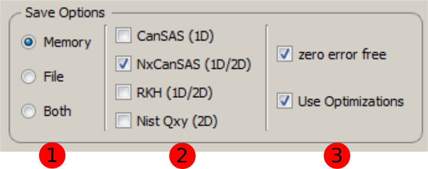

+-------+--------------------------+-----------------------------------------------------------------------------------------+
| **1** | **Save location**        | This sets where the reduced data will be made available for the user. The user can      |
|       |                          | can select to have it only in memory (RAM) with the **Memory** option, saved out as     |
|       |                          | a file with the **File** option or saved both to file and memory with the **Both**      |
|       |                          | option.                                                                                 |
+-------+--------------------------+-----------------------------------------------------------------------------------------+
| **2** | **Save file formats**    | Allows the user to specify the save file format for the reduced data.                   |
|       |                          |                                                                                         |
+-------+--------------------------+-----------------------------------------------------------------------------------------+
| **3** | **Other**                | The **zero error free** option ensures that zero error entries get artificially         |
|       |                          | inflated when the data is saved to a file. This is beneficial if the data is to be      |
|       |                          | loaded into other analysis software.                                                    |
|       |                          | The **Use optimizations** option will reuse already loaded data. This can speed up the  |
|       |                          | data reduction considerably. It is recommended to have this option enabled.             |
+-------+--------------------------+-----------------------------------------------------------------------------------------+

Settings
--------

.. image::  ../images/sans_isis_v2_general_tab_whole.png
   :align: right

.. _Settings:

The Settings tab and its subtabs allow for manipulating and inspect the reduction parameters which were
initially set through loading a user file.  Currently there are five sub-tabs:

- **General, Wavelength, Scale, Event Slice, Sample** This tab contains settings which are not associated
  with the other tabs. This includes settings regarding the general reduction, the wavelength conversion,
  the absolute scaling of the data, event slicing and sample volume scaling.

- **Mask** The mask tab contains the masking information. It displays the selected masks in the
  familiar mask table.

- **Adjustment** This tab contains settings which are required to generate the adjustment workspaces. This
  includes information for the monitor normalization, transmission calculation, pixel-adjustment files and
  wavelength-adjustment files.

- **Q** This tab contains settings which are required for the conversion to momentum space.

- **State Diagnostic** This tab is currently being made available on an experimental basis. The tab provides
  insight into the actual settings which are being passed to the reduction algorithm. Once this interface
  reaches maturity this tab should be removed.

General, Wavelength, Scale, Event Slice, Sample
^^^^^^^^^^^^^^^^^^^^^^^^^^^^^^^^^^^^^^^^^^^^^^^

The first tab contains settings which are not associated with the wider themes of the other tabs.

General
"""""""
.. _General:

.. image::  ../images/sans_isis_v2_general_tab_general.png
   :align: right

+-------+------------------------------+----------------------------------------------------------------------------------------------+
| **1** | **Reduction Dimensionality** | Allows the user to choose either a 1D or 2D reduction                                        |
+-------+------------------------------+----------------------------------------------------------------------------------------------+
| **2** | **Reduction Mode**           | The user can choose to either perform a reduction on the low angle bank (**LAB**),           |
|       |                              | the high angle bank (**HAB**), on both (**Both**) or she can perform a merged (**Merged**)   |
|       |                              | reduction. If a merged reduction is enabled, then further settings are required (see below). |
|       |                              | reduction. A merged reduction essentially means that the reduced result from the             |
|       |                              | low angle bank and the high angle bank are stitched together.                                |
+-------+------------------------------+----------------------------------------------------------------------------------------------+
| **3** | **Merge scale**              | Sets the scale of a merged reduction. If the **Fit** checkbox is enabled, then this scale is |
|       |                              | being fitted.                                                                                |
+-------+------------------------------+----------------------------------------------------------------------------------------------+
| **4** | **Merge shift**              | Sets the shift of a merged reduction. If the **Fit** checkbox is enabled, then this scale is |
|       |                              | being fitted.                                                                                |
+-------+------------------------------+----------------------------------------------------------------------------------------------+
| **5** | **Merge custom q range**     | Describes the q region which should be used to determine the merge parameters.               |
+-------+------------------------------+----------------------------------------------------------------------------------------------+

Event Slice
"""""""""""
.. _Event_Slice:

.. image::  ../images/sans_isis_v2_general_tab_event_slice.png
   :align: right

In case of data which was measured in event-mode, it is possible to perform
time-of-flight slices of the data and reduce these separately. The input can be:

- *start:step:stop* specifieds time slices from a *start* value fot the *stop* value
  in steps of *step*.

- *start-stop* which specifies a time slice from the *start* value to the *stop* value.

- *>start* specifies a slice form the *start* value to the end of the data set.

- *<stop* specifies a slice form the start of the data set to the *stop* value

In addition it is possible to concatenate these specifications using comma-separation.
An example woudl be *5-10,12:2:16,20-30*.

Compatibility Mode
""""""""""""""""""
.. _Compatibility_Mode:

.. image::  ../images/sans_isis_v2_general_tab_event_binning.png
   :align: right

The old SANS GUI allows event-mode data as input but will convert it early on
into histogram-mode data, either using the time-of-flight binning parameters
specified by the user or by using the binning inherent to the monitors. The new
SANS GUI can handle event-mode data up to the conversion to *q*. This leads
to more precise results. However if the user wishes to compare the results between
the two GUIs she is advised to enable the compatibility mode. This will ensure
that event-mode data will be converted to histogram-mode data early on, even
in the new reduction framework and will lead to the same results as one
gets from the old GUI.

If the checkbox is enabled, then the time-of-flight binning parameters will be
taken from teh *Event binning* input. If this is not set, then the binning
parameters will be taken from the monitor workspace.

Wavelength
""""""""""
.. _Wavelength:

.. image::  ../images/sans_isis_v2_general_tab_wavelength_conversion.png
   :align: right

The settings provided here determine the binning used when converting from
time-of-flight units to wavelength units. Note that all units are Angstrom.

+-------+---------------+------------------------------------------+
| **1** | **Min**       | The lower bound of the wavelength bins.  |
+-------+---------------+------------------------------------------+
| **2** | **Max**       | The upper bound of the wavelength bins   |
+-------+---------------+------------------------------------------+
| **3** | **Step**      | The step of the wavelength bins          |
+-------+---------------+------------------------------------------+
| **3** | **Step Type** | The step type of the wavelength bins,    |
|       |               | ie linear or logarithmic                 |
+-------+---------------+------------------------------------------+

Scale and Sample
""""""""""""""""
.. _Scale_and_Sample:

.. image::  ../images/sans_isis_v2_general_tab_sample.png
   :align: right

This grouping allows the user to specify the absolute scale and sample geometry
information. Note that the geometry information is in millimeter.

+-------+--------------------+------------------------------------------------------------------+
| **1** | **Absolute Scale** | The absolute, dimensionless scale factor                         |
+-------+--------------------+------------------------------------------------------------------+
| **2** | **Geometry**       | A gemometry selection. *Read from file* will use the settings    |
|       |                    | that are stored in the data file. The other options are          |
|       |                    | *Cylinder AxisUp*, *Cuboid* and *Cylinder AxisAlong* .           |
+-------+--------------------+------------------------------------------------------------------+
| **3** | **Heigth**         | The sample height. If this is not specified,                     |
|       |                    | the information from the file will be used.                      |
+-------+--------------------+------------------------------------------------------------------+
| **4** | **Width**          | The sample width. If this is not specified,                      |
|       |                    | the information from the file will be used.                      |
+-------+--------------------+------------------------------------------------------------------+
| **5** | **Thickness**      | The sample thickness. If this is not specified,                  |
|       |                    | the information from the file will be used.                      |
+-------+--------------------+------------------------------------------------------------------+
| **6** | **Z offset**       | The sample offset                                                |
+-------+--------------------+------------------------------------------------------------------+

Mask
^^^^
.. _Mask:

.. image::  ../images/sans_isis_v2_general_tab_whole.png
   :align: right

The elements on this tab relate to settings which are used during the masking step.

Masking information
"""""""""""""""""""
.. _Masking_information:

.. image::  ../images/sans_isis_v2_masking_tab_masking_table.png
   :align: right
   :width: 300px

The masking table shows detailed information about the masks which will be applied.
These masks include bin masks, cylinder masks, mask files, spectrum masks, angle masks
and masks for the beam stop. If as mask is applied only to a particular detector
then this will be show in the masking table. Note that data needs to be specified
in order to see the masking information. Also note if manually change the
data table, you will have to update the row selection by pressing *Update Rows*

+-------+-----------------+------------------------------------------------------------------+
| **1** | **Table**       | The masking table which displays all masks which will be applied |
|       |                 | to the data set                                                  |
+-------+-----------------+------------------------------------------------------------------+
| **2** | **Select Row**  | The masking information is shown for a particular data set in    |
|       |                 | in the data table. The information for the selected row is       |
|       |                 | shown.                                                           |
+-------+-----------------+------------------------------------------------------------------+
| **3** | **Update Rows** | TPress this button if you have manually updated the data table.  |
|       |                 | These changes are currently not picked up automatically.         |
+-------+-----------------+------------------------------------------------------------------+

Phi limit
"""""""""
.. _Phi_Limit:

.. image::  ../images/sans_isis_v2_masking_tab_phi.png
   :align: right
   :width: 400px

This group allows the user to specify a angle (pizza-slice) mask. The angles
are in degree.

+-------+-----------------+---------------------------------------+
| **1** | **Start Angle** | The starting angle.                   |
+-------+-----------------+---------------------------------------+
| **2** | **Stop Angle**  | The stop angle.                       |
+-------+-----------------+---------------------------------------+
| **3** | **Use mirror**  | If the mirror sector should be used.  |
+-------+-----------------+---------------------------------------+

Radius limit
""""""""""""
.. _Radius_Limit:

.. image::  ../images/sans_isis_v2_masking_tab_radius.png
   :align: right
   :width: 400px

These settings allow for a hollow cylinder mask. The *Min* entry is the inner
radius and the *Max* entry is the outer radius of the
hollow cylinder.

Adjustment
^^^^^^^^^^
.. _Adjustment:

.. image::  ../images/sans_isis_v2_adjustment_tab_whole.png
   :align: right

This tab provides settings which are required for the creation of the adjustment
workspaces. These adjustments include monitor normalization, transmission
calculation and the application of adjustment files.

Monitor normalization
"""""""""""""""""""""
.. _Monitor_Normalization:

.. image::  ../images/sans_isis_v2_adjustment_tab_monitor_normalization.png
   :align: right

+-------+------------------------------+--------------------------------------------------------+
| **1** | **Incident monitor**         | The incident monitor spectrum number.                  |
+-------+------------------------------+--------------------------------------------------------+
| **2** | **Use interpolating rebin**  | Check if an interpolating rebin should be used instead |
|       |                              | of a normal rebin.                                     |
+-------+------------------------------+--------------------------------------------------------+

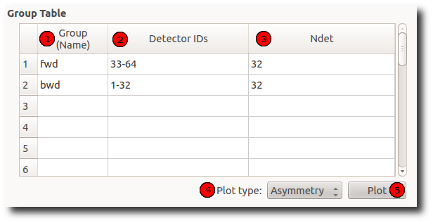

+-------+--------------------------+-----------------------------------------------------------------------------------------+
| **1** | **Group (Name)**         | The name of the group. Should be unique.                                                |
|       | **column**               |                                                                                         |
|       |                          |                                                                                         |
+-------+--------------------------+-----------------------------------------------------------------------------------------+
| **2** | **Detector IDs column**  | A list of detectors associated with the group. One detector might be in multiple groups.|
|       |                          | Ranges are allowed, e.g. "1,2-5,7-9,11" represents detectors                            |
|       |                          | with IDs 1,2,3,4,5,7,8,9 and 11                                                         |
+-------+--------------------------+-----------------------------------------------------------------------------------------+
| **3** | **Ndet column**          | Number of detectors associated with the group. This column is not editable and is       |
|       |                          | updated automatically when the list of group detectors changes.                         |
+-------+--------------------------+-----------------------------------------------------------------------------------------+
| **4** | **Plot type**            | What kind of plot to produce when *Plot* button is pressed. See the Home_ page          |
|       |                          | for an explanation of available plot types.                                             |
|       |                          |                                                                                         |
+-------+--------------------------+-----------------------------------------------------------------------------------------+
| **5** | **Plot**                 | Plots the group highlighted most recently.                                              |
|       |                          |                                                                                         |
+-------+--------------------------+-----------------------------------------------------------------------------------------+

Pair table
^^^^^^^^^^

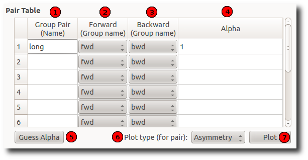

+-------+---------------------------+-----------------------------------------------------------------------------------------+
| **1** | **Group Pair (Name)**     | Name of the pair. Should be unique.                                                     |
|       | **column**                |                                                                                         |
|       |                           |                                                                                         |
+-------+---------------------------+-----------------------------------------------------------------------------------------+
| **2** | **Forward (Group name)**  | The first ("forward") group of the pair.                                                |
|       | **column**                |                                                                                         |
|       |                           |                                                                                         |
+-------+---------------------------+-----------------------------------------------------------------------------------------+
| **3** | **Backward (Group name)** | The second ("backward") group of the pair.                                              |
|       | **column**                |                                                                                         |
+-------+---------------------------+-----------------------------------------------------------------------------------------+
| **4** | **Alpha column**          | Alpha value of the pair.                                                                |
|       |                           |                                                                                         |
|       |                           |                                                                                         |
+-------+---------------------------+-----------------------------------------------------------------------------------------+
| **5** | **Guess alpha**           | Guess a new alpha value for the pair highlighted most recently. Uses AlphaCalc          |
|       |                           | (:ref:`AlphaCalc <algm-AlphaCalc>`) to do that.                                         |
+-------+---------------------------+-----------------------------------------------------------------------------------------+
| **6** | **Plot Type**             | What kind of plot to produce when the *Plot* button is pressed. See the Home_ page      |
|       |                           | for an explanation of available plot types.                                             |
+-------+---------------------------+-----------------------------------------------------------------------------------------+
| **7** | **Plot**                  | Plots the pair highlighted most recently                                                |
|       |                           |                                                                                         |
|       |                           |                                                                                         |
+-------+---------------------------+-----------------------------------------------------------------------------------------+

Data Analysis
-------------

.. _DataAnalysis:

This tab is designed for the user to make a fit against the data just plotted.
Since Mantid 3.8 (upgraded in 3.10), this tab has been enhanced to include fits of multiple datasets at once.
Since Mantid 3.10 a Transverse field (TF) Asymmetry mode has been added.

Default: multiple fitting disabled
^^^^^^^^^^^^^^^^^^^^^^^^^^^^^^^^^^

.. image::  ../images/MuonAnalysisDataAnalysis.png
   :align: right

By default, multiple dataset fitting is not enabled and the interface will look just as it did pre-Mantid 3.8.

In this case, the only thing that this tab will contain is a specialised version of the
`Fit Property Browser <http://www.mantidproject.org/MantidPlot:_Data_Analysis_and_Curve_Fitting>`_.
When the tab is open, this fit property browser is used by default within MantidPlot.

Note that, in this mode, simultaneous fits are not possible.
The intention is that this mode could be useful for users who are accustomed to the existing UI, or if a bug is found in the new UI.

TF asymmetry enabled
^^^^^^^^^^^^^^^^^^^^^^^^

The TF asymmetry mode can be enabled by checking the "TF Asymmetry" checkbox on the Settings_ tab. Loading transverse field asymmetry data into muon analysis will automatically
enable TF asymmetry mode.
When this is activated, the data analysis tab has two main differences to the pre 3.8 version. Firstly there
is an additional row in the Data table (normalization). The second difference is the addition of the "TF
Asymmetry Fit" button in the fitting tab. Selecting this fitting option will recalculate the normalization based on the user fitting function.

.. image::  ../images/MuonAnalysisTFAsymm.png
   :align: right

Multiple fitting enabled
^^^^^^^^^^^^^^^^^^^^^^^^

The multiple fitting functionality can be enabled by checking the "Enable multiple fitting" checkbox on the Settings_ tab.
When this is activated, the tab is divided into multiple sections vertically.

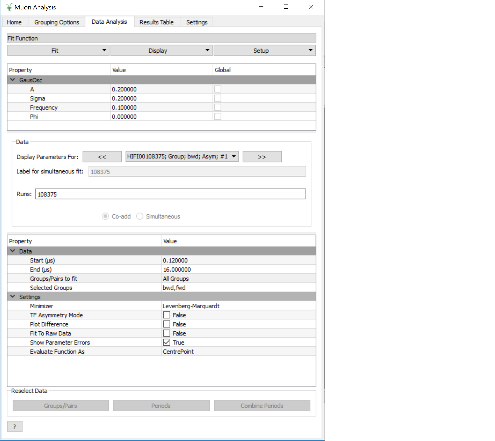

Fit Function
^^^^^^^^^^^^
The uppermost of the three vertical sections is the *Fit Function* section, which is a
FunctionBrowser just like in the *General/Multi dataset fitting* interface (and numerous other places in Mantid).
Functions can be added by right-clicking. If more space is needed, this section can be expanded by dragging its lower edge downwards.

The function browser has three columns - property, value and global.
The values shown are those of the currently selected/plotted dataset.
The global column contains a checkbox for each function parameter which, when checked, sets this parameter to be shared between all fits.

Parameters can be fixed, tied and constrained by right-clicking.
In addition, just as in the general multi dataset fitting interface, when highlighting a non-global function parameter, a small button will appear next to its value.
This button will open the "Edit local parameter values" dialog, which offers greater control of function parameters for each dataset.

Data
^^^^
The next section of the tab is the data selector, which controls the dataset(s) that will be fitted.
By default, this will be a single dataset, the same as the data loaded on the Home_ tab.
The dataset(s) can be changed here and, if more than one is selected, they will all be fitted simultaneously.

The "Display Parameters For" boxes consist of a backwards button, a drop-down selection and a forward button. The drop-down list shows all datasets currently selected,
and the left and right buttons cycle through them. The currently selected dataset has its parameters shown in the *Fit Function* (upper) widget, and will be plotted.

For a multi-dataset fit, the "Label" box is enabled.
This allows the user to input a label for the simultaneous fit.

Runs
""""
A single run, or range (*e.g. 15189-91, 15193*) can be typed into the box here.
The radio buttons below control whether the runs should be co-added together or fitted separately in a simultaneous fit.

Data Table
^^^^^^^^^^

The data table allows the user to modify the selected data for the fitting. This includes the start and end times, which can also
be updated by dragging the blue dashed lines in the plot. The "Groups/Pairs to fit" box provides a drop-down menu with three options (all groups, all pairs and custom).
Selecting custom will produce a pop-up box with tick boxes for each of the available groups and pairs. If a user wants to update the custom selection the
Groups/Pairs button can be pressed from the ReselectData_ section at the bottom ofthe tab (this is only enabled if a custom selection is set). Underneath displays the
"Selected Groups".

The next row is the "Periods to fit" option, which is only displayed for multiple period data. This will automatically be populated with
each of the periods (e.g. 1,2,3) and a custom option. Selecting custom will produce a pop-up with checkboxes for all of the periods. Selecting custom will also enable the
"Periods" button in the ReselectData_ section
and pressing this button will allow the user to alter their custom selection.

Examples/Use cases
""""""""""""""""""
1. Individual fit:

   - One run selected in the box, or a range with the "Co-add" option set.
   - One group selected
   - (One period selected, if multi-period)
   - In this case the "global" option is meaningless as only one dataset will be fitted.
   - Example: MUSR15189, group *long*, period 1

2. Simultaneous fit across runs:

   - Range or selection of runs in box, with "Simultaneous" option set.
   - One group selected
   - (One period selected)
   - Example: MUSR{15189, 15190, 15191}, group *long*, period 1

3. Simultaneous fit across groups or periods:

   - One run selected in the box, or a range with the "Co-add" option set.
   - Multiple groups or periods selected
   - Example: MUSR15189, groups {*fwd*, *bwd*}, period 1

4. Sequential fit of simultaneous fits:

   - One run only selected in the box.
   - Multiple groups or periods selected
   - Under "Fit", click "Sequential fit" and type a range of runs in the dialog. (See SequentialFitting_ below)
     For each run in turn, a simultaneous fit of the selected groups/periods will be performed.

5. Multiple options

   - It is, of course, possible to select several runs, groups, periods all at once and a simultaneous fit will be performed across all the selected datasets.
   - Example: MUSR{15189, 15190, 15191}, groups {*fwd*, *bwd*}, periods {1, 2}: 12 datasets in all.

Additional Options
^^^^^^^^^^^^^^^^^^
Near the bottom of the tab contains selected fit options that can be adjusted, just as elsewhere in Mantid.
The only option specific to the Muon Analysis interface is *Fit To Raw Data*.
When this option is set to *True*, the fitting process is done using the raw (unbinned) data, even if the DataBinning_ is set.

Reselect data
^^^^^^^^^^^^^

.. _ReselectData:

At the bottom of the tab is the "Reselect Data" section. This includes three buttons "Groups/Pairs", "Periods" and "Combine Periods". The "Groups/Pairs" and "Periods"
buttons are only when the relevant options in the data table are set to custom. Pressing the button will produce a pop-up that will allow the user to modify their selection.

The "Combine Periods" button is only enabled if multiple periods are available. Pressing the button will generate a pop-up with two boxes. The top one is for adding periods
(as a comma seperated list or with "+") and the bottom box is for subtraction (as a comma sepearted list). Everything in the top and bottom boxes are summed seperatley
and the results are then used in the subtraction.

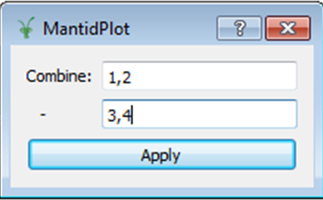

Sequential fitting
^^^^^^^^^^^^^^^^^^

.. _SequentialFitting:

In MantidPlot 3.1 a specialized sequential fitting dialog for MuonAnalysis was introduced.
It allows users to fit various data sets to the chosen fit model, applying all of the interface settings.

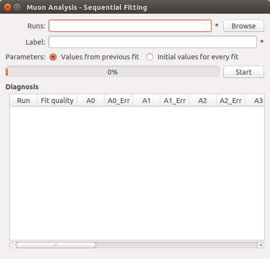

The dialog can be opened from the Fit menu in *Fit* → *Sequential Fit*.

+-------+-----------------------+---------------------------------------------------------------------------+
| **1** | **Runs**              | A list of run data files to fit. Two types of input are accepted:         |
|       |                       |                                                                           |
|       |                       | - List of files on the disk separated by comma. These can be specified    |
|       |                       |   using the *Browse* button.                                              |
|       |                       |                                                                           |
|       |                       | - Run numbers separated by comma. Specific files will then be searched    |
|       |                       |   in the archive for the instrument selected on the interface. Ranges     |
|       |                       |   are allowed, e.g. "15189-15199".                                        |
|       |                       |                                                                           |
+-------+-----------------------+---------------------------------------------------------------------------+
| **2** | **Label**             | Text label to use for the sequential fit. It is used to find the results  |
|       |                       | on the ResultsTable_  tab. The resulting workspace group and the          |
|       |                       | fit-result workspaces will have the label in their names.                 |
+-------+-----------------------+---------------------------------------------------------------------------+
| **3** | **Parameters**        | This option specifies the initial fit parameters for every fit. Choices   |
|       |                       | should be self-explanatory.                                               |
+-------+-----------------------+---------------------------------------------------------------------------+
| **4** | **Progress**          | Shows the progress of the fit.                                            |
+-------+-----------------------+---------------------------------------------------------------------------+
| **5** | **Start/stop button** | Starts a new fit or stops the current one.                                |
+-------+-----------------------+---------------------------------------------------------------------------+
| **6** | **Diagnosis table**   | Displays the intermediate results of the fit. This includes run number,   |
|       |                       | fit quality (see OutputChi2overDoF in :ref:`Fit <algm-Fit>`) and fitted   |
|       |                       | values of all the parameters.                                             |
+-------+-----------------------+---------------------------------------------------------------------------+

After the options have been set and the *Start* button has been pressed, the dialog goes through **every**
data file and does the following:

1. Loads the file

2. Applies all of the settings as set on the interface, e.g. dead time correction, grouping, binning.

3. Runs the :ref:`Fit <algm-Fit>` algorithm using the fit model specified in the *Fit Property Browser* on this tab.

4. Puts the fit-result workspaces inside the MuonSeqFit_%LABEL% group.

After that's done, you can retrieve the results in two ways:

- Go to the ResultsTable_ tab and export fitted parameters as a table.

- Use the workspaces in the MuonSeqFit_%LABEL% group to plot the fitted curves.

Results Table
-------------

.. _ResultsTable:

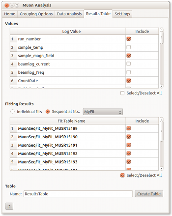

This tab allows users to export the fitting results alongside log values as a table.

Values
^^^^^^

The table contains a list of log values present in **all** of the workspaces in the
*Fitting results* table. The ones selected will be included in the results table.

In the case of start and end times (*run_start* and *run_end*), the option is given
to write these either as text or number. The text option gives an ISO- formatted string
(eg. 2016-07-06T10:10:34) and the numeric option gives the time as a number of seconds.
Zero seconds is taken as the start time of the first run in the selected set.

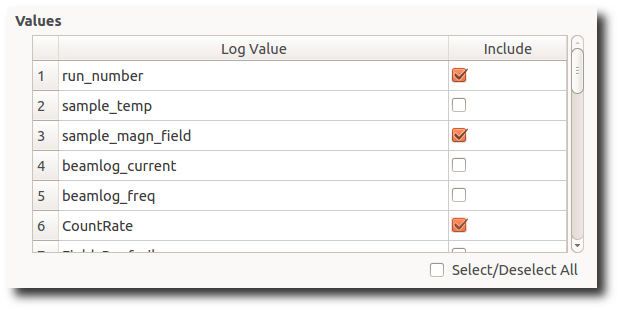

Fitting Results
^^^^^^^^^^^^^^^

This table contains a list of fitted workspaces. You can choose whether you want to see
individual fits only, or a specific sequential (see SequentialFitting_ ) or simultaneous (see DataAnalysis_) fit label.

Fitted parameters of the selected workspaces will be added to the results table.

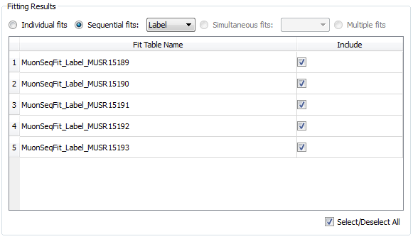

Workspaces might be coloured differently. Workspaces of different colours have
different fitting models and therefore couldn't be included in the same Results table.
(If looking at simultaneous fits, different colours could also indicate that the fits had different numbers of datasets).

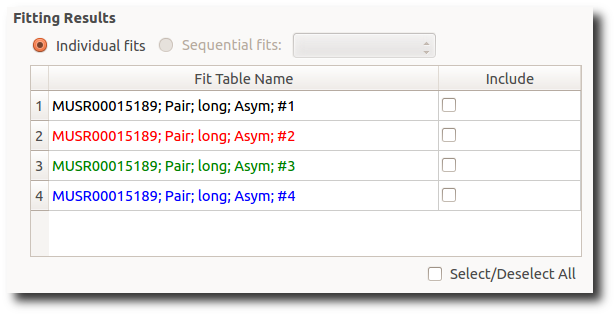

As well as selecting workspaces, the fourth radio button - "Multiple" - can be used to create a table of multiple simultaneous fits, one row per label.
In such a table, each global parameter gets one column and local parameters get one column per dataset.

Table
^^^^^

This allows you to specify the name of the resulting table and create it using the log
values and workspaces you've selected.

Settings
--------

.. _Settings:

This tab allows users to specify various plotting style options, loaded data binning and other general options.

Data Plot Style
^^^^^^^^^^^^^^^

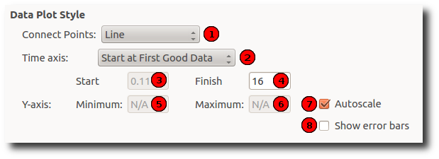

These options control the style of the plot. They will be applied to all new plots.
The currently connected plot (if any) is updated as well.

+-------+---------------------+-------------------------------------------------------------------+
| **1** | Connect Points      | Option for how the points will be represented on the plot:        |
|       |                     |                                                                   |
|       |                     | - **Scatter**. Data points only.                                  |
|       |                     |                                                                   |
|       |                     | - **Line + symbol**. Data points connected by a line.             |
|       |                     |                                                                   |
|       |                     | - **Line**. A line without data points.                           |
|       |                     |                                                                   |
+-------+---------------------+-------------------------------------------------------------------+
| **2** | Time axis           | Type of the start value of the X-axis:                            |
|       |                     |                                                                   |
|       |                     | - **Start at First Good Data**. Uses the First Good Data value    |
|       |                     |   from the Home_ tab.                                             |
|       |                     |                                                                   |
|       |                     | - **Start at Time Zero**. Uses 0. Worth noting that workspaces    |
|       |                     |   will be cropped according to the *Time Zero* value on the Home  |
|       |                     |   (HomeInstrument_) tab, which means that X-value of 0 will       |
|       |                     |   essentially be equal to the *Time Zero* value.                  |
|       |                     |                                                                   |
|       |                     | - **Custom Value**. Uses the specified value.                     |
|       |                     |                                                                   |
+-------+---------------------+-------------------------------------------------------------------+
| **3** | Start               | First value of the X-axis (:math:`\mu s`).                        |
+-------+---------------------+-------------------------------------------------------------------+
| **4** | Finish              | Last value of the X-axis (:math:`\mu s`). If empty, the last      |
|       |                     | available value is used.                                          |
+-------+---------------------+-------------------------------------------------------------------+
| **5** | Minimum             | Minimum value on the Y-axis. If empty, is determined              |
|       |                     | automatically.                                                    |
+-------+---------------------+-------------------------------------------------------------------+
| **6** | Maximum             | Maximum value on the Y-axis. If empty, is determined              |
|       |                     | automatically.                                                    |
+-------+---------------------+-------------------------------------------------------------------+
| **7** | Autoscale           | If checked, the values of *Minimum* and *Maximum* are             |
|       |                     | determined automatically based on the max/min values of the data. |
+-------+---------------------+-------------------------------------------------------------------+
| **8** | Show error bars     | If checked, the curves will have error bars attached to them.     |
+-------+---------------------+-------------------------------------------------------------------+

Data Binning
^^^^^^^^^^^^

.. _DataBinning:

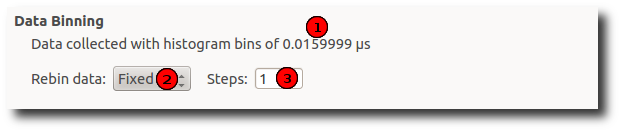

+-------+------------------------+---------------------------------------------------------------+
| **1** | **Bin size**           | Display the size of the bin in the currently loaded data. This|
|       |                        | is usually 0.016 :math:`\mu s` for Muon instruments.          |
+-------+------------------------+---------------------------------------------------------------+
| **2** | **Binning type**       | What type of binning is applied to the loaded data:           |
|       |                        |                                                               |
|       |                        | - **None**. No binning is applied - raw data.                 |
|       |                        |                                                               |
|       |                        | - **Fixed**. Binning with fixed steps.                        |
|       |                        |                                                               |
|       |                        | - **Variable**. Binning with varying steps.                   |
|       |                        |                                                               |
+-------+------------------------+---------------------------------------------------------------+
| **3** | **Binning parameters** | - For fixed binning: number of bins in a single step. For     |
|       |                        |   example, if data is collected in bins of size 0.016 and we  |
|       |                        |   specify 5 here, then the data will be re-binned using a bin |
|       |                        |   size of 0.08.                                               |
|       |                        |                                                               |
|       |                        | - For variable binning: see the *Params* property of          |
|       |                        |   :ref:`Rebin <algm-Rebin>`. Note                             |
|       |                        |   :ref:`Rebin <algm-Rebin>` is executed with                  |
|       |                        |   *FullBinsOnly=True*.                                        |
|       |                        |                                                               |
+-------+------------------------+---------------------------------------------------------------+

General
^^^^^^^

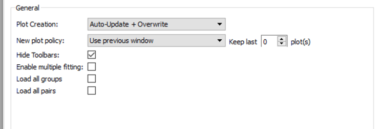

+-------+-----------------------------+---------------------------------------------------------------------+
| **1** | **Plot Creation**           | - **Auto-Update**. When settings are changed on the interface,      |
|       |                             |   the new plot is created automatically.                            |
|       |                             |                                                                     |
|       |                             | - **Overwrite**. When plotting, if the plot of the same type        |
|       |                             |   exists already, it is overwritten instead of creating a new       |
|       |                             |   one.                                                              |
|       |                             |                                                                     |
|       |                             | - **Auto-Update + Overwrite**. Both above settings at the same time |
|       |                             |                                                                     |
|       |                             | - **None**. None of the settings                                    |
|       |                             |                                                                     |
+-------+-----------------------------+---------------------------------------------------------------------+
| **2** | **New plot policy**         | - **Use previous window**. Each new plot will be drawn in the       |
|       |                             |   same window. By default, the previous fit curve will remain       |
|       |                             |   on the graph when the run is changed - the number of curves       |
|       |                             |   to keep can be adjusted here (set to 0 to always clear            |
|       |                             |   previous fits). The "clear fit curves" option on the Data         |
|       |                             |   Analysis tab will clear any fit curves present.                   |
|       |                             |                                                                     |
|       |                             | - **Create new window**. When plotting a new run, it is             |
|       |                             |   plotted in a new window each time.                                |
|       |                             |                                                                     |
|       |                             |   NOTE: This can can cause speed and stability problems once the    |
|       |                             |   number of graphs managed by Mantidplot passes a few hundred       |
|       |                             |   which can hapen if you run Mantid for a few days on an            |
|       |                             |   experiment. For long term stability we suggest you select         |
|       |                             |   **Use previous window**.                                          |
|       |                             |                                                                     |
+-------+-----------------------------+---------------------------------------------------------------------+
| **3** | **Hide Toolbars**           | If enabled, opening the interface up hides the MantidPlot           |
|       |                             | toolbars. This is useful on smaller screens.                        |
+-------+-----------------------------+---------------------------------------------------------------------+
| **4** | **Enable multiple fitting** | By default, this option is disabled and the DataAnalysis_ tab will  |
|       |                             | look the same as it did in previous versions of Mantid (pre-3.8).   |
|       |                             | Note that simultaneous fits are not possible in this case.          |
|       |                             |                                                                     |
|       |                             | Enabling the option will change the UI of the DataAnalysis_ tab to  |
|       |                             | the new one described above, enabling fits of multiple datasets to  |
|       |                             | be made.                                                            |
+-------+-----------------------------+---------------------------------------------------------------------+

Feedback & Comments
-------------------

If you have any questions or comments about this interface or this help page, please
contact the `Mantid team <http://www.mantidproject.org/Contact>`__ or the
`Muon group <http://www.isis.stfc.ac.uk/groups/muons/muons3385.html>`__.

.. categories:: Interfaces Muon
