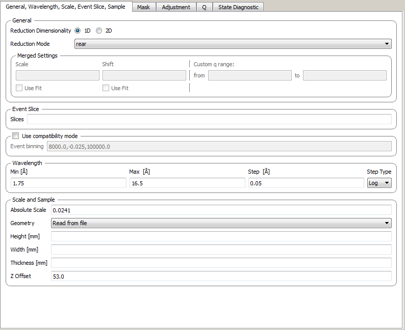
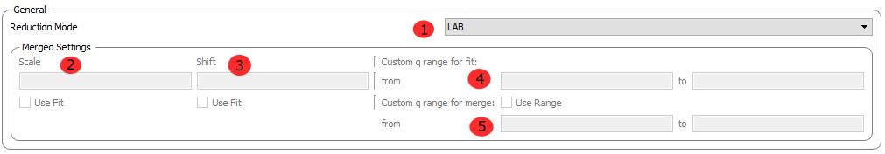
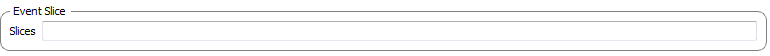
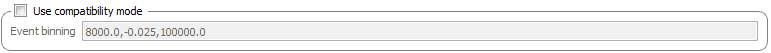
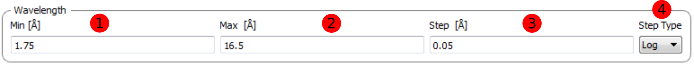
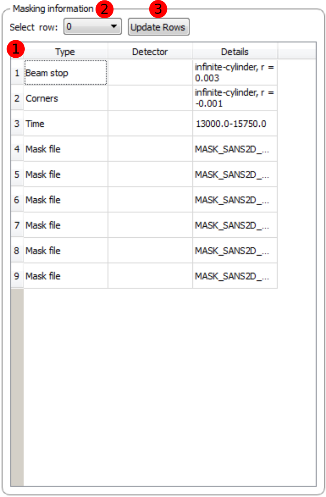
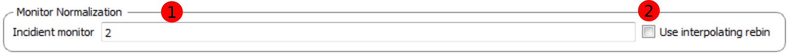
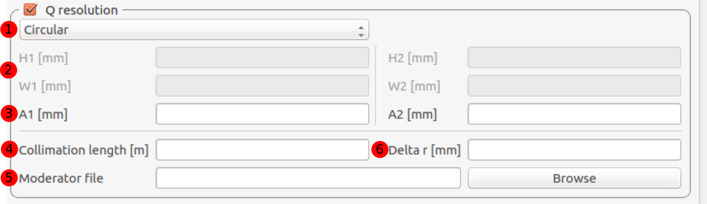
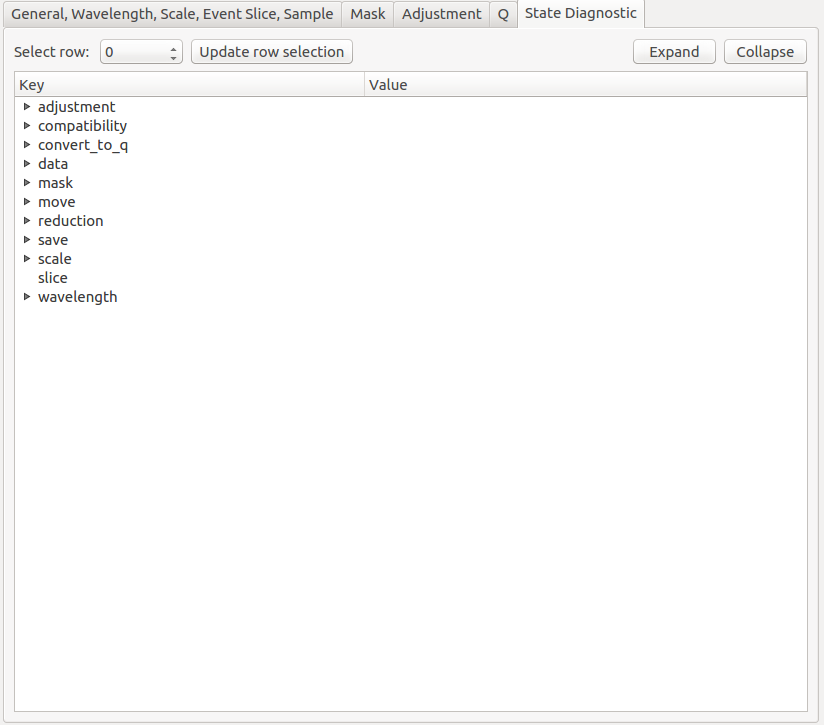

.. _ISIS_SANS_v2-ref:

ISIS SANS v2
============

.. image::  ../images/sans_isis_v2_whole_gui.png
   :align: right
   :width: 800px

.. contents:: Table of Contents
  :local:

Interface Overview
------------------

This interfae is used to reduce ISIS SANS data for SANS2D, LOQ and LARMOR.
The interface can be accessed from teh main menu of MantidPlot, in *Interfaces → SANS → ISIS SANS v2 experimental*.
This interface is intended as a gradual replacement for the old ISIS SANS
interface. Note that it is not yet feature complete and subject to change.

Runs
----

.. _Runs:

The *Runs* tab is the ISIS SANS entry-point. It allows the user to specify the user file and
batch file. Alternatively the user can set the data sets for reduction manually on the data table.
In addition it allows the user to specify her preferred save settings (see more below). The actual
parameters which are loaded from the user file are accesible from the sub tabs on the Settings_ tab.

Data Table
^^^^^^^^^^

.. _RunsDataTable:

.. image::  ../images/sans_isis_v2_run_tab_data_table.png
   :align: center
   :width: 800px

+-------+--------------------------+-----------------------------------------------------------------------------------------+
| **1** | **Process**              | If no individual row is selected in the data table, then this will start a reduction.   |
|       |                          | In this case the the user will be asked if she is sure that she wants to reduce all     |
|       |                          | rows. If any rows are selectd, then only these will be processed.                       |
+-------+--------------------------+-----------------------------------------------------------------------------------------+
| **2** | **Pause**                | Allows the user to pause a reduction, change her row selection and continue             |
|       |                          | the reduction with possibly a different selection.                                      |
+-------+--------------------------+-----------------------------------------------------------------------------------------+
| **3** | **Insert row after**     | Adds a row after the currently selected row.                                            |
+-------+--------------------------+-----------------------------------------------------------------------------------------+
| **4** | **Copy selected**        | Creates a copy of the selected rows.                                                    |
+-------+--------------------------+-----------------------------------------------------------------------------------------+
| **5** | **Cut selected**         | Cuts the selected rows.                                                                 |
+-------+--------------------------+-----------------------------------------------------------------------------------------+
| **6** | **Paste selected**       | Pastes rows from the clipboard.                                                         |
+-------+--------------------------+-----------------------------------------------------------------------------------------+
| **7** | **Clear selected**       | Clears the entries from selected rows.                                                  |
|       |                          | It however does not the delete the rows themsleves.                                     |
+-------+--------------------------+-----------------------------------------------------------------------------------------+
| **8** | **Delete row**           | Deletes a selected row.                                                                 |
+-------+--------------------------+-----------------------------------------------------------------------------------------+
| **9** | **Select instrument**    | Selects the instrument to use. Note that this setting is used to resolve run numbers.   |
+-------+--------------------------+-----------------------------------------------------------------------------------------+
| **10**| **Options**              | This column allows the user to provide row specfic settings. Currently only             |
|       |                          | **WavelengthMin** and **WavelengthMax** can be set here.                                |
+-------+--------------------------+-----------------------------------------------------------------------------------------+

Save Options
^^^^^^^^^^^^

+-------+--------------------------+-----------------------------------------------------------------------------------------+
| **1** | **Save location**        | This sets where the reduced data will be made available for the user. The user can      |
|       |                          | can select to have it only in memory (RAM) with the **Memory** option, saved out as     |
|       |                          | a file with the **File** option or saved both to file and memory with the **Both**      |
|       |                          | option.                                                                                 |
+-------+--------------------------+-----------------------------------------------------------------------------------------+
| **2** | **Save file formats**    | Allows the user to specify the save file format for the reduced data.                   |
|       |                          |                                                                                         |
+-------+--------------------------+-----------------------------------------------------------------------------------------+
| **3** | **Other**                | The **zero error free** option ensures that zero error entries get artificially         |
|       |                          | inflated when the data is saved to a file. This is beneficial if the data is to be      |
|       |                          | loaded into other analysis software.                                                    |
|       |                          | The **Use optimizations** option will reuse already loaded data. This can speed up the  |
|       |                          | data reduction considerably. It is recommended to have this option enabled.             |
+-------+--------------------------+-----------------------------------------------------------------------------------------+

Settings
--------

.. _Settings:

The Settings tab and its subtabs allow for manipulating and inspect the reduction parameters which were
initially set through loading a user file.  Currently there are five sub-tabs:

- **General, Wavelength, Scale, Event Slice, Sample** This tab contains settings which are not associated
  with the other tabs. This includes settings regarding the general reduction, the wavelength conversion,
  the absolute scaling of the data, event slicing and sample volume scaling.

- **Mask** The mask tab contains the masking information. It displays the selected masks in the
  familiar mask table.

- **Adjustment** This tab contains settings which are required to generate the adjustment workspaces. This
  includes information for the monitor normalization, transmission calculation, pixel-adjustment files and
  wavelength-adjustment files.

- **Q** This tab contains settings which are required for the conversion to momentum space.

- **State Diagnostic** This tab is currently being made available on an experimental basis. The tab provides
  insight into the actual settings which are being passed to the reduction algorithm. Once this interface
  reaches maturity this tab should be removed.

General, Wavelength, Scale, Event Slice, Sample
^^^^^^^^^^^^^^^^^^^^^^^^^^^^^^^^^^^^^^^^^^^^^^^

The first tab contains settings which are not associated with the wider themes of the other tabs.

General
"""""""
.. _General:

+-------+------------------------------+----------------------------------------------------------------------------------------------+
| **1** | **Reduction Dimensionality** | Allows the user to choose either a 1D or 2D reduction                                        |
+-------+------------------------------+----------------------------------------------------------------------------------------------+
| **2** | **Reduction Mode**           | The user can choose to either perform a reduction on the low angle bank (**LAB**),           |
|       |                              | the high angle bank (**HAB**), on both (**Both**) or she can perform a merged (**Merged**)   |
|       |                              | reduction. If a merged reduction is enabled, then further settings are required (see below). |
|       |                              | reduction. A merged reduction essentially means that the reduced result from the             |
|       |                              | low angle bank and the high angle bank are stitched together.                                |
+-------+------------------------------+----------------------------------------------------------------------------------------------+
| **3** | **Merge scale**              | Sets the scale of a merged reduction. If the **Fit** checkbox is enabled, then this scale is |
|       |                              | being fitted.                                                                                |
+-------+------------------------------+----------------------------------------------------------------------------------------------+
| **4** | **Merge shift**              | Sets the shift of a merged reduction. If the **Fit** checkbox is enabled, then this scale is |
|       |                              | being fitted.                                                                                |
+-------+------------------------------+----------------------------------------------------------------------------------------------+
| **5** | **Merge custom q range**     | Describes the q region which should be used to determine the merge parameters.               |
+-------+------------------------------+----------------------------------------------------------------------------------------------+

Event Slice
"""""""""""
.. _Event_Slice:

In case of data which was measured in event-mode, it is possible to perform
time-of-flight slices of the data and reduce these separately. The input can be:

- *start:step:stop* specifieds time slices from a *start* value fot the *stop* value
  in steps of *step*.

- *start-stop* which specifies a time slice from the *start* value to the *stop* value.

- *>start* specifies a slice form the *start* value to the end of the data set.

- *<stop* specifies a slice form the start of the data set to the *stop* value

In addition it is possible to concatenate these specifications using comma-separation.
An example woudl be *5-10,12:2:16,20-30*.

Compatibility Mode
""""""""""""""""""
.. _Compatibility_Mode:

The old SANS GUI allows event-mode data as input but will convert it early on
into histogram-mode data, either using the time-of-flight binning parameters
specified by the user or by using the binning inherent to the monitors. The new
SANS GUI can handle event-mode data up to the conversion to *q*. This leads
to more precise results. However if the user wishes to compare the results between
the two GUIs she is advised to enable the compatibility mode. This will ensure
that event-mode data will be converted to histogram-mode data early on, even
in the new reduction framework and will lead to the same results as one
gets from the old GUI.

If the checkbox is enabled, then the time-of-flight binning parameters will be
taken from teh *Event binning* input. If this is not set, then the binning
parameters will be taken from the monitor workspace.

Wavelength
""""""""""
.. _Wavelength:

The settings provided here determine the binning used when converting from
time-of-flight units to wavelength units. Note that all units are Angstrom.

+-------+---------------+------------------------------------------+
| **1** | **Min**       | The lower bound of the wavelength bins.  |
+-------+---------------+------------------------------------------+
| **2** | **Max**       | The upper bound of the wavelength bins   |
+-------+---------------+------------------------------------------+
| **3** | **Step**      | The step of the wavelength bins          |
+-------+---------------+------------------------------------------+
| **3** | **Step Type** | The step type of the wavelength bins,    |
|       |               | ie linear or logarithmic                 |
+-------+---------------+------------------------------------------+

Scale and Sample
""""""""""""""""
.. _Scale_and_Sample:

.. image::  ../images/sans_isis_v2_general_tab_sample.png
   :align: right
   :width: 800px

This grouping allows the user to specify the absolute scale and sample geometry
information. Note that the geometry information is in millimeter.

+-------+--------------------+------------------------------------------------------------------+
| **1** | **Absolute Scale** | The absolute, dimensionless scale factor                         |
+-------+--------------------+------------------------------------------------------------------+
| **2** | **Geometry**       | A gemometry selection. *Read from file* will use the settings    |
|       |                    | that are stored in the data file. The other options are          |
|       |                    | *Cylinder AxisUp*, *Cuboid* and *Cylinder AxisAlong* .           |
+-------+--------------------+------------------------------------------------------------------+
| **3** | **Heigth**         | The sample height. If this is not specified,                     |
|       |                    | the information from the file will be used.                      |
+-------+--------------------+------------------------------------------------------------------+
| **4** | **Width**          | The sample width. If this is not specified,                      |
|       |                    | the information from the file will be used.                      |
+-------+--------------------+------------------------------------------------------------------+
| **5** | **Thickness**      | The sample thickness. If this is not specified,                  |
|       |                    | the information from the file will be used.                      |
+-------+--------------------+------------------------------------------------------------------+
| **6** | **Z offset**       | The sample offset                                                |
+-------+--------------------+------------------------------------------------------------------+

Mask
^^^^
.. _Mask:

The elements on this tab relate to settings which are used during the masking step.

Masking information
"""""""""""""""""""
.. _Masking_information:

The masking table shows detailed information about the masks which will be applied.
These masks include bin masks, cylinder masks, mask files, spectrum masks, angle masks
and masks for the beam stop. If as mask is applied only to a particular detector
then this will be show in the masking table. Note that data needs to be specified
in order to see the masking information. Also note if manually change the
data table, you will have to update the row selection by pressing *Update Rows*

+-------+-----------------+------------------------------------------------------------------+
| **1** | **Table**       | The masking table which displays all masks which will be applied |
|       |                 | to the data set                                                  |
+-------+-----------------+------------------------------------------------------------------+
| **2** | **Select Row**  | The masking information is shown for a particular data set in    |
|       |                 | in the data table. The information for the selected row is       |
|       |                 | shown.                                                           |
+-------+-----------------+------------------------------------------------------------------+
| **3** | **Update Rows** | TPress this button if you have manually updated the data table.  |
|       |                 | These changes are currently not picked up automatically.         |
+-------+-----------------+------------------------------------------------------------------+

Phi limit
"""""""""
.. _Phi_Limit:

.. image::  ../images/sans_isis_v2_masking_tab_phi.png
   :align: right
   :width: 400px

This group allows the user to specify a angle (pizza-slice) mask. The angles
are in degree.

+-------+-----------------+---------------------------------------+
| **1** | **Start Angle** | The starting angle.                   |
+-------+-----------------+---------------------------------------+
| **2** | **Stop Angle**  | The stop angle.                       |
+-------+-----------------+---------------------------------------+
| **3** | **Use mirror**  | If the mirror sector should be used.  |
+-------+-----------------+---------------------------------------+

Radius limit
""""""""""""
.. _Radius_Limit:

.. image::  ../images/sans_isis_v2_masking_tab_radius.png
   :align: right
   :width: 400px

These settings allow for a hollow cylinder mask. The *Min* entry is the inner
radius and the *Max* entry is the outer radius of the
hollow cylinder.

Adjustment
^^^^^^^^^^
.. _Adjustment:

.. image::  ../images/sans_isis_v2_adjustment_tab_whole.png
   :align: right
   :width: 800px

This tab provides settings which are required for the creation of the adjustment
workspaces. These adjustments include monitor normalization, transmission
calculation and the application of adjustment files.

Monitor normalization
"""""""""""""""""""""
.. _Monitor_Normalization:

+-------+------------------------------+--------------------------------------------------------+
| **1** | **Incident monitor**         | The incident monitor spectrum number.                  |
+-------+------------------------------+--------------------------------------------------------+
| **2** | **Use interpolating rebin**  | Check if an interpolating rebin should be used instead |
|       |                              | of a normal rebin.                                     |
+-------+------------------------------+--------------------------------------------------------+

Tranmission calculation
"""""""""""""""""""""""
.. _Transmission_Calculation:

The main inputs for the transmission calculation are concerned with the incident monitor,
the monitors/detectors which measure the transmission and the fit paramters for the
transmission calculation.

Incident monitor
~~~~~~~~~~~~~~~~

+-------+------------------------------+--------------------------------------------------------+
| **1** | **Incident monitor**         | The incident monitor spectrum number.                  |
+-------+------------------------------+--------------------------------------------------------+
| **2** | **Use interpolating rebin**  | Check if an interpolating rebin should be used instead |
|       |                              | of a normal rebin.                                     |
+-------+------------------------------+--------------------------------------------------------+

Transmission targets
~~~~~~~~~~~~~~~~~~~~

.. image::  ../images/sans_isis_v2_adjustment_tab_transmission_monitor.png
   :align: right
   :width: 800px

+-------+--------------------------+------------------------------------------------------------------------------------------------+
| **1** | **Transmission targets** | This combo box allows the user to select the transmission target. *Transmission monitor* will  |
|       |                          | take the transmission data from the monitor which has been selected in **Transmission monitor**|
|       |                          | field. *Region of interest on bank* will take the transmission data from the fields            |
|       |                          | **Radius**, **ROI files** and **Mask files**                                                   |
+-------+--------------------------+------------------------------------------------------------------------------------------------+
| **2** | **Transmission monitor** | The monitor which will be used for the transmission calculation.                               |
+-------+--------------------------+------------------------------------------------------------------------------------------------+
| **3** | **M4 shift**             | An optional shift for the M4 monitor.                                                          |
+-------+--------------------------+------------------------------------------------------------------------------------------------+
| **4** | **Radius**               | This will select all detectors in the specified radius around the beam centre to contribute    |
|       |                          | to the transmission data.                                                                      |
+-------+--------------------------+------------------------------------------------------------------------------------------------+
| **5** | **ROI files**            | A comma-separated list of paths to ROI files. The detectors specified in the ROI files         |
|       |                          | contribute to the transmission data.                                                           |
+-------+--------------------------+------------------------------------------------------------------------------------------------+
| **6** | **Mask files**           | A comma-separated list of paths to Mask files. The detectors specified in the Mask files       |
|       |                          | are excluded from the transmission data.                                                       |
+-------+--------------------------+------------------------------------------------------------------------------------------------+

Fit settings
~~~~~~~~~~~~

.. image::  ../images/sans_isis_v2_adjustment_tab_transmission_fit.png
   :align: right
   :width: 800px

+-------+-----------------+---------------------------------------+-----------------------------------------------------------------+
| **1** | **Fit selection**        | If *Both* is selected, then the Sample and Can will have the same fit setings applied to them. |
|       |                          | If *Seperate* is selected, then the Sample and Can will have different fit settings applied    |
|       |                          | to them. In this case a second row with fit options will appear.                               |
+-------+--------------------------+------------------------------------------------------------------------------------------------+
| **2** | **Use fit**              | If fitting should be used for the transmission calculation.                                    |
+-------+--------------------------+------------------------------------------------------------------------------------------------+
| **3** | **Fit type**             | The type of fitting for the transmission calculation                                           |
|       |                          | This can be *Linear*, *Logarithmic* or *Polynomial*.                                           |
+-------+--------------------------+------------------------------------------------------------------------------------------------+
| **4** | **Polynomal order**      | If *Polynomial* has been chosen in the **Fit type** input, then the polynomial order of the    |
|       |                          | fit can be set here.                                                                           |
+-------+--------------------------+------------------------------------------------------------------------------------------------+
| **5** | **Custom wavelength**    | A custom wavelength range for the fit can be specified here.                                   |
+-------+--------------------------+------------------------------------------------------------------------------------------------+

Adjustement files
~~~~~~~~~~~~~~~~~

.. image::  ../images/sans_isis_v2_adjustment_tab_files.png
   :align: right
   :width: 800px

+-------+---------------------------------+------------------------------------------------------------------------------------------------+
| **1** | **Pixel adjustment det 1**      | File name of the pixel adjustment file for the first detector.                                 |
|       |                                 | The file to be loaded is a 'flat cell' (flood source) calibration file containing the relative |
|       |                                 | efficiency of individual detector pixels. Note that the numbers in this file include solid     |
|       |                                 | angle corrections for the sample-detector distance at which the flood field was measured.      |
|       |                                 | On SANS2D this flood field data is then rescaled for whatever sample-detector distance         |
|       |                                 | the experimental data was collected at. This file must be in RKH format and the                |
|       |                                 | 1st column spectrum number.                                                                    |
+-------+---------------------------------+------------------------------------------------------------------------------------------------+
| **2** | **Pixel adjustment det 2**      | File name of the pixel adjustment file for the second detector. See more inforamtion above.    |
+-------+---------------------------------+------------------------------------------------------------------------------------------------+
| **3** | **Wavelength adjustment det 1** | File name of the wavelength adjustment file for the first detector.                            |
|       |                                 | The content specifies the detector efficiency ratio vs wavelength.                             |
|       |                                 | These files must be in RKH format.                                                             |
+-------+---------------------------------+------------------------------------------------------------------------------------------------+
| **4** | **Wavelength adjustment det 2** | File name of the wavelength adjustment file for the second detector.                           |
|       |                                 | See more information above.                                                                    |
+-------+---------------------------------+------------------------------------------------------------------------------------------------+

Q
^^^^
.. _Q:

.. image::  ../images/sans_isis_v2_q_tab_whole.png
   :align: right
   :width: 800px

The elements on this tab relate to settings which are used during the conversion to momentum transfer step of the reduction.

Q limits
""""""""
.. _Q_Limits:

.. image::  ../images/sans_isis_v2_q_tab_q_limits.png
   :align: right
   :width: 800px

The entries here allow for the providing the binning settings during the momentum transfer conversion. In the
case of a 1D reduction the user can specify stanard bin information. In the case of a 2D rduction the user can only
specify the max Q value, as well as the step size and the step type.

+-------+-----------------+------------------------------------------------------------------------------------------------+
| **1** | **1D settings** | The 1D settings will be used if the redcution dimensionality has been set to 1D. The user can  |
|       |                 | specify the start, stop, step size and step type of the momentum transfer bins.                |
+-------+-----------------+------------------------------------------------------------------------------------------------+
| **2** | **2D settings** | The 2D settings will be used if the redcution dimensionality has been set to 2D. The user can  |
|       |                 | specify the stop value, step size and step type of the momentum transfer bins. The start       |
|       |                 | value is 0. Note that the binning is same for both dimensions.                                 |
+-------+-----------------+------------------------------------------------------------------------------------------------+

Gravity correction
""""""""""""""""""
.. _Gravity_Correction:

.. image::  ../images/sans_isis_v2_q_tab_gravity_correction.png
   :align: right
   :width: 800px

Enabling the checkbox will enable gravity correction. In this case an additional length can be specified.

Q Resolution
""""""""""""
.. _Q_Resolution:

If you want to perform a q resolution calculation then enable the checkbox of this group.
For detailed information please refer to :ref:`TOFSANSResolutionByPixel <algm-TOFSANSResolutionByPixel>`.

+-------+---------------------------------------+------------------------------------------------------------------------------------------------+
| **1** | **Aperture type**                     | The aperture for the q resolution calculation can either be *Circular* or *Rectangular*        |
+-------+---------------------------------------+------------------------------------------------------------------------------------------------+
| **2** | **Settings for rectangular aperture** | If the *Rectangular* aperture has been selected, then fields *H1* (source height), *W1* (source|
|       |                                       | width), *H2* (sample height) and *W2* (sample widgth) will have to be provided.                |
+-------+---------------------------------------+------------------------------------------------------------------------------------------------+
| **3** | **Settings for circular aperture**    | If the *Circular* aperture has been selected, then fields *A1* (source diameter) and *A2*      |
|       |                                       | (sample diameter) will have to be provided.                                                    |
+-------+---------------------------------------+------------------------------------------------------------------------------------------------+
| **4** | **Collimation length**                | The collimation length.                                                                        |
+-------+---------------------------------------+------------------------------------------------------------------------------------------------+
| **5** | **Moderator file**                    | This file contains the moderator time spread  as afunction of wavelength.                      |
+-------+---------------------------------------+------------------------------------------------------------------------------------------------+
| **6** | **Delta r**                           | The virtual ring width on the detector .                                                       |
+-------+---------------------------------------+------------------------------------------------------------------------------------------------+

State Diagnostic
^^^^^^^^^^^^^^^^
.. _State_Diagnostic:

This tab only exits for diagnostic purposes and might be removed (or hidden) when the GUI has
reached maturity. The interface allows instrument scientists and developers to inspect all settings in one place and
check for potential inconsistencies. The settings are presented in a tree view which reflects the hierarchical nature
of the SANS state implementation of the reduction backend.

To inspect the reduction settings for a particular state it is necessary to press the *Update rows* button to ensure
that all the most recent settings changes have been captured. Then the desired row can be selected from the drop-down
menu. The result will be displayed in the tree view.

Note that the settings are logically grouped by significant stages in the reduction. On a high level these are:

+-------------------+------------------------------------------------------------------------------------------------+
| **adjustment**    | This group has four sub-groups: *calculate_transmission*, *normalize_to_monitor*,              |
|                   | *wavelength_and_pixel_adjustment* and *wide_angle_correction*.                                 |
|                   | *calculate_transmission* contains information regarding the transmission calculation, e.g.     |
|                   | the transmission monitor.                                                                      |
|                   | *normalize_to_monitor* contains information regarding the monitor normalizeation, e.g.         |
|                   | the incident monitor.                                                                          |
|                   | *wavelength_and_pixel_adjustment* contains information required to generate the wavelength- and|
|                   | pixel-adjustment workpaces, e.g. the adjustment files.                                         |
|                   | *wide_angle_correction* contains information if the wide angle correction should be used.      |
+-------------------+------------------------------------------------------------------------------------------------+
| **compatibility** | This group contains information for the compatibility mode, e.g. the time-of-flight binning.   |
+-------------------+------------------------------------------------------------------------------------------------+
| **convert_to_q**  | This group contains information for the the momentum transfer conversion, e.g. the momentum    |
|                   | q binning information.                                                                         |
+-------------------+------------------------------------------------------------------------------------------------+
| **data**          | This group contains information about the data which is to be reduced.                         |
+-------------------+------------------------------------------------------------------------------------------------+
| **mask**          | This group contains information about masking, e.g. the mask files                             |
+-------------------+---------------------------------------+--------------------------------------------------------+
| **move**          | This group contains information about the position of the instrument. This is for example used |
|                   | when a data set is being loaded.                                                               |
+-------------------+---------------------------------------+--------------------------------------------------------+
| **reduction**     | This group contains general reduction information, e.g. the reduction dimensionality.          |
+-------------------+---------------------------------------+--------------------------------------------------------+
| **save**          | This group contains information about how the data should be saved, e.g. the file formats.     |
+-------------------+---------------------------------------+--------------------------------------------------------+
| **scale**         | This group contains information about the absolute scaling and the volume scaling of the data  |
|                   | set. This means it contains the information for the sample geometry.                           |
+-------------------+---------------------------------------+--------------------------------------------------------+
| **slice**         | This group contains information about event slicing.                                           |
+-------------------+---------------------------------------+--------------------------------------------------------+
| **wavelength**    | This group contains information about the wavelength conversion                                |
+-------+---------------------------------------+--------------------------------------------------------------------+

Feedback & Comments
-------------------

If you have any questions or comments about this interface or this help page, please
contact the `Mantid team <http://www.mantidproject.org/Contact>`__.

.. categories:: Interfaces Muon
