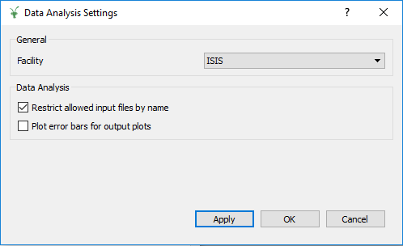

.. _interface-indirect-settings:

Indirect Settings
=================

.. contents:: Table of Contents
  :local:

Overview
--------

Provides a range of options to change the preferences on an Indirect interface. The following
image is the settings window as displayed when opened from the Data Analysis interface.

Action Buttons
--------------

Apply
  This will apply the changes made to the interface. The settings window will not be exited.

OK
  This will apply the changes made to the interface and then exits the settings window.

Cancel
  This disregards any changes which have not been applyed and exits the window.

General
-------

This section contains options which will be applyed across all of the Indirect interfaces.

Options
~~~~~~~

Facility
  Allows you to choose the selected facility.

Indirect Bayes
--------------

This section is displayed only when the settings window is opened from the Bayes
interface.

Options
~~~~~~~

Restrict allowed input files by name
  This will allow you to load input files with any names if unticked. Previously, only
  input files with certain end extensions such as *_red* were allowed to be loaded. See
  the glossary below to understand the restrictions on data when this option is ticked.

Plot error bars for output plots
  This will ensure that error bars are plotted on the output data plots if it is ticked.

Data Analysis
-------------

This section is displayed only when the settings window is opened from the Data Analysis
interface.

Options
~~~~~~~

Restrict allowed input files by name
  This will allow you to load input files with any names if unticked. Previously, only
  input files with certain end extensions such as *_red* were allowed to be loaded. See
  the glossary below to understand the restrictions on data when this option is ticked.

Plot error bars for output plots
  This will ensure that error bars are plotted on the output data plots if it is ticked.

Data Corrections
----------------

This section is displayed only when the settings window is opened from the Data Corrections
interface.

Options
~~~~~~~

Restrict allowed input files by name
  This will allow you to load input files with any names if unticked. Previously, only
  input files with certain end extensions such as *_red* were allowed to be loaded. See
  the glossary below to understand the restrictions on data when this option is ticked.

Plot error bars for output plots
  This will ensure that error bars are plotted on the output data plots if it is ticked.

Data Reduction
--------------

This section is displayed only when the settings window is opened from the Data Reduction
interface.

Options
~~~~~~~

Restrict allowed input files by name
  This will allow you to load input files with any names if unticked. Previously, only
  input files with certain end extensions such as *_red* were allowed to be loaded. See
  the glossary below to understand the restrictions on data when this option is ticked.

Plot error bars for output plots
  This will ensure that error bars are plotted on the output data plots if it is ticked.

Other Interfaces
----------------

There are currently no interface-specific settings for the Diffraction, Simulation and Tools
interfaces.

Glossary of Allowed Suffixes
----------------------------

_red
  This is produced in ISIS Energy Transfer on the :ref:`Data Reduction <interface-indirect-data-reduction>`
  interface. It can also be produced from ISIS Calibration.
_res
  This is produced in ISIS Calibration on the :ref:`Data Reduction <interface-indirect-data-reduction>`
  interface when Create RES is ticked.
_calib
  This is produced in ISIS Calibration on the :ref:`Data Reduction <interface-indirect-data-reduction>`
  interface.
_sqw
  This is produced in S(Q,w) on the :ref:`Data Reduction <interface-indirect-data-reduction>` interface.
_Corrections
  This is produced in Calculate Paalman Pings or Calculate Monte Carlo Absorption on the
  :ref:`Data Corrections <interface-indirect-corrections>` interface.
_eq
  This is produced in Elwin on the :ref:`Data Analysis <interface-indirect-data-analysis>` interface.
_elf
  This is produced in Elwin on the :ref:`Data Analysis <interface-indirect-data-analysis>` interface.
_iqt
  This is produced in I(Q,t) on the :ref:`Data Analysis <interface-indirect-data-analysis>` interface.
_Result
  This is produced in MSDFit, IqtFit, ConvFit or F(Q)Fit on the
  :ref:`Data Analysis <interface-indirect-data-analysis>` interface.

When **Restrict allowed input files by name** is ticked, the input data is restricted by name
according to the suffixes below:

Indirect Bayes Suffixes
~~~~~~~~~~~~~~~~~~~~~~~
ResNorm
#######

Vanadium Suffixes
  _red, _sqw

Resolution Suffixes
  _res

Quasi
#####

Sample Suffixes
  _red, _sqw

Resolution Suffixes
  _res, _red, _sqw

Stretch
#######

Sample Suffixes
  _red, _sqw

Resolution Suffixes
  _res

Data Analysis Suffixes
~~~~~~~~~~~~~~~~~~~~~~
Elwin
#####

Input Suffixes
  _red, _sqw

MSDFit
######

Sample Suffixes
  _eq

I(Q,t)
######

Sample Suffixes
  _red, _sqw

Resolution Suffixes
  _res, _red, _sqw

I(Q,t)Fit
#########

Sample Suffixes
  _iqt

ConvFit
#######

Sample Suffixes
  _red, _sqw

Resolution Suffixes
  _res, _red, _sqw

F(Q)Fit
#######

Sample Suffixes
  _Result

Data Corrections Suffixes
~~~~~~~~~~~~~~~~~~~~~~~~~
Container Subtraction
#####################

Sample Suffixes
  _red, _sqw, _elf

Container Suffixes
  _red, _sqw, _elf

Calculate Paalman Pings
#######################

Sample Suffixes
  _red, _sqw

Container Suffixes
  _red, _sqw

Calculate Monte Carlo Absorption
################################

Sample Suffixes
  _red, _sqw

Container Suffixes
  _red, _sqw

Apply Absorption Corrections
############################

Sample Suffixes
  _red, _sqw

Container Suffixes
  _red, _sqw

Corrections Suffixes
  _Corrections

Data Reduction Suffixes
~~~~~~~~~~~~~~~~~~~~~~~
ISIS Energy Transfer
####################

Calibration Suffixes
  _calib

ILL Energy Transfer
###################
No restrictions.

ISIS Calibration
################
No restrictions.

ISIS Diagnostics
################

Calibration Suffixes
  _calib

Transmission
############
No restrictions.

Symmetrise
##########

Input Suffixes
  _red

S(Q,w)
######

Input Suffixes
  _red

Moments
#######

Input Suffixes
  _sqw

Diffraction Suffixes
~~~~~~~~~~~~~~~~~~~~
No restriction of input data by name takes place.

Simulation Suffixes
~~~~~~~~~~~~~~~~~~~
No restriction of input data by name takes place.

Tools Suffixes
~~~~~~~~~~~~~~
No restriction of input data by name takes place.

.. categories:: Interfaces Indirect
