.. _Multi-dataset-Fitting-Interface:

Multi-dataset Fitting Interface
===============================

.. contents:: Table of Contents
  :local:

Interface Overview
------------------

The Multi-dataset fitting interface can be used to fit multiple spectra using
the same model and starting parameters for each spectrum. This interface can be
accessed from the main menu of MantidPlot, in *Interfaces → General →
Multi-dataset Fitting*. The interface consists of three major parts: The fit
property window, the spectrum & fit viewer, and the list of spectra to operate
on. 

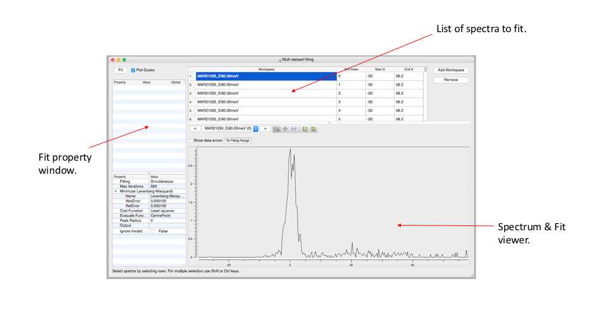

   A high level overview of the various sections of the multidataset fitting
   interface.

List of Spectra
---------------

To start fitting data with this interface some data of interest first needs to
be loaded into the view. Using the "Add workspace" button you can choose a
workspace to add spectra from. This will let you choose from a list of loaded
workspaces and optionally select which workspace indices to include for
fitting. Spectra can be removed by highlighting a corresponding row (or rows)
and clicking "Remove". To remove all spectra click the "workspace" column name
and then click the "Remove" button.

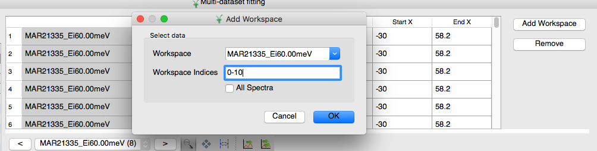

   The dialog box shown after clicking "Add workspace".

After a list of spectra have been imported from a workspace the table of
spectra will be populated with one entry for each spectrum. Here you can see
which workspace the spectrum came from, what the workspace index was, and what
the start and end `x` values are for this particular spectrum for each fit. The
start and end values are editable and can be changed by the user by double
clicking on an entry.

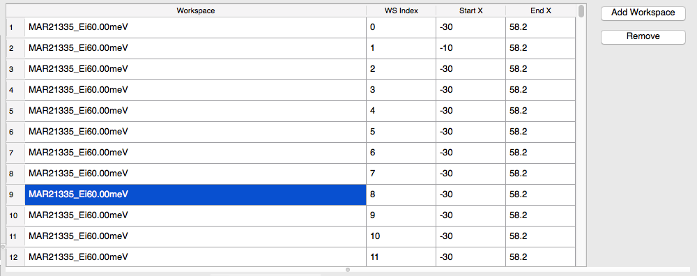

   The list of spectra after loading a workspace.

Fit Property Browser
--------------------

The fit property browser is located on the left of the interface. The operation
of the fit property browser is very similar to the `general fitting view
<https://www.mantidproject.org/MBC_Setup_And_Execute_First_Fit>`_ available in
Mantid but with slightly reduced functionality. The fit property browser is
split into two major parts. The top panel allows the user to define the
specifics of the model they wish to fit to the dataset. The bottom panel
contains the parameters for the minimizer and general parameters not associated
with the model (e.g. the number of iterations). The bottom panel also allows
the user to choose between simultaneous and sequential fitting mode:

* **Simultaneous Fitting**: Fit all spectra at the same time as a multi-domain
  function.

* **Sequential Fitting**: Has two different modes of operation specified by the
  "Fit Type" property:

  * *Sequential*: in which the fitted parameters of the previous spectrum are
    used as the starting values for the next one.
  * *Individual*: when all spectra have the same starting values.

Another import general option in the bottom panel is the *CreateOutput* option
(available in sequential mode). With this checked, as well as the output
parameters, the fit will also output a workspace with the normalised covariance
matrices and workspace with parameters for each spectrum. It will also output
one workspace for each spectrum containing the data, fitted model, and
difference between model and data.

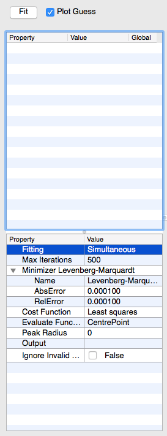

   The fit property browser. The top panel contains the specifics of the model
   to fit. The bottom panel contains general parameters not associated with
   the model.

A model can be created by right clicking and choosing "Add function" in the top
panel of the fit property window. This will produce a dialog box containing a
large number of different fit functions which can be added to the model.

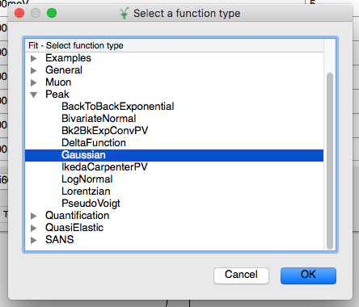

   The dialog containing the list of fit functions that can be added to the
   model.

After adding a function a new entry will appear in the top left panel with the
name of the fit function and a list of fitting parameters. The user can enter
appropriate guesses at starting values for the model parameters. Once a model
has been created the "Plot Guess" checkbox can be used to show a plot of the
model in the spectrum viewer using the starting parameter. To fit the model
click the "Fit" button.

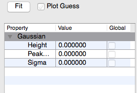

   The fit property browser with a model added. The browser shows the current
   starting values for each of the parameters of the model.

Global Parameters & Ties
^^^^^^^^^^^^^^^^^^^^^^^^
In the simultaneous fitting model parameters can be set as global. This means
the same parameter will be shared across all spectra. To set a parameter as
global click the checkbox in the "Global" column of the fit property browser
next to the name and value of the model parameter.

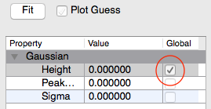

   Setting a model parameter to be global.

Model parameters can also be tied together or fixed to a given value. This can
be done by right clicking on the parameter and choosing either "Tie" or "Fix".
A fixed parameter's value will not change during a fit. A tied parameter can be
used to either bound a parameter to a range or to tie the values of two
parameters together.

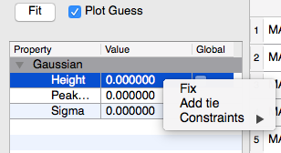

   Right clicking on a parameter shows the context menu with the fix, tie, and
   contraint options

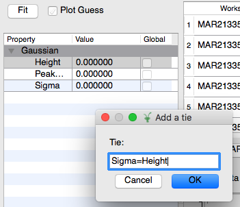

   Tieing the height parameter to the sigma parameter. More complex expressions
   are allowed. See the documentation in the :ref:`Fit <algm-Fit-v1>`
   algorithm.

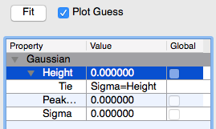

   The fit property browser after the tie has been added to the parameter.

Local Parameters
^^^^^^^^^^^^^^^^
As well as setting the starting values for global parameters, the local
parameter values of the model used for each spectrum can be set individually.
The local parameter values can be edited by clicking on the value you wish to
modify, then clicking on the "..." button next to the value. This will open a
dialog of values for every spectrum. Here individual values can be set, fixed,
and tied as with the global parameters.

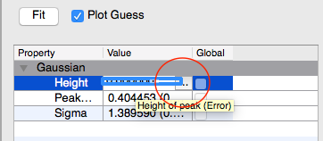
     
   Button to open the window to edit local parameter values. 

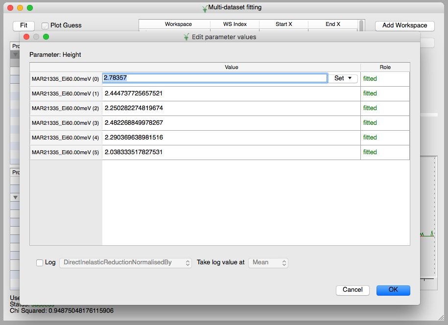
     
   Editing local parameter values for each spectrum. 

Spectrum Viewer
---------------

The spectrum viewer is shown in the bottom panel of the interface. This shows a
plot of a single spectrum from the loaded list. It also shows a plot of the
model with the current parameters overlaid on the spectrum. Using the buttons
shown in the screenshot below the user can select which spectrum they wish to
view. The plot is interactive and can be panned and zoomed. 

The user can also interactively select `x` bounds either for a single spectrum
or for all spectra by selecting the "Apply to all spectra option. To select
`x` bounds click and drag the blue dashed vertical lines to move define the
fitting window.

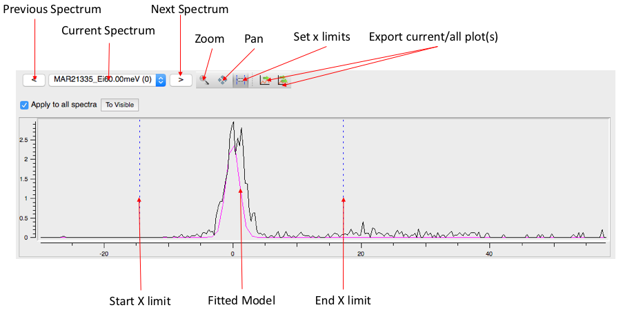

   The spectrum view in the multidataset fitting interface.

.. categories:: Interfaces Fitting
