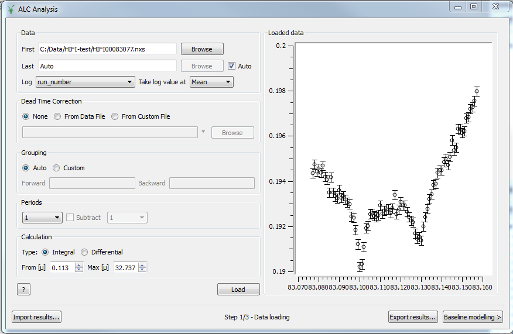
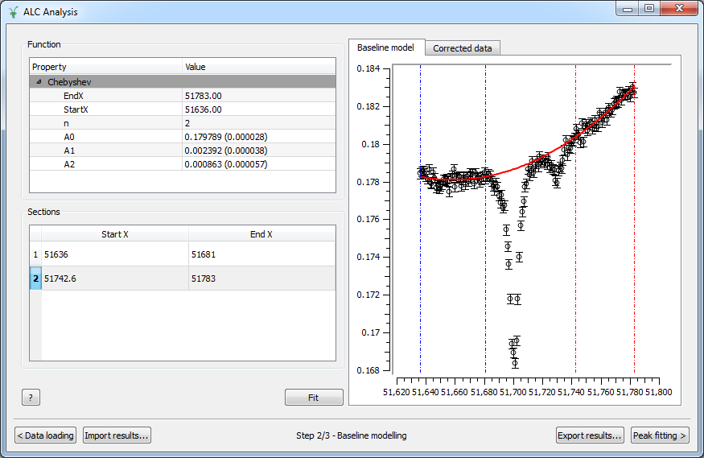
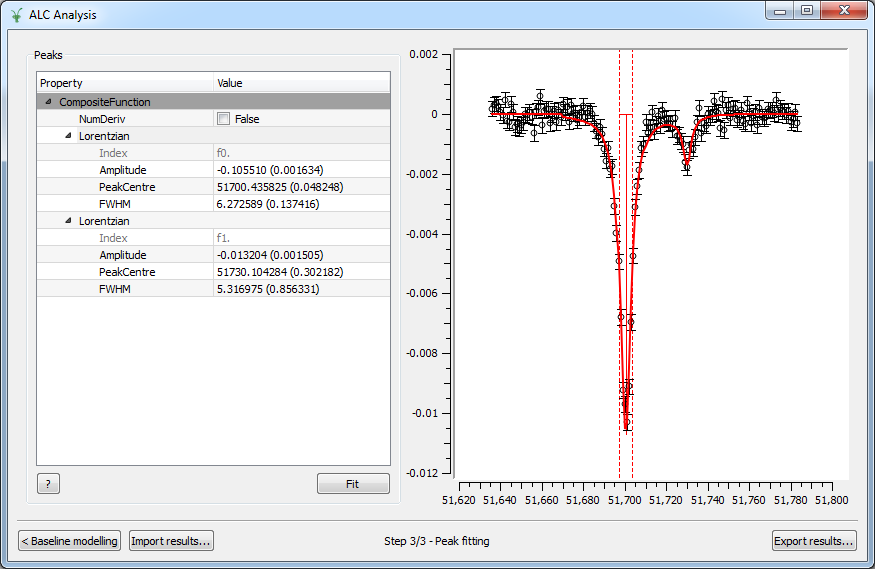

.. _MuonALC-ref:

Muon ALC
========

.. contents:: Table of Contents
  :local:

Overview
--------

The Avoided Level Crossing (ALC) :math:`\mu SR` technique probes the energy levels of a
muoniated radical system, and can be used to elucidate the regiochemistry of
muonium addition, dynamic processes, and reaction kinetics, through measurement
of the muon and proton hyperfine coupling interactions. Examples of how the ALC
technique can be used are presented in this `brochure <http://www.mantidproject.org/images/3/39/Muon_level_crossing_resonance_leaflet.pdf>`__.

Radical systems are formed during muon thermalisation, during which a portion of
the implanted muons are able to capture electrons to form muonium (:math:`\mu+e`). Muonium
adds to centres of unsaturation in a sample (double or triple bonds) to form a
muoniated radical species. The spins of the muon, unpaired electron, and protons
within the sample interact through the isotropic and anisotropic components of
the hyperfine interaction, forming a quantised system, described by a series of
discrete energy levels.

In an ALC experiment the magnetic field is incrementally scanned, recording a
specified number of positron events at each step. At certain fields, the energy
levels in the muon and sample system become nearly degenerate, and are able to
interact through the hyperfine coupling interaction. The spins oscillate between
the two energy states resulting in a dip in the polarisation, observed as a
resonance during the magnetic field scan. The three types of ALC resonance
(referred to as :math:`\Delta 0`, :math:`\Delta 1`, and :math:`\Delta 2` resonances) are characterised by the selection
rule :math:`\Delta M=0, \pm 1, \pm 2`, where :math:`M` is the sum of the mz quantum numbers of the spins
of the muon, electron and proton. Isotropic hyperfine coupling interactions
manifest as :math:`\Delta 0` resonances resulting from muon-nuclear spin flip-flop transitions.
The :math:`\Delta 0` resonance field is dependent on the magnitude of both the muon and proton
hyperfine interaction (:math:`A\mu` and :math:`Ak`, respectively) and can occur in gaseous, liquid,
or solid phase samples. The muon spin flip transition that produces the :math:`\Delta 1`
resonance only arises in the presence of anisotropy. Radical systems possessing
complete anisotropy produce a single broad resonance and systems with axial or
equatorial anisotropy produce an asymmetrical resonance line shape known as a
powder pattern. The :math:`\Delta 2` resonance is also observed in radicals from anisotropic
environments. However, these are rarely observed experimentally due to their
characteristically weak intensity line shapes. The magnitude of the hyperfine
interaction is characteristic of the muon binding site, and can result in an
ALC resonance associated with each of the magnetically equivalent nuclei,
for each muoniated radical isomer.

The magnetic field position, the full width at half height (FWHH), and the
resonance line shape are the important parameters to be extracted from the
ALC spectrum. The field position of a resonance is related to the muon
and/or nuclear hyperfine coupling constant. They often show strong temperature
dependence and can reveal information regarding the structure of the investigated
system. The FWHH of a resonance may indicate any motional dynamics present in the
system, and can also be used to determine muonium addition rates. The anisotropic
environments experienced by radicals in solid samples can produce a variety of
'powder pattern' lineshapes, which are characteristic of the orientation of the
effective hyperfine tensors relative to the magnetic field, and can thus
indicate any reorientational motion present.

In order to extract these parameters accurately from an ALC spectrum it is
necessary to determine a baseline, perform a baseline subtraction and then
fit the peaks. The Muon ALC interface integrates this sequence of
operations hiding the complexity of the underlying algorithms.

Global Options
--------------

Global options are options visible and accessible from any step in the
interface. Currently, there are two buttons that can be used at any point during the analysis.

Export Results
~~~~~~~~~~~~~~

The 'Export results...' button allows the user to export intermediate results at any step. When clicked,
it prompts the user to enter a label for the workspace group that will gather the ALC results. This
label is defaulted to 'ALCResults'. In the DataLoading step, data are exported in a workspace named
<Label>_Loaded_Data, which contains a single spectrum. In the BaselineModelling step, data and model
are exported in a set of three workspaces: a workspace named <Label>_Baseline_Workspace, which contains
three spectra corresponding to the original data, model and corrected data respectively, a TableWorkspace
named <Label>_Baseline_Model with information on the fitting parameters, and a second TableWorkspace
named <Label>_Baseline_Sections containing information on the sections used to fit the baseline. When
exporting results in the PeakFitting steps, two workspaces will be created: a <Label>_Peaks_Workspace,
that contains at least three spectra: the corrected data (i.e., the data after the baseline model
subtraction), fitting function and difference curve. If more than one peak was fitted, individual peaks
will be stored in subsequent spectra. The <Label>_Peaks_FitResults TableWorkspace provides information
about the fitting parameters and errors.

Note that the 'Export results...' button exports as much information as possible, which means that all
the data stored in the interface will be exported when clicked, regardless of the current step. For
example, if the user starts a new analysis and the button is used in the 'DataLoading' step, only the
<Label>_Loaded_Data workspace will be created in the ADS. However, if the user proceeds with the analysis
and clicks 'Export results...' at the 'BaselineModelling' step, the interface will export not only the
<Label>_Baseline_* workspaces but also the <Label>_Loaded_Data workspace. In the same way, if the user
has completed the peak fitting analysis and uses the button in the PeakFitting step, not only the
<Label>_Peaks_* workspaces will be created, but also the <Label>_Baseline_* and the <Label>_Loaded_Data
workspaces. Also, note that if 'Export results...' is used at a specific step but results from a previous
analysis exist in a subsequent stage of the analysis, the latter will be exported as well.

Import Results
~~~~~~~~~~~~~~

The 'Import results...' button allows the user to load previously analysed data, ideally saved using
'Export results...'. When clicked, it prompts the user to enter a label for the workspace group from which
data will be imported, which is defaulted to 'ALCResults'. The interface then searches for a workspace
corresponding to the
interface's step from which it was called. This means that if the user is currently in the
DataLoading step, the interface will search for a workspace named <Label>_Loaded_Data. If
it is used from the BaselineModelling step, the workspace named <Label>_Baseline_Workspace
will be loaded. Finally, if PeakFitting is the current step in the analysis, the workspace
<Label>_Peaks_Workspaces will be imported. Note that using the 'Import results...' button
at a specific step does not produce the loading of data corresponding to previous or subsequent
steps. In addition, data at subsequent steps will not be cleared. For instance, if some data
were analysed in the PeakFitting step and you went back to BaselineModelling to import a new
set of runs, previous peaks would be kept in PeakFitting. Note that at this stage of development
'Import results...' does not load fitting results or fitting sections.

Description
-----------

This section describes the three steps in the analysis: Data Loading, Baseline Modelling and Peak
Fitting.

Data Loading
~~~~~~~~~~~~

In the Data Loading step, a sequence of runs are loaded through the fields **First** and **Last**.
All datasets with run number between these limits will be loaded, and a warning message
will be shown if any of them is missing. Instead of selecting the **Last** dataset manually, the
**Auto** checkbox can be ticked. In this case, the text box and button are disabled and the interface
automatically selects the most recently modified file in the directory. The data will be automatically
updated when new files are added to the directory.

The input files must be Muon Nexus files with names beginning with at least one letter
and followed by a number. In addition, the user must supply the **Log** data that will
be used as X parameter from the list of available log values.
Some additional options may be specified: the **Dead Time Corrections**, if any, can be
loaded from the input dataset itself or from a custom file specified by the user. The
detector **Grouping** is defaulted to **Auto**, in which case the grouping information
is read from the run data, although it can be customized by setting the list of spectra
for the forward and backward groups. The user can also choose the **Period** number
that corresponds to the red period, and the number corresponding to the green period,
if the option **Subtract** is checked, and finally the type of **Calculation** together
with the time limits. A click on the **Load** button results in the calculation of the
asymmetry, displayed on the right panel.

Options
^^^^^^^
First
  The path to the first nexus file in the series.

Last
  The path to the last nexus file in the series.

Log
  The name of the log value which will be used as the X-axis in the output workspace. The list of
  possible logs is automatically populated when the first nexus file is browsed and selected. If
  the run start/end time is chosen, they are plotted in seconds relative to the start time of the
  first run.

Take log value at
  The function to apply to the time series log: Mean/Min/Max/First/Last.

Dead Time Correction
  Type of dead time corrections to apply. Options are *None*, in which case no 
  corrections will be applied, *From Data File*, to load corrections from 
  the input dataset itself, or *From Custom File*, to load corrections from a 
  specified nexus file.

Grouping
  Detector grouping to apply. *Auto* will load the grouping information contained 
  in the run file, while *Custom* allows to specify the list of spectra for both the 
  forward and backward groups.

Periods
  Period number to use as red data. The *Subtract* option, if checked, allows to 
  select the green period number that will be subtracted to the red data.

Calculation
  Type of calculation, *Integral* or *Differential*, together with the time limits.

?
  Shows this help page.

Load
  Computes the asymmetry according to selected options and displays it against the 
  chosen log value.

Loaded Data
  Graph where the asymmetry as a function of the Log value is displayed. These are the
  data passed to the BaselineModelling step.

Baseline Modelling
~~~~~~~~~~~~~~~~~~

In the Baseline Modelling step, the user can fit a baseline by selecting which
sections of the data should be used in the fit, and what the baseline fit 
function should be. To select a baseline function, right-click on the **Function**
region, then **Add function** and choose among the different possibilities. Then
pick the desired fitting sections by right-clicking in the **Sections** area as
many times as sections to use. Sections are also displayed on the **Baseline model**
graph and can be easily modified by clicking and dragging the corresponding
vertical lines.

Options
^^^^^^^

Function
  Right-click on the blank area to add a baseline function.

Sections
  Right-click on the blank area to add as many sections as needed to 
  select the different ranges to fit. Each section is coloured differently and
  can be modified by dragging the vertical lines.

?
  Shows this help page.

Fit
  Fits the data.

Baseline model
  Graph where the original data and the model are displayed, together with
  the fitting ranges.

Corrected data
  Graph where the corrected data, i.e., the original data with the baseline
  subtracted, are displayed. These are the data passed to the PeakFitting
  step.
  
Peak Fitting
~~~~~~~~~~~~

In the Peak Fitting step, the data with the baseline subtracted are shown in 
the right panel. The user can study the peaks of interest all with the same simple 
interface. To add a new peak, right-click on the **Peaks** region, then select
**Add function** and choose among the different possibilities in the category Peak.
Add as many peaks as needed. To activate the peak picker tool, click on one of
the functions in the browser and then left-click on the graph near the peak's
center while holding the Shift key. This will move the picker tool associated
with the highlighted function to the desired location. To set the peak width,
click and drag while holding Crtl. You can then tune the height by clicking on
the appropriate point in the graph while holding Shift. Repeat the same steps
with the rest of the functions in the browser and hit **Fit** to fit the peaks.

Options
^^^^^^^

Peaks
  Right-click on the blank area to add as many peak functions as needed.

?
  Shows this help page.

Fit
  Fits the data.

Peak graph
  Graph where the corrected data and the fitted peaks are displayed.

Run the ALC interface
---------------------

The interface is available from the MantidPlot Interfaces menu: Interfaces -> Muon -> ALC.

Feedback & Comments
-------------------

If you have any questions or comments about this interface or this help page, please
contact the `Mantid team <http://www.mantidproject.org/Contact>`__ or the `Muon group <http://www.isis.stfc.ac.uk/groups/muons/muons3385.html>`__. 

.. categories:: Interfaces Muon
