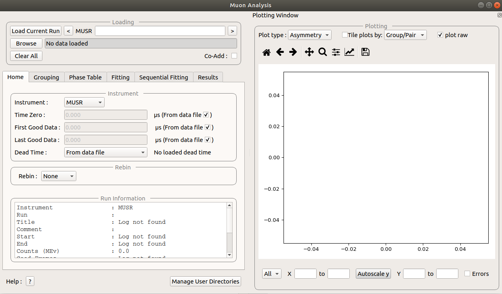

.. _MuonAnalysis_2-ref:

Muon Analysis
=============

.. contents:: Table of Contents
  :local:

Interface Overview
------------------

This interface is used to analyse the time domain data collected on Muon instruments. The interface can be
accessed from the main menu of MantidPlot, in *Interfaces → Muon → Muon Analysis 2*. For sample
datasets, please visit `Muon - Downloads <http://www.isis.stfc.ac.uk/groups/muons/downloads/downloads4612.html>`_.

Loading
-------

The loading section is used to load data as well as to specify what the current runs of interest are.

**Load Current Run** This will load the latest run for the selected instrument. You must be connected to the
 data archive. It also currently only works on windows.

**Run selection box** This takes a comma seperated list of run numbers for the GUI to load. A range 
be specified with a dash. For example ``62260, 62270-3`` will load ``62260, 62270, 62271, 62273``. This specifies
the runs that are used in the rest of the GUI.

**Browse** This opens a dialog window that allows local files to be loaded.

**Clear All** This clears all the data from the current GUI.

**Co-Add** If selected the runs are added together for improved statistics. 

Tabs
----

All these tabs can be dragged away from the interface into their own window.

* :ref:`Home Tab <muon_home_tab-ref>`
* :ref:`Grouping Tab <muon_grouping_tab-ref>`
* :ref:`Phase Table Tab <muon_phase_table_tab-ref>`
* :ref:`Fitting Tab <muon_fitting_tab-ref>`

Feedback & Comments
-------------------

If you have any questions or comments about this interface or this help page, please
contact the `Mantid team <http://www.mantidproject.org/Contact>`__ or the
`Muon group <http://www.isis.stfc.ac.uk/groups/muons/muons3385.html>`__.

.. categories:: Interfaces Muon
