.. _Muon_Analysis-ref:

Muon Analysis
=============

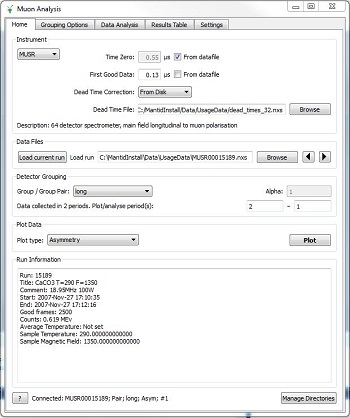

.. contents:: Table of Contents
  :local:

Interface Overview
------------------

This interface is used to analyse the data collected on Muon instruments. The interface can be
accessed from the main menu of MantidPlot, in *Interfaces → Muon → Muon Analysis*. For sample
datasets, please visit `Muon - Downloads <http://www.isis.stfc.ac.uk/groups/muons/downloads/downloads4612.html>`_.

Home
----

.. _Home:

The *Home* tab is the MuonAnalysis entry-point. It allows you to load the data, set some
basic loading and plotting parameters and plot the data.

In most cases, the initial settings should be fine and the grouping loaded from the data
file should be sensible, but these can be easily adjusted using the GroupingOptions_ and Settings_ tabs.

Instrument
^^^^^^^^^^

.. _HomeInstrument:

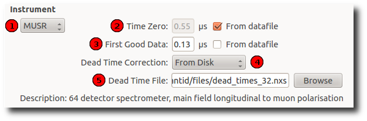

+-------+--------------------------+-----------------------------------------------------------------------------------------+
| **1** | **Instrument**           | Selection of instrument that the experiments were run on.                               |
|       |                          | It is an advantage if an Instrument Definition File (                                   |
|       |                          | `IDF <http://docs.mantidproject.org/nightly/concepts/InstrumentDefinitionFile.html>`_)  |
|       |                          | is available for the instrument selection.                                              |
+-------+--------------------------+-----------------------------------------------------------------------------------------+
| **2** | **Time Zero**            | Time zero value (:math:`\mu s`). Any bins before that time will be discarded.           |
|       |                          | If *From datafile* is checked, the value stored in the loaded Muon data file is used.   |
+-------+--------------------------+-----------------------------------------------------------------------------------------+
| **3** | **First Good Data**      | Time of the first good data (:math:`\mu s`). If *Time Axis* is set appropriately on the |
|       |                          | Settings_ tab then it is used as a                                                      |
|       |                          | start value for the X-axis. If *From datafile* is checked, the value stored in the      |
|       |                          | loaded Muon data file is used.                                                          |
+-------+--------------------------+-----------------------------------------------------------------------------------------+
| **4** | **Dead Time Correction** | The type of :ref:`Dead Time Correction <algm-ApplyDeadTimeCorr>`                        |
|       |                          | to apply to the loaded file. Available choices:                                         |
|       |                          |                                                                                         |
|       |                          | - **None**. Don't apply the correction.                                                 |
|       |                          |                                                                                         |
|       |                          | - **From Data File**. Use Dead Time table stored in the loaded Muon data file.          |
|       |                          |                                                                                         |
|       |                          | - **From Disk**. Specify a custom Nexus file that has a Dead Time table. If this is     |
|       |                          |   selected, a *Dead Time File* text box will be shown so you can specify the file       |
|       |                          |   or browse to its location.                                                            |
|       |                          |                                                                                         |
+-------+--------------------------+-----------------------------------------------------------------------------------------+
| **5** | **Dead Time File**       | If *Dead Time Correction* is set to **From Disk**, you can choose a Nexus file which    |
|       |                          | contains a table with Dead Times, and will be applied to the loaded data file.          |
+-------+--------------------------+-----------------------------------------------------------------------------------------+

Data Files
^^^^^^^^^^

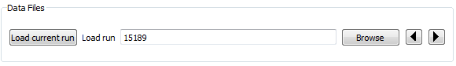

+-------+--------------------------+-----------------------------------------------------------------------------------------+
| **1** | **Load current run**     | Attempt to load current run for the instrument specified (ISIS only)                    |
|       |                          |                                                                                         |
|       |                          |                                                                                         |
|       |                          |                                                                                         |
+-------+--------------------------+-----------------------------------------------------------------------------------------+
| **2** | **Load current run**     | Specify a data file by typing a run number (for the instrument selected from the        |
|       |                          | Instrument drop-down) or use the *Browse* button to select a data file.                 |
|       |                          | Multiple runs/files can be specified here, in which case they will all be summed to form|
|       |                          | a single data set.                                                                      |
|       |                          | Files should be in the NeXus format (PSI bin files can be converted using the program   |
|       |                          | `any2many <https://www.psi.ch/lmu/software-and-data-storage>`_).                        |
|       |                          | Both version 1 and 2 of the muon NeXus data format are supported.                       |
|       |                          |                                                                                         |
+-------+--------------------------+-----------------------------------------------------------------------------------------+
| **3** | **Previous/next run**    | Open next or previous run in the series.                                                |
|       |                          |                                                                                         |
+-------+--------------------------+-----------------------------------------------------------------------------------------+

Detector Grouping
^^^^^^^^^^^^^^^^^

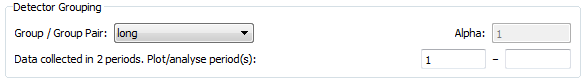

+-------+--------------------------+-----------------------------------------------------------------------------------------+
| **1** | **Group/ Group Pair**    | A group or a pair which will be plotted.                                                |
|       |                          |                                                                                         |
|       |                          |                                                                                         |
|       |                          |                                                                                         |
+-------+--------------------------+-----------------------------------------------------------------------------------------+
| **2** | **Alpha**                | This text box is only visible if a pair is selected. It corresponds to the pair alpha   |
|       |                          | value used for asymmetry calculation. See :ref:`AsymmetryCalc <algm-AsymmetryCalc>` for |
|       |                          | a broader explanation. The value is taken from the *Pair table* on the Grouping Options |
|       |                          | tab for the selected pair and can be modified there only.                               |
+-------+--------------------------+-----------------------------------------------------------------------------------------+
| **3** | **Periods**              | Use the two text boxes to select the combination of periods you would like to plot.     |
|       |                          | Each holds a comma-separated list of periods, and the periods in the list on the right  |
|       |                          | will be subtracted from those on the left. For example, to plot the combination         |
|       |                          | (1+2)-(3+4), enter "1,2" in the left-hand box and "3,4" in the right hand box.          |
|       |                          | For single period data only the first box will be active.                               |
|       |                          |                                                                                         |
+-------+--------------------------+-----------------------------------------------------------------------------------------+

Plot Data
^^^^^^^^^

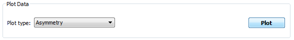

+-------+--------------------------+-----------------------------------------------------------------------------------------+
| **1** | **Plot Type**            | Type of the plot. Available choices are:                                                |
|       |                          |                                                                                         |
|       |                          | - **AsymmetryCalc** For pairs- the result of                                            |
|       |                          |   :ref:`AsymmetryCalc <algm-AsymmetryCalc>` for the pair groups.                        |
|       |                          |   For groups- the result of :ref:`RemoveExpDecay <algm-RemoveExpDecay>` applied         |
|       |                          |   to the group.                                                                         |       
|       |                          |                                                                                         |
|       |                          | - **Counts** *(groups only)*. Pure counts of the selected group.                        |
|       |                          |                                                                                         |
|       |                          | - **Logarithm** *groups only*. Pure counts of the selected group on a                   |
|       |                          |   logarithmic scale.                                                                    |
|       |                          |                                                                                         |
+-------+--------------------------+-----------------------------------------------------------------------------------------+
| **2** | **Plot**                 | Plots the loaded data using the parameters set.                                         |
+-------+--------------------------+-----------------------------------------------------------------------------------------+

Run Information etc.
^^^^^^^^^^^^^^^^^^^^

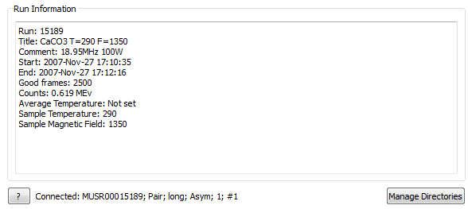

+-------+--------------------------+-----------------------------------------------------------------------------------------+
| **1** | **Run Information**      | Information about the loaded run.                                                       |
|       |                          | See `Run <http://docs.mantidproject.org/nightly/concepts/Run.html#isis-muon-data>`_     |
|       |                          | for the list of parameters which are looked up in the data files.                       |
+-------+--------------------------+-----------------------------------------------------------------------------------------+
| **2** | **Connected plot**       | The name of the workspace produced for the last plot, i.e. "connected" to the interface.|
|       |                          | It will be used for fitting etc.                                                        |
+-------+--------------------------+-----------------------------------------------------------------------------------------+
| **3** | **Manage Directories**   | Opens the `ManageUserDirectories <http://www.mantidproject.org/ManageUserDirectories>`_ |
|       |                          | dialog.                                                                                 |
+-------+--------------------------+-----------------------------------------------------------------------------------------+

Grouping Options
----------------

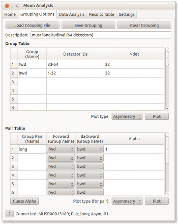

.. _GroupingOptions:

The Grouping Options tab allows you to set up detector grouping, which will be applied to the loaded data.

There are two concepts we use when dealing with detector grouping of Muon instruments:

- **Group**. A group is essentially a list of detectors. When grouping, the counts of all the detectors
  in the list are summed together. This makes the group appear as a single detector, represented by a single
  spectra in the resulting workspace. See :ref:`GroupDetectors <algm-GroupDetectors>` and
  :ref:`MuonGroupDetectors <algm-MuonGroupDetectors>` for more details.

- **Pair**. A pair connects together two groups and has an *alpha* value assigned to it. It is useful
  for quickly specifying the parameters of asymmetry calculations.

Essentially, this tab allows you to create/modify groups and form pairs out of them. There are basic
load/save functions for using predefined instrument groupings and for saving custom ones. Predefined
instrument groupings are usually stored in the *Instrument/Grouping* directory of the Mantid install directory.

This tab also provides some basic plotting functionality, which allows you to experiment with groupings
and plot the results without any additional effort.

Controls and description
^^^^^^^^^^^^^^^^^^^^^^^^

+-------+------------------------+----------------------------------------------------------------------------------------------+
| **1** | **Load Grouping File** | Opens a file browser window. Use it to select a grouping file for loading.                   |
+-------+------------------------+----------------------------------------------------------------------------------------------+
| **2** | **Save Grouping**      | Opens a file browser window. Use it to select a file to save a grouping to.                  |
+-------+------------------------+----------------------------------------------------------------------------------------------+
| **3** | **Clear Grouping**     | Clear group and pair tables.                                                                 |
+-------+------------------------+----------------------------------------------------------------------------------------------+
| **4** | **Description**        | Description of the current grouping. Is loaded/saved together with the grouping information. |
+-------+------------------------+----------------------------------------------------------------------------------------------+

Group table
^^^^^^^^^^^

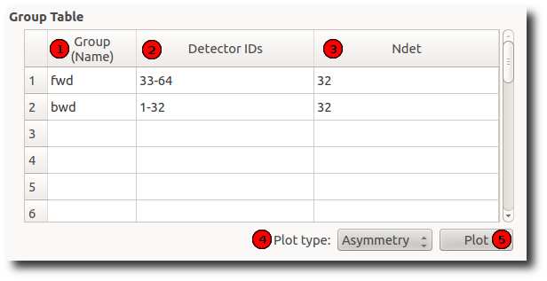

+-------+--------------------------+-----------------------------------------------------------------------------------------+
| **1** | **Group (Name)**         | The name of the group. Should be unique.                                                |
|       | **column**               |                                                                                         |
|       |                          |                                                                                         |
+-------+--------------------------+-----------------------------------------------------------------------------------------+
| **2** | **Detector IDs column**  | A list of detectors associated with the group. One detector might be in multiple groups.|
|       |                          | Ranges are allowed, e.g. "1,2-5,7-9,11" represents detectors                            |
|       |                          | with IDs 1,2,3,4,5,7,8,9 and 11                                                         |
+-------+--------------------------+-----------------------------------------------------------------------------------------+
| **3** | **Ndet column**          | Number of detectors associated with the group. This column is not editable and is       |
|       |                          | updated automatically when the list of group detectors changes.                         |
+-------+--------------------------+-----------------------------------------------------------------------------------------+
| **4** | **Plot type**            | What kind of plot to produce when *Plot* button is pressed. See the Home_ page          |
|       |                          | for an explanation of available plot types.                                             |
|       |                          |                                                                                         |
+-------+--------------------------+-----------------------------------------------------------------------------------------+
| **5** | **Plot**                 | Plots the group highlighted most recently.                                              |
|       |                          |                                                                                         |
+-------+--------------------------+-----------------------------------------------------------------------------------------+

Pair table
^^^^^^^^^^

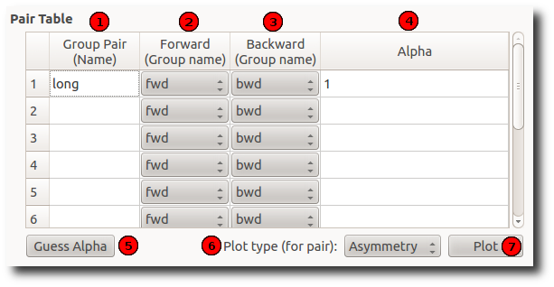

+-------+---------------------------+-----------------------------------------------------------------------------------------+
| **1** | **Group Pair (Name)**     | Name of the pair. Should be unique.                                                     |
|       | **column**                |                                                                                         |
|       |                           |                                                                                         |
+-------+---------------------------+-----------------------------------------------------------------------------------------+
| **2** | **Forward (Group name)**  | The first ("forward") group of the pair.                                                |
|       | **column**                |                                                                                         |
|       |                           |                                                                                         |
+-------+---------------------------+-----------------------------------------------------------------------------------------+
| **3** | **Backward (Group name)** | The second ("backward") group of the pair.                                              |
|       | **column**                |                                                                                         |
+-------+---------------------------+-----------------------------------------------------------------------------------------+
| **4** | **Alpha column**          | Alpha value of the pair.                                                                |
|       |                           |                                                                                         |
|       |                           |                                                                                         |
+-------+---------------------------+-----------------------------------------------------------------------------------------+
| **5** | **Guess alpha**           | Guess a new alpha value for the pair highlighted most recently. Uses AlphaCalc          |
|       |                           | (:ref:`AlphaCalc <algm-AlphaCalc>`) to do that.                                         |
+-------+---------------------------+-----------------------------------------------------------------------------------------+
| **6** | **Plot Type**             | What kind of plot to produce when the *Plot* button is pressed. See the Home_ page      |
|       |                           | for an explanation of available plot types.                                             |
+-------+---------------------------+-----------------------------------------------------------------------------------------+
| **7** | **Plot**                  | Plots the pair highlighted most recently                                                |
|       |                           |                                                                                         |
|       |                           |                                                                                         |
+-------+---------------------------+-----------------------------------------------------------------------------------------+

Data Analysis
-------------

.. _DataAnalysis:

This tab is designed for the user to make a fit against the data just plotted.
Since Mantid 3.8 (upgraded in 3.10), this tab has been enhanced to include fits of multiple datasets at once.
Since Mantid 3.10 a Transverse field (TF) Asymmetry mode has been added. 

Default: multiple fitting disabled
^^^^^^^^^^^^^^^^^^^^^^^^^^^^^^^^^^

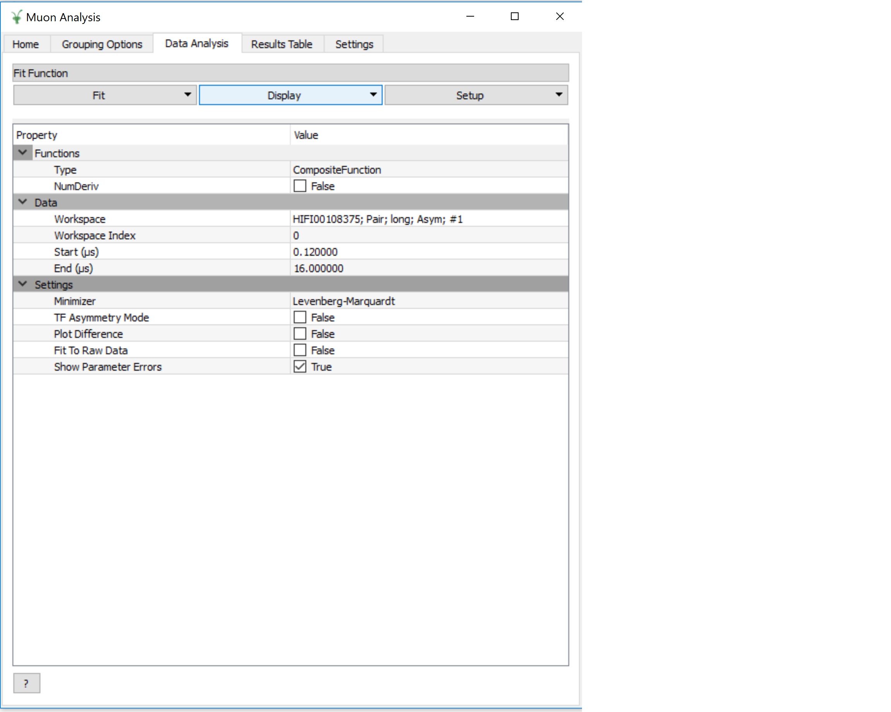

By default, multiple dataset fitting is not enabled and the interface will look just as it did pre-Mantid 3.8.

In this case, the only thing that this tab will contain is a specialised version of the
`Fit Property Browser <http://www.mantidproject.org/MantidPlot:_Data_Analysis_and_Curve_Fitting>`_.
When the tab is open, this fit property browser is used by default within MantidPlot.

Note that, in this mode, simultaneous fits are not possible.
The intention is that this mode could be useful for users who are accustomed to the existing UI, or if a bug is found in the new UI.

TF asymmetry enabled
^^^^^^^^^^^^^^^^^^^^^^^^

The TF asymmetry mode can be enabled by checking the "TF Asymmetry" checkbox on the Settings_ tab.
At present it is not possible to use multiple fitting and TF asymmetry, therefore it is not possible 
to select both checkboxes. Loading transverse field asymmetry data into muon analysis will automatically
enable TF asymmetry mode. 
When this is activated, the data analysis tab has two main differences to the pre 3.8 version. Firstly there 
is an additional row in the Data table (normalization). The second difference is the addition of the "TF
Asymmetry Fit" button in the fitting tab. Selecting this fitting option will call the :ref:`Calculate Muon Asymmetry <algm-CalculateMuonAsymmetry>` algorithm. The user defined function will be the composite function from the interface.

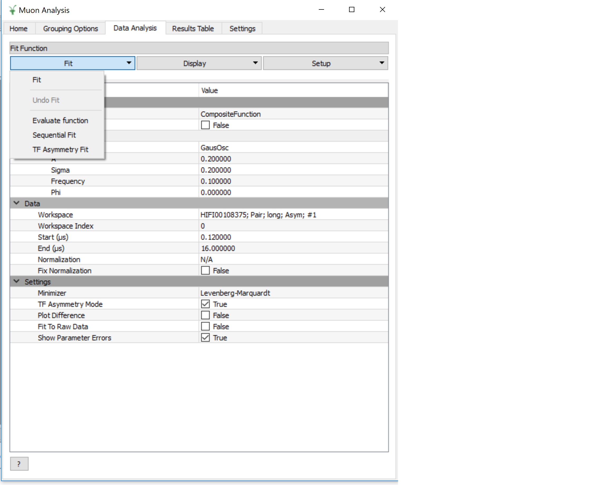

Multiple fitting enabled
^^^^^^^^^^^^^^^^^^^^^^^^

The multiple fitting functionality can be enabled by checking the "Enable multiple fitting" checkbox on the Settings_ tab.
When this is activated, the tab is divided into multiple sections vertically.

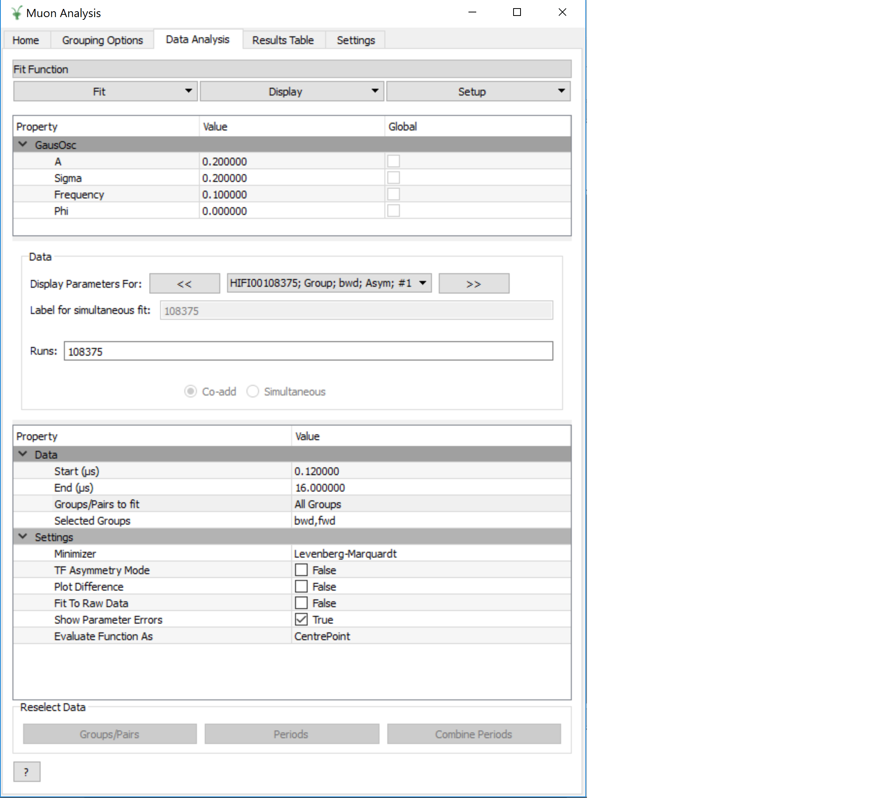

Fit Function
^^^^^^^^^^^^
The uppermost of the three vertical sections is the *Fit Function* section, which is a
FunctionBrowser just like in the *General/Multi dataset fitting* interface (and numerous other places in Mantid).
Functions can be added by right-clicking. If more space is needed, this section can be expanded by dragging its lower edge downwards.

The function browser has three columns - property, value and global.
The values shown are those of the currently selected/plotted dataset.
The global column contains a checkbox for each function parameter which, when checked, sets this parameter to be shared between all fits.

Parameters can be fixed, tied and constrained by right-clicking. 
In addition, just as in the general multi dataset fitting interface, when highlighting a non-global function parameter, a small button will appear next to its value.
This button will open the "Edit local parameter values" dialog, which offers greater control of function parameters for each dataset.

Data
^^^^
The next section of the tab is the data selector, which controls the dataset(s) that will be fitted.
By default, this will be a single dataset, the same as the data loaded on the Home_ tab.
The dataset(s) can be changed here and, if more than one is selected, they will all be fitted simultaneously.

The "Display Parameters For" boxes consist of a backwards button, a drop-down selection and a forward button. The drop-down list shows all datasets currently selected,
and the left and right buttons cycle through them. The currently selected dataset has its parameters shown in the *Fit Function* (upper) widget, and will be plotted.

For a multi-dataset fit, the "Label" box is enabled.
This allows the user to input a label for the simultaneous fit.

Runs
""""
A single run, or range (*e.g. 15189-91, 15193*) can be typed into the box here.
The radio buttons below control whether the runs should be co-added together or fitted separately in a simultaneous fit.

Data Table
^^^^^^^^^^

The data table allows the user to modify the selected data for the fitting. This includes the start and end times, which can also
be updated by dragging the blue dashed lines in the plot. The "Groups/Pairs to fit" box provides a drop-down menu with three options (all groups, all pairs and custom). 
Selecting custom will produce a pop-up box with tick boxes for each of the available groups and pairs. If a user wants to update the custom selection the 
Groups/Pairs button can be pressed from the ReselectData_ section at the bottom ofthe tab (this is only enabled if a custom selection is set). Underneath displays the
"Selected Groups". 

The next row is the "Periods to fit" option, which is only displayed for multiple period data. This will automatically be populated with
each of the periods (e.g. 1,2,3) and a custom option. Selecting custom will produce a pop-up with checkboxes for all of the periods. Selecting custom will also enable the 
"Periods" button in the ReselectData_ section
and pressing this button will allow the user to alter their custom selection. 

Examples/Use cases
""""""""""""""""""
1. Individual fit:

   - One run selected in the box, or a range with the "Co-add" option set.
   - One group selected
   - (One period selected, if multi-period)
   - In this case the "global" option is meaningless as only one dataset will be fitted.
   - Example: MUSR15189, group *long*, period 1

2. Simultaneous fit across runs:

   - Range or selection of runs in box, with "Simultaneous" option set.
   - One group selected
   - (One period selected)
   - Example: MUSR{15189, 15190, 15191}, group *long*, period 1

3. Simultaneous fit across groups or periods:

   - One run selected in the box, or a range with the "Co-add" option set.
   - Multiple groups or periods selected
   - Example: MUSR15189, groups {*fwd*, *bwd*}, period 1

4. Sequential fit of simultaneous fits:

   - One run only selected in the box.
   - Multiple groups or periods selected
   - Under "Fit", click "Sequential fit" and type a range of runs in the dialog. (See SequentialFitting_ below)
     For each run in turn, a simultaneous fit of the selected groups/periods will be performed.

5. Multiple options

   - It is, of course, possible to select several runs, groups, periods all at once and a simultaneous fit will be performed across all the selected datasets.
   - Example: MUSR{15189, 15190, 15191}, groups {*fwd*, *bwd*}, periods {1, 2}: 12 datasets in all.

Additional Options
^^^^^^^^^^^^^^^^^^
Near the bottom of the tab contains selected fit options that can be adjusted, just as elsewhere in Mantid.
The only option specific to the Muon Analysis interface is *Fit To Raw Data*.
When this option is set to *True*, the fitting process is done using the raw (unbinned) data, even if the DataBinning_ is set.

Reselect data
^^^^^^^^^^^^^

.. _ReselectData:

At the bottom of the tab is the "Reselect Data" section. This includes three buttons "Groups/Pairs", "Periods" and "Combine Periods". The "Groups/Pairs" and "Periods" 
buttons are only when the relevant options in the data table are set to custom. Pressing the button will produce a pop-up that will allow the user to modify their selection. 

The "Combine Periods" button is only enabled if multiple periods are available. Pressing the button will generate a pop-up with two boxes. The top one is for adding periods 
(as a comma seperated list or with "+") and the bottom box is for subtraction (as a comma sepearted list). Everything in the top and bottom boxes are summed seperatley 
and the results are then used in the subtraction. 

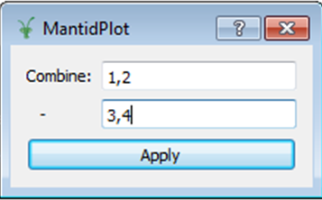

Sequential fitting
^^^^^^^^^^^^^^^^^^

.. _SequentialFitting:

In MantidPlot 3.1 a specialized sequential fitting dialog for MuonAnalysis was introduced.
It allows users to fit various data sets to the chosen fit model, applying all of the interface settings.

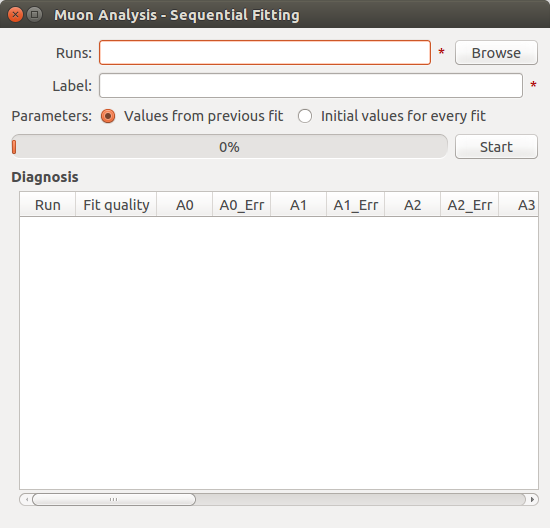

The dialog can be opened from the Fit menu in *Fit* → *Sequential Fit*.

+-------+-----------------------+---------------------------------------------------------------------------+
| **1** | **Runs**              | A list of run data files to fit. Two types of input are accepted:         |
|       |                       |                                                                           | 
|       |                       | - List of files on the disk separated by comma. These can be specified    |
|       |                       |   using the *Browse* button.                                              |
|       |                       |                                                                           | 
|       |                       | - Run numbers separated by comma. Specific files will then be searched    |
|       |                       |   in the archive for the instrument selected on the interface. Ranges     |
|       |                       |   are allowed, e.g. "15189-15199".                                        |
|       |                       |                                                                           | 
+-------+-----------------------+---------------------------------------------------------------------------+
| **2** | **Label**             | Text label to use for the sequential fit. It is used to find the results  |
|       |                       | on the ResultsTable_  tab. The resulting workspace group and the          |
|       |                       | fit-result workspaces will have the label in their names.                 |
+-------+-----------------------+---------------------------------------------------------------------------+
| **3** | **Parameters**        | This option specifies the initial fit parameters for every fit. Choices   |
|       |                       | should be self-explanatory.                                               |
+-------+-----------------------+---------------------------------------------------------------------------+
| **4** | **Progress**          | Shows the progress of the fit.                                            |
+-------+-----------------------+---------------------------------------------------------------------------+
| **5** | **Start/stop button** | Starts a new fit or stops the current one.                                |
+-------+-----------------------+---------------------------------------------------------------------------+
| **6** | **Diagnosis table**   | Displays the intermediate results of the fit. This includes run number,   |
|       |                       | fit quality (see OutputChi2overDoF in :ref:`Fit <algm-Fit>`) and fitted   |
|       |                       | values of all the parameters.                                             |
+-------+-----------------------+---------------------------------------------------------------------------+

After the options have been set and the *Start* button has been pressed, the dialog goes through **every** 
data file and does the following:

1. Loads the file

2. Applies all of the settings as set on the interface, e.g. dead time correction, grouping, binning.

3. Runs the :ref:`Fit <algm-Fit>` algorithm using the fit model specified in the *Fit Property Browser* on this tab.

4. Puts the fit-result workspaces inside the MuonSeqFit_%LABEL% group.

After that's done, you can retrieve the results in two ways:

- Go to the ResultsTable_ tab and export fitted parameters as a table.

- Use the workspaces in the MuonSeqFit_%LABEL% group to plot the fitted curves.

Results Table
-------------

.. _ResultsTable:

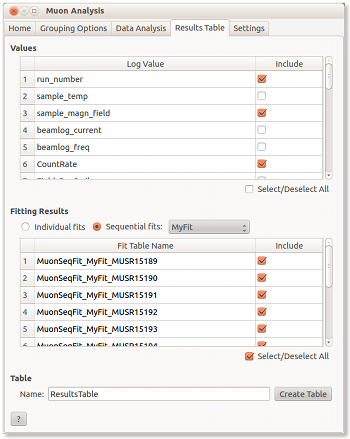

This tab allows users to export the fitting results alongside log values as a table.

Values
^^^^^^

The table contains a list of log values present in **all** of the workspaces in the
*Fitting results* table. The ones selected will be included in the results table.

In the case of start and end times (*run_start* and *run_end*), the option is given
to write these either as text or number. The text option gives an ISO- formatted string
(eg. 2016-07-06T10:10:34) and the numeric option gives the time as a number of seconds.
Zero seconds is taken as the start time of the first run in the selected set.

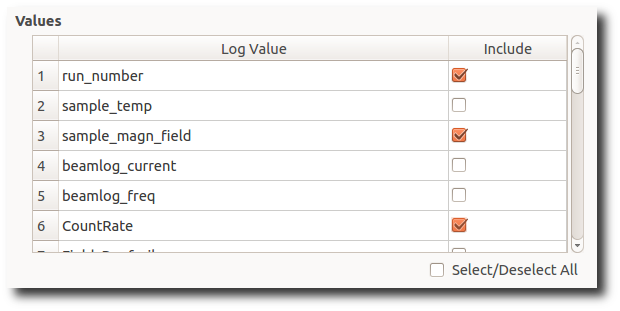

Fitting Results
^^^^^^^^^^^^^^^

This table contains a list of fitted workspaces. You can choose whether you want to see
individual fits only, or a specific sequential (see SequentialFitting_ ) or simultaneous (see DataAnalysis_) fit label.

Fitted parameters of the selected workspaces will be added to the results table.

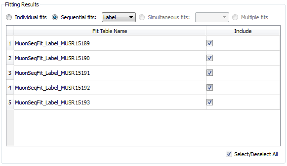

Workspaces might be coloured differently. Workspaces of different colours have
different fitting models and therefore couldn't be included in the same Results table.
(If looking at simultaneous fits, different colours could also indicate that the fits had different numbers of datasets).

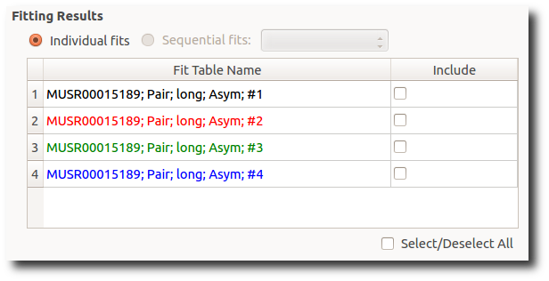

As well as selecting workspaces, the fourth radio button - "Multiple" - can be used to create a table of multiple simultaneous fits, one row per label.
In such a table, each global parameter gets one column and local parameters get one column per dataset.

Table
^^^^^

This allows you to specify the name of the resulting table and create it using the log
values and workspaces you've selected.

Settings
--------

.. _Settings:

This tab allows users to specify various plotting style options, loaded data binning and other general options.

Data Plot Style
^^^^^^^^^^^^^^^

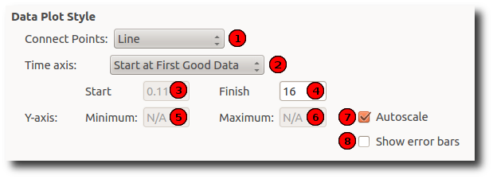

These options control the style of the plot. They will be applied to all new plots.
The currently connected plot (if any) is updated as well.

+-------+---------------------+-------------------------------------------------------------------+
| **1** | Connect Points      | Option for how the points will be represented on the plot:        |
|       |                     |                                                                   |
|       |                     | - **Scatter**. Data points only.                                  |
|       |                     |                                                                   |
|       |                     | - **Line + symbol**. Data points connected by a line.             |
|       |                     |                                                                   |
|       |                     | - **Line**. A line without data points.                           |
|       |                     |                                                                   |
+-------+---------------------+-------------------------------------------------------------------+
| **2** | Time axis           | Type of the start value of the X-axis:                            |
|       |                     |                                                                   |
|       |                     | - **Start at First Good Data**. Uses the First Good Data value    |
|       |                     |   from the Home_ tab.                                             |
|       |                     |                                                                   |
|       |                     | - **Start at Time Zero**. Uses 0. Worth noting that workspaces    |
|       |                     |   will be cropped according to the *Time Zero* value on the Home  |
|       |                     |   (HomeInstrument_) tab, which means that X-value of 0 will       |
|       |                     |   essentially be equal to the *Time Zero* value.                  |
|       |                     |                                                                   |
|       |                     | - **Custom Value**. Uses the specified value.                     |
|       |                     |                                                                   |
+-------+---------------------+-------------------------------------------------------------------+
| **3** | Start               | First value of the X-axis (:math:`\mu s`).                        |
+-------+---------------------+-------------------------------------------------------------------+
| **4** | Finish              | Last value of the X-axis (:math:`\mu s`). If empty, the last      |
|       |                     | available value is used.                                          |
+-------+---------------------+-------------------------------------------------------------------+
| **5** | Minimum             | Minimum value on the Y-axis. If empty, is determined              |
|       |                     | automatically.                                                    |
+-------+---------------------+-------------------------------------------------------------------+
| **6** | Maximum             | Maximum value on the Y-axis. If empty, is determined              |
|       |                     | automatically.                                                    |
+-------+---------------------+-------------------------------------------------------------------+
| **7** | Autoscale           | If checked, the values of *Minimum* and *Maximum* are             |
|       |                     | determined automatically based on the max/min values of the data. |
+-------+---------------------+-------------------------------------------------------------------+
| **8** | Show error bars     | If checked, the curves will have error bars attached to them.     |
+-------+---------------------+-------------------------------------------------------------------+

Data Binning
^^^^^^^^^^^^

.. _DataBinning:

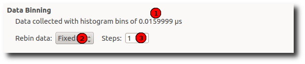

+-------+------------------------+---------------------------------------------------------------+
| **1** | **Bin size**           | Display the size of the bin in the currently loaded data. This|
|       |                        | is usually 0.016 :math:`\mu s` for Muon instruments.          |
+-------+------------------------+---------------------------------------------------------------+
| **2** | **Binning type**       | What type of binning is applied to the loaded data:           |
|       |                        |                                                               |
|       |                        | - **None**. No binning is applied - raw data.                 |
|       |                        |                                                               |
|       |                        | - **Fixed**. Binning with fixed steps.                        |
|       |                        |                                                               |
|       |                        | - **Variable**. Binning with varying steps.                   |
|       |                        |                                                               |
+-------+------------------------+---------------------------------------------------------------+
| **3** | **Binning parameters** | - For fixed binning: number of bins in a single step. For     |
|       |                        |   example, if data is collected in bins of size 0.016 and we  |
|       |                        |   specify 5 here, then the data will be re-binned using a bin |
|       |                        |   size of 0.08.                                               |
|       |                        |                                                               |
|       |                        | - For variable binning: see the *Params* property of          |
|       |                        |   :ref:`Rebin <algm-Rebin>`. Note                             |
|       |                        |   :ref:`Rebin <algm-Rebin>` is executed with                  |
|       |                        |   *FullBinsOnly=True*.                                        |
|       |                        |                                                               |
+-------+------------------------+---------------------------------------------------------------+

General
^^^^^^^

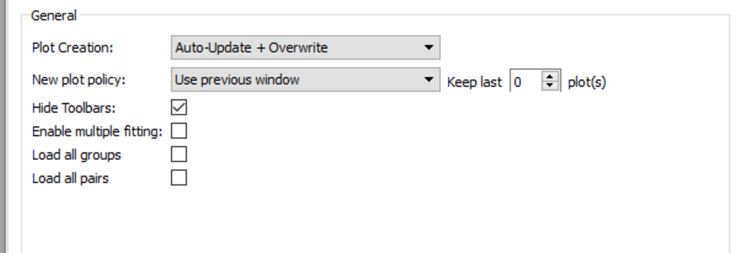

+-------+-----------------------------+---------------------------------------------------------------------+
| **1** | **Plot Creation**           | - **Auto-Update**. When settings are changed on the interface,      |
|       |                             |   the new plot is created automatically.                            |
|       |                             |                                                                     |
|       |                             | - **Overwrite**. When plotting, if the plot of the same type        |
|       |                             |   exists already, it is overwritten instead of creating a new       |
|       |                             |   one.                                                              |
|       |                             |                                                                     |
|       |                             | - **Auto-Update + Overwrite**. Both above settings at the same time |
|       |                             |                                                                     |
|       |                             | - **None**. None of the settings                                    |
|       |                             |                                                                     |
+-------+-----------------------------+---------------------------------------------------------------------+
| **2** | **New plot policy**         | - **Use previous window**. Each new plot will be drawn in the       |
|       |                             |   same window. By default, the previous fit curve will remain       |
|       |                             |   on the graph when the run is changed - the number of curves       |
|       |                             |   to keep can be adjusted here (set to 0 to always clear            |
|       |                             |   previous fits). The "clear fit curves" option on the Data         |
|       |                             |   Analysis tab will clear any fit curves present.                   |
|       |                             |                                                                     |
|       |                             | - **Create new window**. When plotting a new run, it is             |
|       |                             |   plotted in a new window each time.                                |
|       |                             |                                                                     |
|       |                             |   NOTE: This can can cause speed and stability problems once the    |
|       |                             |   number of graphs managed by Mantidplot passes a few hundred       |
|       |                             |   which can hapen if you run Mantid for a few days on an            |
|       |                             |   experiment. For long term stability we suggest you select         |
|       |                             |   **Use previous window**.                                          |
|       |                             |                                                                     |
+-------+-----------------------------+---------------------------------------------------------------------+
| **3** | **Hide Toolbars**           | If enabled, opening the interface up hides the MantidPlot           |
|       |                             | toolbars. This is useful on smaller screens.                        |
+-------+-----------------------------+---------------------------------------------------------------------+
| **4** | **Enable multiple fitting** | By default, this option is disabled and the DataAnalysis_ tab will  |
|       |                             | look the same as it did in previous versions of Mantid (pre-3.8).   |
|       |                             | Note that simultaneous fits are not possible in this case.          |
|       |                             |                                                                     |
|       |                             | Enabling the option will change the UI of the DataAnalysis_ tab to  |
|       |                             | the new one described above, enabling fits of multiple datasets to  |
|       |                             | be made.                                                            |
+-------+-----------------------------+---------------------------------------------------------------------+

Feedback & Comments
-------------------

If you have any questions or comments about this interface or this help page, please
contact the `Mantid team <http://www.mantidproject.org/Contact>`__ or the
`Muon group <http://www.isis.stfc.ac.uk/groups/muons/muons3385.html>`__. 

.. categories:: Interfaces Muon
