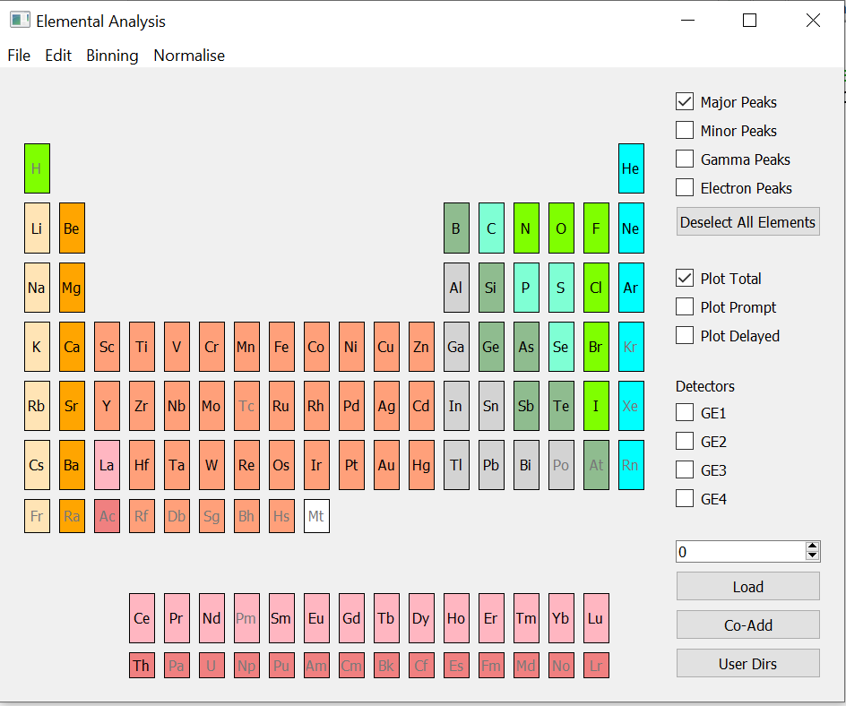
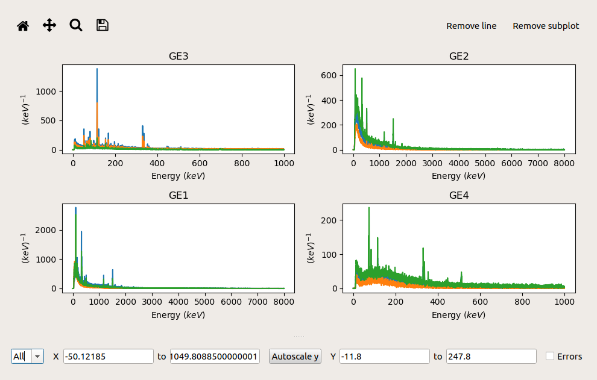

.. _Muon_Elemental_Analysis-ref:

Muon Elemental Analysis
=======================

.. contents:: Table of Contents
  :local:

Interface overview
------------------
The interface is used to compare data from the Muon detector with the emission spectra of given elements. The interface
can be accessed from the main menu in MantidPlot and workbench: *Interfaces → Muon → Elemental Analysis*.

Loading
-------
Enter a run number (e.g. 6295) and press *Load*. If the number entered does not correspond to any available run,
the program will not load any file, nor return an error.

Plotting
--------
Tick the boxes corresponding to the detector you want to display. For each detector, a separate plot should appear in
the same window. Each plot contains 3 lines: *Prompt*, *Delayed* and *Total*.

To remove one or more lines on the top right corner of the plot press *Remove line*, a table should appear. Select the
lines you want to remove and press *OK*.
Similarly, to remove one plot press *Remove plot*, select the plot you wish to remove and press *OK*.

Displaying peaks
----------------
Elements whose name appears in grey lack any peak data and thus cannot be plotted.
To observe the peaks of any other, click on its label which should turn yellow.
Now plot data from one of the detectors and select all the peaks you would like to examine: main, secondary,
gamma and electronic. Lines should appear for each of the peaks.
Lines corresponding to different elements should appear in different colours.

To remove lines from a specific element, click on its label on the periodic table which will return to the original
colour.

Changing peak data file
#######################
If you wish to load a custom data file for the peaks you can do so from *Edit → Change Peak Data File*. This will open
a window where you can navigate to the position of the datafile you want to load.
This has to be a .json file formatted as:

.. code-block:: json

    {
      "Ag": {
        "Z": 47,
        "A": 107.87,
        "Primary": {
          "K(4->1)": 3177.7,
          "L(4->2)": 900.7,
          "M(4->3)": 304.7,
          "6->5": 141
          ...
        },
        "Secondary": {
          "K(2->1)": 3140.6,
          "L(8->2)": 1347.8,
          "M(10->3)": 567,
          "8->6": 122.2
          ...
        },
        "Gamma": {
          ...
        }
      }
      ...
    }

If some peaks are plotted, but the new file lacks data for them, the corresponding lines will disappear.
The lines corresponding to peaks of elements present in the new file will remain plotted.

.. categories:: Interfaces Muon