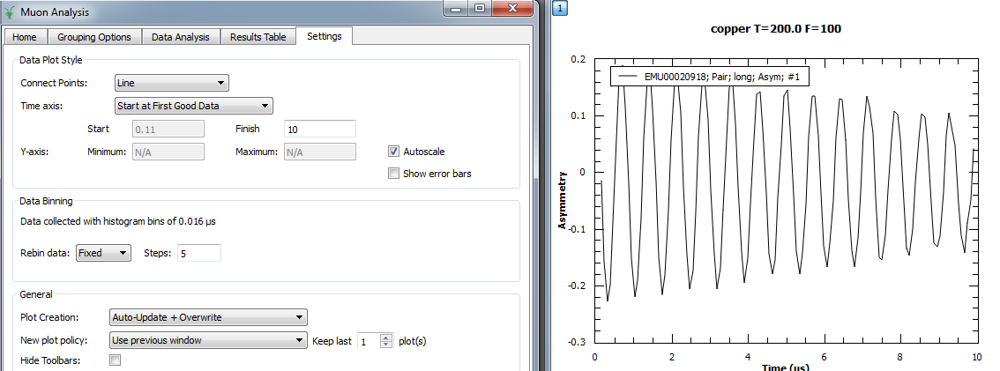

.. _Muon_Analysis_TestGuide_1_General-ref:

Muon Analysis Unscripted Testing: Group 1 (General)
===================================================

.. contents:: Table of Contents
    :local:

Introduction
^^^^^^^^^^^^

These are unscripted tests for the :program:`Muon Analysis` interface.
The tests here in group 1 are concerned with general data loading and processing, as well as with switching between the old and new fitting interfaces and fitting raw or binned data.
The master testing guide is located at :ref:`Muon_Analysis_TestGuide-ref`.

Tests
^^^^^

Test 1: Load current run
------------------------

.. note:: This test will only work if you are using Windows and are connected to the ISIS network. If this is not the case, go to test 2.

- On the *Home* tab, in the *Instrument* section, select each ISIS muon instrument in turn.
- For each instrument, click the *Load current run* button in the *Data Files* section.
- A datafile should be successfully loaded, and a plot produced, for every instrument except MUT.
- For MUT, a dialog should explain that current run loading is not supported for that instrument.
- When the current run is loaded, check that the left and right arrow buttons on the interface cycle through recent runs.

Test 2: Data loading and rebinning
----------------------------------

- On the *Home* tab, in the *Instrument* section, set the instrument to EMU.
- Type *20918* in the runs box and hit Enter.
- After data is loaded, the *Grouping Options* and *Data Analysis* tabs should be enabled.
- The data should look like this:

(settings used on *Settings* tab are: finish 10 us, autoscale on, line plot, no rebinning).

- Go to *Settings* tab and, under "Rebin data", select "Fixed" with steps of 5. Should now look like this:

Test 3: Old style data analysis GUI
-----------------------------------

- Still on the *Settings* tab from test 2, leave rebinning on and make sure that "Enable multiple fitting" is turned **off**. (It should be off by default).
- Go to the *Data Analysis* tab. The interface should contain a fit property browser.
- Set up an ``Abragam`` function with ``Omega=8.5``, ``Tau=0.5`` and fit the data. The fit should be done to the rebinned data.

Test 4: Fit to raw data
-----------------------

- Now tick the ``Fit to raw data`` box in the bottom section and fit again. This time it will fit to the raw data, but the rebinned data will still be shown in the plot.

Test 5: New style data analysis GUI
-----------------------------------

- On the *Settings* tab, turn "Enable multiple fitting" **on**.
- Go back to *Data Analysis*. The new UI should be there, and the fit function should have been cleared (so the Fit option is disabled until a new function is set up).
- Set up the Abragam function as in test 3 and fit.
- Try this with and without "Fit to raw data" as in test 4.

Teardown
--------

Before moving to group 2, clear any existing fit curves, then go to the *Settings* tab and set rebinning back to "None". Leave the "Enable multiple fitting" option turned on.
