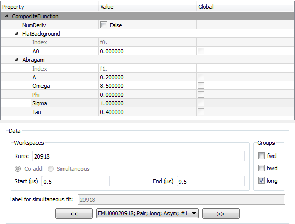
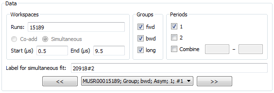

.. _Muon_Analysis_TestGuide_2_Fitting-ref:

Muon Analysis Unscripted Testing: Group 2 (Fitting)
===================================================

.. contents:: Table of Contents
    :local:
    
Introduction
^^^^^^^^^^^^

These are unscripted tests for the :program:`Muon Analysis` interface.
The tests here in group 2 are concerned with the different types of fits possible through the *Data Analysis* tab.
In each test, the fit should succeed without a crash - the results will be tested later, in test group 3.

The master testing guide is located at :ref:`Muon_Analysis_TestGuide-ref`.

Tests
^^^^^

Test 1: individual fit
----------------------
- On the *Home* tab, select instrument EMU and load ``EMU00020918.nxs``.
- Go to *Data Analysis* tab. Expand the window if the function browser is too small (you can drag the bar underneath it to set relative sizes of the widgets).
- The loaded dataset should be pre-selected: "20918" in Runs and "long" ticked as the group.
- "Label" box and "Co-add/Simultaneous" radio buttons should be disabled
- Click and drag blue lines on graph, check start/end times are updated.
- Check the reverse - change start/end times and blue lines should be updated on graph.
- Set up the interface to look like this. Note the non-default values for ``f1.Omega`` and ``f1.Sigma``:

- Fit the data. Graph should be updated.

Test 2: sequential fit
----------------------
- With everything set up as in the picture above, click *Fit/Sequential fit*. (Runs should still be set to "20918", a single run).
- Dialog should appear. In the runs box **of the new dialog that appears**, type "20918-20" and hit Start
- Sequential fit of runs 20918, 20919, 20920 should happen one after the other

Test 3: co-added fit
--------------------
- Close the sequential dialog and return to the main interface.
- Now in the "Runs" box of MuonAnalysis's *Data Analysis* tab, type "20918-20" and hit return.
- Stale errors should be cleared from the function browser.
- "Co-add/Simultaneous" radio buttons should be enabled with "Co-add" selected
- "Label" box should still be disabled
- In the drop-down, there should only be one workspace (``EMU00020918-20; Pair; long; Asym; #1``)
- Fit as before. Graph should be updated.

Test 4: simultaneous fit across runs
------------------------------------
- With the same runs (20918-20) selected, select the "Simultaneous" radio button option.
- Drop-down list should have three workspaces in it now, for the three runs that will be fitted.
- The "Label" box should be enabled. By default, this will contain the run number string ("20918-20") - leave as is.
- Keep the same fit function, but use the "Global" checkboxes to mark ``A``, ``Omega``, ``Phi`` and ``Sigma`` as global.
- Fit the data. Note that plot will *not* be updated at present.
  (If you want to plot results, see the ``MuonSimulFit_20918-20`` workspace group)
- Use the ``<<`` and ``>>`` buttons, or drop-down list, to see the fitted parameters for each run in the function browser.

Test 5: simultaneous fit across groups
--------------------------------------
- Type "20918" only in the "Runs" box
- The "Label" box should now read "20918"
- Select both "fwd" and "bwd" as groups, deselect "long"
- Keep fit function and global parameters as before
- Fit data. 
- Now try to fit again, without changing anything. It should warn you that the label "20918" has already been used - say no to overwriting and it should automatically increment the label to "20918#2".

Test 6: sequential fit of simultaneous fits
-------------------------------------------
- Keep the same setup as Test 5, i.e. Runs="20918", "fwd" and "bwd" selected as groups
- Click *Fit/Sequential fit* to launch the dialog
- If offered the choice, choose not to overwrite the label
- Dialog should appear. In this new dialog (not the interface underneath):

  - Runs = "20918-20"
  - Label = "LabelSeq"
  - Hit "Start"

- This should fit the ``fwd`` and ``bwd`` groups simultaneously for each run 20918, 20919, 20920 in sequence.

Test 7: simultaneous fit across periods
---------------------------------------
The data used so far is single period, so here we will use MUSR data from the unit test data.

- Go back to the *Home* tab, set instrument to MUSR
- Load run 15189 and switch to *Data Analysis* tab
- (If any fit curves are still displayed, clear them with :menuselection:`Display --> Clear fit curves`)
- An extra box should have appeared because this is multi-period data. Like this:

- Note two points:

  - The previously selected groups "fwd" and "bwd" are still selected, as well as "long" - because "long" was loaded on the *Home* tab.
  - In the *label* box, the previous label "20918#2" has **not** been updated. This is because it contains a non-numeric character, so is assumed to be a user-set label (this is the intended behaviour).

- Set selected group to "long" only (not "fwd" or "bwd")
- Set label to "MUSRlabel"
- Check the boxes for periods 1 and 2. So now the box should look like this:

.. image:: ../../images/MuonAnalysisTests/multiperiod.png
  :align: center

- Set fit function to ``LinearBackground`` (clear any existing function)
- Fit - periods will be fitted simultaneously

