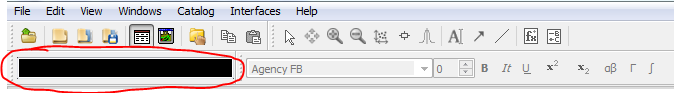

.. _Muon_Analysis_DevelopersGuide-ref:

Muon Analysis: a guide for Mantid developers 
============================================

.. contents:: Table of Contents
    :local:
    
Introduction
^^^^^^^^^^^^
This document is intended for Mantid developers as a guide to the architecture of the Muon Analysis custom interface.
User documentation for this interface can be found at :ref:`Muon_Analysis-ref`.
There is also an unscripted testing guide for developers at :ref:`Muon_Analysis_TestGuide-ref`.

There will be a particular focus on the *Data Analysis* tab, which has been significantly changed for Mantid 3.8.

Note that there is also another custom interface for muons: ALC. Development on this is much easier as it has an MVP architecture and is far better tested, so it will not be covered in this document.

What the interface is for
^^^^^^^^^^^^^^^^^^^^^^^^^

Muon Analysis is for reducing and analysing data from muon instruments at ISIS and SMuS.
Muons are implanted into the sample and decay with a lifetime of about 2.2 microseconds.
The decay products (positrons) are detected and the signal measured is the count of positrons over time.

The instruments have many detectors (sometimes up to 600) in different positions, grouped spatially into "groups".
In a typical muon spin resonance experiment, the muon spins precess in a magnetic field, meaning that the positron count seen on a particular detector will be modulated with time. This gives information about the local fields in the sample at the location where the muon is implanted.

Data is loaded into the interface, corrected for dead time, and the detectors grouped into groups.
For example, MuSR (64 detectors) uses two groups, *fwd* (forward, detectors 33-64) and *bwd* (backward, detectors 1-32) in its longitudinal field configuration, corresponding to the two detector rings.
(MuSR is special in that the main field direction can be rotated either longitudinal or transverse). 
In this case scientists will usually look at a "group pair" called *long*, defined as *fwd - bwd*.

The grouping used is taken from the IDF by default, or from the data file if not present.
The user can also specify their own grouping.

The counts or log counts can be plotted, but what scientists usually want to look at is the **asymmetry** (see below).

Processing is done using the workflow algorithm :ref:`algm-MuonProcess` - see there for a fuller explanation and diagram of the steps performed.

The "Data Analysis" tab is then used to fit a function to the data, and tables of the results from such fits can be generated with the "Results Table" tab.

For a full explanation of what the interface does and how to use it, please see the user docs.
Other useful documents are the "Mantid 4 Muons" document and the training school workbook, both of which can be found on the `Muon page <http://www.mantidproject.org/Muon>`_.

Groups and Periods
##################

Groups are explained above, as sets of detectors corresponding to physical arrangements.
For example, the MuSR instrument has two rings of detectors, leading to two detector groups in the longitudinal field arrangement.

*Periods* refers to collecting data in several periods of time - for example you might have two periods "RF on" and "RF off" or "laser on" and "laser off". 
The interface allows users to analyse one period at a time, or a sum/difference (such as "1+2", "1-2" or even "1+2-3+4").

.. warning:: Note that for summed periods (1+2), you sum the periods 1 and 2 first, then calculate the asymmetry of the sum. For subtracted periods (1-2), you calculate the asymmetry of each period separately, then subtract the asymmetry of period 2 from that of period 1. So for 1+2-3+4, you sum 1+2 and 3+4, calculate asymmetry of each sum, then subtract the asymmetry of (3+4) from that of (1+2).

.. note:: We don't support names of periods yet, they are referred to by number. This is something scientists would like to have in the future, though. The names are stored in the NeXus file.

.. topic:: Asymmetry example

    Let's look at a group first - the *fwd* group of ``MUSR00022725.nxs``.
    For a group, you get the asymmetry simply by removing the exponential decay:

    .. image:: ../images/MuonAnalysisDevDocs/MUSR22725-fwd.png
      :align: center

    Now let's look at a group pair - the *long* pair (*fwd - bwd*) of ``MUSR00060625.nxs``.
    For this, the asymmetry is defined as (see :ref:`algm-AsymmetryCalc`)

    .. math:: \textrm{Asymmetry} = \frac{F-\alpha B}{F+\alpha B}

    where :math:`F` is the front spectra, :math:`B` is the back spectra
    and :math:`\alpha` is the balance parameter - see :ref:`algm-AlphaCalc`.

    .. image:: ../images/MuonAnalysisDevDocs/MUSR60625-long.png
      :align: center

Loading data
^^^^^^^^^^^^

Data is loaded into the interface as NeXus files. This is the only file type supported at the moment.

.. note:: Converters exist to translate most other formats (e.g. older ISIS files) to NeXus. PSI have a program called ``any2many`` that will convert their ``BIN`` files to NeXus.

Muon NeXus files come in two versions, v1 and v2, and there are two versions of the :ref:`algm-LoadMuonNexus` algorithm to handle them. 
Both v1 and v2 are in active use (in fact most ISIS data is v1 at the moment).
The schema can be found on the `muon group website <http://www.isis.stfc.ac.uk/groups/muons/muons3385.html>`_, and Steve Cottrell is the best person to ask about NeXus-related questions at ISIS.
Version 2 files support multiple detectors per spectrum, which version 1 files don't. This isn't used on any instruments at ISIS at the time of writing.

Which data is loaded from which place in the NeXus file, and where it is put in the workspace/run object, is well documented for both versions of the algorithm in their algorithm doc pages.

There are also some "version 0" muon NeXus files. These are old, pre-NeXus files that have been converted to NeXus.
These mostly load OK into Mantid, but sometimes may be missing something that the loader is expecting.
In one case, there used to be an instrument at ISIS called DEVA, which is not there any more and does not have an IDF (at the moment there is a hack to allow old DEVA files to be loaded).

The class ``MuonAnalysisDataLoader`` handles loading files and creating analysis workspaces using :ref:`algm-MuonProcess`.
It is fully tested, in addition to the tests that the algorithms themselves have.

The grouping is stored in a ``Mantid::API::Grouping`` struct. The user can specify their own grouping on the "Grouping Options" tab, and a ``MuonGroupingHelper`` object is used to deal with this. (This is not tested as it is too coupled to the GUI - needs refactoring).

Load current run 
################

**ISIS only**

Scientists at ISIS often use the "load current run" feature - a button on the front tab that will load the most recent data file from the selected instrument. The button is not enabled at other facilities, where this feature is not available.

The location of the current run is kept in ``\\<instrument>\data\autosave.run``, a file that points to another file in the same directory where the data is.
For example, ``\\MUSR\data\autosave.run`` might contain the file name ``auto_B.tmp``, meaning that the current data is in ``\\MUSR\data\auto_B.tmp``. 

After loading the current run, the left/right buttons are used to cycle through recent datasets.

At present the "load current run" feature is Windows only, due to how the shared data folder is accessed - at the moment this is OK, as most muon scientists at ISIS tend to use Windows, but it would be good to fix in the long run.

MuonAnalysisHelper
##################

On the whole, the main part of MuonAnalysis uses the "big ball of mud" design pattern.
It is very difficult to write tests because the logic is mixed up with the GUI code.
There is, however, a namespace called ``MuonAnalysisHelper`` which contains non-GUI MuonAnalysis-related functions, and these do have tests.

As noted above, data loading/processing is handled with ``MuonAnalysisDataLoader``, which is also tested.

.. topic:: Workspace names in MuonAnalysis

    ``MuonAnalysisHelper`` is also where the generation and parsing of workspace names is done.
    In the Muon Analysis interface, these follow a strict format delimited by semicolons:
    
    ``INST00012345; Pair; long; Asym;[ 1;] #1``

    1. Run label, made up of instrument and run number.
    2. "Item type": Group (e.g. *fwd*, *bwd*) or Pair (e.g. *long*).
    3. Name of the group or pair.
    4. Plot type: Counts, Logs (logarithm) or Asym (asymmetry).
    5. **Optional:** Period number, or combination like ``1+2``. If not present, data is single-period OR all periods are summed together.
    6. Version: always ``#1`` if overwrite is on (Settings tab of interface), otherwise auto-increments.

    The suffix ``_Raw`` is appended if rebinning is used, to denote the un-rebinned data.

Plotting data
^^^^^^^^^^^^^

To plot data, Muon Analysis uses a hard-coded Python script in the ``plotSpectrum`` method, which is run via the ``runPythonScript`` method common to all Mantid custom interfaces.
(I wonder if there is a better way to do this? It is difficult to maintain the plotting script when it is a string within a C++ method).

There are various options set on the Settings page - see the user docs for more information on these:

- Use a new window each time, or the previous window
- Whether it replots automatically, or waits for the "Plot" button to be pressed
- Y autoscale or fixed scale
- Curve type and errors on/off

Note that, as well as plotting from the front tab, there are "Plot" buttons on the "Grouping Options" tab too.

Another important point is the setting for "rebin options" on the settings page.
If set, rebinned data will be plotted, and analysis workspaces will be created for *both* rebinned and raw data.
Often, scientists will use the rebinning option but choose the "Fit to raw data" option on the fitting tab.

If reusing the previous plot window, previous fit curves are kept when new raw data is loaded.
The number of such curves kept is user-configurable.
The script recognises which curves are fits by their name: ``Workspace-Calc``.
It will also keep any "plot guesses", which are recognised by the name ``CompositeFunction``.

Fitting data
^^^^^^^^^^^^

The Muon Analysis fitting ("Data Analysis") tab was updated in Mantid 3.8 to support multi-dataset fitting.
Its features are described in the user documentation; this section concentrates on its architecture.

Prior to Mantid 3.8, this tab contained one thing: a ``FitPropertyBrowser`` (actually a ``MuonFitPropertyBrowser``).

.. image::  ../images/MuonAnalysisDataAnalysis.png
   :align: center

This is still there, but only the bottom section ("Settings") and the three buttons at the top are visible.
The "Function" and "Data" sections are hidden.
In their place are two new widgets - this is achieved by inserting an extra ``Layout`` into the muon fit property browser and adding the widgets to this layout.

The above assumes that the "Enable multiple fitting" option is selected on the Settings tab.
Since the ``MuonFitPropertyBrowser`` is all still there underneath, deselecting this option will hide the new widgets and show the previously hidden sections of the fit browser - note that, at present this option is *deselected* by default (i.e. the interface has the old UI).

This tab can be thought of as something like an MVP (model-view-presenter) architecture.
Of course, it's not *properly* MVP, as that would have required a rewrite - the focus was on reusing as much existing code as possible!

.. topic:: "MVP-like" design

    .. image:: ../images/MuonAnalysisDevDocs/mvp_muon.png
       :align: center

    **Model:** the ``MuonFitPropertyBrowser``. Still performs the actual fit, keeps track of the workspace(s) fitted, and raises events (Qt signals) to notify the presenters.

    This model is shared between two presenter/view pairs, one to deal with the fitting function and one to deal with the data that will be fitted.

    It inherits from two new abstract base classes (i.e. implements two interfaces), so that it can be mocked when testing the two presenters.

    **Views:** 

    - Fit function: ``FunctionBrowser`` - the same one used in the general multi-fitting interface. It is reused here, with the only change being to restrict the range of functions shown to only those that are of interest to muon scientists.

      The ``FunctionBrowser``, as a pre-existing Mantid widget, is not a very humble view and has some logic inside it which unfortunately cannot be tested.

    - Data: a ``MuonFitDataSelector``, a new widget written as a humble view. It does as little as possible and leaves all the logic to the presenter.

    Both these views inherit from abstract base classes - this is for mocking purposes when testing the presenters.

    **Presenters:**

    - Fit function: ``MuonAnalysisFitFunctionPresenter``

    - Data: ``MuonAnalysisFitDataPresenter``

    Both presenters have unit tests. The relevant views, and relevant part of the model, are mocked out for this purpose.

Fit function
############

The actual function that is going to be fitted to the data is stored in the ``MuonFitPropertyBrowser`` (model) and, after the fit, this function will have the correct parameter values.

It is therefore the job of the presenter to 

- Update the model's function when the user changes the function in the view
- Update the view's displayed function parameters when the fit has finished.

There are also some signals that come from the data presenter, when the user has used the ``<<`` or ``>>`` buttons to change datasets, or changed the number of workspaces to fit. In these cases the ``FunctionBrowser`` must be updated with this information, to set the number of datasets or to change which dataset's parameters are being displayed.

Data
####

When the user changes something in the ``MuonFitDataSelector`` view, for example the runs to fit, selected groups/periods, fit type (single/co-add/simultaneous) or simultaneous fit label, an event is raised to notify the presenter.
This gets the relevant information from the view and updates the model with it.

(In a couple of cases, the signal actually goes via ``MuonAnalysis`` itself - because the grouping and plot type may have been changed by the user in that GUI, and so they need to be updated too).

If the user's chosen runs/groups/periods include datasets that haven't had workspaces created for them yet, they will be created at that point, rather than just before the fit.
Note that, when "Fit raw data" has been ticked, two workspaces must be created per dataset - one binned and one raw.
The data presenter uses a ``MuonAnalysisDataLoader`` (see earlier) to create the analysis workspaces.

The case where the user updates the fitting range by dragging lines on the graph is also dealt with by the data presenter.

When a new dataset is loaded on the Home tab, this assigns a new "first run".
(Intended use case is that the first run will always be the one specified on the Home tab).
The presenter therefore updates the view's selected group/period in this case.

When a fit is finished, the data presenter is notified so that it can process the results.
This is only relevant in the case of a simultaneous fit, because the :ref:`algm-Fit` algorithm produces output in a very different form to its regular output format.
The presenter reorganises the output workspaces so that they are in the same format as they would have been for a regular fit - and then they can be easily read by the "Results table" tab.

Sequence of events when "Fit" clicked
^^^^^^^^^^^^^^^^^^^^^^^^^^^^^^^^^^^^^

The "Fit" button is part of the *MuonFitPropertyBrowser*, i.e. the model. This doesn't fit with the MVP pattern but is this way for historical reasons, as the button was always part of this widget.

When the user clicks "Fit", the model emits a signal ``preFitChecksRequested``. This is caught by the data presenter, which performs some checks that the data is valid before the fit starts. Extra checks could be easily added at this point. 

If everything is OK, the data presenter tells the model to continue, and the model emits ``functionUpdateAndFitRequested``.
This signal is caught by the function presenter, which updates the fit function in the model from that in the view, to ensure they are in sync before the fit. It then tells the model to start the fit.

Sequential fit dialog
^^^^^^^^^^^^^^^^^^^^^

This is opened when the user selects *Fit/Sequential Fit*.
A sequential fit runs the same fit (either one group/period or a simultaneous fit over groups/periods for one run) for one run at a time, over several runs in sequence.
For example, fits group *fwd*, period 1 for run 15189, then the same group/period for run 15190, then run 15191...

The dialog ``MuonSequentialFitDialog`` is part of the ``CustomInterfaces`` project.
It holds pointers to the ``MuonAnalysisFitDataPresenter`` (which creates the workspaces to fit and processes the fitted workspaces) and to the ``MuonFitPropertyBrowser`` ("Model" - the dialog gets the fit function and properties from here).

The actual fit is done by calling the :ref:`algm-Fit` algorithm from the sequential fit dialog.

One point to note is that the fit is done in two stages.
On pressing the Fit button, the ``startFit`` method is called - this starts running the file search from the ``MWRunFiles`` (run number input widget).
When the ``MWRunFiles`` widget signals that it has found the relevant files, only then does the fit process continue in ``continueFit``.
The reason for this is because users can type a range of runs into the box and then immediately hit Return or click Fit, without first clicking outside the box - and we need time to do the file search before starting.

.. note:: Despite their names, ``MuonSequentialFitDialog`` does *not* inherit from ``SequentialFitDialog`` - they are completely separate classes. I assume this is for historical reasons. Amongst other differences, the muon sequential fit dialog calls :ref:`algm-Fit` multiple times while the general sequential fit dialog uses :ref:`algm-PlotPeakByLogValue`.

After a fit
^^^^^^^^^^^

After fitting a single dataset, the plot is automatically updated with the fit curve and difference (if "Plot Difference" is selected).
This is done by the ``PeakPickerTool`` from MantidPlot, not by anything within Muon Analysis.

(The ``PeakPickerTool`` is set to the plot when the Data Analysis tab is selected - see box below.)

The ``PeakPickerTool`` can recognise muon data by noticing that the fit property browser is a ``MuonFitPropertyBrowser``. 
In this case it doesn't remove previous fit curves like it would for other graphs, because this is handled by Muon Analysis instead - we have the option there to keep *n* previous fits as selected by the user...

If it notes that the fit was a *simultaneous* fit of muon data, then **nothing is plotted**.
This is a temporary solution.
In the long run, we need to discuss with scientists what they would like to be plotted when a simultaneous fit ends.
(N.B. We need to avoid the situation of automatically trying to make a tiled plot of hundreds of datasets at once!)

What users can currently do to plot the results of a simultaneous or sequential fit is to right-click on the workspace group (``MuonSimulFit_<Label>`` or ``MuonSeqFit_<Label>``) and select *Plot Spectrum...*, then use the *Tiled Plot* option.
Probably it would be best to make this automatic when a multiple fit ends, or provide a "Plot" button in Muon Analysis - this would most likely require exposing the relevant tiled plot functionality to Python first.

.. topic:: Changing tabs in Muon Analysis
    
    Changing tabs is handled by the ``changeTab`` method in ``MuonAnalysis.cpp``.
    When entering the *Data Analysis* tab:

    - The ``MuonFitPropertyBrowser`` on this tab is set as the default, rather than Mantid's general fit property browser
    - Fitting range (start/end) is initialised, unless one is already set
    - The ``PeakPickerTool`` is attached to the current plot
    - The currently selected workspace is set in the fit data presenter
    - The current value of the Mantid-wide setting ``curvefitting.peakRadius`` is cached, and its value is changed to 99. Muon scientists requested this as they don't fit peaks on this tab. The change is localised only to while the *Data Analysis* tab is open, and the cached value will be restored on leaving this tab.

    When leaving the *Data Analysis* tab, the reverse happens:

    - Default fit browser in MantidPlot is reset to Mantid's default
    - The config option ``curvefitting.peakRadius`` is reset to its cached value
    - The ``PeakPickerTool`` is disconnected from the plot

Generating results tables
^^^^^^^^^^^^^^^^^^^^^^^^^

The "Results table" tab is structured with ``MuonAnalysisResultTableTab`` handling the GUI parts - populating the tables and getting the user's choice - and uses a ``MuonAnalysisResultTableCreator`` object to actually create the table.

The ``MuonAnalysisResultTableCreator`` is tested as it doesn't use the GUI, but the tab class itself does not have tests.

The user can tick time-series logs to add to the table, and a few non-timeseries logs are available too. These are:

- ``run_number``
- ``run_start``, ``run_end``: either as seconds relative to first run start, or ISO-formatted text
- ``sample_temp``
- ``sample_magn_field``
- ``group`` and ``period`` - these are not logs from the NeXus file but, in the case of a simultaneous fit, the ``MuonFitDataPresenter`` adds them to the fitted workspace (in ``addSpecialLogs``).

The results table creator must check the workspaces have the same fit model, add the right columns and populate them with values.
The columns must have the correct plot type (X, Y, YError or Label).
If a parameter was fixed in the fit, its error will be zero for each row - so that error column can be removed.

The *Multiple* option is a little different to the others.
While the single, sequential or simultaneous fit tables have one row per dataset, the multiple fit table has one row per label - showing many fits in the same table, one row per fit.
A *global* parameter has just one value column and one error column, while other (non-global) parameters have one value and one error column per dataset.

The results table creator can recognise a global parameter by the fact that it has the same value for all datasets.

Miscellaneous notable points
^^^^^^^^^^^^^^^^^^^^^^^^^^^^

For a long time, using the Muon Analysis interface has produced a mysterious black box in the toolbars of MantidPlot:

This is caused by using the "Hide Toolbars" option on the Settings tab.
If selected, MantidPlot emits a ``setToolbarsHidden(true)`` signal, which is caught by MantidPlot, hiding all the toolbars.
The option is meant to be helpful for users with small laptop screens.

However, when the interface is closed/hidden, the reverse ``setToolbarsHidden(false)`` tells MantidPlot to show *all* the toolbars, even ones that the user didn't have displayed in the first place!
There is no cache of which toolbars were displayed, and no control over which to show - it's all or none.

The "black box" seen in the image is, in fact, one of the toolbars - the "Data Display" one.
This is used by the "Screen reader" feature in MantidPlot, which displays coordinates from a graph.
When no graph is being read, the toolbar appears as an empty black box, as above.

Future work
^^^^^^^^^^^

Open muon issues can be found on Github with the `Component: Muon <https://github.com/mantidproject/mantid/issues?q=is%3Aopen+is%3Aissue+label%3A%22Component%3A+Muon%22>`_ label.
Those marked ``Misc: Roadmap`` are the most important.

.. categories:: Interfaces Muon
