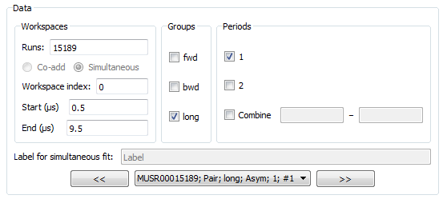

.. _Muon_Analysis_TestGuide-ref:

Muon Analysis Unscripted Testing
=================================

.. contents:: Table of Contents
    :local:
    
Preamble
^^^^^^^^^
This document is intended for developers to use for unscripted testing of the Muon Analysis GUI.
User documentation for this interface can be found at :ref:`Muon_Analysis-ref`.

Testing here focuses on the *Data Analysis* tab, which has been significantly changed for Mantid 3.8.
The tests follow real use cases provided by scientists and are intended to exercise all the interface's functionality.

Setup
^^^^^
- Set your facility to ISIS
- Ensure the files ``EMU00020918-20`` are in Mantid's path
- Open *Interfaces/Muon/Muon Analysis*
- At this point, before loading any data, the *Grouping Options* and *Data Analysis* tabs should be disabled.
- On *Settings* tab, uncheck "Compatibility mode" if checked
- Set instrument to EMU, type "20918" in the "Load run" box and hit return
- Now that data has been loaded, all tabs on the interface should be enabled.

Fitting tests
^^^^^^^^^^^^^
These test the different types of fits. The fit should succeed in each without a crash.
The *results* will be tested later, in the results table test section.

Test 1: individual fit
----------------------
- Go to *Data Analysis* tab. Expand the window if the function browser is too small (you can drag the bar underneath it to set relative sizes of the widgets).
- The loaded dataset should be pre-selected: "20918" in Runs and "long" ticked as the group.
- "Label" box and "Co-add/Simultaneous" radio buttons should be disabled
- Click and drag blue lines on graph, check start/end times are updated.
- Check the reverse - change start/end times and blue lines should be updated on graph.
- Set up the interface to look like this. Note the non-default values for ``f1.Omega`` and ``f1.Sigma``:

.. image:: ../images/MuonAnalysisTests/test1.png
  :align: center

- Fit the data. Graph should be updated.

Test 2: sequential fit
----------------------
- With everything set up as in the picture above, click *Fit/Sequential fit*. (Runs should still be set to "20918", a single run).
- Dialog should appear. In the runs box **of the new dialog that appears**, type "20918-20" and hit Start
- Sequential fit of runs 20918, 20919, 20920 should happen one after the other

Test 3: co-added fit
--------------------
- Close the sequential dialog and return to the main interface.
- Now in the "Runs" box of MuonAnalysis's *Data Analysis* tab, type "20918-20" and hit return.
- Stale errors should be cleared from the function browser.
- "Co-add/Simultaneous" radio buttons should be enabled with "Co-add" selected
- "Label" box should still be disabled
- In the drop-down, there should only be one workspace (``EMU00020918-20; Pair; long; Asym; #1``)
- Fit as before. Graph should be updated.

Test 4: simultaneous fit across runs
------------------------------------
- With the same runs (20918-20) selected, select the "Simultaneous" radio button option.
- Drop-down list should have three workspaces in it now, for the three runs that will be fitted.
- Keep the same fit function, but use the "Global" checkboxes to mark ``A``, ``Omega``, ``Phi`` and ``Sigma`` as global.
- Fit the data. Note that plot will *not* be updated at present.
  (If you want to plot results, see the ``MuonSimulFit_Label`` workspace group)
- Use the ``<<`` and ``>>`` buttons, or drop-down list, to see the fitted parameters for each run in the function browser.

Test 5: simultaneous fit across groups
--------------------------------------
- Type "20918" only in the "Runs" box
- Select both "fwd" and "bwd" as groups
- Keep fit function and global parameters as before
- Fit data. It should warn you that "Label" has already been used - say no to overwriting and it should automatically increment the label.

Test 6: sequential fit of simultaneous fits
-------------------------------------------
- Keep the same setup as Test 5, i.e. Runs="20918", "fwd" and "bwd" selected as groups
- Click *Fit/Sequential fit* to launch the dialog
- If offered the choice, choose not to overwrite the label
- Dialog should appear. In this new dialog (not the interface underneath):

  - Runs = "20918-20"
  - Label = "Label2"
  - Hit "Start"

- This should fit the ``fwd`` and ``bwd`` groups simultaneously for each run 20918, 20919, 20920 in sequence.

Results table tests
^^^^^^^^^^^^^^^^^^^

After running all the fits above, go to the *Results Table* tab.

Test 1: individual fits
-----------------------
- Top group box: select ``run_number`` and ``sample_temp`` as logs
- Centre group box: keep the default, which should be the *Individual fits* radio button with both individual fits selected
- Create the table with the default name ``ResultsTable``.
- Table should have two rows, one for runs 20918-20 (co-added) and one for run 20918.
- Sample temp should be expressed correctly as a range "180 to 200" for co-added runs
- Should be one pair of columns for each parameter + error, plus a final column for "cost function value"

Test 2: Sequential fit (simple)
-------------------------------
- Top group box: keep same logs as before
- Select the *Sequential fits* radio button in the centre group box, and "Label" in the drop-down, *i.e.* the first sequential fit you did. Keep all three runs included.
- Create the table - check that, if you don't change the name, it warns you about overwriting.
- The table should have three rows, one for each run, with the correct sample log values (180, 190, 200).
- Again there should be one pair of columns for each parameter and error, and a cost function column at the end.

Test 3: Sequential fit of simultaneous fits
-------------------------------------------
- Now select "Label2", the sequential fit of simultaneous fits (from test 5 above), in the drop-down next to *Sequential fits* (see test 2).
- The top box should have extra log values for ``group`` and ``period`` - select ``group`` (as well as ``run_number``)
- Keep all runs selected and create table
- There should be six rows in all, two per run (one for fwd, one for bwd).

Test 4: Simultaneous fits
-------------------------
- Select the "Simultaneous fits" radio button above the centre group box.
- Keep the first "Label" selected in the drop-down list.
- Create the table
- There should be one row per run
- For the global parameters (``f1.A``, ``f1.Omega``, ``f1.Phi``, ``f1.Sigma``), note the error is non-zero for the first run and zero for the others as they were all fitted together.
- Try the second label ("Label#2"), which was the simultaneous fit across groups. Have the ``group`` log value selected (as well as ``run_number``). There will be one row for each group.
- Try the third label ("MUSRlabel"), the fit across periods for MUSR data. Have the ``period`` log value selected. 

Test 5: Multiple simultaneous fits
----------------------------------
- Select the last radio button, "Multiple", above the centre group box.
- Three simultaneous fit labels are listed: Label, Label#2, MUSRlabel.
- Note that they have different colours, because the number of datasets and fit models differ. You should not be able to create a table with all of these selected.
- Select just the first "Label", log values ``run_number`` and ``sample_temp``, and create the table.
- There should be columns for label, run number/sample temp (with correct ranges) and fit parameters.
- Non-global parameters should have a column for each dataset - so ``f0.f0.A0``, ``f1.f0.A0``, ``f2.f0.A0``
- Global parameters should share a column - so just ``f1.A``, ``f1.Omega`` etc.

Test of simultaneous fit across periods
^^^^^^^^^^^^^^^^^^^^^^^^^^^^^^^^^^^^^^^
The data used so far is single period, so here we will use MUSR data from the unit test data.

- Close and open the Muon Analysis interface again. 
- This time, on the *Home* tab, set instrument to MUSR
- Load run 15189 and switch to *Data Analysis* tab
- An extra box should have appeared because this is multi-period data. Like this:

- Check the boxes for periods 1 and 2.
- Set fit function to LinearBackground and the label to "MUSRlabel"
- Fit - periods will be fitted simultaneously

