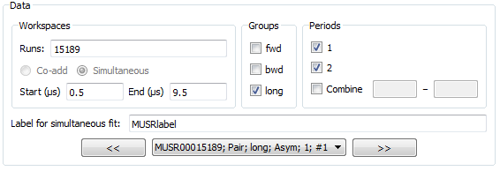

.. _Muon_Analysis_TestGuide-ref:

Muon Analysis Unscripted Testing
=================================

.. contents:: Table of Contents
    :local:
    
Preamble
^^^^^^^^^
This document is intended for developers to use for unscripted testing of the Muon Analysis GUI.
.. User documentation for this interface can be found at :ref:`Muon_Analysis-ref`.
User documentation for this interface can be found at (currently not built - insert link when ready)

Testing here focuses on the *Data Analysis* tab, which has been significantly changed for Mantid 3.8.
The tests follow real use cases provided by scientists and are intended to exercise all the interface's functionality.

Setup
^^^^^
- Set your facility to ISIS
- Download ``EMU00020918-20`` 
- Open *Interfaces/Muon/Muon Analysis*
- On *Settings* tab, uncheck "Compatibility mode" if checked
- Set instrument to EMU, type "20918" in the "Load run" box and hit return

Fitting tests
^^^^^^^^^^^^^
These test the different types of fits. The fit should succeed in each without a crash.
The *results* will be tested later, in the results table test section.

Test 1: individual fit
----------------------
- Go to *Data Analysis* tab. Expand the window if the function browser is too small (you can drag the bar underneath it to set relative sizes of the widgets).
- The loaded dataset should be pre-selected: "20918" in Runs and "long" ticked as the group.
- "Label" box and "Co-add/Simultaneous" radio buttons should be disabled
- Click and drag blue lines on graph, check start/end times are updated.
- Check the reverse - change start/end times and blue lines should be updated on graph.
- Set up the interface to look like this:

.. image:: ../images/MuonAnalysisTests/test1.png
  :align: center

- Fit the data. Graph should be updated.

Test 2: sequential fit
----------------------
- With everything set up as before, click *Fit/Sequential fit*
- Dialog should appear. In the runs box, type "20918-20" and hit Start
- Sequential fit of runs 20918, 20919, 20920 should happen one after the other

Test 2: co-added fit
--------------------
- Now in the "Runs" box, type "20918-20" and hit return.
- "Co-add/Simultaneous" radio buttons should be enabled with "Co-add" selected
- "Label" box should still be disabled
- In the drop-down, there should only be one workspace (``EMU00020918-20; Pair; long; Asym; #1``)
- Fit as before. Graph should be updated.

Test 3: simultaneous fit across runs
------------------------------------
- Select the "Simultaneous" radio button option.
- Drop-down list should have three workspaces in it now, for the three runs that will be fitted.
- Keep the same fit function, but use the "Global" checkboxes to mark ``A``, ``Omega``, ``Phi`` and ``Sigma`` as global.
- Fit the data. Note that plot will *not* be updated at present.
- (If you want to plot results, see the ``MuonSimulFit_Label`` workspace group)

Test 4: simultaneous fit across groups
--------------------------------------
- Type "20918" only in the "Runs" box
- Select both "fwd" and "bwd" as groups
- Keep fit function and global parameters as before
- Fit data. It should warn you that "Label" has already been used - say no to overwriting and it should automatically increment the label.

Test 5: sequential fit of simultaneous fits
-------------------------------------------
- With the same setup, click *Fit/Sequential fit*
- Dialog should appear. In the runs box, type "20918-20" and hit Start
- This should fit the ``fwd`` and ``bwd`` groups simultaneously for each run 20918, 20919, 20920 in sequence.

Test 6: simultaneous fit across periods
---------------------------------------
The data used so far is single period, so here we will use MUSR data from the unit test data.
- *Home* tab: set instrument to MUSR
- Load run 15189 and switch to *Data Analysis* tab
- An extra box should have appeared because this is multi-period data. Like this:

- Check the boxes for periods 1 and 2.
- Set fit function to LinearBackground and the label to "MUSRlabel"
- Fit - periods will be fitted simultaneously

Results table tests
^^^^^^^^^^^^^^^^^^^

After running all the fits above, go to the *Results Table* tab.

