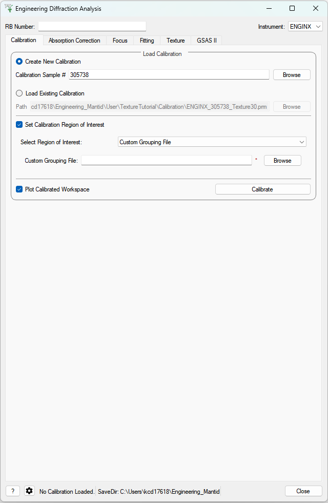
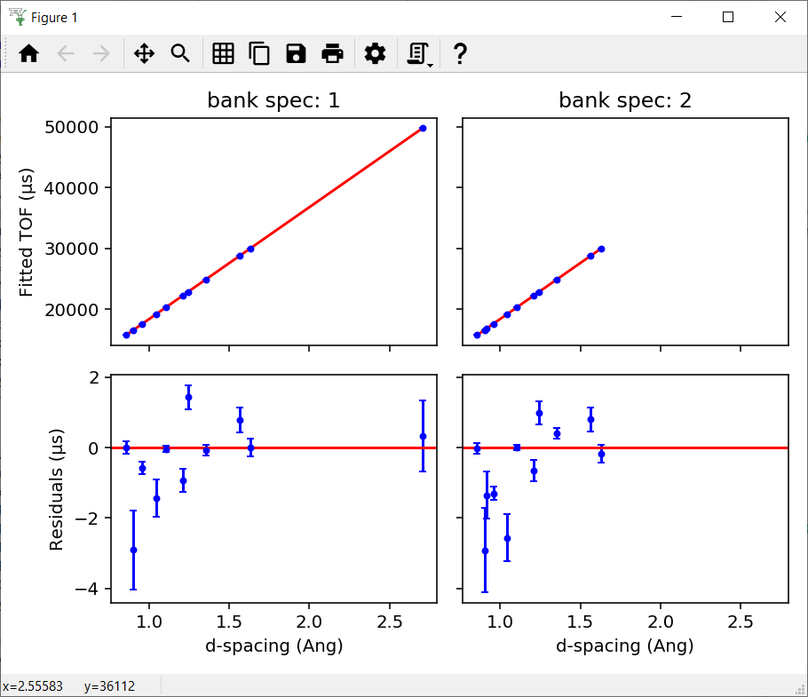
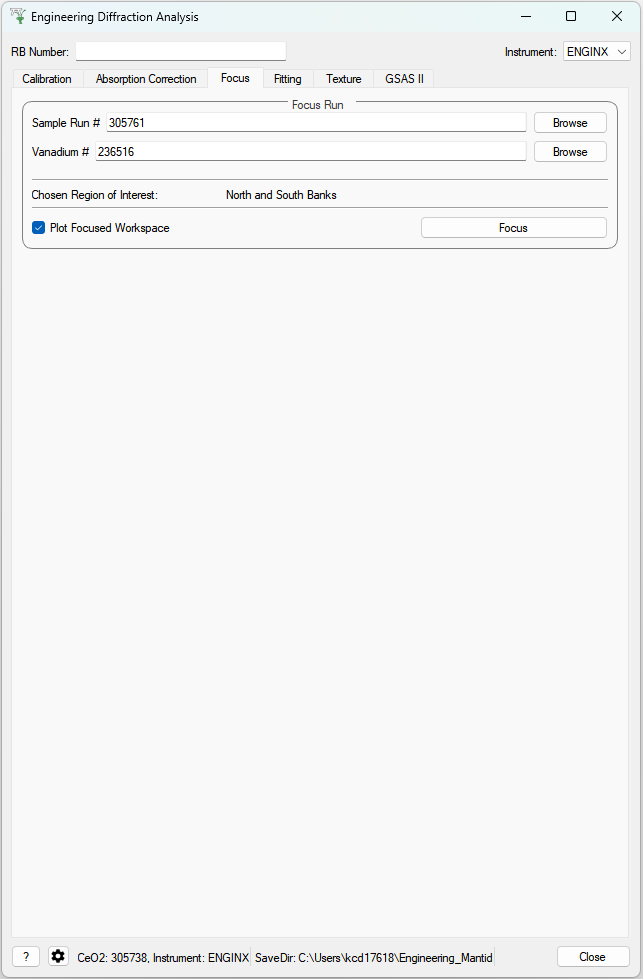
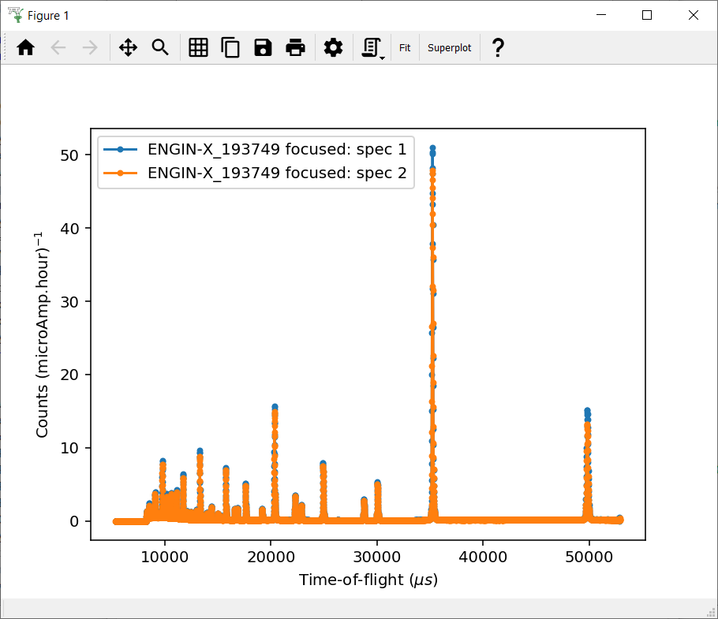

.. _Engineering_Diffraction-ref:

Engineering Diffraction
=========================

.. contents:: Table of Contents
    :local:

Interface Overview
------------------

This custom interface will integrate several tasks related to engineering
diffraction. In its current state it provides functionality for creating
and loading calibration files and focusing ENGINX run files.

Functionality for performing single peak fitting on focused run files is currently in progress.

This interface is under active development.

.. _Engineering_Diffraction_options-ref:

General Options
^^^^^^^^^^^^^^^
RB Number
    The reference number for the output paths (usually an experiment reference
    number at ISIS). Leaving this field empty will result in no user directories
    being created, and only the general directory will be used for file storage.

Instrument
    Select the instrument (ENGINX or IMAT). Currently only ENGINX is fully
    supported.

?
    Show this documentation page.

Settings
    Provides a range of options that apply across the entire interface, currently
    providing the option to change the default output directory. The user can also select the
    log values from a list which are loaded with data in the fitting tab and select
    a log by which to sort the runs in a sequential fit. There is also an option to
    specify a peak function to fit (limited to a subset of all peak functions that
    are recommended for the UI) which will be set on opening the interface. Note that
    the user can select any peak function to fit (even a non-recommended one) at a
    later point when adding a peak in the fitting tab.

Close
    Close the interface.

Other Information
^^^^^^^^^^^^^^^^^

Red Stars
    Red stars next to browse boxes and other fields indicate that the file
    could not be found. Hover over the star to see more information.

Status Bar
    The status bar shows the calibration run numbers the GUI is currently using.
    It also displays the save directory (which can be changed in the settings).

Saved File Outputs
    The location of files saved by the GUI during processing will be shown in the mantid
    messages log.

    *Note*: The locations are shown at "Notice" level, so may not appear if the messages log
    is on the incorrect setting.

.. _ui engineering calibration:

Calibration
-----------

This tab currently provides a graphical interface to create new calibrations and visualise them.
It also allows for the loading of GSAS parameter files (.prm) created by the calibration process
to load a previously created calibration into the interface.

When loading an existing calibration, the fields for creating a new calibration will be
automatically filled, allowing the recreation of the workspaces and plots generated by
creating a new calibration.

The "Plot Output" check-box will plot the fitted TOF as a function of d-spacing for the ceria peaks in each group
(typically a bank) when a new calibration is calculated.

Creating a new calibration file generates instrument parameter files for the selected region of interest.
If both banks are selected then two additional .prm files are created - one for each individual bank.
The calibration files are written to the directory:

`<CHOSEN_OUTPUT_DIRECTORY>/Calibration/`

If an RB number has been specified the files will also be saved to a user directory
in the base directory:

`<CHOSEN_OUTPUT_DIRECTORY>/User/<RB_NUMBER>/Calibration/`

In the case the ROI being Texture20 or Texture30 the files are saved to only one directory (the latter if an RB number is specified, otherwise the former) - this is to limit the number of files being written.

Cropping
^^^^^^^^

The interface also provides the ability to restrict a new calibration to a particular region of interest:
one of the two banks on ENGIN-X, a custom .cal file, a list of spectra (referred to as cropped), Texture20 grouping
(consists of 10 groupings per detector bank - 20 in total) and Texture30 (15 groupings per detector bank - 30 in total).

Parameters
^^^^^^^^^^

Vanadium Number
    The run number or file path used to correct the calibration and experiment runs.

Calibration Sample Number
    The run number for the calibration sample run (such as ceria) used to calibrate
    experiment runs.

Path
    The path to the GSAS parameter file (.prm) to be loaded.

Bank/Spectra
    Select a bank to crop to or specify a custom spectra will be entered.

Custom Spectra
    A comma separated list of spectra to restrict the calibration to. Can be provided as single spectrum numbers
    or ranges using hyphens (e.g. 14-150, 405, 500-600).

.. _ui engineering focus:

Focus
-----

This tab allows for the focusing of data files - summing up spectra in a given region of interest.
To do this a new or existing calibration must be created or loaded (see above) and a
vanadium run must also be supplied for normalisation.

The data will be focused over the region of interest selected in the calibration tab.
Files can be selected by providing run numbers or selecting the files manually using the browse button.

Ticking the "Plot Focused Workspace" checkbox will create a plot of nthe focused spectra for each of the focused runs
when the algorithm is complete.

Clicking the focus button will begin the focusing algorithm for the selected run files. The button and plotting checkbox
will be disabled until the fitting algorithm is complete.

The focused output files are saved in NeXus, GSS, and TOPAS format. All of these files are saved to:

`<CHOSEN_OUTPUT_DIRECTORY>/Focus/`

If an RB number has been specified the files will also be saved to a user directory:

`<CHOSEN_OUTPUT_DIRECTORY>/User/<RB_NUMBER>/Focus/`

In the case the ROI being Texture20 or Texture30 the files are saved to only one directory (the latter if an RB number is specified, otherwise the former) - this is to limit the number of files being written.

Parameters
^^^^^^^^^^

Sample Run Number
    The run numbers of or file paths to the data files to be focused.

Bank/Spectra
    Select which bank to restrict the focusing to or allow for the entry of custom spectra.

.. _ui engineering fitting:

Fitting
-------

This tab will allow for plotting and peak fitting of focused run files.

Focused run files can be loaded from the file system into mantid from the interface. The interface will keep track of all the
workspaces that it has created from these files. When a focused run is loaded, the proton charge weighted average (and standard deviation) of the log values set in the
settings options are calculated and stored in a grouped workspace accessible in the main mantid window.

Loaded workspaces can be plotted in the interface and the mantid fitting capability can be accessed from the 'Fit' button on the plot toolbar.
This allows for the user to select peaks of any supported type (the default is :ref:`BackToBackExponential <func-BackToBackExponential>`) by right-clicking on the plot. The initial parameters can be varied interactively by dragging sliders (vertical lines on the plot).
After a successful fit the best-fit model is stored as a setup in the fit browser (Setup > Custom Setup) with the name of the workspace fitted.
Selecting this loads the function and the parameters and the curve can be inspected by doing Display > Plot Guess.

The output from the fit is stored in a group of workspaces that contains a matrix workspace of the fit value and error for each parameter in the model. If there is more than one of the same function, the parameters are stored in the same workspace with different x-values. For example, if there were two Gaussian peaks then there would be a workspace for each parameter of the Gaussian (i.e. Height, PeakCentre, Sigma) each of which will have two columns corresponding to each peak. Each workspace has a spectra per run loaded (each row in the table of the UI fitting tab). In general different models/functions could be fitted to each run, so when there is a parameter that does not exist for a run (or that run has not yet been fitted), the Y and E fields in the relevant row are filled with NaNs. The group of fit workspaces also contains a table workspace that stores the model string that can be copied into the fit browser (Setup > Manage Setup > Load From String).

The workspaces can be fitted sequentially (sorted by the average of a chosen log in the settings) or serially (fitted with the same initial parameters).
If a valid model is present in the fit browser then the Sequential Fit and Serial Fit buttons (on the plot toolbar) will be enabled - it is not necessary to run an initial fit.

The user may want to fix or constrain certain model parameters, which can be done in the usual way in the fit browser. The sequential fit will populate the fit tables as above and store the model in the Custom Setups.

Parameters
^^^^^^^^^^

Focused Run Files
    A comma separated list of files to load. Selecting files from the file system using the browse button will do this
    for you.

File Filters
    Choose to filter by xunit (TOF or d-spacing) and region of interest (e.g. North Bank).

.. image:: ../../images/EngDiff_Fitting.png
    :width: 600px
    :align: center

.. _ui engineering gsas:

GSAS-II Refinement
------------------

This tab calls GSAS-II python interface (path to GSAS-II supplied by the user in the interface settings).
Currently only Pawley refinements are supported and the lattice parameters in the .cif phase file can be overidden.

Parameters
^^^^^^^^^^

Project Name
    Name of the GSAS project file.

Instrument Group
    Path to .prm file produced by the Calibration tab

Phase
    Path to the .cif file defining the initial crystal structure (more than one path can be supplied, the lattice
    parameters will be overridden for the first phase only).

Focused Data
    Path to focused .gss files (note it should have the same number of spectra as in .prm file)

Refinement Method
    Only Pawley refinement currently supported

Override Unit Cell Length
    Lattice parameters (a, b, c, alpha, beta, gamma) can be supplied to overwrite the lattice parameters in the first .cif file

Refine Microstrain

Refine Sigma_1

Refine Gamma

.. image:: figure:: ../../../../images/6_5_release/Diffraction/GSASII_tab.png
    :align: center
    :width: 600px

.. categories:: Interfaces Diffraction

