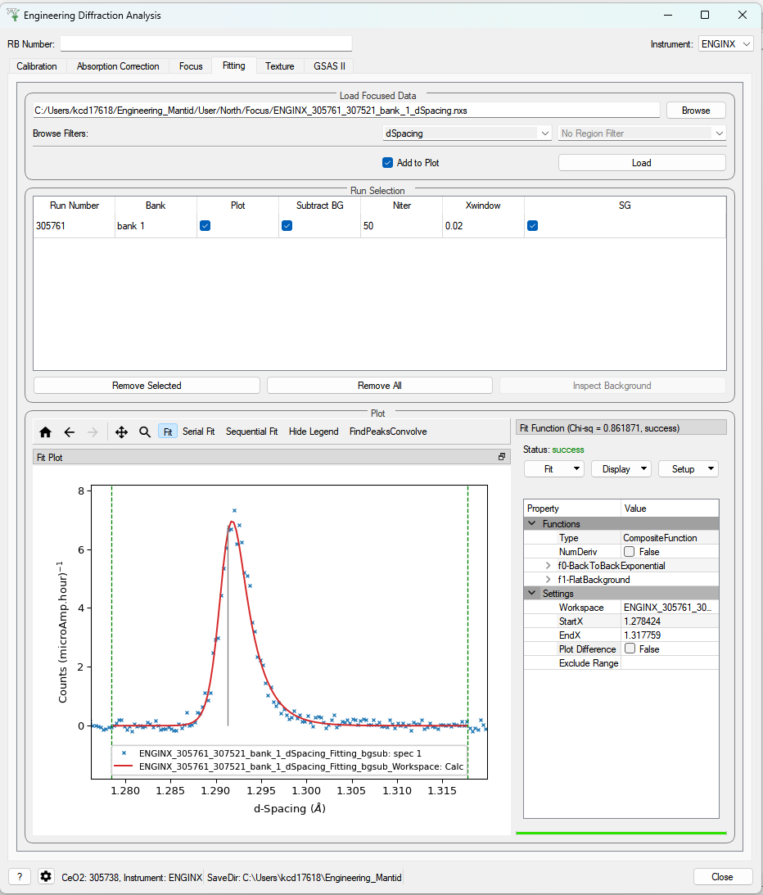
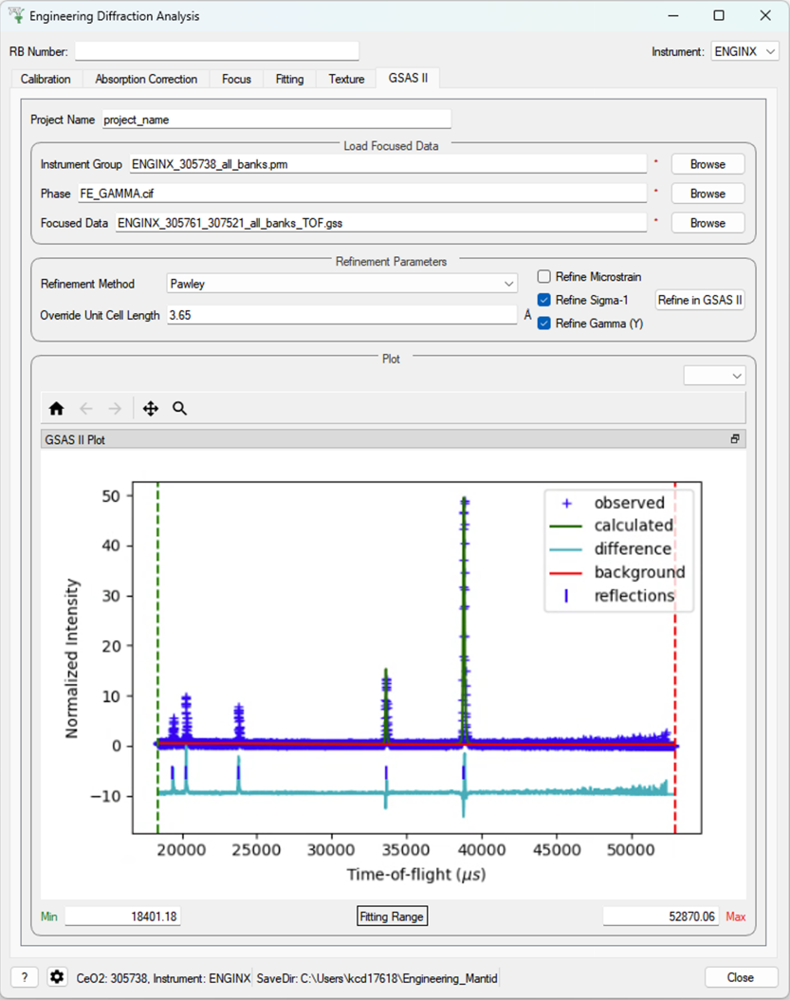

.. _Engineering_Diffraction-ref:

Engineering Diffraction
=========================

.. contents:: Table of Contents
    :local:

Interface Overview
------------------

This custom interface will integrate several tasks related to engineering
diffraction. In its current state it provides functionality for creating
and loading calibration files and focusing ENGINX run files.

Functionality for performing single peak fitting on focused run files is currently in progress.

This interface is under active development.

.. _Engineering_Diffraction_options-ref:

General Options
^^^^^^^^^^^^^^^
RB Number
    The reference number for the output paths (usually an experiment reference
    number at ISIS). Leaving this field empty will result in no user directories
    being created, and only the general directory will be used for file storage.

Instrument
    Select the instrument (ENGINX or IMAT). Currently only ENGINX is fully
    supported.

?
    Show this documentation page.

Settings
    Provides a range of options that apply across the entire interface, currently
    providing the option to change the default output directory. The user can also select the
    log values from a list which are loaded with data in the fitting tab and select
    a log by which to sort the runs in a sequential fit. There is also an option to
    specify a peak function to fit (limited to a subset of all peak functions that
    are recommended for the UI) which will be set on opening the interface. Note that
    the user can select any peak function to fit (even a non-recommended one) at a
    later point when adding a peak in the fitting tab.

Close
    Close the interface.

.. image:: ../../images/EngDiff_Settings.png
    :width: 600px
    :align: center

Other Information
^^^^^^^^^^^^^^^^^

Red Stars
    Red stars next to browse boxes and other fields indicate that the file
    could not be found. Hover over the star to see more information.

Status Bar
    The status bar shows the calibration run numbers the GUI is currently using.
    It also displays the save directory (which can be changed in the settings).

Saved File Outputs
    The location of files saved by the GUI during processing will be shown in the mantid
    messages log.

    *Note*: The locations are shown at "Notice" level, so may not appear if the messages log
    is on the incorrect setting.

.. _ui engineering run_processing:

Run Processing
--------------

This tab currently provides a graphical interface to create and visualise new calibrations and focussed runs.
It also allows for the loading of GSAS parameter files (.prm) created by the calibration process
to load a previously created calibration into the interface.

It also allows for the focusing of data files - summing up spectra in a given region of interest.
To do this a new or existing calibration must be created or loaded

For both calibration and focussing, a vanadium run should also be supplied for normalisation.

Parameters
^^^^^^^^^^

Vanadium Number
    The run number or file path used to correct the calibration and focused data files.

.. image:: ../../images/EngDiff_RunProcessing.png
    :width: 600px
    :align: center

.. _ui engineering calibration:

Calibration
^^^^^^^^^^^

When loading an existing calibration, the fields for creating a new calibration will be
automatically filled, allowing the recreation of the workspaces and plots generated by
creating a new calibration.

The ``Plot Output`` check-box will plot the fitted TOF as a function of d-spacing for the ceria peaks in each group
(typically a bank) when a new calibration is calculated.

Creating a new calibration file generates instrument parameter files for the selected region of interest.
If both banks are selected then two additional .prm files are created - one for each individual bank.
The calibration files are written to the directory:

`<CHOSEN_OUTPUT_DIRECTORY>/Calibration/`

If an RB number has been specified the files will also be saved to a user directory
in the base directory:

`<CHOSEN_OUTPUT_DIRECTORY>/User/<RB_NUMBER>/Calibration/`

In the case the ROI being ``Texture20`` or ``Texture30`` the files are saved to only one directory (the latter if an RB
number is specified, otherwise the former) - this is to limit the number of files being written.

Cropping
++++++++

The interface also provides the ability to restrict a new calibration to a particular region of interest:
one of the two banks on ENGIN-X, a custom grouping file (``.cal`` or ``.xml`` files), a list of spectra (referred to as
cropped), ``Texture20`` grouping (consists of 10 groupings per detector bank - 20 in total) and ``Texture30`` (15
groupings per detector bank - 30 in total).

Parameters
++++++++++

Calibration Sample Number
    The run number for the calibration sample run (such as ceria) used to calibrate
    experiment runs.

Path
    The path to the GSAS parameter file (.prm) to be loaded.

Region Of Interest
    Select a bank to crop to or specify a custom spectra will be entered.

Custom Grouping File
    The path to a custom ``.cal`` or ``.xml`` file with the desired detector groupings.

Custom Spectra
    A comma separated list of spectra to restrict the calibration to. Can be provided as single spectrum numbers
    or ranges using hyphens (e.g. 14-150, 405, 500-600).

.. image:: ../../../../dev-docs/source/images/EngineeringDiffractionTest/EnggDiffExpectedLinear.png
    :width: 900px
    :align: center

.. _ui engineering focus:

Focus
^^^^^

The data will be focused over the region of interest selected during calibration.
Files can be selected by providing run numbers or selecting the files manually using the browse button.

Ticking the ``Plot Focused Workspace`` checkbox will create a plot of the focused spectra for each of the focused runs
when the algorithm is complete.

Clicking the ``Focus`` button will begin the focusing algorithm for the selected run files. The button and plotting
checkbox will be disabled until the fitting algorithm is complete.

The focused output files are saved in NeXus, GSS, and TOPAS format. All of these files are saved to:

`<CHOSEN_OUTPUT_DIRECTORY>/Focus/`

If an RB number has been specified the files will also be saved to a user directory:

`<CHOSEN_OUTPUT_DIRECTORY>/User/<RB_NUMBER>/Focus/`

In the case the ROI being ``Texture20`` or ``Texture30`` the files are saved to only one directory (the latter if an RB
number is specified, otherwise the former) - this is to limit the number of files being written.

Parameters
++++++++++

Sample Run Number
    The run numbers of or file paths to the data files to be focused.

Chosen Region Of Interest
    Select which bank to restrict the focusing to or allow for the entry of custom spectra (this is carried over from
    the calibration).

.. image:: ../../../../dev-docs/source/images/EngineeringDiffractionTest/EnggDiffExampleFocusOutput.png
    :width: 900px
    :align: center

.. _ui engineering correction:

Absorption Correction
---------------------

This tab allows corrections to be applied to the input data files, as well as attaching sample information, such as shape, material and orientation. Additional functionality is to correct experimental intensity for beam divergence and
to calculate a table of attenuation coefficients for a given bin in the spectra.

Parameters
^^^^^^^^^^

Sample Run(s)
    The run numbers of or file paths to the data files to be corrected.

Reference Workspace
    The file path to a reference workspace with the default sample information (sample shape in neutral positioner orientation and material)

Orientation File
    The file path to the orientation data for the experiment. This is either given as a collection of flattened rotation matrices or euler rotation angles

Custom Gauge Volume File
    File path to an XML file containing a Constructive Solid Geometry description of the gauge volume geometry

Evaluation point
    Position along the spectra x-axis where the attenuation value saved into the table should be evaluated

Units
    Unit the x-axis should be in when getting the attenuation at the evaluation point

Incident Horizontal
    The horizontal component of the divergence of the incident beam (in radians)

Incident Vertical
    The vertical component of the divergence of the incident beam (in radians)

Detector Horizontal
    The horizontal component of the divergence of the scattered beam (in radians) - *currently this correction assumes this is the same for all detector groups*

Settings Parameters
^^^^^^^^^^^^^^^^^^^

Texture Directions
    Defines the intrinsic directions of the sample, which will be used for plotting and calculating pole figures. The second axis (second row of the matrix) is always the normal to the pole figure plane. Both the vectors and the labels of these axes can be modified here

Monte Carlo Parameters
    Python dictionary-style string for input parameters to the :ref:`algm-MonteCarloAbsorption` algorithm, where keywords and values are given as ``keyword1:value1, keyword2, value2``

Remove File from ADS after processing
    Flag for whether the calculated corrected workspaces need to be kept in the ADS (flagging them for removal frees up system memory)

Orientation File is Euler Angles
    Flag for notifying whether the orientation file which will be provided in the correction tab is a text file with euler angles or whether each line is a flattened matrix

Euler Angle Scheme
    Lab-frame axes that the euler angles are defined along, when in neutral position

Euler Angles Sense
    The sense of the rotation around each euler axis where 1 is counter clockwise and -1 is clockwise

Buttons/Functions
^^^^^^^^^^^^^^^^^

Browse
    Opens a file navigator to find desired file

Load Files
    Loads the selected sample runs into the table

Select All
    Sets all of the loaded workspaces in the table to selected

Deselect All
    Sets all of the loaded workspaces in the table to unselected

Delete Selected Files
    Deletes all of the loaded files, whcih are set as selected, from the table

View/View Shape
    Pops up a plot of the sample shape on a given workspace, along with the relative orientation of sample axes (defined in the settings)

Create Reference Workspace
    Creates an empty workspace that can hold the reference sample information that can then be copied onto each experimental workspace

Set Reference Orientation
    Allows an initial orientation to be applied to the reference shape to align it correctly with the experimental sample upon a positioner with neutral/default/homed motor values

Save Reference Workspace
    Saves the reference workspace into the experimental data folder

Load Reference
    Loads a reference workspace from provided file path

Load Shape onto Single WS
    Opens dialog for :ref:`algm-LoadSampleShape`, allows loading of STL sample shape onto the reference/experimental workspaces

Set Shape onto Single WS
    Opens dialog for :ref:`algm-CreateSampleShape`, allows defining sample shape onto the reference/experimental workspaces using constructive solid geometry XML string

Set Sample Material
    Opens dialog for :ref:`algm-SetSampleMaterial`, allows definition of sample material properties onto the reference/experimental workspaces

Set Single Orientation
    Opens dialog for :ref:`algm-SetGoniometer`, allows definition of sample orientation onto individual experimental workspaces

Load Orientation File
    Reads the provided orientation file and sets the orientation provided in each line onto the selected workspaces in turn

Copy Reference Sample
    Copies the sample information from the reference workspace onto all of the selected workspaces

Copy WS Sample
    Copies the sample information from the workspace in the dropdown menu onto all of the selected workspaces

Apply Correction
    Applies all the flagged corrections according to the provided parameters onto each selected workspace in turn, saving the resulting workspaces in the indicated save directory

.. _ui engineering fitting:

Fitting
-------

This tab will allow for plotting and peak fitting of focused run files.

Focused run files can be loaded from the file system into mantid from the interface. The interface will keep track of all the
workspaces that it has created from these files. When a focused run is loaded, the proton charge weighted average (and standard deviation) of the log values set in the
settings options are calculated and stored in a grouped workspace accessible in the main mantid window.

Loaded workspaces can be plotted in the interface and the mantid fitting capability can be accessed from the 'Fit' button on the plot toolbar.
This allows for the user to select peaks of any supported type (the default is :ref:`BackToBackExponential <func-BackToBackExponential>`) by right-clicking on the plot. The initial parameters can be varied interactively by dragging sliders (vertical lines on the plot).
After a successful fit the best-fit model is stored as a setup in the fit browser (Setup > Custom Setup) with the name of the workspace fitted.
Selecting this loads the function and the parameters and the curve can be inspected by doing Display > Plot Guess.

The output from the fit is stored in a group of workspaces that contains a matrix workspace of the fit value and error for each parameter in the model. If there is more than one of the same function, the parameters are stored in the same workspace with different x-values. For example, if there were two Gaussian peaks then there would be a workspace for each parameter of the Gaussian (i.e. Height, PeakCentre, Sigma) each of which will have two columns corresponding to each peak. Each workspace has a spectra per run loaded (each row in the table of the UI fitting tab). In general different models/functions could be fitted to each run, so when there is a parameter that does not exist for a run (or that run has not yet been fitted), the Y and E fields in the relevant row are filled with NaNs. The group of fit workspaces also contains a table workspace that stores the model string that can be copied into the fit browser (Setup > Manage Setup > Load From String).

The workspaces can be fitted sequentially (sorted by the average of a chosen log in the settings) or serially (fitted with the same initial parameters).
If a valid model is present in the fit browser then the Sequential Fit and Serial Fit buttons (on the plot toolbar) will be enabled - it is not necessary to run an initial fit.

The user may want to fix or constrain certain model parameters, which can be done in the usual way in the fit browser. The sequential fit will populate the fit tables as above and store the model in the Custom Setups.

Parameters
^^^^^^^^^^

Focused Run Files
    A comma separated list of files to load. Selecting files from the file system using the browse button will do this
    for you.

File Filters
    Choose to filter by xunit (TOF or d-spacing) and region of interest (e.g. North Bank).

.. _ui engineering texture:

Texture (Pole Figure)
---------------------

This tab allows data to be reduced into pole figure tables, comprising of alpha and beta angles (location of detector group relative to sample axes in spherical coordinates) and an optional attached value for that detector group.
The tab also plots these pole figure tables as a pole figure in the panel beneath.

Parameters
^^^^^^^^^^

Sample Run(s)
    The run numbers of or file paths to the data files.

Fit Parameters
    The workspace names of or file paths to the Table Workspaces with the values to be added to the pole figure table - expected to have one row per spectra in the corresponding workspace.

Lattice
    String representation of the crystal lattice (eg. '2.8665  2.8665  2.866', see :ref:`Crystal Structure concept page <Crystal structure and reflections>`)

Space Group
    String representation of the crystal space group (eg. 'I m -3 m', see :ref:`Crystal Structure concept page <Crystal structure and reflections>`)

Basis
    String representation of the crystal basis (eg. 'Fe 0 0 0 1.0 0.05; Fe 0.5 0.5 0.5 1.0 0.05', see :ref:`Crystal Structure concept page <Crystal structure and reflections>`)

HKL
    The HKL of the reflection that has been fit

Projection
    The 2D projection method of displaying the Pole Figure Table data (options are azimuthal or stereographic)

Parameter Readout Column
    Which column of the parameter table workspaces to read to find the values which should be included in the pole figure table

Settings Parameters
^^^^^^^^^^^^^^^^^^^

Cost Function Threshold
    The maximum cost function value for a given spectra's fit to be plotted in the pole figure

Peak Position Threshold
    The maximum deviation in peak position from the expected position for a given spectra's fit to be plotted in the pole figure. Expected position is either mean of all peaks or, if provided, peak position of given HKL

Scatter Plot Experimental Pole Figure
    Flag for whether the experimental pole figure should have individual detector groups plotted as scatter points (checked), or should be interpolated and given as a contour plot (unchecked)

Contour Kernel Size
    Sigma value of the gaussian smoothing kernel applied before the interpolation

Buttons/Functions
^^^^^^^^^^^^^^^^^

Load Workspace Files
    Loads the selected sample runs into the table

Load Parameter Files
    Loads the selected table workspaces into the table, assigning them to each row currently without an assigned table, in turn

Select All Files
    Sets all the rows of the table as selected

Deselect All Files
    Sets all the rows of the table as unselected

Delete All Selected Files
    Deletes all rows of the table which are set as selected

Delete All Selected Parameter Files
    Removes all the set parameter files for the rows of the table that have been selected

View Shape
    Pops up a plot of the sample shape on a given workspace, along with the relative orientation of sample axes (defined in the settings)

Set Crystal
    Takes the crystal structure defined in either the CIF or the lattice/space group/basis inputs and applies it to the workspace in the drop down menu

Set Crystal to All
    Takes the crystal structure defined in either the CIF or the lattice/space group/basis inputs and applies it to all the selected workspaces

Calculate Pole Figure
    Creates the pole figure tables and plots the corresponding pole figure

.. _ui engineering gsas:

GSAS-II Refinement
------------------

This tab calls GSAS-II python interface (path to GSAS-II supplied by the user in the interface settings).
Currently only Pawley refinements are supported and the lattice parameters in the .cif phase file can be overidden.

Parameters
^^^^^^^^^^

Project Name
    Name of the GSAS project file.

Instrument Group
    Path to .prm file produced by the Calibration tab (only one instrument file is supported and will be applied to each data file)

Phase
    Path to the .cif file defining the initial crystal structure (more than one path can be supplied, the lattice
    parameters will be overridden for the first phase only).

Focused Data
    Path to focused .gss files (note it should have the same number of spectra as in .prm file and contains multiple banks)

Refinement Method
    Only Pawley refinement currently supported

Override Unit Cell Length
    Lattice parameters (a, b, c, alpha, beta, gamma) can be supplied to overwrite the lattice parameters in the first .cif file

Refine Microstrain

Refine Sigma_1

Refine Gamma

.. categories:: Interfaces Diffraction
