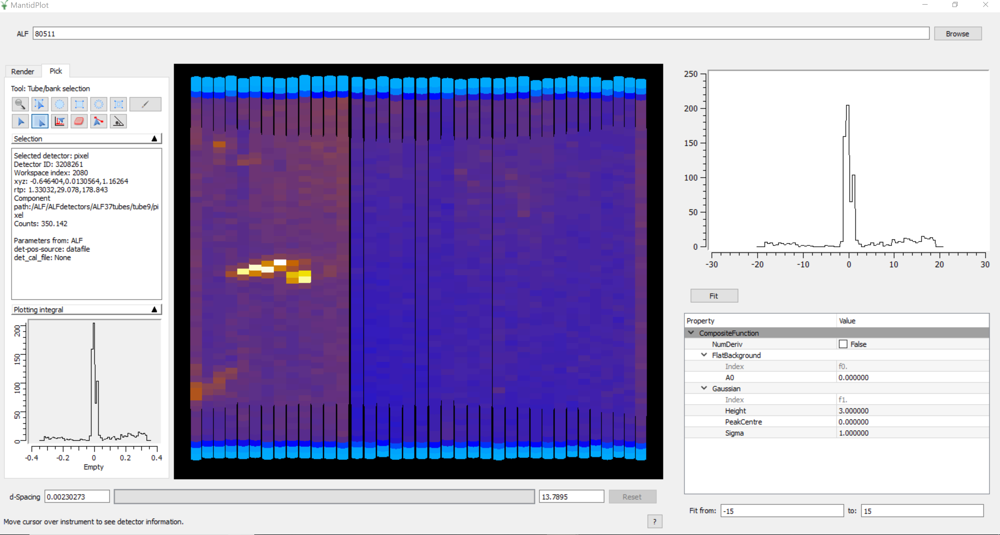

.. _ALF_View-ref:

ALF View
========

.. contents:: Table of Contents
  :local:

Interface Overview
------------------

This interface is used to analyse the alignment of data collected on ALF instrument. The interface can be
accessed from the main menu of MantidPlot, in *Interfaces → Direct → ALF view*.

Loading
-------

The loading section is used to load a single data set. This can be achieved by either typing the run number or browsing to the file of interest.

Instrument View
---------------

There is a custom version of the `Instrument View <http://www.mantidproject.org/MantidPlot:_Instrument_View>`__, which only contains the render and pick tabs. 
In the pick tab chose the :code:`select whole tube` option. Left clicking on the instrument will create a menu, which will have an additional option :code:`Export Tube`. 
This option will export the currently selected data to the mini-plot on the right hand side of the GUI. 
Once a tube has been exported another option will appear in the left click menu called `Add Tube To Average`. 
This option will create an average of all the tubes that have been exported.
The average will reset when the data changes.

Analysis Pane
-------------

At the top of the right hand pane is a mini-plot. 
This shows the exported data.
Underneath is a basic fitting tool, by default it has a `FlatBackground` and `Gaussian` loaded.
The fitting functions can be edited like the rest of Mantid.
The fit button will perform a fit and add the result to the mini-plot (in red).
At the bottom of the right is the fitting range. 

Feedback & Comments
-------------------

If you have any questions or comments about this interface or this help page, please
contact the `Mantid team <http://www.mantidproject.org/Contact>`__ .

.. categories:: Interfaces Direct
