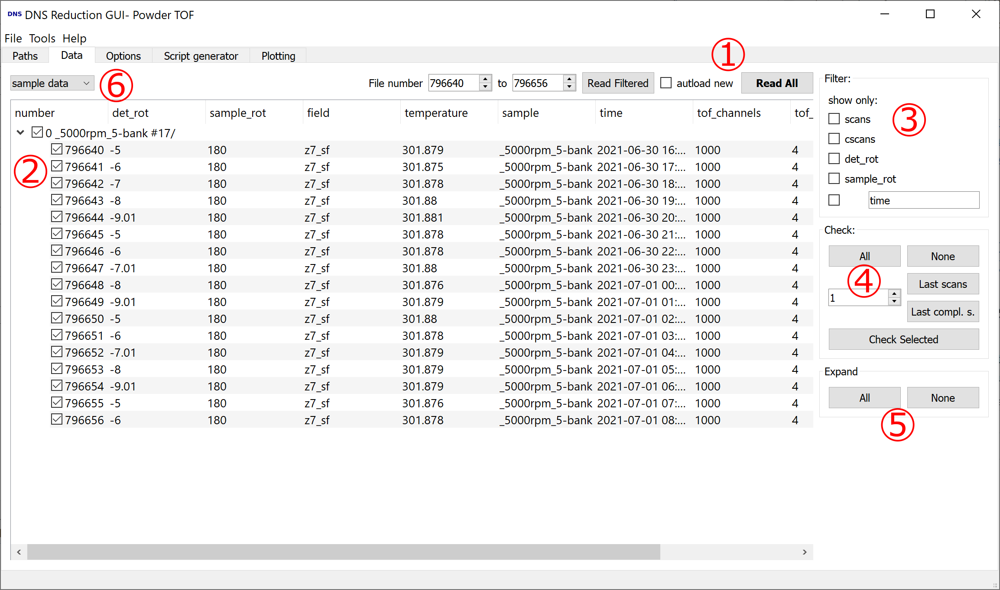

.. _dns_data_tab-ref:

DNS Data Tab
--------

\

This tab is a file browser for the DNS datafiles.

**1** If you click **Read All** all files in the data directory (as specified
in :ref:`Paths tab <dns_paths_tab-ref>`) will be read.
It will only show TOF or elastic datafiles in dependency of the selected
mode. The input fields for the filenumbers and the **Read filtered** button can
be used to read only a specific filenumber range. The **autoload new**
checkbox, will automatically load new data which is found in the directory.
If an incomplete scan was selected for reduction autoload will also
automatically check new files in this scan for reduction.

**2** Here is a tree of the DNS data files, grouped by scan commands, ordered
by the file numbers.
The top tree element shows the sample name followed by the scan command and the
number of files found and the number of files expected for a complete scan.
You can select files or scans for data reduction by checking the box or using
the quick check buttons under **4**. One can also right click files in the tree
to open them in a text editor.

**3** The shown scans can be filtered by their scan commands, or text matching.

**4** The button **Last Scans** checks the most recent number of scans given in
the
input field next to it.  **Last compl. s.** does the same, but only considers
complete scans. **Check selected** checks scans previously selected by mouse
selection, which can use Strg or Shift for multiple selection.

**5** Expands or unexpands all treeview elements.

**6** Is used to switch between sample data and standard data.
If standard data is not selected all found files in the standard directory
(as specified in
:ref:`Paths tab <dns_paths_tab-ref>`) will be automatically selected.
If no standard files are found in this directory,
the GUI will look for the newest zip file with *standard* in its name in the
standard directory or if none is found also in the data directory,
unzip it and try to use the unzipped files.

:ref:`DNS Reduction <DNS_Reduction-ref>`

