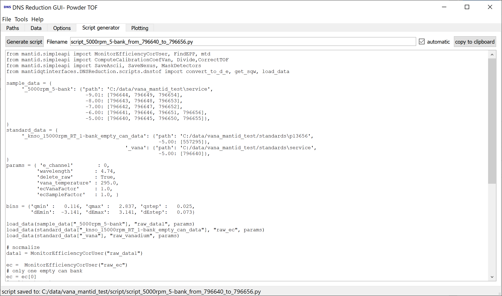

.. _dns_script_generator_tab-ref:

DNS Script Generator Tab
--------

\

The script generator tab, generates and runs a mantid script for data reduction,
if the button **generate script** is clicked.

If **automatic** is checked the
filename will be automatically set to
**script_samplename_from_firstfilenumber_to_lastfilenumber.py**,
otherwise one can manually give a filename.
The script is saved to the script directory selected in the **Paths tab**,
the path is shown in the status line.

Running of the script can be aborted, by clicking *abort loading* but then the
data cannot be plotted.
The shown script cannot be edited in the window but copied to the clipboard.

:ref:`DNS Reduction <DNS_Reduction-ref>`