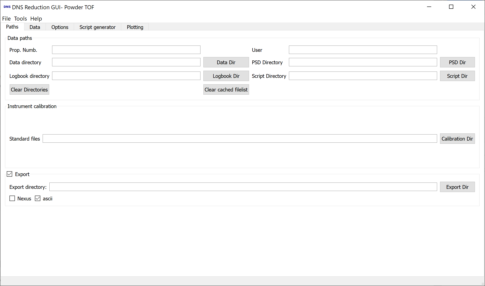

.. _dns_paths_tab-ref:

DNS Path Tab
------------

\

In this tab you can set the directories containing the datafiles which should
be processed. If you set the **Data directory** all other fields will be
automatically set, to standard values.
If a DNS data file is found in the directory, the proposal number and
username will be shown.

If the GUI is called from commandline, the current working directory is
automatically chosen as data directory.

Directories
^^^^^^^^^^^^^^^^^^^^^^^^^
**Data directory** for the DNS .d_dat files

**PSD directory** for the position sensitive detector event
list mode .mdat files (not used atm.)

**Logbook directory** for the Nicos log files (not used atm.)

**Script directory** where the reduction scripts will be saved

**Standard files** here the DNS calibration files are stored,
normally Vanadium, NiCr and Empty.

**Export directory** if the checkbox is checked, the processed data is
automatically exported to this directory in the chosen formats.

The button **Clear directories** clears all the fields, this shoud be done if
the **Data directory** is changed and new automatic setting of the other
directories is wanted.

The **Clear cached filelist** button deletes the saved filelist of the
**Data Tab**, which is cached for speed reasons in the data directory in the
file *last_filelist.txt*

:ref:`DNS Reduction <dns_reduction-ref>`

