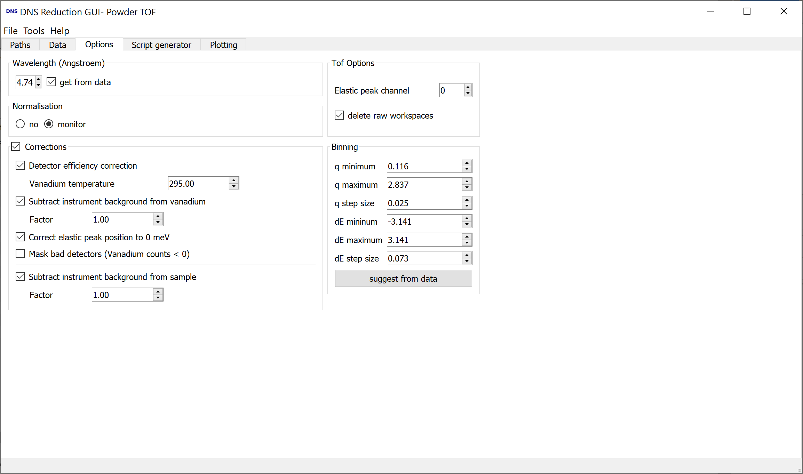

.. _dns_powder_tof_options_tab-ref:

DNS Powder TOF Options Tab
--------------------------

\

This tab of the powder TOF mode defines the options for the reduction script.
The most useful configuration is preselected so that one just needs to set the
binning and proceed to the next tab if no change to the selected options is
desired.

**Wavelength** sets the wavelength of the neutron beam. The value can be overwritten,
for example for the cases when :math:`\lambda/2` was selected by the velocity selector.

**Normalization** gives user a choice whether to normilize the data on monitor
counts or not.

**Detector Efficiency Correction** normalises the detector efficiency using standard
vanadium data. Moreover, the temperature of the vanadium sample can be specified
using the respective **Vanadium Temperature** box.

**Subtract Instrument Background from Vanadium** can be enabled to subtract the
instrument background from vanadium data. Additionally, the instrument background
can be corrected by a scaling factor using the corresponding **Factor** box.

**Correct Elastic Peak Position to 0 meV** shifts the elastic peak to 0 meV
using a fit of the elastic line of the vanadium data. This is necessary because
the zero time signal is not calibrated at DNS at the moment. Alternatively,
the elastic peak channel can be given manually.

**Mask Bad Detectors (Vanadium Counts < 0)** option enables user to mask those
detectors that show negative counts.

**Subtract Instrument Background from Sample** can be enabled to subtract the
instrument background from sample data. The corresponding **Factor** box can be
used to set a scaling factor for this correction.

**Elastic Peak Channel** can be used to specify the time channel number at which
the elastic peak is observed. **Delete Raw Workspaces** gives user a choice whether
to remove workspaces with raw data or not from the list of loaded workspaces.

**Binning** section can be used to specify the respective self-descriptive parameters of
binning. **Sugest from Data** button can be pressed to set the parameters of binning to
the values that will give the user an oppotunity to display the whole dataset.
