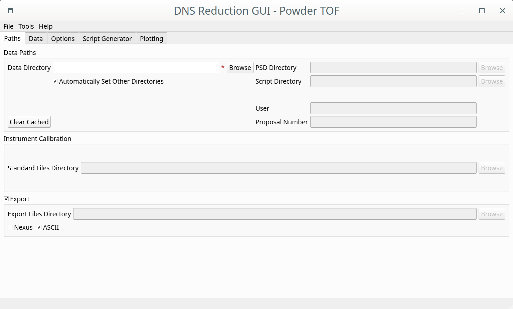

.. _dns_powder_tof_paths_tab-ref:

DNS Paths Tab
-------------

\

In this tab you can set the path to the datafiles for processing, as well as to the locations where the output files will be stored.
The **Data Directory** field is mandatory and a user should browse to the location where the data files are located. If
**Automatically Set Other Directories** checkbox is selected, the paths for PSD and Standard Files directories will be automatically
set to default values. The folders for the processed files and generated reduction scripts will be set to default values, as well.
Once a DNS data file is found in the **Data Directory**, the proposal number and username will be automatically displayed (if available)
in the corresponding fields.

If the GUI is called from commandline, the current working directory is automatically chosen as the **Data Directory**.

Main Controls Summary
^^^^^^^^^^^^^^^^^^^^^

+------------------------------+--------------------------------------------------------------------------------------------------+
| **Data Directory**           | Path to DNS ``.d_dat`` files                                                                     |
+------------------------------+--------------------------------------------------------------------------------------------------+
| **PSD Directory**            | Path to the position sensitive detector event list mode (``.mdat`` files, not used at the moment)|
+------------------------------+--------------------------------------------------------------------------------------------------+
| **Script Directory**         | Path to the directory in which python reduction scripts will be saved                            |
+------------------------------+--------------------------------------------------------------------------------------------------+
| **Standard Files Directory** | Path to the DNS calibration files (normally Vanadium, NiCr and Empty)                            |
+------------------------------+--------------------------------------------------------------------------------------------------+
| **Export Directory**         | Path to the directory in which the processed data are saved (in the chosen formats)              |
+------------------------------+--------------------------------------------------------------------------------------------------+

In order to speed up the performance of data processing, the list of files that are contained in the **Data Directory** is cached to
the file named ``last_filelist.txt``. In order to clean up the cache, click on the **Clear Cached Filelist** button.

Whenever a user operates regularly with the same set of input/output directories, it might be convenient to save the corresponding
configuration of input/output folders to an ``.xml`` file. This can be done by clicking on the "File" → "Save As" buttons at the top
left corner of the GUI. After the configuration has been saved, it can simply be loaded by chosing "File" → "Open" → ``config_filename.xml``.
