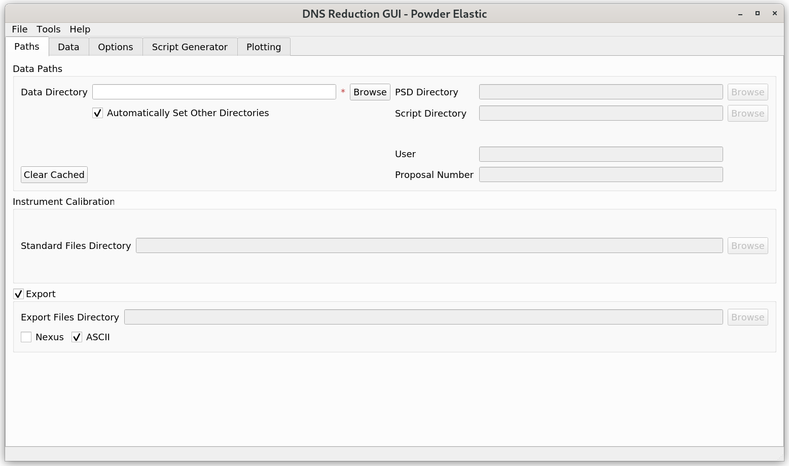

.. _dns_powder_elastic-ref:

.. toctree::

==================
DNS Powder Elastic
==================

\

This mode of the DNS Reduction GUI can be used to reduce
polarized and unpolarized powder diffraction data collected at the DNS
instrument at MLZ. In the case when polarized data are loaded, the separation
of scattering contributions by polarization analysis can be performed.

This mode can be accessed from the main menu of the "DNS Reduction"
interface by clicking on "Tools" → "Change Mode" and selecting the
"Powder Elastic" option.

Below the interface menu, there are various tabs for data processing.
These tabs should be called from left to right during the data processing.
The functionality of the "Paths", "Data", and "Script Generator" tabs of this
operational mode of the DNS Reduction GUI is identical to that of the
"Powder TOF" mode.

Tabs Usage and Description
--------------------------

* :ref:`Paths <dns_powder_tof_paths_tab-ref>`
* :ref:`Data <dns_powder_tof_data_tab-ref>`
* :ref:`Options <dns_powder_elastic_options_tab-ref>`
* :ref:`Script Generator <dns_powder_elastic_script_generator_tab-ref>`
* :ref:`Plotting <dns_powder_elastic_plotting_tab-ref>`
