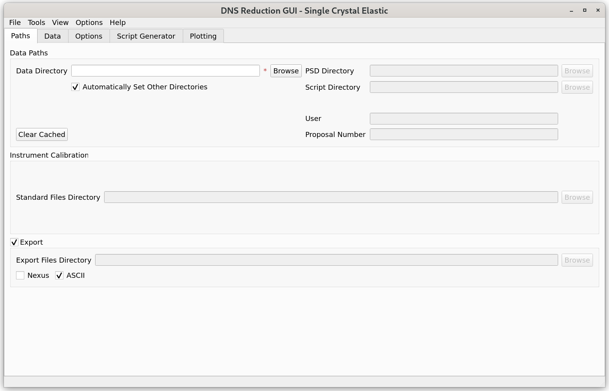

.. _dns_single_crystal_elastic-ref:

==========================
DNS Single Crystal Elastic
==========================

\

The single crystal elastic mode of the DNS Reduction GUI can be used for
reduction of polarized and unpolarized single crystal diffraction data
collected at the DNS instrument at MLZ.

This mode can be accessed from the main menu of the "DNS Reduction"
interface by clicking on "Tools" → "Change Mode" and selecting the
"Single Crystal Elastic" option.

Below the interface menu, there are various tabs for data processing.
These tabs should be called from left to right during the data processing.
The functionality of the "Paths", "Data", and "Script Generator" tabs of
this operational mode is identical to that of the "Powder TOF" mode.

Tabs Usage and Description
--------------------------

* :ref:`Paths <dns_powder_tof_paths_tab-ref>`
* :ref:`Data <dns_powder_tof_data_tab-ref>`
* :ref:`Options <dns_single_crystal_elastic_options_tab-ref>`
* :ref:`Script Generator <dns_single_crystal_elastic_script_generator_tab-ref>`
* :ref:`Plotting <dns_single_crystal_elastic_plotting_tab-ref>`
