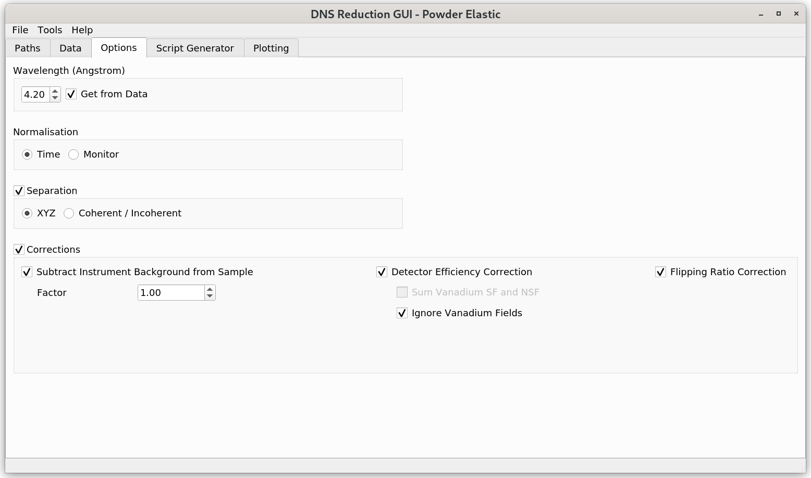

.. _dns_powder_elastic_options_tab-ref:

DNS Powder Elastic - Options Tab
================================

\

**Wavelength** sets the wavelength of the neutron beam. If **Get from Data**
is checked, then the wavelength is read from the data files. If the selected
data files have a different wavelength, or the wavelength does not
match the corresponding frequency of the velocity selector, a warning will be
given to the user and **Get from Data** checkbox will be unselected. In this
case, the wavelength will have to be set manually by the user.

**Normalisation** can be used to select whether the dataset should be normalised
by measurement time or monitor counts.

**Corrections** should be selected to activate various options for data reduction.

**Detector Efficiency Correction** corrects for different detector efficiencies
by normalizing selected sample data on vanadium measurements. When the detector
efficiency correction checkbox is selected, the user must select the corresponding
vanadium and empty container measurements under the **Standard Data** view of
the :ref:`Data <dns_powder_tof_data_tab-ref>` tab. The empty measurement is
required because background subtraction from vanadium is mandatory. Detector
efficiencies will be evaluated for each of those vanadium "field" channels
that correspond to the user-selected sample "field" channels, unless either
from **Sum Vanadium SF and NSF** and **Ignore Vanadium Fields** options is
additionally selected by the user (both options can't be selected at the same time).

**Sum Vanadium SF and NSF** calculates detector efficiencies by combining
vanadium spin-flip (SF) and non-spin-flip (NSF) data for each of the vanadium
polarization components that correspond to the selected polarisations
(:math:`x, y`, or :math:`z`) of the sample.

**Ignore Vanadium Fields** calculates detector efficiencies by combining all
selected vanadium "fields". In this case, the calculated detector efficiencies
can be applied to any of the selected sample "fields".

**Flipping Ratio Correction** corrects for the finite flipping ratio, using
standard NiCr data. Similarly to the case with detector efficiency correction,
when the flipping ratio option is selected, the corresponding empty measurement
must also be selected (for the background subtraction from NiCr). Both, spin-flip
and non-spin-flip measurements are required to be selected in **Sample Data**
and **Standard Data** views of the :ref:`Data <dns_powder_tof_data_tab-ref>` tab.

**Separation** allows choosing between two possible separation options. **XYZ**
polarization separation can be chosen for the analysis of magnetic samples.
It requires at least x_sf, y_sf, z_sf, and z_nsf sample
channels to be selected by the user. As a result of the :math:`xyz`-separation
analysis, the user will be able to additionally visualize magnetic, nuclear
coherent, and spin incoherent contributions to the resulting intensity function.
**Coherent/Incoherent** is helpful for the analysis of non-magnetic samples and
requires only SF and NSF channels to be selected. As a result, the user can
visualize nuclear coherent and spin-incoherent contributions to each of
the selected sample polarisation components.

When the **Automatic Binning** checkbox is selected, the interface will determine
the minimum and maximum values for the scattering angle :math:`2 \theta` based
on the detector bank rotation angles of the selected sample data files. The default
bin size value is chosen to be :math:`0.5^{\circ}`. When **Automatic Binning**
is unselected, the user can manually choose the desired bin size value,
as well as the scattering angle range that will be used in the figure under
the :ref:`Plotting <dns_powder_elastic_plotting_tab-ref>` tab.
