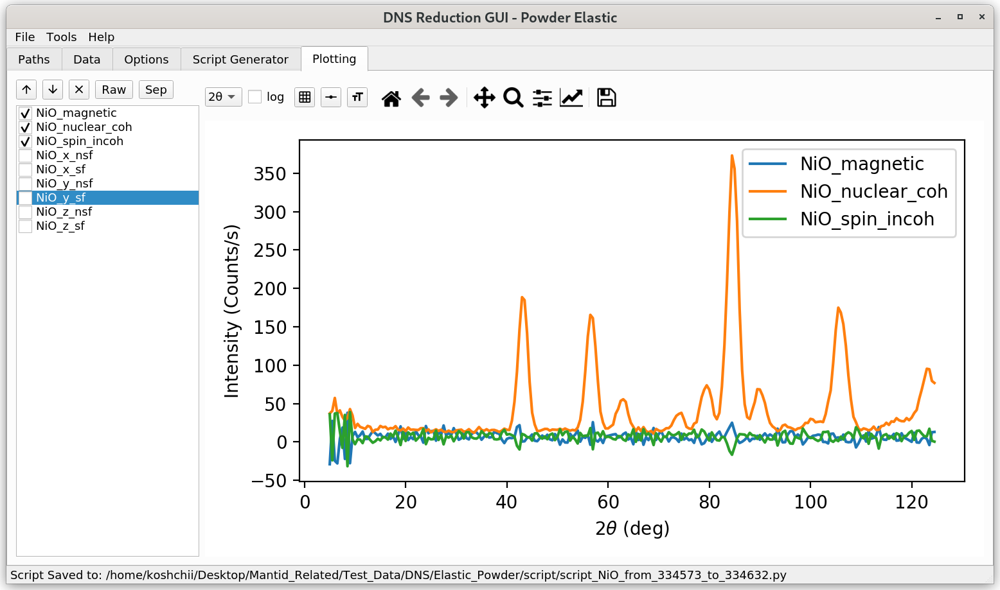

.. _dns_powder_elastic_plotting_tab-ref:

DNS Powder Elastic Plotting Tab
===============================

The **Plotting** tab offers basic plotting functionality for reduced data sets.

\

On the left side, a selection table with the different scattering channels
of reduced data will be provided. The user can select which channels should
be visualized. With the up and down arrows, one can move through each of the
available single channels. The **Raw** button selects for visualisation all
of the scattering channels chosen by the user in the **Sample Data**
view of the :ref:`Data <dns_powder_tof_data_tab-ref>` tab. The **Sep**
button selects the workspaces with separated nuclear coherent,
spin-incoherent, and magnetic contributions. The latter contribution is
available when the :math:`xyz`-separation option was selected by the user.

The dropdown :math:`2 \theta` box can be used to switches the labes of the
:math:`x`-axis between the scattering angle :math:`2 \theta`, scattering vector
`q`, and spacing :math:`d`. The **log** checkbox can be used to switch to the
logarithmic :math:`y`-axis scaling. The buttons to the right from it can be
used to switch grids, line styles, and error bars.
